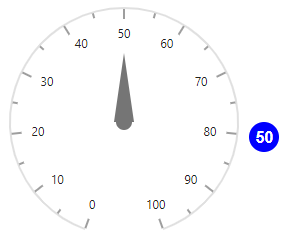
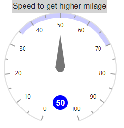

# Annotations in Blazor Circular Gauge Component

Annotations mark areas of interest in the circular gauge using text, shapes, or images.

## Customization

Custom elements can be placed on the axis area using [ContentTemplate](https://help.syncfusion.com/cr/blazor/Syncfusion.Blazor.CircularGauge.CircularGaugeAnnotation.html#Syncfusion_Blazor_CircularGauge_CircularGaugeAnnotation_ContentTemplate) in the [CircularGaugeAnnotation](https://help.syncfusion.com/cr/blazor/Syncfusion.Blazor.CircularGauge.CircularGaugeAnnotation.html).

```cshtml

@using Syncfusion.Blazor.CircularGauge

<SfCircularGauge Height="250px" Width="250px">
    <CircularGaugeAxes>
        <CircularGaugeAxis>
            <CircularGaugePointers>
                <CircularGaugePointer Value="50"></CircularGaugePointer>
            </CircularGaugePointers>
            <CircularGaugeAnnotations>
                <CircularGaugeAnnotation Angle="180" ZIndex="1">
                    <ContentTemplate>
                        <div class="custom-annotation">50</div>
                    </ContentTemplate>
                </CircularGaugeAnnotation>
            </CircularGaugeAnnotations>
        </CircularGaugeAxis>
    </CircularGaugeAxes>
</SfCircularGauge>

<style type="text/css">
    .custom-annotation {
        color: white;
        background-color: blue;
        height: 30px;
        width: 30px;
        border-radius: 15px;
        padding: 6px 0 0 6px;
        font-weight: bold;
    }
</style>

```



## Positioning the annotation

Annotations can be positioned around an axis using the [Radius](https://help.syncfusion.com/cr/blazor/Syncfusion.Blazor.CircularGauge.CircularGaugeAnnotation.html#Syncfusion_Blazor_CircularGauge_CircularGaugeAnnotation_Radius) and [Angle](https://help.syncfusion.com/cr/blazor/Syncfusion.Blazor.CircularGauge.CircularGaugeAnnotation.html#Syncfusion_Blazor_CircularGauge_CircularGaugeAnnotation_Angle) properties. For example, with an angle of 90 degrees and a radius of 110%, the annotation appears to the right of the axis.

Radius accepts pixel or percentage values. When set as a percentage, the annotation's position is relative to the axis radius.

```cshtml

@using Syncfusion.Blazor.CircularGauge

<SfCircularGauge Height="250px" Width="250px">
    <CircularGaugeAxes>
        <CircularGaugeAxis>
            <CircularGaugePointers>
                <CircularGaugePointer Value="50"></CircularGaugePointer>
            </CircularGaugePointers>
            <CircularGaugeAnnotations>
                <CircularGaugeAnnotation Angle="95"
                                         Radius="125%"
                                         ZIndex="1">
                    <ContentTemplate>
                        <div class="custom-annotation">50</div>
                    </ContentTemplate>
                </CircularGaugeAnnotation>
            </CircularGaugeAnnotations>
        </CircularGaugeAxis>
    </CircularGaugeAxes>
</SfCircularGauge>

<style type="text/css">
    .custom-annotation {
        color: white;
        background-color: blue;
        height: 30px;
        width: 30px;
        border-radius: 15px;
        padding: 6px 0 0 6px;
        font-weight: bold;
    }
</style>

```




## Multiple annotations

Multiple annotations can be added to the circular gauge using [CircularGaugeAnnotation](https://help.syncfusion.com/cr/blazor/Syncfusion.Blazor.CircularGauge.CircularGaugeAnnotation.html), and each annotation's content can be customized independently.

```cshtml

@using Syncfusion.Blazor.CircularGauge

<SfCircularGauge Height="350px" Width="400px">
    <CircularGaugeAxes>
        <CircularGaugeAxis>
            <CircularGaugeRanges>
                <CircularGaugeRange Start="35"
                                    End="70"
                                    Color="blue"
                                    Opacity="0.2">
                </CircularGaugeRange>
            </CircularGaugeRanges>
            <CircularGaugePointers>
                <CircularGaugePointer Value="50"></CircularGaugePointer>
            </CircularGaugePointers>
            <CircularGaugeAnnotations>
                <CircularGaugeAnnotation Angle="360" Radius="105%" ZIndex="1">
                    <ContentTemplate>
                        <div class="custom-annotation">Speed to get higher milage</div>
                    </ContentTemplate>
                </CircularGaugeAnnotation>
                <CircularGaugeAnnotation Angle="180" ZIndex="1">
                    <ContentTemplate>
                        <div class="speed">50</div>
                    </ContentTemplate>
                </CircularGaugeAnnotation>
            </CircularGaugeAnnotations>
        </CircularGaugeAxis>
    </CircularGaugeAxes>
</SfCircularGauge>

<style type="text/css">
    .speed {
        color: white;
        background-color: blue;
        height: 30px;
        width: 30px;
        border-radius: 15px;
        padding: 6px 0 0 6px;
        font-weight: bold;
    }

    .custom-annotation {
        background-color: lightgray;
        width: 100%;
        padding: 1px;
    }
</style>

```




## See also

* [Tooltip for Annotation](user-interaction#tooltip-for-annotations)
