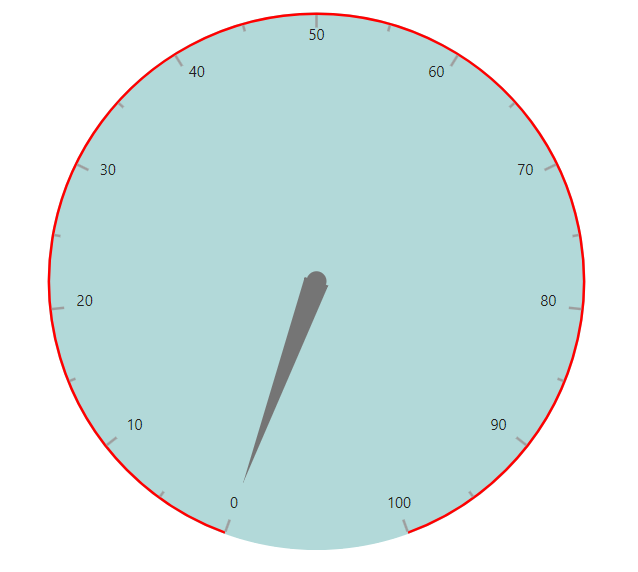
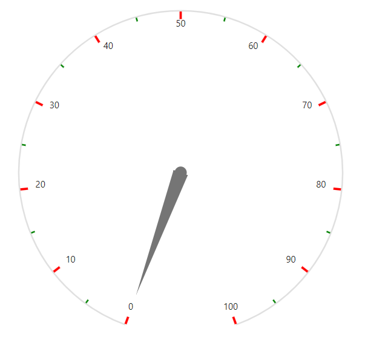
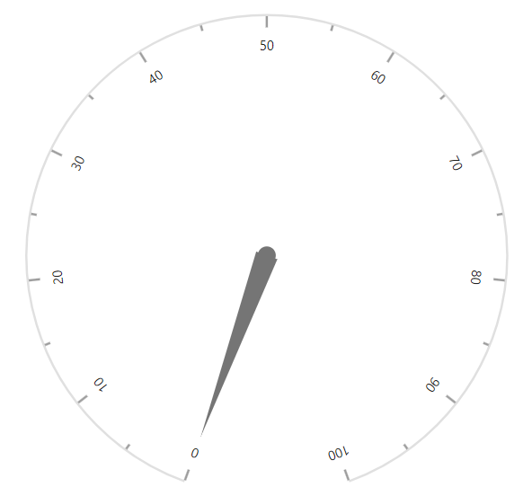
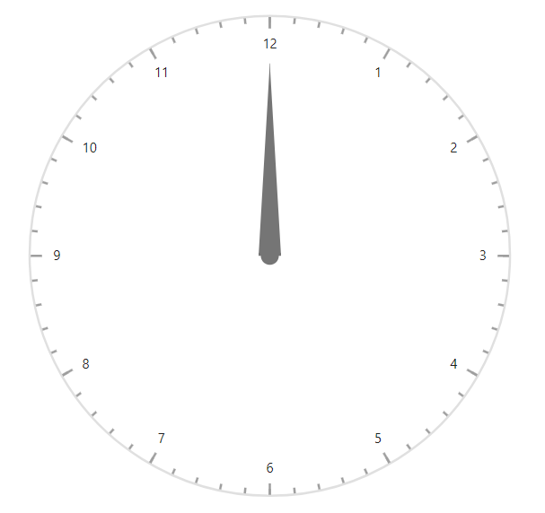
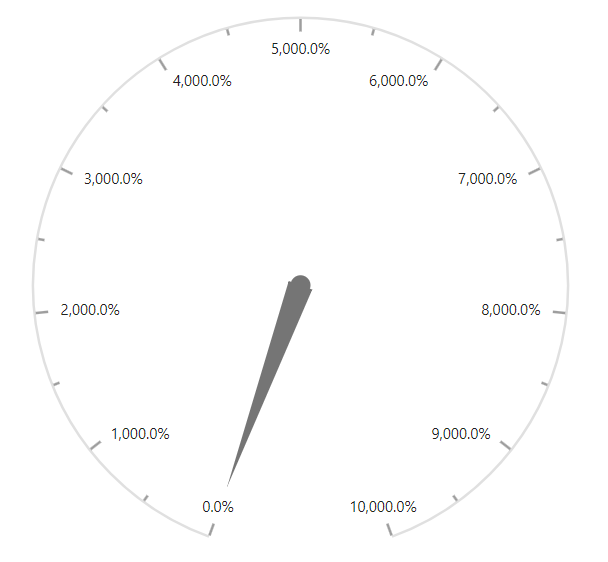

# Axes in Blazor Circular Gauge Component

By default, the Circular Gauge renders with a single axis. Each axis can include its own ranges, pointers, and annotations.

## Axis customization

Customize the [Width](https://help.syncfusion.com/cr/blazor/Syncfusion.Blazor.CircularGauge.CircularGaugeAxisLineStyle.html#Syncfusion_Blazor_CircularGauge_CircularGaugeAxisLineStyle_Width) and [Color](https://help.syncfusion.com/cr/blazor/Syncfusion.Blazor.CircularGauge.CircularGaugeAxisLineStyle.html#Syncfusion_Blazor_CircularGauge_CircularGaugeAxisLineStyle_Color) of the axis line using the [CircularGaugeAxisLineStyle](https://help.syncfusion.com/cr/blazor/Syncfusion.Blazor.CircularGauge.CircularGaugeAxisLineStyle.html) tag. Configure the axis background using the [Background](https://help.syncfusion.com/cr/blazor/Syncfusion.Blazor.CircularGauge.CircularGaugeAxis.html#Syncfusion_Blazor_CircularGauge_CircularGaugeAxis_Background) property.

```cshtml

@using Syncfusion.Blazor.CircularGauge

<SfCircularGauge>
    <CircularGaugeAxes>
        <CircularGaugeAxis Background= "rgba(0, 128, 128, 0.3)">
            <CircularGaugeAxisLineStyle Width="2" Color="red">
            </CircularGaugeAxisLineStyle>
            <CircularGaugePointers>
                <CircularGaugePointer />
            </CircularGaugePointers>
        </CircularGaugeAxis>
    </CircularGaugeAxes>
</SfCircularGauge>

```




## Minimum and maximum

Use the [Minimum](https://help.syncfusion.com/cr/blazor/Syncfusion.Blazor.CircularGauge.CircularGaugeAxis.html#Syncfusion_Blazor_CircularGauge_CircularGaugeAxis_Minimum) and [Maximum](https://help.syncfusion.com/cr/blazor/Syncfusion.Blazor.CircularGauge.CircularGaugeAxis.html#Syncfusion_Blazor_CircularGauge_CircularGaugeAxis_Maximum) properties to set the start and end values of an axis.

```cshtml

@using Syncfusion.Blazor.CircularGauge

<SfCircularGauge>
    <CircularGaugeAxes>
        <CircularGaugeAxis Minimum= "50" Maximum= "250">
            <CircularGaugePointers>
                <CircularGaugePointer />
            </CircularGaugePointers>
        </CircularGaugeAxis>
    </CircularGaugeAxes>
</SfCircularGauge>

```



## Start and end angle

An axis can sweep from 0 to 360 degrees. By default, the start angle is 200 degrees and the end angle is 160 degrees. Customize these values using the [StartAngle](https://help.syncfusion.com/cr/blazor/Syncfusion.Blazor.CircularGauge.CircularGaugeAxis.html#Syncfusion_Blazor_CircularGauge_CircularGaugeAxis_StartAngle) and [EndAngle](https://help.syncfusion.com/cr/blazor/Syncfusion.Blazor.CircularGauge.CircularGaugeAxis.html#Syncfusion_Blazor_CircularGauge_CircularGaugeAxis_EndAngle) properties.

```cshtml

@using Syncfusion.Blazor.CircularGauge

<SfCircularGauge>
    <CircularGaugeAxes>
        <CircularGaugeAxis StartAngle= "270" EndAngle= "90">
            <CircularGaugePointers>
                <CircularGaugePointer />
            </CircularGaugePointers>
        </CircularGaugeAxis>
    </CircularGaugeAxes>
</SfCircularGauge>

```



## Axis radius

By default, the axis radius is calculated based on the available size. Customize the radius using the [Radius](https://help.syncfusion.com/cr/blazor/Syncfusion.Blazor.CircularGauge.CircularGaugeAxis.html#Syncfusion_Blazor_CircularGauge_CircularGaugeAxis_Radius) property. It accepts values in percentage or pixels.

### In pixel

Set the axis radius in pixels as shown below.

```cshtml

@using Syncfusion.Blazor.CircularGauge

<SfCircularGauge>
    <CircularGaugeAxes>
        <CircularGaugeAxis Radius="150px">
            <CircularGaugePointers>
                <CircularGaugePointer />
            </CircularGaugePointers>
        </CircularGaugeAxis>
    </CircularGaugeAxes>
</SfCircularGauge>

```



### In percentage

When specified as a percentage, the gauge scales relative to the available size. For example, when [Radius](https://help.syncfusion.com/cr/blazor/Syncfusion.Blazor.CircularGauge.CircularGaugeAxis.html#Syncfusion_Blazor_CircularGauge_CircularGaugeAxis_Radius) is 50%, the gauge renders at half of the available size.

```cshtml

@using Syncfusion.Blazor.CircularGauge

<SfCircularGauge>
    <CircularGaugeAxes>
        <CircularGaugeAxis Radius="50%">
            <CircularGaugePointers>
                <CircularGaugePointer />
            </CircularGaugePointers>
        </CircularGaugeAxis>
    </CircularGaugeAxes>
</SfCircularGauge>

```



## Ticks

Customize the [Height](https://help.syncfusion.com/cr/blazor/Syncfusion.Blazor.CircularGauge.CircularGaugeTickSettings.html#Syncfusion_Blazor_CircularGauge_CircularGaugeTickSettings_Height), [Color](https://help.syncfusion.com/cr/blazor/Syncfusion.Blazor.CircularGauge.CircularGaugeTickSettings.html#Syncfusion_Blazor_CircularGauge_CircularGaugeTickSettings_Color), and [Width](https://help.syncfusion.com/cr/blazor/Syncfusion.Blazor.CircularGauge.CircularGaugeTickSettings.html#Syncfusion_Blazor_CircularGauge_CircularGaugeTickSettings_Width) of major and minor ticks using the [CircularGaugeAxisMajorTicks](https://help.syncfusion.com/cr/blazor/Syncfusion.Blazor.CircularGauge.CircularGaugeAxisMajorTicks.html) and [CircularGaugeAxisMinorTicks](https://help.syncfusion.com/cr/blazor/Syncfusion.Blazor.CircularGauge.CircularGaugeAxisMinorTicks.html) tags.

By default, the [Interval](https://help.syncfusion.com/cr/blazor/Syncfusion.Blazor.CircularGauge.CircularGaugeTickSettings.html#Syncfusion_Blazor_CircularGauge_CircularGaugeTickSettings_Interval) for [CircularGaugeAxisMajorTicks](https://help.syncfusion.com/cr/blazor/Syncfusion.Blazor.CircularGauge.CircularGaugeAxisMajorTicks.html) is calculated automatically. Customize the interval for both major and minor ticks using the [Interval](https://help.syncfusion.com/cr/blazor/Syncfusion.Blazor.CircularGauge.CircularGaugeTickSettings.html#Syncfusion_Blazor_CircularGauge_CircularGaugeTickSettings_Interval) property.

```cshtml

@using Syncfusion.Blazor.CircularGauge

<SfCircularGauge>
    <CircularGaugeAxes>
        <CircularGaugeAxis>
            <CircularGaugeAxisMajorTicks Interval="10" Color="red" Height="10" Width="3">
            </CircularGaugeAxisMajorTicks>
            <CircularGaugeAxisMinorTicks Interval="5" Color="green" Height="5" Width="2">
            </CircularGaugeAxisMinorTicks>
            <CircularGaugePointers>
                <CircularGaugePointer />
            </CircularGaugePointers>
        </CircularGaugeAxis>
    </CircularGaugeAxes>
</SfCircularGauge>

```




### Tick position

Position minor and major ticks using the [Offset](https://help.syncfusion.com/cr/blazor/Syncfusion.Blazor.CircularGauge.CircularGaugeTickSettings.html#Syncfusion_Blazor_CircularGauge_CircularGaugeTickSettings_Offset) and [Position](https://help.syncfusion.com/cr/blazor/Syncfusion.Blazor.CircularGauge.Position.html) properties.

- The [Offset](https://help.syncfusion.com/cr/blazor/Syncfusion.Blazor.CircularGauge.CircularGaugeTickSettings.html#Syncfusion_Blazor_CircularGauge_CircularGaugeTickSettings_Offset) defines the distance between the axis and ticks. The default value is 0.

- The [Position](https://help.syncfusion.com/cr/blazor/Syncfusion.Blazor.CircularGauge.Position.html) specifies tick placement relative to the axis. The default value is **Inside**. Available values are `Position.Inside`, `Position.Outside`, and `Position.Cross`.

```cshtml

@using Syncfusion.Blazor.CircularGauge

<SfCircularGauge>
    <CircularGaugeAxes>
        <CircularGaugeAxis>
            <CircularGaugeAxisMajorTicks Color="red"
                                         Height="10" Width="3"
                                         Position="Position.Inside"
                                         Offset="5">
            </CircularGaugeAxisMajorTicks>
            <CircularGaugeAxisMinorTicks Color="green"
                                         Height="5" Width="2"
                                         Position="Position.Inside"
                                         Offset="5">
            </CircularGaugeAxisMinorTicks>
            <CircularGaugePointers>
                <CircularGaugePointer />
            </CircularGaugePointers>
        </CircularGaugeAxis>
    </CircularGaugeAxes>
</SfCircularGauge>

```



## Labels

Axis labels can be customized using the [CircularGaugeAxisLabelFont](https://help.syncfusion.com/cr/blazor/Syncfusion.Blazor.CircularGauge.CircularGaugeAxisLabelFont.html) tag within the [CircularGaugeAxisLabelStyle](https://help.syncfusion.com/cr/blazor/Syncfusion.Blazor.CircularGauge.CircularGaugeAxisLabelStyle.html) option.

```cshtml

@using Syncfusion.Blazor.CircularGauge

<SfCircularGauge>
    <CircularGaugeAxes>
        <CircularGaugeAxis>
            <CircularGaugeAxisLabelStyle>
                <CircularGaugeAxisLabelFont Color="red" Size="20px" FontWeight="Bold">
                </CircularGaugeAxisLabelFont>
            </CircularGaugeAxisLabelStyle>
            <CircularGaugePointers>
                <CircularGaugePointer />
            </CircularGaugePointers>
        </CircularGaugeAxis>
    </CircularGaugeAxes>
</SfCircularGauge>

```



### Label position

Move labels using the [Offset](https://help.syncfusion.com/cr/blazor/Syncfusion.Blazor.CircularGauge.CircularGaugeAxisLabelStyle.html#Syncfusion_Blazor_CircularGauge_CircularGaugeAxisLabelStyle_Offset) or [Position](https://help.syncfusion.com/cr/blazor/Syncfusion.Blazor.CircularGauge.CircularGaugeAxisLabelStyle.html#Syncfusion_Blazor_CircularGauge_CircularGaugeAxisLabelStyle_Position) property.

- The [Offset](https://help.syncfusion.com/cr/blazor/Syncfusion.Blazor.CircularGauge.CircularGaugeAxisLabelStyle.html#Syncfusion_Blazor_CircularGauge_CircularGaugeAxisLabelStyle_Offset) defines the distance between labels and ticks. The default value is 0.

- The [Position](https://help.syncfusion.com/cr/blazor/Syncfusion.Blazor.CircularGauge.CircularGaugeAxisLabelStyle.html#Syncfusion_Blazor_CircularGauge_CircularGaugeAxisLabelStyle_Position) specifies label placement. The default value is **Inside**. Available values are `Position.Inside`, `Position.Outside` and `Position.Cross`.

```cshtml

@using Syncfusion.Blazor.CircularGauge

<SfCircularGauge>
    <CircularGaugeAxes>
        <CircularGaugeAxis>
            <CircularGaugeAxisLabelStyle Position="Position.Outside"
                                Offset="5">
            </CircularGaugeAxisLabelStyle>
            <CircularGaugePointers>
                <CircularGaugePointer />
            </CircularGaugePointers>
        </CircularGaugeAxis>
    </CircularGaugeAxes>
</SfCircularGauge>

```



### Auto angle

Sweep labels along the axis angle by enabling the [AutoAngle](https://help.syncfusion.com/cr/blazor/Syncfusion.Blazor.CircularGauge.CircularGaugeAxisLabelStyle.html#Syncfusion_Blazor_CircularGauge_CircularGaugeAxisLabelStyle_AutoAngle) property.

```cshtml

@using Syncfusion.Blazor.CircularGauge

<SfCircularGauge>
    <CircularGaugeAxes>
        <CircularGaugeAxis>
            <CircularGaugeAxisLabelStyle AutoAngle="true"></CircularGaugeAxisLabelStyle>
            <CircularGaugePointers>
                <CircularGaugePointer />
            </CircularGaugePointers>
        </CircularGaugeAxis>
    </CircularGaugeAxes>
</SfCircularGauge>

```




### Smart labels

When an axis completes a full circle, the first and last labels overlap. Hide one of them using the [HiddenLabel](https://help.syncfusion.com/cr/blazor/Syncfusion.Blazor.CircularGauge.CircularGaugeAxisLabelStyle.html#Syncfusion_Blazor_CircularGauge_CircularGaugeAxisLabelStyle_HiddenLabel) property. When the value is [First](https://help.syncfusion.com/cr/blazor/Syncfusion.Blazor.CircularGauge.HiddenLabel.html), the first label is hidden; when the value is [Last](https://help.syncfusion.com/cr/blazor/Syncfusion.Blazor.CircularGauge.HiddenLabel.html), the last label is hidden.

```cshtml

@using Syncfusion.Blazor.CircularGauge

<SfCircularGauge>
    <CircularGaugeAxes>
        <CircularGaugeAxis Minimum="0"
                           Maximum="12"
                           EndAngle="360"
                           StartAngle="0">
            <CircularGaugeAxisLabelStyle Position="Position.Inside"
                                HiddenLabel="HiddenLabel.First">
            </CircularGaugeAxisLabelStyle>
            <CircularGaugeAxisMajorTicks Interval="1"
                                         Height="10"
                                         Position="Position.Inside">
            </CircularGaugeAxisMajorTicks>
            <CircularGaugeAxisMinorTicks Interval="0.2"
                                         Height="5"
                                         Position="Position.Inside">
            </CircularGaugeAxisMinorTicks>
            <CircularGaugePointers>
                <CircularGaugePointer />
            </CircularGaugePointers>
        </CircularGaugeAxis>
    </CircularGaugeAxes>
</SfCircularGauge>

```




### Label format

Format axis labels using the [Format](https://help.syncfusion.com/cr/blazor/Syncfusion.Blazor.CircularGauge.CircularGaugeAxisLabelStyle.html#Syncfusion_Blazor_CircularGauge_CircularGaugeAxisLabelStyle_Format) property in [CircularGaugeAxisLabelStyle](https://help.syncfusion.com/cr/blazor/Syncfusion.Blazor.CircularGauge.CircularGaugeAxisLabelStyle.html). It supports all Globalize formats.

```cshtml

@using Syncfusion.Blazor.CircularGauge

<SfCircularGauge>
    <CircularGaugeAxes>
        <CircularGaugeAxis>
            <CircularGaugeAxisLabelStyle Format="p1"></CircularGaugeAxisLabelStyle>
            <CircularGaugePointers>
                <CircularGaugePointer />
            </CircularGaugePointers>
        </CircularGaugeAxis>
    </CircularGaugeAxes>
</SfCircularGauge>

```




The following table describes the result of applying some commonly used label formats on numeric values.

<!-- markdownlint-disable MD033 -->
<table>
<tr>
<td><b>Label Value</b></td>
<td><b>Label Format property value</b></td>
<td><b>Result </b></td>
<td><b>Description </b></td>
</tr>
<tr>
<td>1000</td>
<td>n1</td>
<td>1000.0</td>
<td>The number is rounded to 1 decimal place.</td>
</tr>
<tr>
<td>1000</td>
<td>n2</td>
<td>1000.00</td>
<td>The number is rounded to 2 decimal places.</td>
</tr>
<tr>
<td>1000</td>
<td>n3</td>
<td>1000.000</td>
<td>The number is rounded to 3 decimal places.</td>
</tr>
<tr>
<td>0.01</td>
<td>p1</td>
<td>1.0%</td>
<td>The number is converted to percentage with 1 decimal place.</td>
</tr>
<tr>
<td>0.01</td>
<td>p2</td>
<td>1.00%</td>
<td>The number is converted to percentage with 2 decimal places.</td>
</tr>
<tr>
<td>0.01</td>
<td>p3</td>
<td>1.000%</td>
<td>The number is converted to percentage with 3 decimal places.</td>
</tr>
<tr>
<td>1000</td>
<td>c1</td>
<td>$1,000.0</td>
<td>The currency symbol is appended to number, and the number is rounded to 1 decimal place.</td>
</tr>
<tr>
<td>1000</td>
<td>c2</td>
<td>$1,000.00</td>
<td>The currency symbol is appended to number, and the number is rounded to 2 decimal places.</td>
</tr>
</table>

### Custom label format

Axis labels support custom formats using a placeholder such as {value}°C, where the placeholder represents the axis label value; for example, 20°C.

```cshtml

@using Syncfusion.Blazor.CircularGauge

<SfCircularGauge>
    <CircularGaugeAxes>
        <CircularGaugeAxis>
            <CircularGaugeAxisLabelStyle Format="{value}°C"></CircularGaugeAxisLabelStyle>
            <CircularGaugePointers>
                <CircularGaugePointer />
            </CircularGaugePointers>
        </CircularGaugeAxis>
    </CircularGaugeAxes>
</SfCircularGauge>

```



### Show last label

If the maximum value does not align with a major tick interval, the last label is hidden by default. To display the last label, set [ShowLastLabel](https://help.syncfusion.com/cr/blazor/Syncfusion.Blazor.CircularGauge.CircularGaugeAxis.html#Syncfusion_Blazor_CircularGauge_CircularGaugeAxis_ShowLastLabel) property to **true**.

```cshtml

@using Syncfusion.Blazor.CircularGauge

<SfCircularGauge>
    <CircularGaugeAxes>
        <CircularGaugeAxis Maximum="100"
                           ShowLastLabel="true">
            <CircularGaugeAxisMajorTicks Interval="30"></CircularGaugeAxisMajorTicks>
            <CircularGaugePointers>
                <CircularGaugePointer />
            </CircularGaugePointers>
        </CircularGaugeAxis>
    </CircularGaugeAxes>
</SfCircularGauge>

```



### Hide intersecting axis labels

When axis labels overlap, hide the intersecting labels by setting the `HideIntersectingLabel` property to true on the axis.

```cshtml

@using Syncfusion.Blazor.CircularGauge

<SfCircularGauge>
    <CircularGaugeAxes>
        <CircularGaugeAxis Maximum="200" StartAngle="270" EndAngle="90" Minimum="0" HideIntersectingLabel="true">
            <CircularGaugeAxisMajorTicks Interval="4"></CircularGaugeAxisMajorTicks>
            <CircularGaugeAxisMinorTicks Interval="2"></CircularGaugeAxisMinorTicks>
            <CircularGaugePointers>
                <CircularGaugePointer />
            </CircularGaugePointers>
        </CircularGaugeAxis>
    </CircularGaugeAxes>
</SfCircularGauge>

```



## Axis direction

Change the axis direction using the [Direction](https://help.syncfusion.com/cr/blazor/Syncfusion.Blazor.CircularGauge.GaugeDirection.html) property. The following directions are available:

- ClockWise
- AntiClockWise

```cshtml

@using Syncfusion.Blazor.CircularGauge

<SfCircularGauge>
    <CircularGaugeAxes>
        <CircularGaugeAxis Direction="GaugeDirection.AntiClockWise">
            <CircularGaugePointers>
                <CircularGaugePointer />
            </CircularGaugePointers>
        </CircularGaugeAxis>
    </CircularGaugeAxes>
</SfCircularGauge>

```



## Multiple axes

In addition to the default axis, multiple axes can be added to a gauge. Each axis has its own ranges, pointers, annotations and customization options.

```cshtml

@using Syncfusion.Blazor.CircularGauge

<SfCircularGauge>
    <CircularGaugeAxes>
        <CircularGaugeAxis Minimum="0"
                           Maximum="140">
            <CircularGaugePointers>
                <CircularGaugePointer Type="PointerType.Needle">
                </CircularGaugePointer>
            </CircularGaugePointers>
        </CircularGaugeAxis>
        <CircularGaugeAxis Minimum="-20"
                           Maximum="60">
            <CircularGaugePointers>
                <CircularGaugePointer Type="PointerType.Marker"
                                      MarkerShape="GaugeShape.InvertedTriangle"
                                      MarkerHeight="20"
                                      MarkerWidth="20">
                </CircularGaugePointer>
            </CircularGaugePointers>
            <CircularGaugeAxisMajorTicks Position="Position.Outside">
            </CircularGaugeAxisMajorTicks>
            <CircularGaugeAxisMinorTicks Position="Position.Outside">
            </CircularGaugeAxisMinorTicks>
            <CircularGaugeAxisLabelStyle Position="Position.Outside">
            </CircularGaugeAxisLabelStyle>
        </CircularGaugeAxis>
    </CircularGaugeAxes>
</SfCircularGauge>

```



