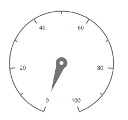

# Dimensions in Blazor Circular Gauge Component

## Size for Circular Gauge

You can set size for the Circular Gauge directly using the [Width](https://help.syncfusion.com/cr/blazor/Syncfusion.Blazor.CircularGauge.SfCircularGauge.html#Syncfusion_Blazor_CircularGauge_SfCircularGauge_Width) and [Height](https://help.syncfusion.com/cr/blazor/Syncfusion.Blazor.CircularGauge.SfCircularGauge.html#Syncfusion_Blazor_CircularGauge_SfCircularGauge_Height) properties.

### In pixel

You can set the size of the Circular Gauge in pixel as demonstrated below.

```cshtml
@using Syncfusion.Blazor.CircularGauge

<SfCircularGauge Width= "200px" Height= "200px">
    <CircularGaugeAxes>
        <CircularGaugeAxis>
            <CircularGaugePointers>
                <CircularGaugePointer></CircularGaugePointer>
            </CircularGaugePointers>
        </CircularGaugeAxis>
    </CircularGaugeAxes>
</SfCircularGauge>
```




### In percentage

By setting value in percentage, gauge gets its dimension with respect to its container. For example, when the height is ‘50%’, gauge is rendered to half of the container height.

```cshtml
@using Syncfusion.Blazor.CircularGauge

<div style="height:450px; width:450px">
    <SfCircularGauge Width="50%" Height="50%">
        <CircularGaugeAxes>
        <CircularGaugeAxis>
            <CircularGaugePointers>
                <CircularGaugePointer></CircularGaugePointer>
            </CircularGaugePointers>
        </CircularGaugeAxis>
        </CircularGaugeAxes>
    </SfCircularGauge>
</div>
```




N> When you do not specify the size, it takes `450` pixels as the height and window size as its width.