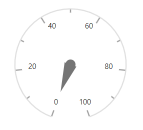

# Dimensions in Blazor Circular Gauge Component

## Size for Circular Gauge

Set the Circular Gauge size directly using the [Width](https://help.syncfusion.com/cr/blazor/Syncfusion.Blazor.CircularGauge.SfCircularGauge.html#Syncfusion_Blazor_CircularGauge_SfCircularGauge_Width) and [Height](https://help.syncfusion.com/cr/blazor/Syncfusion.Blazor.CircularGauge.SfCircularGauge.html#Syncfusion_Blazor_CircularGauge_SfCircularGauge_Height) properties.

### In pixel

Set the size of the Circular Gauge in pixels as shown below.

```cshtml

@using Syncfusion.Blazor.CircularGauge

<SfCircularGauge Width= "200px" Height= "200px">
    <CircularGaugeAxes>
        <CircularGaugeAxis>
            <CircularGaugePointers>
                <CircularGaugePointer />
            </CircularGaugePointers>
        </CircularGaugeAxis>
    </CircularGaugeAxes>
</SfCircularGauge>

```




### In percentage

When a percentage is specified, the gauge size is calculated relative to its container. For example, if the height is set to "50%", the gauge renders at half of the container height.

```cshtml

@using Syncfusion.Blazor.CircularGauge

<div style="height:450px; width:450px">
    <SfCircularGauge Width="50%" Height="50%">
        <CircularGaugeAxes>
            <CircularGaugeAxis>
                <CircularGaugePointers>
                    <CircularGaugePointer />
                </CircularGaugePointers>
            </CircularGaugeAxis>
        </CircularGaugeAxes>
    </SfCircularGauge>
</div>

```



N> When the size is not specified, the gauge uses 450 pixels for height and the window size for width.
