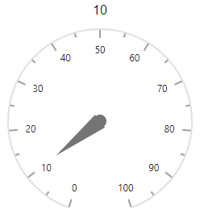

# Events

## Using events in Circular Gauge component

In the following example, the event [`OnDragMove`](https://help.syncfusion.com/cr/blazor/Syncfusion.Blazor.CircularGauge.CircularGaugeEvents.html#Syncfusion_Blazor_CircularGauge_CircularGaugeEvents_OnDragMove) binds to the circular gauge component, so the event handler `UpdatePointerValue` will be called when you drag the pointer and update the pointer value in the div element.

```cshtml
@using Syncfusion.Blazor.CircularGauge

<div style="width:250px">
    <div style="text-align: center">@pointerValue</div>
    <SfCircularGauge EnablePointerDrag="true" Height="250px" Width="250px">
        <CircularGaugeEvents OnDragMove="@UpdatePointerValue"></CircularGaugeEvents>
        <CircularGaugeAxes>
            <CircularGaugeAxis>
                <CircularGaugePointers>
                    <CircularGaugePointer Value="@pointerValue"></CircularGaugePointer>
                </CircularGaugePointers>
            </CircularGaugeAxis>
        </CircularGaugeAxes>
    </SfCircularGauge>
</div>

@code {
    private double pointerValue = 10;
    void UpdatePointerValue(IPointerDragEventArgs args)
    {
        pointerValue = args.CurrentValue;
    }
}
```



## Available events

### AnimationCompleted

Description: Triggers, after animation is completed.

### AnnotationRendering

Description: Triggers, before rendering on each annotation. You can customize annotations using
these arguments.

|   Argument name      |   Description                               |
|----------------------| --------------------------------------------|
|   Content            |   Specifies the annotation content          |
|   TextStyle          |   To customize the text style               |
|   Name               |   Specifies the name of the event            |
|   Cancel             |   Specifies the event cancel status          |

### Loaded

Description: Triggers, after the gauge component has been loaded.

### OnDragEnd

Description: Triggers, when you finished dragging the pointer needle.

|   Argument name      |   Description                          |
|----------------------| ---------------------------------------|
|   AxisIndex          |   Specifies the current axis index value |
|   CurrentValue       |   Specifies the current value of label    |
|   PointerIndex       |   Index of the current pointer instance|
|   Name               |   Specifies the name of the event      |

### OnDragMove

Description: Triggers, when you dragging the pointer needle.

|   Argument name      |   Description                          |
|----------------------| ---------------------------------------|
|   AxisIndex          |   Specifies the axis index value |
|   CurrentValue       |   Specifies the current value of label    |
|   PointerIndex       |   Index of the current pointer instance|
|   PreviousValue      |   PreviousValue instance        |
|   Name               |   Specifies the name of the event                |

### OnDragStart

Description: Triggers, when you start to drag the pointer needle.

|   Argument name      |   Description                          |
|----------------------| ---------------------------------------|
|   AxisIndex          |   Specifies the axis index value         |
|   CurrentValue       |   Specifies the current value of label    |
|   PointerIndex       |   Index of the current pointer instance|
|   Name               |   Specifies the name of the event       |

### OnGaugeMouseDown

Description: Triggers, when you click the mouse on the gauge.

|   Argument name      |   Description                         |
|----------------------| --------------------------------------|
|   Target             |   Defines current mouse event target id    |
|   X                  |   Define the current mouse x location            |
|   Y                  |   Define the current mouse y location            |
|   Name               |   Specifies the name of the event                |

### OnGaugeMouseLeave

Description: Triggers, when the mouse pointer is moved out of the gauge.

|   Argument name      |   Description                         |
|----------------------| --------------------------------------|
|   Target             |   Defines current mouse event target id    |
|   X                  |   Define the current mouse x location            |
|   Y                  |   Define the current mouse y location            |
|   Name               |   Specifies the name of the event                |

### OnGaugeMouseMove

Description: Triggers on cursor moving on the gauge.

|   Argument name      |   Description                         |
|----------------------| --------------------------------------|
|   Target             |   Defines current mouse event target id    |
|   X                  |   Define the current mouse x location           |
|   Y                  |   Define the current mouse Y location            |
|   Name               |   Specifies the name of the event                |
|   Cancel             |   Specifies the event cancel status          |

### OnGaugeMouseUp

Description: Triggers, when you releasing a mouse on the gauge.

|   Argument name      |   Description                         |
|----------------------| --------------------------------------|
|   Target             |   Defines current mouse event target id    |
|   X                  |   Define the current mouse x location            |
|   Y                  |   Define the current mouse Y location            |
|   Name               |   Specifies the name of the event                |

### OnLoad

Description: Triggers, before rendering the gauge. Gauge will trigger this event first.

### OnRadiusCalculate

Description: Triggers, before the radius get calculated for the gauge. You can customize the gauge radius using these arguments.

|   Argument name      |   Description                          |
|----------------------| ---------------------------------------|
|   CurrentRadius      |   Specifies the current radius value      |
|   MidPoint           |   Specifies the mid point of the gauge location |
|   Name               |   Specifies the name of the event                |
|   Cancel             |   Specifies the event cancel status              |

### Resizing

Description: Triggers, when you resize the gauges.

|   Argument name      |   Description                          |
|----------------------| ---------------------------------------|
|   CurrentSize        |   Define the current size of the gauge |
|   PreviousSize       |   Define the previous size of the gauge    |
|   Name               |   Specifies the name of the event          |

### TooltipRendering

Description: Triggers, before rendering the gauge tooltip.

|   Argument name      |   Description                          |
|----------------------| ---------------------------------------|
|   Content            |   Specifies the tooltip text             |
|   Event              |   Specifies the mouse arguments             |
|   Location           |   Specifies the tooltip location          |
|   appendInBodyTag    |   Specifies the tooltip to append in body tag    |
|   Tooltip            |   Tooltip instance, to customize the tooltip settings  |
|   Name               |   Specifies the name of the event                       |
|   Cancel             |   Specifies the event cancel status                     |
|   Axis               |   Specifies the axis                     |
|   Range              |   Specifies the range                     |