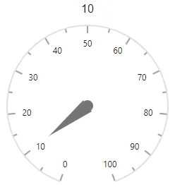
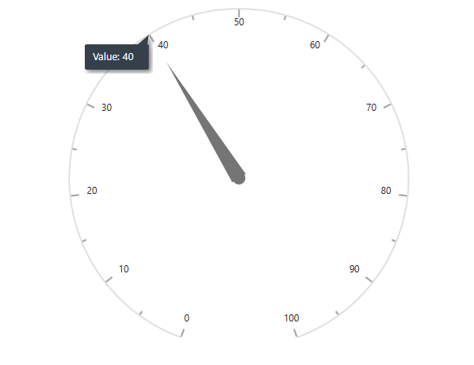

# Blazor Circular Gauge Events

The Blazor Circular Gauge component provides events for lifecycle, rendering, drag, and mouse interactions. Configure these events through the [`CircularGaugeEvents`](https://help.syncfusion.com/cr/blazor/Syncfusion.Blazor.CircularGauge.CircularGaugeEvents.html) component to respond to user interactions and customize the gauge behavior. This guide describes the available events and demonstrates common event-handling scenarios.

## Using events in Circular Gauge component

In the following example, the [OnDragMove](https://help.syncfusion.com/cr/blazor/Syncfusion.Blazor.CircularGauge.CircularGaugeEvents.html#Syncfusion_Blazor_CircularGauge_CircularGaugeEvents_OnDragMove) event is bound to the Circular Gauge so that the `UpdatePointerValue` handler is called as you drag the pointer. The current pointer value is displayed in the div element above the gauge.

```cshtml
@using Syncfusion.Blazor.CircularGauge

<div style="width:250px">
    <div style="text-align: center">@pointerValue</div>
    <SfCircularGauge EnablePointerDrag="true" Height="250px" Width="250px">
        <CircularGaugeEvents OnDragMove="@UpdatePointerValue"></CircularGaugeEvents>
        <CircularGaugeAxes>
            <CircularGaugeAxis>
                <CircularGaugePointers>
                    <CircularGaugePointer Value="@pointerValue"></CircularGaugePointer>
                </CircularGaugePointers>
            </CircularGaugeAxis>
        </CircularGaugeAxes>
    </SfCircularGauge>
</div>

@code {
    private double pointerValue = 10;
    void UpdatePointerValue(PointerDragEventArgs args)
    {
        pointerValue = args.CurrentValue;
    }
}
```





### Customizing the tooltip with TooltipRendering

Use the `TooltipRendering` event to customize tooltip content before it is displayed on the gauge.

```cshtml
@using Syncfusion.Blazor.CircularGauge

<SfCircularGauge>
    <CircularGaugeEvents TooltipRendering="@OnTooltipRender"></CircularGaugeEvents>
    <CircularGaugeAxes>
        <CircularGaugeAxis Minimum="0" Maximum="100">
            <CircularGaugePointers>
                <CircularGaugePointer Value="40"></CircularGaugePointer>
            </CircularGaugePointers>
		<CircularGaugeTooltipSettings Enable="true" />
        </CircularGaugeAxis>
    </CircularGaugeAxes>
</SfCircularGauge>

@code {
    private void OnTooltipRender(TooltipRenderEventArgs args)
    {
        args.Content = $"Value: {args.Content}";
    }
}
```



## Commonly used events

Events are configured through the `CircularGaugeEvents` component. The following sections group the available events by lifecycle, drag, mouse, and rendering behavior.

### Lifecycle events

#### [OnLoad](https://help.syncfusion.com/cr/blazor/Syncfusion.Blazor.CircularGauge.CircularGaugeEvents.html#Syncfusion_Blazor_CircularGauge_CircularGaugeEvents_OnLoad)

Description: Triggers before the Circular Gauge is rendered. Use this event to perform initialization-related customization before rendering.

#### [Loaded](https://help.syncfusion.com/cr/blazor/Syncfusion.Blazor.CircularGauge.CircularGaugeEvents.html#Syncfusion_Blazor_CircularGauge_CircularGaugeEvents_Loaded)

Description: Triggers after the gauge component has finished loading and rendering.

#### [Resizing](https://help.syncfusion.com/cr/blazor/Syncfusion.Blazor.CircularGauge.CircularGaugeEvents.html#Syncfusion_Blazor_CircularGauge_CircularGaugeEvents_Resizing)

Description: Triggers while the gauge is being resized.

|   Argument name      |   Description                                  |
|----------------------| -----------------------------------------------|
|   CurrentSize        |   Specifies the current size of the gauge      |
|   PreviousSize       |   Specifies the previous size of the gauge     |
|   Name               |   Specifies the name of the event              |

N> `OnLoad` fires before rendering, while `Loaded` fires after rendering. Use `OnLoad` for short synchronous setup and `Loaded` for tasks that require the rendered DOM.

### Drag events

Drag events require `EnablePointerDrag="true"` on `SfCircularGauge` and a renderable `CircularGaugePointer` (the default needle is supported). See the [Binding multiple events](#binding-multiple-events) sample above for end-to-end usage.

#### [OnDragStart](https://help.syncfusion.com/cr/blazor/Syncfusion.Blazor.CircularGauge.CircularGaugeEvents.html#Syncfusion_Blazor_CircularGauge_CircularGaugeEvents_OnDragStart)

Description: Triggers when you start dragging the pointer needle.

|   Argument name      |   Description                                 |
|----------------------|-----------------------------------------------|
|   AxisIndex          |   Specifies the axis index value              |
|   CurrentValue       |   Specifies the value of the pointer          |
|   PointerIndex       |   Specifies the index of the pointer          |
|   Name               |   Specifies the name of the event             |

#### [OnDragMove](https://help.syncfusion.com/cr/blazor/Syncfusion.Blazor.CircularGauge.CircularGaugeEvents.html#Syncfusion_Blazor_CircularGauge_CircularGaugeEvents_OnDragMove)

Description: Triggers when you drag the pointer needle.

|   Argument name      |   Description                                  |
|----------------------|-----------------------------------------------|
|   AxisIndex          |   Specifies the axis index value              |
|   CurrentValue       |   Specifies the value of the pointer          |
|   PointerIndex       |   Specifies the index of the pointer          |
|   PreviousValue      |   Specifies the previous value of the pointer |
|   Name               |   Specifies the name of the event             |

#### [OnDragEnd](https://help.syncfusion.com/cr/blazor/Syncfusion.Blazor.CircularGauge.CircularGaugeEvents.html#Syncfusion_Blazor_CircularGauge_CircularGaugeEvents_OnDragEnd)

Description: Triggers when you finish dragging the pointer needle.

|   Argument name      |   Description                                  |
|----------------------|-----------------------------------------------|
|   AxisIndex          |   Specifies the axis index value              |
|   CurrentValue       |   Specifies the value of the pointer          |
|   PointerIndex       |   Specifies the index of the pointer          |
|   Name               |   Specifies the name of the event             |

### Mouse events

#### [OnGaugeMouseDown](https://help.syncfusion.com/cr/blazor/Syncfusion.Blazor.CircularGauge.CircularGaugeEvents.html#Syncfusion_Blazor_CircularGauge_CircularGaugeEvents_OnGaugeMouseDown)

Description: Triggers when you press a mouse button on the gauge.

|   Argument name      |   Description                                 |
|----------------------|-----------------------------------------------|
|   X                  |   Specifies the mouse X location              |
|   Y                  |   Specifies the mouse Y location              |

#### [OnGaugeMouseUp](https://help.syncfusion.com/cr/blazor/Syncfusion.Blazor.CircularGauge.CircularGaugeEvents.html#Syncfusion_Blazor_CircularGauge_CircularGaugeEvents_OnGaugeMouseUp)

Description: Triggers when you release the mouse button on the gauge.

|   Argument name      |   Description                                 |
|----------------------|-----------------------------------------------|
|   X                  |   Specifies the mouse X location              |
|   Y                  |   Specifies the mouse Y location              |

#### [OnGaugeMouseMove](https://help.syncfusion.com/cr/blazor/Syncfusion.Blazor.CircularGauge.CircularGaugeEvents.html#Syncfusion_Blazor_CircularGauge_CircularGaugeEvents_OnGaugeMouseMove)

Description: Triggers when the cursor moves over the gauge area.

|   Argument name      |   Description                                 |
|----------------------|-----------------------------------------------|
|   X                  |   Specifies the mouse X location              |
|   Y                  |   Specifies the mouse Y location              |

#### [OnGaugeMouseLeave](https://help.syncfusion.com/cr/blazor/Syncfusion.Blazor.CircularGauge.CircularGaugeEvents.html#Syncfusion_Blazor_CircularGauge_CircularGaugeEvents_OnGaugeMouseLeave)

Description: Triggers when the mouse pointer leaves the gauge area.

|   Argument name      |   Description                                 |
|----------------------|-----------------------------------------------|
|   X                  |   Specifies the mouse X location              |
|   Y                  |   Specifies the mouse Y location              |

### Rendering events

#### [OnRadiusCalculate](https://help.syncfusion.com/cr/blazor/Syncfusion.Blazor.CircularGauge.CircularGaugeEvents.html#Syncfusion_Blazor_CircularGauge_CircularGaugeEvents_OnRadiusCalculate)

Description: Triggers before the radius is calculated for the gauge. Use the event arguments to customize the gauge radius.

|   Argument name      |   Type    |   Description                                      |
|----------------------|-----------|----------------------------------------------------|
|   CurrentRadius      |   double  |   Specifies the current radius value               |
|   MidPoint           |   double  |   Specifies the mid-point location of the gauge    |

#### [AnnotationRendering](https://help.syncfusion.com/cr/blazor/Syncfusion.Blazor.CircularGauge.CircularGaugeEvents.html#Syncfusion_Blazor_CircularGauge_CircularGaugeEvents_AnnotationRendering)

Description: Triggers before rendering each annotation. Use the event arguments to customize the annotation's content and text style.

|   Argument name      |   Description                                 |
|----------------------|-----------------------------------------------|
|   Content            |   Specifies the annotation content            |

#### [TooltipRendering](https://help.syncfusion.com/cr/blazor/Syncfusion.Blazor.CircularGauge.CircularGaugeEvents.html#Syncfusion_Blazor_CircularGauge_CircularGaugeEvents_TooltipRendering)

Description: Triggers before rendering the gauge tooltip. Use the event arguments to customize tooltip text, position, and references.

|   Argument name      |   Description                                                  |
|----------------------|----------------------------------------------------------------|
|   Content            |   Specifies the tooltip text                                   |
|   Location           |   Specifies the tooltip location                               |
|   AppendInBodyTag    |   Specifies whether to append the tooltip in the body tag      |

## See also

* [User Interaction in Blazor Circular Gauge](https://blazor.syncfusion.com/documentation/circular-gauge/user-interaction)
* [Pointers in Blazor Circular Gauge](https://blazor.syncfusion.com/documentation/circular-gauge/pointers)
* [Annotations in Blazor Circular Gauge](https://blazor.syncfusion.com/documentation/circular-gauge/annotations)
* [Getting Started with the Blazor Circular Gauge](https://blazor.syncfusion.com/documentation/circular-gauge/getting-started)
* [Tooltip in Blazor Circular Gauge](https://help.syncfusion.com/cr/blazor/Syncfusion.Blazor.CircularGauge.TooltipSettings.html)