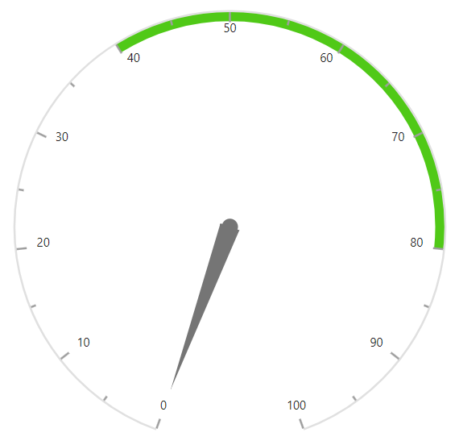

# Getting Started with Blazor CircularGauge Component

This section briefly explains about how to include [Blazor CircularGauge](https://www.syncfusion.com/blazor-components/blazor-circular-gauge) component in your Blazor Server App and Blazor WebAssembly App using Visual Studio.

The below video demonstrates the customization of Blazor Circular Gauge component.



## Prerequisites

* [System requirements for Blazor components](https://blazor.syncfusion.com/documentation/system-requirements)

## Create a new Blazor App in Visual Studio

You can create a **Blazor Server App** or **Blazor WebAssembly App** using Visual Studio via [Microsoft Templates](https://learn.microsoft.com/en-us/aspnet/core/blazor/tooling?view=aspnetcore-7.0) or the [Syncfusion Blazor Extension](https://blazor.syncfusion.com/documentation/visual-studio-integration/template-studio).

## Install Syncfusion Blazor CircularGauge and Themes NuGet in the App

To add **Blazor CircularGauge** component in the app, open the NuGet package manager in Visual Studio (*Tools → NuGet Package Manager → Manage NuGet Packages for Solution*), search and install [Syncfusion.Blazor.CircularGauge](https://www.nuget.org/packages/Syncfusion.Blazor.CircularGauge) and [Syncfusion.Blazor.Themes](https://www.nuget.org/packages/Syncfusion.Blazor.Themes/). Alternatively, you can utilize the following package manager command to achieve the same.




Install-Package Syncfusion.Blazor.CircularGauge -Version {{ site.releaseversion }}
Install-Package Syncfusion.Blazor.Themes -Version {{ site.releaseversion }}




N> Syncfusion Blazor components are available in [nuget.org](https://www.nuget.org/packages?q=syncfusion.blazor). Refer to [NuGet packages](https://blazor.syncfusion.com/documentation/nuget-packages) topic for available NuGet packages list with component details.

## Register Syncfusion Blazor Service

Open **~/_Imports.razor** file and import the `Syncfusion.Blazor` and `Syncfusion.Blazor.CircularGauge` namespace.




@using Syncfusion.Blazor
@using Syncfusion.Blazor.CircularGauge




Now, register the Syncfusion Blazor Service in the **~/Program.cs** file of your Blazor Server App or Blazor WebAssembly App.




using Microsoft.AspNetCore.Components;
using Microsoft.AspNetCore.Components.Web;
using Syncfusion.Blazor;

var builder = WebApplication.CreateBuilder(args);

// Add services to the container.
builder.Services.AddRazorPages();
builder.Services.AddServerSideBlazor();
builder.Services.AddSyncfusionBlazor();

var app = builder.Build();
....




using Microsoft.AspNetCore.Components.Web;
using Microsoft.AspNetCore.Components.WebAssembly.Hosting;
using Syncfusion.Blazor;

var builder = WebAssemblyHostBuilder.CreateDefault(args);
builder.RootComponents.Add<App>("#app");
builder.RootComponents.Add<HeadOutlet>("head::after");

builder.Services.AddScoped(sp => new HttpClient { BaseAddress = new Uri(builder.HostEnvironment.BaseAddress) });

builder.Services.AddSyncfusionBlazor();
await builder.Build().RunAsync();
....




## Add stylesheet and script resources

The theme stylesheet and script can be accessed from NuGet through [Static Web Assets](https://blazor.syncfusion.com/documentation/appearance/themes#static-web-assets). Reference the stylesheet and script in the `<head>` of the main page as follows:

* For **.NET 6** Blazor Server app, include it in **~/Pages/_Layout.cshtml** file.

* For **.NET 7** Blazor Server app, include it in the **~/Pages/_Host.cshtml** file.

* For Blazor WebAssembly app, include it in the **~/index.html** file.

```html
<head>
    ....
    <link href="_content/Syncfusion.Blazor.Themes/bootstrap5.css" rel="stylesheet" />
    <script src="_content/Syncfusion.Blazor.Core/scripts/syncfusion-blazor.min.js" type="text/javascript"></script>
</head>
```
N> Check out the [Blazor Themes](https://blazor.syncfusion.com/documentation/appearance/themes) topic to discover various methods ([Static Web Assets](https://blazor.syncfusion.com/documentation/appearance/themes#static-web-assets), [CDN](https://blazor.syncfusion.com/documentation/appearance/themes#cdn-reference), and [CRG](https://blazor.syncfusion.com/documentation/common/custom-resource-generator)) for referencing themes in your Blazor application. Also, check out the [Adding Script Reference](https://blazor.syncfusion.com/documentation/common/adding-script-references) topic to learn different approaches for adding script references in your Blazor application.

## Add Blazor CircularGauge component

Add the Syncfusion Blazor CircularGauge component in the **~/Pages/Index.razor** file.




<SfCircularGauge>
    <CircularGaugeAxes>
        <CircularGaugeAxis>
            <CircularGaugePointers>
                <CircularGaugePointer></CircularGaugePointer>
            </CircularGaugePointers>
        </CircularGaugeAxis>
    </CircularGaugeAxes>
</SfCircularGauge>




* Press <kbd>Ctrl</kbd>+<kbd>F5</kbd> (Windows) or <kbd>⌘</kbd>+<kbd>F5</kbd> (macOS) to launch the application. This will render the Syncfusion Blazor CircularGauge component in your default web browser.




## Set pointer value

Pointers are used to indicate values on an axis. You can change the pointer value using the [Value](https://help.syncfusion.com/cr/blazor/Syncfusion.Blazor.CircularGauge.CircularGaugePointer.html#Syncfusion_Blazor_CircularGauge_CircularGaugePointer_Value) property in [CircularGaugePointer](https://help.syncfusion.com/cr/blazor/Syncfusion.Blazor.CircularGauge.CircularGaugePointer.html).

N> In CircularGauge, you can configure multiple axes. On each axis, you can add a pointer.




<SfCircularGauge>
    <CircularGaugeAxes>
        <CircularGaugeAxis>
            <CircularGaugePointers>
                <CircularGaugePointer Value="35">
                </CircularGaugePointer>
            </CircularGaugePointers>
        </CircularGaugeAxis>
    </CircularGaugeAxes>
</SfCircularGauge>







## Adding title for Blazor CircularGauge

Title can be added to the CircularGauge to provide a quick information to the users about the context of the rendered CircularGauge. You can add a title using [Title](https://help.syncfusion.com/cr/blazor/Syncfusion.Blazor.CircularGauge.SfCircularGauge.html#Syncfusion_Blazor_CircularGauge_SfCircularGauge_Title) property in [SfCircularGauge](https://help.syncfusion.com/cr/blazor/Syncfusion.Blazor.CircularGauge.SfCircularGauge.html).




<SfCircularGauge Title="Speedometer">
    <CircularGaugeTitleStyle Color="blue" FontWeight="bold" Size="25"></CircularGaugeTitleStyle>
    <CircularGaugeAxes>
        <CircularGaugeAxis>
            <CircularGaugePointers>
                <CircularGaugePointer>
                </CircularGaugePointer>
            </CircularGaugePointers>
        </CircularGaugeAxis>
    </CircularGaugeAxes>
</SfCircularGauge>







## Adding ranges in the Blazor CircularGauge

Range is used to specify a group of scale values in the gauge. You can set the range start and end using [Start](https://help.syncfusion.com/cr/blazor/Syncfusion.Blazor.CircularGauge.CircularGaugeRange.html#Syncfusion_Blazor_CircularGauge_CircularGaugeRange_Start) and [End](https://help.syncfusion.com/cr/blazor/Syncfusion.Blazor.CircularGauge.CircularGaugeRange.html#Syncfusion_Blazor_CircularGauge_CircularGaugeRange_End) properties in the [CircularGaugeRange](https://help.syncfusion.com/cr/blazor/Syncfusion.Blazor.CircularGauge.CircularGaugeRange.html).




<SfCircularGauge>
    <CircularGaugeAxes>
        <CircularGaugeAxis>
            <CircularGaugeRanges>
                <CircularGaugeRange Start="40" End="80">
                </CircularGaugeRange>
            </CircularGaugeRanges>
        </CircularGaugeAxis>
    </CircularGaugeAxes>
</SfCircularGauge>








N> [View Sample in GitHub](https://github.com/SyncfusionExamples/Blazor-Getting-Started-Examples/tree/main/CircularGauge).

## See also

* [Getting Started with Syncfusion Blazor for Client-Side in .NET Core CLI](https://blazor.syncfusion.com/documentation/getting-started/blazor-webassembly-dotnet-cli)

* [Getting Started with Syncfusion Blazor for Server-Side in Visual Studio](https://blazor.syncfusion.com/documentation/getting-started/blazor-server-side-visual-studio)

* [Getting Started with Syncfusion Blazor for Server-Side in .NET Core CLI](https://blazor.syncfusion.com/documentation/getting-started/blazor-server-side-dotnet-cli)
