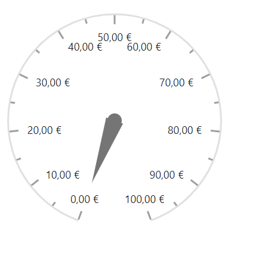

# Globalization in Blazor Circular Gauge Component

The internationalization library enables formatting and parsing of numbers using official [Unicode CLDR](http://cldr.unicode.org/) JSON data and exposes the `loadCldr` method to load culture-specific CLDR JSON data. The Circular Gauge component includes built-in globalization support to adapt content to different cultures.

By default, all Blazor components use the English culture ("en-US"). To apply a different culture, follow these steps:

Install the [CLDR-Data](http://cldr.unicode.org/index/cldr-spec/json) package using the following command (this installs the CLDR JSON data).

```
npm install cldr-data --save
```

To learn more about CLDR-Data, refer to [CLDR-Data](http://cldr.unicode.org/index/cldr-spec/json).

After installation, the culture-specific JSON data is available at `/node_modules/cldr-data/main`. Copy the required `cldr-data` files into the `wwwroot/cldr-data` folder.

Circular Gauge supports globalization for the following elements:

* Axis label
* Tooltip

In the following example, axis labels are formatted as currency in **EUR**.

```cshtml

@using Syncfusion.Blazor
@using Syncfusion.Blazor.CircularGauge
@using Microsoft.JSInterop;

<SfCircularGauge>
    <CircularGaugeAxes>
        <CircularGaugeAxis>
            <CircularGaugeAxisLabelStyle Format='c' Position="Position.Inside">
            </CircularGaugeAxisLabelStyle>
        </CircularGaugeAxis>
    </CircularGaugeAxes>
</SfCircularGauge>

@code {
    [Inject]
    protected IJSRuntime JsRuntime { get; set; }

    protected override void OnAfterRender()
    {
        this.JsRuntime.Sf().LoadCldrData(new string[] { "wwwroot/cldr-data/de/currencies.json", "wwwroot/cldr-data/de/numbers.json" }).SetCulture("de").SetCurrencyCode("EUR");
    }
}

```


