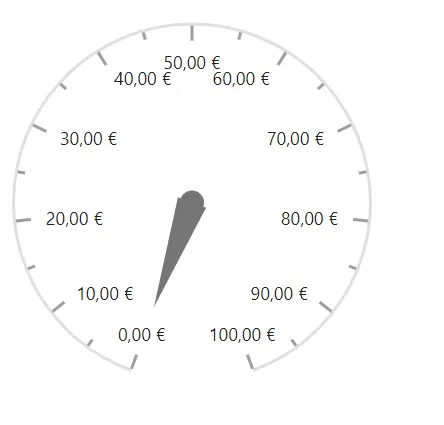

# Blazor Circular Gauge Globalization

The internationalization library formats and parses numbers, dates, and currencies using the official [Unicode CLDR](http://cldr.unicode.org/) JSON data. The Circular Gauge component comes with built-in internationalization support to adapt to different cultures.

By default, all Blazor components use the `en-US` culture. The following steps describe how to apply a different culture to axis labels and tooltips in the Circular Gauge.

Install the [CLDR-Data](https://cldr.unicode.org/index/cldr-spec/cldr-json-bindings) package using the following command (it installs the CLDR JSON data).

```
npm install cldr-data --save
```

After installation, the culture-specific CLDR JSON files are located under `/node_modules/cldr-data/main`. Copy the required culture files (for example, `de/currencies.json` and `de/numbers.json`) into the `wwwroot/cldr-data` folder of your application. For more information, refer to the [CLDR-Data specification](https://cldr.unicode.org/index/cldr-spec/cldr-json-bindings).

> The `LoadCldrData` API must run after JavaScript interop is available. Calling it from `OnAfterRender` (with a `firstRender` guard) ensures the required JS files are loaded before culture data is applied.

## Supported elements

The Circular Gauge applies the loaded culture to the following elements:

* Axis labels
* Tooltips

The following example formats axis labels with the `EUR` currency (German, Germany). Because the `Format` is set to `c`, labels render as currency values using the active culture and currency code.

```cshtml
@using Syncfusion.Blazor.CircularGauge
@using Microsoft.JSInterop

<SfCircularGauge>
    <CircularGaugeAxes>
        <CircularGaugeAxis>
            <CircularGaugeAxisLabelStyle Format='c' Position="Position.Inside">
            </CircularGaugeAxisLabelStyle>
        </CircularGaugeAxis>
    </CircularGaugeAxes>
</SfCircularGauge>

@code {
    [Inject]
    protected IJSRuntime JsRuntime { get; set; }
    protected override void OnAfterRender()
    {
        this.JsRuntime.Sf().LoadCldrData(new string[] { "wwwroot/cldr-data/de/currencies.json", "wwwroot/cldr-data/de/numbers.json" }).SetCulture("de").SetCurrencyCode("EUR");
    }
}
```




## See also

* [Tooltip for pointers](user-interaction#tooltip-for-pointers)
* [Axis label customization](axes#axis-labels)
* [CircularGaugeAxisLabelStyle API reference](https://help.syncfusion.com/cr/blazor/Syncfusion.Blazor.CircularGauge.CircularGaugeAxisLabelStyle.html)
* [CircularGaugeTooltipSettings API reference](https://help.syncfusion.com/cr/blazor/Syncfusion.Blazor.CircularGauge.CircularGaugeTooltipSettings.html)