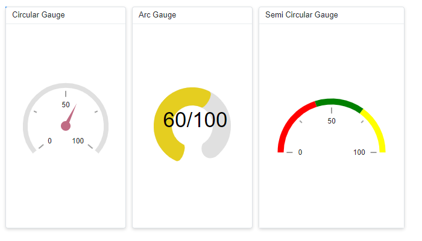
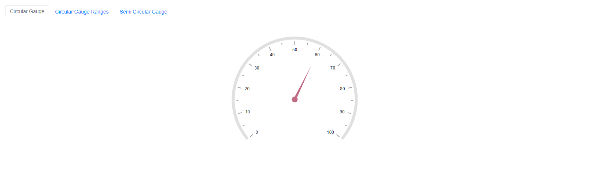
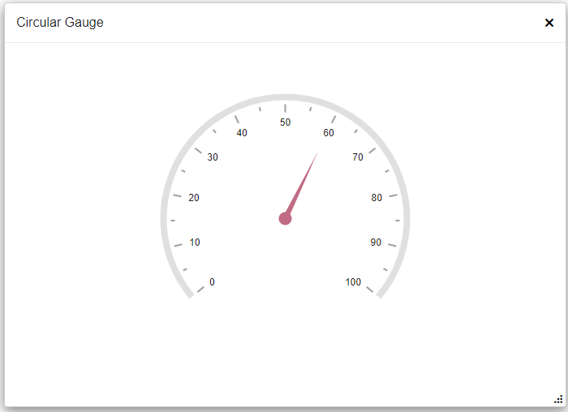
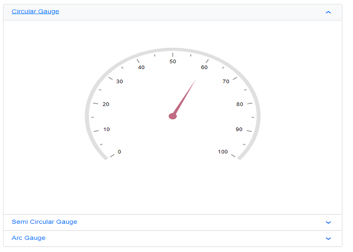

# Render Circular Gauge component inside other components

The Circular Gauge can be rendered within components such as the Dashboard Layout, Tab, Dialog, and Accordion. In general, the Circular Gauge renders before its container, so a boolean flag is used to defer rendering until the container is ready.

## Circular Gauge component inside Dashboard Layout

When the Circular Gauge renders within a Dashboard Layout panel, it starts concurrently with the layout, which can result in incorrect sizing. To ensure correct rendering, create a boolean flag (for example, IsInitialRender) to control when the Circular Gauge is rendered. Set the flag to **false** by default so the Circular Gauge does not render initially. When the Dashboard Layout fires the [Created](https://help.syncfusion.com/cr/blazor/Syncfusion.Blazor.Layouts.DashboardLayoutEvents.html#Syncfusion_Blazor_Layouts_DashboardLayoutEvents_Created) event, call `Task.Yield()` and set the flag to **true**. This ensures the Dashboard Layout is fully rendered before initializing the Circular Gauge.

When the Dashboard Layout panel is dragged or resized, or when the window is resized, the Circular Gauge is not notified and may render incorrectly. To address this, call the Circular Gauge [RefreshAsync](https://help.syncfusion.com/cr/blazor/Syncfusion.Blazor.CircularGauge.SfCircularGauge.html#Syncfusion_Blazor_CircularGauge_SfCircularGauge_RefreshAsync) method within the Dashboard Layout [Resizing](https://help.syncfusion.com/cr/blazor/Syncfusion.Blazor.Layouts.DashboardLayoutEvents.html#Syncfusion_Blazor_Layouts_DashboardLayoutEvents_Resizing) and [OnWindowResize](https://help.syncfusion.com/cr/blazor/Syncfusion.Blazor.Layouts.DashboardLayoutEvents.html#Syncfusion_Blazor_Layouts_DashboardLayoutEvents_OnWindowResize) events. Additionally, use a 500-millisecond timer to refresh the Circular Gauge after resizing completes.

```cshtml

@using Syncfusion.Blazor.CircularGauge
@using Syncfusion.Blazor.Layouts
@using Syncfusion.Blazor.Inputs

<SfDashboardLayout ID="DashBoard" AllowResizing="true" AllowFloating="true" CellSpacing="@CellSpacing" Columns="20">
    <DashboardLayoutEvents Created="Created" OnWindowResize="@ResizingWindow"></DashboardLayoutEvents>
    <DashboardLayoutPanels>
        <DashboardLayoutPanel Id="LayoutOne" Row="0" Column="5" SizeX="5" SizeY="7">
            <HeaderTemplate><div> Circular Gauge </div></HeaderTemplate>
            <ContentTemplate>
                @if (IsInitialRender)
                {
                    <SfCircularGauge ID="GaugeOne" @ref="GaugeOne" Background="transparent" Height="100%" Width="100%">
                        <CircularGaugeAxes>
                            <CircularGaugeAxis Radius="80%" StartAngle="230" EndAngle="130">
                                <CircularGaugeAxisLabelStyle Offset="-1">
                                    <CircularGaugeAxisLabelFont FontFamily="inherit"></CircularGaugeAxisLabelFont>
                                </CircularGaugeAxisLabelStyle>
                                <CircularGaugeAxisLineStyle Width="8" Color="#E0E0E0" />
                                <CircularGaugeAxisMajorTicks Offset="5" />
                                <CircularGaugeAxisMinorTicks Offset="5" />
                                <CircularGaugePointers>
                                    <CircularGaugePointer Value=60 Radius="60%" PointerWidth="7" Color="#c06c84">
                                        <CircularGaugePointerAnimation Duration="500" />
                                        <CircularGaugeCap Radius="8" Color="#c06c84">
                                            <CircularGaugeCapBorder Width="0" />
                                        </CircularGaugeCap>
                                        <CircularGaugeNeedleTail Length="0%" />
                                    </CircularGaugePointer>
                                </CircularGaugePointers>
                            </CircularGaugeAxis>
                        </CircularGaugeAxes>
                    </SfCircularGauge>
                }
            </ContentTemplate>
        </DashboardLayoutPanel>
        <DashboardLayoutPanel Id="LayoutTwo" Row="1" Column="5" SizeX="5" SizeY="7">
            <HeaderTemplate><div>  Semi Circular Gauge </div></HeaderTemplate>
            <ContentTemplate>
                @if (IsInitialRender)
                {
                    <SfCircularGauge ID="GaugeTwo" @ref="GaugeTwo" Width="100%" Height="100%" MoveToCenter="true">
                        <CircularGaugeAxes>
                            <CircularGaugeAxis Radius="80%" StartAngle="270" EndAngle="90">
                                <CircularGaugeAxisLabelStyle Offset="-1">
                                    <CircularGaugeAxisLabelFont FontFamily="inherit"></CircularGaugeAxisLabelFont>
                                </CircularGaugeAxisLabelStyle>
                                <CircularGaugeAxisLineStyle Width="0" Color="white" />
                                <CircularGaugeAxisMajorTicks Offset="15" />
                                <CircularGaugeAxisMinorTicks Offset="15" />
                                <CircularGaugeRanges>
                                    <CircularGaugeRange Start="0" End="40" StartWidth="10" EndWidth="10" Color="Red">
                                    </CircularGaugeRange>
                                    <CircularGaugeRange Start="40" End="70" StartWidth="10" EndWidth="10" Color="Green">
                                    </CircularGaugeRange>
                                    <CircularGaugeRange Start="70" End="100" StartWidth="10" EndWidth="10" Color="Yellow">
                                    </CircularGaugeRange>
                                </CircularGaugeRanges>
                            </CircularGaugeAxis>
                        </CircularGaugeAxes>
                    </SfCircularGauge>
                }
            </ContentTemplate>
        </DashboardLayoutPanel>
        <DashboardLayoutPanel Id="LayoutThree" Row="2" Column="5" SizeX="5" SizeY="7">
            <HeaderTemplate><div> Arc Gauge </div></HeaderTemplate>
            <ContentTemplate>
                @if (IsInitialRender)
                {
                    <SfCircularGauge Background="transparent" ID="GaugeThree" @ref="GaugeThree" Width="100%" Height="100%">
                        <CircularGaugeTitleStyle FontFamily="inherit"></CircularGaugeTitleStyle>
                        <CircularGaugeAxes>
                            <CircularGaugeAxis StartAngle="200" EndAngle="160" Minimum="1" Maximum="100" Radius="80%">
                                <CircularGaugeAxisLineStyle Width="0" />
                                <CircularGaugeAxisLabelStyle>
                                    <CircularGaugeAxisLabelFont Size="0px" FontFamily="inherit" />
                                </CircularGaugeAxisLabelStyle>
                                <CircularGaugeAxisMajorTicks Height="0" />
                                <CircularGaugeAxisMinorTicks Height="0" />
                                <CircularGaugeRanges>
                                    <CircularGaugeRange Start="1" End="100" Radius="90%" StartWidth="30" EndWidth="30" Color="#E0E0E0" RoundedCornerRadius="20" />
                                </CircularGaugeRanges>
                                <CircularGaugePointers>
                                    <CircularGaugePointer Value="60" RoundedCornerRadius="20" Type="PointerType.RangeBar" Radius="90%" Color="#e5ce20" PointerWidth="30">
                                        <CircularGaugePointerAnimation Enable="false" />
                                        <CircularGaugePointerBorder Width="0" />
                                    </CircularGaugePointer>
                                </CircularGaugePointers>
                                <CircularGaugeAnnotations>
                                    <CircularGaugeAnnotation Radius="30%" Angle="90" ZIndex="1">
                                        <ContentTemplate>
                                            <div class="annotationText">60/100</div>
                                        </ContentTemplate>
                                    </CircularGaugeAnnotation>
                                </CircularGaugeAnnotations>
                            </CircularGaugeAxis>
                        </CircularGaugeAxes>
                    </SfCircularGauge>
                }
            </ContentTemplate>
        </DashboardLayoutPanel>
    </DashboardLayoutPanels>
</SfDashboardLayout>

<style>
    .annotationText {
        font-size: 35px;
        width: 120px;
        text-align: center;
        margin-top: -30px;
        margin-left: -55px
    }
</style>

@code {
    SfCircularGauge GaugeOne;
    SfCircularGauge GaugeTwo;
    SfCircularGauge GaugeThree;
    private Timer _resizeTimer;

    public bool IsInitialRender { get; set; }
    public double[] CellSpacing = { 10, 10 };

    public async void Created(Object args)
    {
        await Task.Yield();
        IsInitialRender = true;
    }

    public async Task ResizingWindow(ResizeArgs args)
    {
        if (_resizeTimer != null)
        {
            _resizeTimer.Dispose();
        }
        _resizeTimer = new Timer(async _ =>
        {
            await InvokeAsync(() =>
            {
                RefreshComponents();
            });
        }, null, 500, Timeout.Infinite);
    }

    private async Task RefreshComponents()
    {
        await Task.Yield();
        await GaugeOne.RefreshAsync();
        await GaugeTwo.RefreshAsync();
        await GaugeThree.RefreshAsync();
    }
}

```



## Circular Gauge component inside Tab

When the Circular Gauge renders within the Tab component, it starts concurrently with the Tab, which can result in incorrect sizing. To ensure correct rendering, create a boolean flag (for example, IsInitialRender) to control when the Circular Gauge is rendered. Set the flag to **false** by default so the Circular Gauge does not render initially. When the Tab fires the [Created](https://help.syncfusion.com/cr/blazor/Syncfusion.Blazor.Navigations.TabEvents.html#Syncfusion_Blazor_Navigations_TabEvents_Created) event, set the flag to **true** to initiate rendering.

```cshtml

@using Syncfusion.Blazor.Navigations
@using Syncfusion.Blazor.CircularGauge
@using Syncfusion.Blazor.Inputs

<SfTab CssClass="default-tab">
    <TabEvents Created="Created"></TabEvents>
    <TabItems>
        <TabItem>
            <ChildContent>
                <TabHeader Text="Circular Gauge"></TabHeader>
            </ChildContent>
            <ContentTemplate>
                @if (IsInitialRender)
                {
                <SfCircularGauge @ref="Gauge" ID="CircularGauge" Background="transparent">
                    <CircularGaugeAxes>
                        <CircularGaugeAxis Radius="80%" StartAngle="230" EndAngle="130">
                            <CircularGaugeAxisLabelStyle Offset="-1">
                                <CircularGaugeAxisLabelFont FontFamily="inherit"></CircularGaugeAxisLabelFont>
                            </CircularGaugeAxisLabelStyle>
                            <CircularGaugeAxisLineStyle Width="8" Color="#E0E0E0" />
                            <CircularGaugeAxisMajorTicks Offset="5" />
                            <CircularGaugeAxisMinorTicks Offset="5" />
                            <CircularGaugePointers>
                                <CircularGaugePointer Value=60 Radius="60%" PointerWidth="7" Color="#c06c84">
                                    <CircularGaugePointerAnimation Duration="500" />
                                    <CircularGaugeCap Radius="8" Color="#c06c84">
                                        <CircularGaugeCapBorder Width="0" />
                                    </CircularGaugeCap>
                                    <CircularGaugeNeedleTail Length="0%" />
                                </CircularGaugePointer>
                            </CircularGaugePointers>
                        </CircularGaugeAxis>
                    </CircularGaugeAxes>
                </SfCircularGauge>
                }   
                </ContentTemplate>
        </TabItem>
        <TabItem>
            <ChildContent>
                <TabHeader Text="Semi Circular Gauge"></TabHeader>
            </ChildContent>
                <ContentTemplate>
                @if (IsInitialRender)
                {
                <SfCircularGauge ID="GaugeOne" MoveToCenter="true">
                    <CircularGaugeAxes>
                        <CircularGaugeAxis Radius="80%" StartAngle="270" EndAngle="90">
                            <CircularGaugeAxisLabelStyle Offset="-1">
                            <CircularGaugeAxisLabelFont FontFamily="inherit"></CircularGaugeAxisLabelFont>
                            </CircularGaugeAxisLabelStyle>
                            <CircularGaugeAxisLineStyle Width="0" Color="white" />
                            <CircularGaugeAxisMajorTicks Offset="15" />
                            <CircularGaugeAxisMinorTicks Offset="15" />
                            <CircularGaugeRanges>
                                <CircularGaugeRange Start="0" End="40" StartWidth="10" EndWidth="10" Color="Red">
                                </CircularGaugeRange>
                                <CircularGaugeRange Start="40" End="70" StartWidth="10" EndWidth="10" Color="Green">
                                </CircularGaugeRange>
                                <CircularGaugeRange Start="70" End="100" StartWidth="10" EndWidth="10" Color="Yellow">
                                </CircularGaugeRange>
                            </CircularGaugeRanges>
                        </CircularGaugeAxis>
                    </CircularGaugeAxes>
                </SfCircularGauge>
                }   
                </ContentTemplate>
        </TabItem>
        <TabItem>
            <ChildContent>
                <TabHeader Text="Arc Gauge"></TabHeader>
            </ChildContent>
                <ContentTemplate>
                @if (IsInitialRender)
                {
                    <SfCircularGauge Background="transparent" ID="GaugeTwo">
                        <CircularGaugeTitleStyle FontFamily="inherit"></CircularGaugeTitleStyle>
                        <CircularGaugeAxes>
                            <CircularGaugeAxis StartAngle="200" EndAngle="160" Minimum="1" Maximum="100" Radius="80%">
                                <CircularGaugeAxisLineStyle Width="0" />
                                <CircularGaugeAxisLabelStyle>
                                    <CircularGaugeAxisLabelFont Size="0px" FontFamily="inherit" />
                                </CircularGaugeAxisLabelStyle>
                                <CircularGaugeAxisMajorTicks Height="0" />
                                <CircularGaugeAxisMinorTicks Height="0" />
                                <CircularGaugeRanges>
                                    <CircularGaugeRange Start="1" End="100" Radius="90%" StartWidth="30" EndWidth="30" Color="#E0E0E0" RoundedCornerRadius="20" />
                                </CircularGaugeRanges>
                                <CircularGaugePointers>
                                    <CircularGaugePointer Value="60" RoundedCornerRadius="20" Type="PointerType.RangeBar" Radius="90%" Color="#e5ce20" PointerWidth="30">
                                        <CircularGaugePointerAnimation Enable="false" />
                                        <CircularGaugePointerBorder Width="0" />
                                    </CircularGaugePointer>
                                </CircularGaugePointers>
                                <CircularGaugeAnnotations>
                                    <CircularGaugeAnnotation Radius="0%" Angle="0" ZIndex="1">
                                        <ContentTemplate>
                                            <div class="annotationText">60/100</div>
                                        </ContentTemplate>
                                    </CircularGaugeAnnotation>
                                </CircularGaugeAnnotations>
                            </CircularGaugeAxis>
                        </CircularGaugeAxes>
                </SfCircularGauge>
                }   
                </ContentTemplate>
        </TabItem>
    </TabItems>
</SfTab>

<style>
    .annotationText {
        font-size: 35px;
        width: 120px;
        text-align: center;
        margin-top: -30px;
        margin-left: -55px
    }
</style>

@code {
    SfCircularGauge Gauge;
    public bool IsInitialRender { get; set; }

    public void Created()
    {
        IsInitialRender = true;
    }
}

```




## Circular Gauge component inside Dialog

When the Circular Gauge renders within the Dialog component, it starts concurrently with the Dialog, which can result in incorrect sizing. To ensure correct rendering, create a boolean flag (for example, IsInitialRender) to control when the Circular Gauge is rendered. Set the flag to **false** by default so the Circular Gauge does not render initially. When the Dialog is opened, the [Opened](https://help.syncfusion.com/cr/blazor/Syncfusion.Blazor.Popups.DialogEvents.html#Syncfusion_Blazor_Popups_DialogEvents_Opened) event fires; set the flag to **true** to start rendering. When the Dialog is closed, the [Closed](https://help.syncfusion.com/cr/blazor/Syncfusion.Blazor.Popups.DialogEvents.html#Syncfusion_Blazor_Popups_DialogEvents_Closed) event fires; set the flag to false.

When the Dialog is dragged or resized, the Circular Gauge is not notified, which can lead to incorrect sizing. Call `RefreshAsync` in the Dialog [Resizing](https://help.syncfusion.com/cr/blazor/Syncfusion.Blazor.Popups.DialogEvents.html#Syncfusion_Blazor_Popups_DialogEvents_Resizing) and [OnResizeStop](https://help.syncfusion.com/cr/blazor/Syncfusion.Blazor.Popups.DialogEvents.html#Syncfusion_Blazor_Popups_DialogEvents_OnResizeStop) events. Because the Dialog size stabilizes after a brief delay, apply a 100-millisecond delay before refreshing the Circular Gauge.

```cshtml

@using Syncfusion.Blazor.Popups
@using Syncfusion.Blazor.CircularGauge

<div class="col-lg-12 control-section" id="target">
    <div>
        @if (this.ShowButton)
        {
            <button class="e-btn" @onclick="@OnClicked">Open</button>
        }
    </div>
    <SfDialog ResizeHandles="@DialogResizeDirections" AllowDragging="true" Height="400px" Width="400px" EnableResize="true" ShowCloseIcon="true" @bind-Visible="Visibility">
        <DialogEvents OnResizeStop="@OnResizeStopHandler" Resizing="OnResizeStopHandler" Opened="@DialogOpen" Closed="@DialogClose"></DialogEvents>
        <DialogTemplates>
            <Header>Circular Gauge</Header>
            <Content> 
                @if(IsInitialRender)
                {
                   <SfCircularGauge @ref="Gauge" ID="CircularGauge" Background="transparent" Height="100%" Width="100%">
                        <CircularGaugeAxes>
                            <CircularGaugeAxis Radius="80%" StartAngle="230" EndAngle="130">
                                <CircularGaugeAxisLabelStyle Offset="-1">
                                    <CircularGaugeAxisLabelFont FontFamily="inherit"></CircularGaugeAxisLabelFont>
                                </CircularGaugeAxisLabelStyle>
                                <CircularGaugeAxisLineStyle Width="8" Color="#E0E0E0" />
                                <CircularGaugeAxisMajorTicks Offset="5" />
                                <CircularGaugeAxisMinorTicks Offset="5" />
                                <CircularGaugePointers>
                                    <CircularGaugePointer Value=60 Radius="60%" PointerWidth="7" Color="#c06c84">
                                        <CircularGaugePointerAnimation Duration="500" />
                                        <CircularGaugeCap Radius="8" Color="#c06c84">
                                            <CircularGaugeCapBorder Width="0" />
                                        </CircularGaugeCap>
                                        <CircularGaugeNeedleTail Length="0%" />
                                    </CircularGaugePointer>
                                </CircularGaugePointers>
                            </CircularGaugeAxis>
                        </CircularGaugeAxes>
                    </SfCircularGauge>  
                }
            </Content>
        </DialogTemplates>
    </SfDialog>
</div>

<style>
    #target {
        min-height: 400px;
    }
</style>

@code {
    SfCircularGauge Gauge;
    public bool IsInitialRender { get; set; }
    public bool Visibility { get; set; } = true;
    public bool ShowButton { get; set; } = false;
    public ResizeDirection[] DialogResizeDirections { get; set; } = new ResizeDirection[] { ResizeDirection.All };

    public async Task OnResizeStopHandler(Microsoft.AspNetCore.Components.Web.MouseEventArgs args)
    {
        await Task.Delay(100);
        Gauge.RefreshAsync();
    }

    public void DialogOpen(Object args)
    {
        this.ShowButton = false;
        IsInitialRender = true;
    }

    private void DialogClose(Object args)
    {
        this.ShowButton = true;
        IsInitialRender = false;
    }

    private void OnClicked()
    {
        this.Visibility = true;
    }
}

```






## Circular Gauge component inside Accordion

When the Circular Gauge renders within the Accordion component, it starts concurrently with the Accordion, which can result in incorrect sizing. To ensure correct rendering, create a boolean flag (for example, IsInitialRender) to control when the Circular Gauge is rendered. Set the flag to false by default so the Circular Gauge does not render initially. When the Accordion fires the [Created](https://help.syncfusion.com/cr/blazor/Syncfusion.Blazor.Navigations.AccordionEvents.html#Syncfusion_Blazor_Navigations_AccordionEvents_Created) event, set the flag to true to initiate rendering.

When the Accordion item expands, the Circular Gauge is not notified and may not render correctly. To handle this, call `RefreshAsync` in the Accordion [Expanded](https://help.syncfusion.com/cr/blazor/Syncfusion.Blazor.Navigations.AccordionEvents.html#Syncfusion_Blazor_Navigations_AccordionEvents_Expanded) event.

```cshtml

@using Syncfusion.Blazor.Navigations
@using Syncfusion.Blazor.CircularGauge
@using Syncfusion.Blazor.Inputs

<div class="control-section accordion-control-section">
    <SfAccordion>
        <AccordionEvents Created="Created" Expanded="Expand"></AccordionEvents>
        <AccordionItems>
            <AccordionItem Expanded="true">
                <HeaderTemplate>Circular Gauge</HeaderTemplate>
                <ContentTemplate>
                 @if (IsInitialRender)
                 {
                    <SfCircularGauge ID="GaugeOne" @ref="GaugeOne" Background="transparent" Width="100%">
                        <CircularGaugeAxes>
                            <CircularGaugeAxis Radius="80%" StartAngle="230" EndAngle="130">
                                <CircularGaugeAxisLabelStyle Offset="-1">
                                    <CircularGaugeAxisLabelFont FontFamily="inherit"></CircularGaugeAxisLabelFont>
                                </CircularGaugeAxisLabelStyle>
                                <CircularGaugeAxisLineStyle Width="8" Color="#E0E0E0" />
                                <CircularGaugeAxisMajorTicks Offset="5" />
                                <CircularGaugeAxisMinorTicks Offset="5" />
                                <CircularGaugePointers>
                                    <CircularGaugePointer Value=60 Radius="60%" PointerWidth="7" Color="#c06c84">
                                        <CircularGaugePointerAnimation Duration="500" />
                                        <CircularGaugeCap Radius="8" Color="#c06c84">
                                            <CircularGaugeCapBorder Width="0" />
                                        </CircularGaugeCap>
                                        <CircularGaugeNeedleTail Length="0%" />
                                    </CircularGaugePointer>
                                </CircularGaugePointers>
                            </CircularGaugeAxis>
                        </CircularGaugeAxes>
                    </SfCircularGauge>   
                 }
                </ContentTemplate>
            </AccordionItem>
            <AccordionItem>
                <HeaderTemplate>Semi Circular Gauge</HeaderTemplate>
                <ContentTemplate>
                    @if (IsInitialRender)
                    {
                        <SfCircularGauge ID="GaugeTwo" @ref="GaugeTwo" MoveToCenter="true" Width="100%">
                            <CircularGaugeAxes>
                                <CircularGaugeAxis Radius="80%" StartAngle="270" EndAngle="90">
                                    <CircularGaugeAxisLabelStyle Offset="-1">
                                    <CircularGaugeAxisLabelFont FontFamily="inherit"></CircularGaugeAxisLabelFont>
                                    </CircularGaugeAxisLabelStyle>
                                    <CircularGaugeAxisLineStyle Width="0" Color="white" />
                                    <CircularGaugeAxisMajorTicks Offset="15" />
                                    <CircularGaugeAxisMinorTicks Offset="15" />
                                    <CircularGaugeRanges>
                                        <CircularGaugeRange Start="0" End="40" StartWidth="10" EndWidth="10" Color="Red">
                                        </CircularGaugeRange>
                                        <CircularGaugeRange Start="40" End="70" StartWidth="10" EndWidth="10" Color="Green">
                                        </CircularGaugeRange>
                                        <CircularGaugeRange Start="70" End="100" StartWidth="10" EndWidth="10" Color="Yellow">
                                        </CircularGaugeRange>
                                    </CircularGaugeRanges>
                                </CircularGaugeAxis>
                            </CircularGaugeAxes>
                        </SfCircularGauge>
                    }      
                </ContentTemplate>
            </AccordionItem>
            <AccordionItem>
                <HeaderTemplate>Arc Gauge</HeaderTemplate>
                <ContentTemplate>
                     @if (IsInitialRender)
                     {
                        <SfCircularGauge Background="transparent" ID="GaugeThree" @ref="GaugeThree" Width="100%">
                            <CircularGaugeTitleStyle FontFamily="inherit"></CircularGaugeTitleStyle>
                            <CircularGaugeAxes>
                                <CircularGaugeAxis StartAngle="200" EndAngle="160" Minimum="1" Maximum="100" Radius="80%">
                                    <CircularGaugeAxisLineStyle Width="0" />
                                    <CircularGaugeAxisLabelStyle>
                                        <CircularGaugeAxisLabelFont Size="0px" FontFamily="inherit" />
                                    </CircularGaugeAxisLabelStyle>
                                    <CircularGaugeAxisMajorTicks Height="0" />
                                    <CircularGaugeAxisMinorTicks Height="0" />
                                    <CircularGaugeRanges>
                                        <CircularGaugeRange Start="1" End="100" Radius="90%" StartWidth="30" EndWidth="30" Color="#E0E0E0" RoundedCornerRadius="20" />
                                    </CircularGaugeRanges>
                                    <CircularGaugePointers>
                                        <CircularGaugePointer Value="60" RoundedCornerRadius="20" Type="PointerType.RangeBar" Radius="90%" Color="#e5ce20" PointerWidth="30">
                                            <CircularGaugePointerAnimation Enable="false" />
                                            <CircularGaugePointerBorder Width="0" />
                                        </CircularGaugePointer>
                                    </CircularGaugePointers>
                                    <CircularGaugeAnnotations>
                                        <CircularGaugeAnnotation Radius="0%" Angle="0" ZIndex="1">
                                            <ContentTemplate>
                                                <div class="annotationText">60/100</div>
                                            </ContentTemplate>
                                        </CircularGaugeAnnotation>
                                    </CircularGaugeAnnotations>
                                </CircularGaugeAxis>
                            </CircularGaugeAxes>
                        </SfCircularGauge>
                    }   
                </ContentTemplate>
            </AccordionItem>
        </AccordionItems>
    </SfAccordion>
</div>

<style>
    @@-moz-document url-prefix() {
        .e-accordion .e-content table {
            border-collapse: initial;
        }
    }
    .e-accordion table {
        width: 100%;
    }
    #nested-accordion.e-accordion {
        padding: 4px;
    }
    .e-accordion table th,
    .e-accordion table td {
        padding: 5px;
        border: 1px solid #ddd;
    }
    .accordion-control-section {
        margin: 0 10% 0 10%;
        padding-bottom: 25px;
    }
    .source-link {
        padding-bottom: 25px;
    }
    .annotationText {
        font-size: 35px;
        width: 120px;
        text-align: center;
        margin-top: -30px;
        margin-left: -55px
    }
</style>

@code {
    SfCircularGauge GaugeOne;
    SfCircularGauge GaugeTwo;
    SfCircularGauge GaugeThree;

    public bool IsInitialRender { get; set; }

    public void Created(Object args)
    {
        IsInitialRender = true;
    }

    public async Task Expand(ExpandedEventArgs args)
    {
        if (args.Index == 0)
        {
            GaugeOne.RefreshAsync();

        } else if (args.Index == 1)
        {
            GaugeTwo.RefreshAsync();

        } else if (args.Index == 2)
        {
            GaugeThree.RefreshAsync();
        } 
    }
}

```


