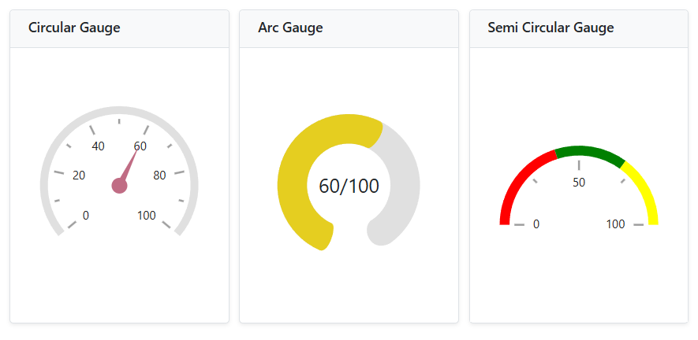

# Render Circular Gauge component inside other components

The Circular Gauge can be rendered within components such as the Dashboard Layout, Tabs, Dialog, and others. In general, the Circular Gauge component renders before other components, so a boolean variable (i.e. boolean flag) is used to determine when to begin rendering the Circular Gauge component.

## Circular Gauge component inside Dashboard Layout

When the Circular Gauge component renders within a panel of the Dashboard Layout component, its rendering begins concurrently with the Dashboard Layout component's rendering. As a result, the size of the Circular Gauge component will not be proper. To properly render the Circular Gauge component, a boolean variable (i.e. **IsInitialRender**) must be created and it is used to determine the Circular Gauge component's rendering. The boolean variable is set to **false** by default, so the Circular Gauge component will not be rendered initially. When the Dashboard Layout component is rendered, its [Created](https://help.syncfusion.com/cr/blazor/Syncfusion.Blazor.Layouts.DashboardLayoutEvents.html#Syncfusion_Blazor_Layouts_DashboardLayoutEvents_Created) event is fired. Within this event, the `Task.Yield()` method should be called, and the boolean variable (i.e. **IsInitialRender**) should be set to **true** to initiate the rendering of the Circular Gauge component. This ensures that the Dashboard Layout component is fully rendered before the Circular Gauge component begins rendering.

When you drag and resize the Dashboard Layout panel or resize the window, the Circular Gauge component is not notified and thus may not render properly within the panel. To address this, call the Circular Gauge component's [RefreshAsync](https://help.syncfusion.com/cr/blazor/Syncfusion.Blazor.CircularGauge.SfCircularGauge.html#Syncfusion_Blazor_CircularGauge_SfCircularGauge_RefreshAsync) method within the Dashboard Layout's [Resizing](https://help.syncfusion.com/cr/blazor/Syncfusion.Blazor.Layouts.DashboardLayoutEvents.html#Syncfusion_Blazor_Layouts_DashboardLayoutEvents_Resizing) and [OnWindowResize](https://help.syncfusion.com/cr/blazor/Syncfusion.Blazor.Layouts.DashboardLayoutEvents.html#Syncfusion_Blazor_Layouts_DashboardLayoutEvents_OnWindowResize) events. Additionally, apply a 500-millisecond delay using a timer to refresh the Circular Gauge components after resizing is complete.

```cshtml

@using Syncfusion.Blazor.CircularGauge
@using Syncfusion.Blazor.Layouts
@using Syncfusion.Blazor.Inputs

<SfDashboardLayout ID="DashBoard" AllowResizing="true" AllowFloating="true" CellSpacing="@CellSpacing" Columns="20">
    <DashboardLayoutEvents Created="Created" OnWindowResize="@ResizingWindow"></DashboardLayoutEvents>
    <DashboardLayoutPanels>
        <DashboardLayoutPanel Id="LayoutOne" Row="0" Column="5" SizeX="5" SizeY="7">
            <HeaderTemplate><div> Circular Gauge </div></HeaderTemplate>
            <ContentTemplate>
                @if (IsInitialRender)
                {
                    <SfCircularGauge ID="GaugeOne" @ref="GaugeOne" Background="transparent" Height="100%" Width="100%">
                        <CircularGaugeAxes>
                            <CircularGaugeAxis Radius="80%" StartAngle="230" EndAngle="130">
                                <CircularGaugeAxisLabelStyle Offset="-1">
                                    <CircularGaugeAxisLabelFont FontFamily="inherit"></CircularGaugeAxisLabelFont>
                                </CircularGaugeAxisLabelStyle>
                                <CircularGaugeAxisLineStyle Width="8" Color="#E0E0E0" />
                                <CircularGaugeAxisMajorTicks Offset="5" />
                                <CircularGaugeAxisMinorTicks Offset="5" />
                                <CircularGaugePointers>
                                    <CircularGaugePointer Value=60 Radius="60%" PointerWidth="7" Color="#c06c84">
                                        <CircularGaugePointerAnimation Duration="500" />
                                        <CircularGaugeCap Radius="8" Color="#c06c84">
                                            <CircularGaugeCapBorder Width="0" />
                                        </CircularGaugeCap>
                                        <CircularGaugeNeedleTail Length="0%" />
                                    </CircularGaugePointer>
                                </CircularGaugePointers>
                            </CircularGaugeAxis>
                        </CircularGaugeAxes>
                    </SfCircularGauge>
                }
            </ContentTemplate>
        </DashboardLayoutPanel>
        <DashboardLayoutPanel Id="LayoutTwo" Row="1" Column="5" SizeX="5" SizeY="7">
            <HeaderTemplate><div>  Semi Circular Gauge </div></HeaderTemplate>
            <ContentTemplate>
                @if (IsInitialRender)
                {
                    <SfCircularGauge ID="GaugeTwo" @ref="GaugeTwo" Width="100%" Height="100%" MoveToCenter="true">
                        <CircularGaugeAxes>
                            <CircularGaugeAxis Radius="80%" StartAngle="270" EndAngle="90">
                                <CircularGaugeAxisLabelStyle Offset="-1">
                                    <CircularGaugeAxisLabelFont FontFamily="inherit"></CircularGaugeAxisLabelFont>
                                </CircularGaugeAxisLabelStyle>
                                <CircularGaugeAxisLineStyle Width="0" Color="white" />
                                <CircularGaugeAxisMajorTicks Offset="15" />
                                <CircularGaugeAxisMinorTicks Offset="15" />
                                <CircularGaugeRanges>
                                    <CircularGaugeRange Start="0" End="40" StartWidth="10" EndWidth="10" Color="Red">
                                    </CircularGaugeRange>
                                    <CircularGaugeRange Start="40" End="70" StartWidth="10" EndWidth="10" Color="Green">
                                    </CircularGaugeRange>
                                    <CircularGaugeRange Start="70" End="100" StartWidth="10" EndWidth="10" Color="Yellow">
                                    </CircularGaugeRange>
                                </CircularGaugeRanges>
                            </CircularGaugeAxis>
                        </CircularGaugeAxes>
                    </SfCircularGauge>
                }
            </ContentTemplate>
        </DashboardLayoutPanel>
        <DashboardLayoutPanel Id="LayoutThree" Row="2" Column="5" SizeX="5" SizeY="7">
            <HeaderTemplate><div> Arc Gauge </div></HeaderTemplate>
            <ContentTemplate>
                @if (IsInitialRender)
                {
                     <SfCircularGauge Background="transparent" ID="GaugeThree" @ref="GaugeThree" Width="100%" Height="100%">
                        <CircularGaugeTitleStyle FontFamily="inherit"></CircularGaugeTitleStyle>
                        <CircularGaugeAxes>
                            <CircularGaugeAxis StartAngle="200" EndAngle="160" Minimum="1" Maximum="100" Radius="80%">
                                <CircularGaugeAxisLineStyle Width="0" />
                                <CircularGaugeAxisLabelStyle>
                                    <CircularGaugeAxisLabelFont Size="0px" FontFamily="inherit" />
                                </CircularGaugeAxisLabelStyle>
                                <CircularGaugeAxisMajorTicks Height="0" />
                                <CircularGaugeAxisMinorTicks Height="0" />
                                <CircularGaugeRanges>
                                    <CircularGaugeRange Start="1" End="100" Radius="90%" StartWidth="30" EndWidth="30" Color="#E0E0E0" RoundedCornerRadius="20" />
                                </CircularGaugeRanges>
                                <CircularGaugePointers>
                                    <CircularGaugePointer Value="60" RoundedCornerRadius="20" Type="PointerType.RangeBar" Radius="90%" Color="#e5ce20" PointerWidth="30">
                                        <CircularGaugePointerAnimation Enable="false" />
                                        <CircularGaugePointerBorder Width="0" />
                                    </CircularGaugePointer>
                                </CircularGaugePointers>
                                <CircularGaugeAnnotations>
                                    <CircularGaugeAnnotation Radius="30%" Angle="90" ZIndex="1">
                                        <ContentTemplate>
                                            <div class="annotationText">60/100</div>
                                        </ContentTemplate>
                                    </CircularGaugeAnnotation>
                                </CircularGaugeAnnotations>
                            </CircularGaugeAxis>
                        </CircularGaugeAxes>
                    </SfCircularGauge>
                }
            </ContentTemplate>
        </DashboardLayoutPanel>
    </DashboardLayoutPanels>
</SfDashboardLayout>

<style>
    .annotationText {
        font-size: 35px;
        width: 120px;
        text-align: center;
        margin-top: -30px;
        margin-left: -55px
    }
</style>
@code {
    SfCircularGauge GaugeOne;
    SfCircularGauge GaugeTwo;
    SfCircularGauge GaugeThree;
    private Timer _resizeTimer;

    public bool IsInitialRender { get; set; }
    public double[] CellSpacing = { 10, 10 };

    public async void Created(Object args)
    {
        await Task.Yield();
        IsInitialRender = true;
    }

    public async Task ResizingWindow(ResizeArgs args)
    {
        if (_resizeTimer != null)
        {
            _resizeTimer.Dispose();
        }
        _resizeTimer = new Timer(async _ =>
        {
            await InvokeAsync(() =>
            {
                RefreshComponents();
            });
        }, null, 500, Timeout.Infinite);
    }

    private async Task RefreshComponents()
    {
        await Task.Yield();
        await GaugeOne.RefreshAsync();
        await GaugeTwo.RefreshAsync();
        await GaugeThree.RefreshAsync();
    }
}

```



## Circular Gauge component inside Tab

When the Circular Gauge component renders within the Tab component, its rendering begins concurrently with the Tab component's rendering. As a result, the size of the Circular Gauge component will not be proper. To properly render the Circular Gauge component, a boolean variable (i.e. **IsInitialRender**) must be created and it is used to determine the Circular Gauge component's rendering. The boolean variable is set to **false** by default, so the Circular Gauge component will not be rendered initially. When the Tab component is rendered, its [Created](https://help.syncfusion.com/cr/blazor/Syncfusion.Blazor.Navigations.TabEvents.html#Syncfusion_Blazor_Navigations_TabEvents_Created) event is fired, and the boolean variable (i.e. **IsInitialRender**) in this event must be changed to **true** to initiate the render of the Circular Gauge component.

```cshtml

@using Syncfusion.Blazor.Navigations
@using Syncfusion.Blazor.CircularGauge
@using Syncfusion.Blazor.Inputs

     <SfTab CssClass="default-tab">
        <TabEvents Created="Created"></TabEvents>
        <TabItems>
            <TabItem>
                <ChildContent>
                    <TabHeader Text="Circular Gauge"></TabHeader>
                </ChildContent>
                <ContentTemplate>
                 @if (IsInitialRender)
                 {
                    <SfCircularGauge @ref="Gauge" ID="CircularGauge" Background="transparent">
                        <CircularGaugeAxes>
                            <CircularGaugeAxis Radius="80%" StartAngle="230" EndAngle="130">
                                <CircularGaugeAxisLabelStyle Offset="-1">
                                    <CircularGaugeAxisLabelFont FontFamily="inherit"></CircularGaugeAxisLabelFont>
                                </CircularGaugeAxisLabelStyle>
                                <CircularGaugeAxisLineStyle Width="8" Color="#E0E0E0" />
                                <CircularGaugeAxisMajorTicks Offset="5" />
                                <CircularGaugeAxisMinorTicks Offset="5" />
                                <CircularGaugePointers>
                                    <CircularGaugePointer Value=60 Radius="60%" PointerWidth="7" Color="#c06c84">
                                        <CircularGaugePointerAnimation Duration="500" />
                                        <CircularGaugeCap Radius="8" Color="#c06c84">
                                            <CircularGaugeCapBorder Width="0" />
                                        </CircularGaugeCap>
                                        <CircularGaugeNeedleTail Length="0%" />
                                    </CircularGaugePointer>
                                </CircularGaugePointers>
                            </CircularGaugeAxis>
                        </CircularGaugeAxes>
                    </SfCircularGauge>
                 }   
                 </ContentTemplate>
            </TabItem>
            <TabItem>
                <ChildContent>
                    <TabHeader Text="Semi Circular Gauge"></TabHeader>
                </ChildContent>
                 <ContentTemplate>
                 @if (IsInitialRender)
                 {
                    <SfCircularGauge ID="GaugeOne" MoveToCenter="true">
                        <CircularGaugeAxes>
                            <CircularGaugeAxis Radius="80%" StartAngle="270" EndAngle="90">
                                <CircularGaugeAxisLabelStyle Offset="-1">
                                <CircularGaugeAxisLabelFont FontFamily="inherit"></CircularGaugeAxisLabelFont>
                                </CircularGaugeAxisLabelStyle>
                                <CircularGaugeAxisLineStyle Width="0" Color="white" />
                                <CircularGaugeAxisMajorTicks Offset="15" />
                                <CircularGaugeAxisMinorTicks Offset="15" />
                                <CircularGaugeRanges>
                                    <CircularGaugeRange Start="0" End="40" StartWidth="10" EndWidth="10" Color="Red">
                                    </CircularGaugeRange>
                                    <CircularGaugeRange Start="40" End="70" StartWidth="10" EndWidth="10" Color="Green">
                                    </CircularGaugeRange>
                                    <CircularGaugeRange Start="70" End="100" StartWidth="10" EndWidth="10" Color="Yellow">
                                    </CircularGaugeRange>
                                </CircularGaugeRanges>
                            </CircularGaugeAxis>
                        </CircularGaugeAxes>
                    </SfCircularGauge>
                 }   
                 </ContentTemplate>
            </TabItem>
            <TabItem>
                <ChildContent>
                    <TabHeader Text="Arc Gauge"></TabHeader>
                </ChildContent>
                 <ContentTemplate>
                 @if (IsInitialRender)
                 {
                     <SfCircularGauge Background="transparent" ID="GaugeTwo">
                            <CircularGaugeTitleStyle FontFamily="inherit"></CircularGaugeTitleStyle>
                            <CircularGaugeAxes>
                                <CircularGaugeAxis StartAngle="200" EndAngle="160" Minimum="1" Maximum="100" Radius="80%">
                                    <CircularGaugeAxisLineStyle Width="0" />
                                    <CircularGaugeAxisLabelStyle>
                                        <CircularGaugeAxisLabelFont Size="0px" FontFamily="inherit" />
                                    </CircularGaugeAxisLabelStyle>
                                    <CircularGaugeAxisMajorTicks Height="0" />
                                    <CircularGaugeAxisMinorTicks Height="0" />
                                    <CircularGaugeRanges>
                                        <CircularGaugeRange Start="1" End="100" Radius="90%" StartWidth="30" EndWidth="30" Color="#E0E0E0" RoundedCornerRadius="20" />
                                    </CircularGaugeRanges>
                                    <CircularGaugePointers>
                                        <CircularGaugePointer Value="60" RoundedCornerRadius="20" Type="PointerType.RangeBar" Radius="90%" Color="#e5ce20" PointerWidth="30">
                                            <CircularGaugePointerAnimation Enable="false" />
                                            <CircularGaugePointerBorder Width="0" />
                                        </CircularGaugePointer>
                                    </CircularGaugePointers>
                                    <CircularGaugeAnnotations>
                                        <CircularGaugeAnnotation Radius="0%" Angle="0" ZIndex="1">
                                            <ContentTemplate>
                                                <div class="annotationText">60/100</div>
                                            </ContentTemplate>
                                        </CircularGaugeAnnotation>
                                    </CircularGaugeAnnotations>
                                </CircularGaugeAxis>
                            </CircularGaugeAxes>
                    </SfCircularGauge>
                 }   
                 </ContentTemplate>
            </TabItem>
        </TabItems>
    </SfTab>

<style>
    .annotationText {
        font-size: 35px;
        width: 120px;
        text-align: center;
        margin-top: -30px;
        margin-left: -55px
    }
</style>

@code{
    SfCircularGauge Gauge;
    public bool IsInitialRender { get; set; }

    public void Created()
    {
        IsInitialRender = true;
    }
}

```


## Circular Gauge component inside Dialog

When the Circular Gauge component renders within the Dialog component, its rendering begins concurrently with the Dialog component's rendering. As a result, the size of the Circular Gauge component will not be proper. To properly render the Circular Gauge component, a boolean variable (i.e. **IsInitialRender**) must be created and it is used to determine the Circular Gauge component's rendering. The boolean variable is set to **false** by default, so the Circular Gauge component will not be rendered initially. When the Dialog component is being opened, its [Opened](https://help.syncfusion.com/cr/blazor/Syncfusion.Blazor.Popups.DialogEvents.html#Syncfusion_Blazor_Popups_DialogEvents_Opened) event is fired, and the boolean variable (i.e. **IsInitialRender**) must be set to **true** to initiate the render of the Circular Gauge component. When the Dialog component is closed, its [Closed](https://help.syncfusion.com/cr/blazor/Syncfusion.Blazor.Popups.DialogEvents.html#Syncfusion_Blazor_Popups_DialogEvents_Closed) event is triggered, and the boolean variable (i.e. **IsInitialRender**) in this event must be changed to false.

When you drag and resize the Dialog component, the Circular Gauge component is not notified, so the Circular Gauge is not properly rendered within the Dialog. To avoid this scenario, the Circular Gauge component's `RefreshAsync` method must be called in the Dialog's [Resizing](https://help.syncfusion.com/cr/blazor/Syncfusion.Blazor.Popups.DialogEvents.html#Syncfusion_Blazor_Popups_DialogEvents_Resizing) and [OnResizeStop](https://help.syncfusion.com/cr/blazor/Syncfusion.Blazor.Popups.DialogEvents.html#Syncfusion_Blazor_Popups_DialogEvents_OnResizeStop) events. Because the size of the Dialog is determined after a delay, a 100 millisecond delay must be provided before refreshing the Circular Gauge component.

```cshtml

@using Syncfusion.Blazor.Popups
@using Syncfusion.Blazor.CircularGauge

<div class="col-lg-12 control-section" id="target">
    <div>
        @if (this.ShowButton)
        {
            <button class="e-btn" @onclick="@OnClicked">Open</button>
        }
    </div>
    <SfDialog ResizeHandles="@DialogResizeDirections" AllowDragging="true" Height="400px" Width="400px" EnableResize="true" ShowCloseIcon="true" @bind-Visible="Visibility">
        <DialogEvents OnResizeStop="@OnResizeStopHandler" Resizing="OnResizeStopHandler" Opened="@DialogOpen" Closed="@DialogClose"></DialogEvents>
        <DialogTemplates>
            <Header>Circular Gauge</Header>
            <Content> 
                @if(IsInitialRender)
                {
                   <SfCircularGauge @ref="Gauge" ID="CircularGauge" Background="transparent" Height="100%" Width="100%">
                        <CircularGaugeAxes>
                            <CircularGaugeAxis Radius="80%" StartAngle="230" EndAngle="130">
                                <CircularGaugeAxisLabelStyle Offset="-1">
                                    <CircularGaugeAxisLabelFont FontFamily="inherit"></CircularGaugeAxisLabelFont>
                                </CircularGaugeAxisLabelStyle>
                                <CircularGaugeAxisLineStyle Width="8" Color="#E0E0E0" />
                                <CircularGaugeAxisMajorTicks Offset="5" />
                                <CircularGaugeAxisMinorTicks Offset="5" />
                                <CircularGaugePointers>
                                    <CircularGaugePointer Value=60 Radius="60%" PointerWidth="7" Color="#c06c84">
                                        <CircularGaugePointerAnimation Duration="500" />
                                        <CircularGaugeCap Radius="8" Color="#c06c84">
                                            <CircularGaugeCapBorder Width="0" />
                                        </CircularGaugeCap>
                                        <CircularGaugeNeedleTail Length="0%" />
                                    </CircularGaugePointer>
                                </CircularGaugePointers>
                            </CircularGaugeAxis>
                        </CircularGaugeAxes>
                    </SfCircularGauge>  
                }
            </Content>
        </DialogTemplates>
    </SfDialog>
</div>
<style>
    #target {
        min-height: 400px;
    }
</style>
@code {
    SfCircularGauge Gauge;
    public bool IsInitialRender { get; set; }
    public bool Visibility { get; set; } = true;
    public bool ShowButton { get; set; } = false;
    public ResizeDirection[] DialogResizeDirections { get; set; } = new ResizeDirection[] { ResizeDirection.All };

    public async Task OnResizeStopHandler(Microsoft.AspNetCore.Components.Web.MouseEventArgs args)
    {
        await Task.Delay(100);
        Gauge.RefreshAsync();
    }

    public void DialogOpen(Object args)
    {
        this.ShowButton = false;
        IsInitialRender = true;
    }
    private void DialogClose(Object args)
    {
        this.ShowButton = true;
        IsInitialRender = false;
    }
    private void OnClicked()
    {
        this.Visibility = true;
    }
}

```




## Circular Gauge component inside Accordion

When the Circular Gauge component renders within the Accordion component, its rendering begins concurrently with the Accordion component's rendering. As a result, the size of the Circular Gauge component will not be proper. To properly render the Circular Gauge component, a boolean variable (i.e. **IsInitialRender**) must be created and it is used to determine the Circular Gauge component's rendering. The boolean variable is set to **false** by default, so the Circular Gauge component will not be rendered initially. When the Accordion component is rendered, its [Created](https://help.syncfusion.com/cr/blazor/Syncfusion.Blazor.Navigations.AccordionEvents.html#Syncfusion_Blazor_Navigations_AccordionEvents_Created) event is fired, and the boolean variable (i.e. **IsInitialRender**) in this event must be changed to **true** to initiate the render of the Circular Gauge component.

When you expand the Accordion component, the Circular Gauge component is not notified, so the Circular Gauge is not properly rendered within the Accordion. To avoid this scenario, the Circular Gauge component's `RefreshAsync` method must be called in the Accordion's [Expanded](https://help.syncfusion.com/cr/blazor/Syncfusion.Blazor.Navigations.AccordionEvents.html#Syncfusion_Blazor_Navigations_AccordionEvents_Expanded) event.

```cshtml

@using Syncfusion.Blazor.Navigations
@using Syncfusion.Blazor.CircularGauge
@using Syncfusion.Blazor.Inputs

<div class="control-section accordion-control-section">
    <SfAccordion>
        <AccordionEvents Created="Created" Expanded="Expand"></AccordionEvents>
        <AccordionItems>
            <AccordionItem Expanded="true">
                <HeaderTemplate>Circular Gauge</HeaderTemplate>
                <ContentTemplate>
                 @if (IsInitialRender)
                 {
                    <SfCircularGauge ID="GaugeOne" @ref="GaugeOne" Background="transparent" Width="100%">
                        <CircularGaugeAxes>
                            <CircularGaugeAxis Radius="80%" StartAngle="230" EndAngle="130">
                                <CircularGaugeAxisLabelStyle Offset="-1">
                                    <CircularGaugeAxisLabelFont FontFamily="inherit"></CircularGaugeAxisLabelFont>
                                </CircularGaugeAxisLabelStyle>
                                <CircularGaugeAxisLineStyle Width="8" Color="#E0E0E0" />
                                <CircularGaugeAxisMajorTicks Offset="5" />
                                <CircularGaugeAxisMinorTicks Offset="5" />
                                <CircularGaugePointers>
                                    <CircularGaugePointer Value=60 Radius="60%" PointerWidth="7" Color="#c06c84">
                                        <CircularGaugePointerAnimation Duration="500" />
                                        <CircularGaugeCap Radius="8" Color="#c06c84">
                                            <CircularGaugeCapBorder Width="0" />
                                        </CircularGaugeCap>
                                        <CircularGaugeNeedleTail Length="0%" />
                                    </CircularGaugePointer>
                                </CircularGaugePointers>
                            </CircularGaugeAxis>
                        </CircularGaugeAxes>
                    </SfCircularGauge>   
                 }
                </ContentTemplate>
            </AccordionItem>
            <AccordionItem>
                <HeaderTemplate>Semi Circular Gauge</HeaderTemplate>
                <ContentTemplate>
                    @if (IsInitialRender)
                    {
                        <SfCircularGauge ID="GaugeTwo" @ref="GaugeTwo" MoveToCenter="true" Width="100%">
                            <CircularGaugeAxes>
                                <CircularGaugeAxis Radius="80%" StartAngle="270" EndAngle="90">
                                    <CircularGaugeAxisLabelStyle Offset="-1">
                                    <CircularGaugeAxisLabelFont FontFamily="inherit"></CircularGaugeAxisLabelFont>
                                    </CircularGaugeAxisLabelStyle>
                                    <CircularGaugeAxisLineStyle Width="0" Color="white" />
                                    <CircularGaugeAxisMajorTicks Offset="15" />
                                    <CircularGaugeAxisMinorTicks Offset="15" />
                                    <CircularGaugeRanges>
                                        <CircularGaugeRange Start="0" End="40" StartWidth="10" EndWidth="10" Color="Red">
                                        </CircularGaugeRange>
                                        <CircularGaugeRange Start="40" End="70" StartWidth="10" EndWidth="10" Color="Green">
                                        </CircularGaugeRange>
                                        <CircularGaugeRange Start="70" End="100" StartWidth="10" EndWidth="10" Color="Yellow">
                                        </CircularGaugeRange>
                                    </CircularGaugeRanges>
                                </CircularGaugeAxis>
                            </CircularGaugeAxes>
                        </SfCircularGauge>
                    }      
                </ContentTemplate>
            </AccordionItem>
            <AccordionItem>
                <HeaderTemplate>Arc Gauge</HeaderTemplate>
                <ContentTemplate>
                     @if (IsInitialRender)
                     {
                        <SfCircularGauge Background="transparent" ID="GaugeThree" @ref="GaugeThree" Width="100%">
                            <CircularGaugeTitleStyle FontFamily="inherit"></CircularGaugeTitleStyle>
                            <CircularGaugeAxes>
                                <CircularGaugeAxis StartAngle="200" EndAngle="160" Minimum="1" Maximum="100" Radius="80%">
                                    <CircularGaugeAxisLineStyle Width="0" />
                                    <CircularGaugeAxisLabelStyle>
                                        <CircularGaugeAxisLabelFont Size="0px" FontFamily="inherit" />
                                    </CircularGaugeAxisLabelStyle>
                                    <CircularGaugeAxisMajorTicks Height="0" />
                                    <CircularGaugeAxisMinorTicks Height="0" />
                                    <CircularGaugeRanges>
                                        <CircularGaugeRange Start="1" End="100" Radius="90%" StartWidth="30" EndWidth="30" Color="#E0E0E0" 
RoundedCornerRadius="20" />
                                    </CircularGaugeRanges>
                                    <CircularGaugePointers>
                                        <CircularGaugePointer Value="60" RoundedCornerRadius="20" Type="PointerType.RangeBar" Radius="90%" 
Color="#e5ce20" PointerWidth="30">
                                            <CircularGaugePointerAnimation Enable="false" />
                                            <CircularGaugePointerBorder Width="0" />
                                        </CircularGaugePointer>
                                    </CircularGaugePointers>
                                    <CircularGaugeAnnotations>
                                        <CircularGaugeAnnotation Radius="0%" Angle="0" ZIndex="1">
                                            <ContentTemplate>
                                                <div class="annotationText">60/100</div>
                                            </ContentTemplate>
                                        </CircularGaugeAnnotation>
                                    </CircularGaugeAnnotations>
                                </CircularGaugeAxis>
                            </CircularGaugeAxes>
                        </SfCircularGauge>
                    }   
                </ContentTemplate>
            </AccordionItem>
        </AccordionItems>
    </SfAccordion>
</div>
<style>
    @@-moz-document url-prefix() {
        .e-accordion .e-content table {
            border-collapse: initial;
        }
    }
    .e-accordion table {
        width: 100%;
    }
    #nested-accordion.e-accordion {
        padding: 4px;
    }
    .e-accordion table th,
    .e-accordion table td {
        padding: 5px;
        border: 1px solid #ddd;
    }
    .accordion-control-section {
        margin: 0 10% 0 10%;
        padding-bottom: 25px;
    }
    .source-link {
        padding-bottom: 25px;
    }
    .annotationText {
        font-size: 35px;
        width: 120px;
        text-align: center;
        margin-top: -30px;
        margin-left: -55px
    }
</style>
@code{
    SfCircularGauge GaugeOne;
    SfCircularGauge GaugeTwo;
    SfCircularGauge GaugeThree;

    public bool IsInitialRender { get; set; }

    public void Created(Object args)
    {
        IsInitialRender = true;
    }

    public async Task Expand(ExpandedEventArgs args)
    {
        if (args.Index == 0)
        {
            GaugeOne.RefreshAsync();

        } else if (args.Index == 1)
        {
            GaugeTwo.RefreshAsync();

        } else if (args.Index == 2)
        {
            GaugeThree.RefreshAsync();
        } 
    }
}

```

