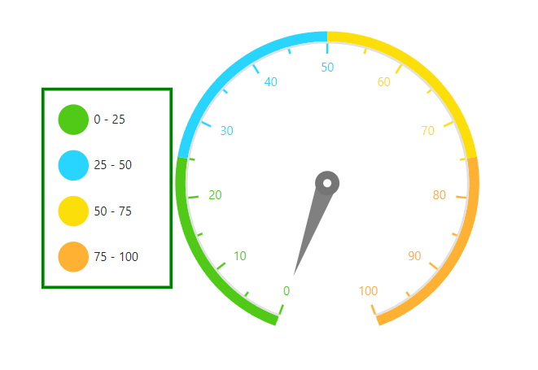
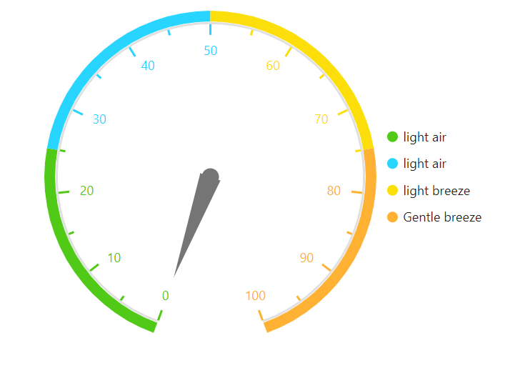

# Legend in Blazor Circular Gauge Component

The legend explains what the circular gauge axis ranges represent. It can display symbols in various colors and shapes, or other identifiers mapped to the underlying data. This helps interpret what each symbol denotes within the gauge’s axis range.

Enable the legend for circular gauge ranges by setting the `Visible` property of `CircularGaugeLegendSettings` to **true**.

<!-- markdownlint-disable MD036 -->

## Legend customization

Legend customization options are available for shape, alignment, and position.

## Position and alignment

Position determines where the legend appears. Use the `Position` property in `CircularGaugeLegendSettings`. The following options are available:

* Top
* Bottom
* Left
* Right
* Custom
* Auto

Alignment determines how legend items are aligned within the available space. Use the `Alignment` property in `CircularGaugeLegendSettings`. The following options are available:

* Near
* Center
* Far

Absolute positioning is supported through the `Location` properties available in `CircularGaugeLegendSettings`.

### Legend size

Modify legend size using the `Height` and `Width` properties in `CircularGaugeLegendSettings`.

### Legend opacity

Control legend shape transparency with the `Opacity` property in `CircularGaugeLegendSettings`.

### Legend shape

Change the legend item shape by setting the `Shape` property. By default, the shape is `Circle`.

Supported shapes:

* Circle
* Rectangle
* Diamond
* Triangle
* InvertedTriangle
* Image

Customize shape dimensions using the `ShapeWidth` and `ShapeHeight` properties.

### Legend padding

Control spacing between legend items using the `Padding` property of the legend. The default value is 5.

### Legend border

Customize the legend border using the `Border` option in the legend, including border `Color` and `Width` properties.

## Font of the legend text

The font of legend item text can be customized using the following properties:

* fontFamily
* fontStyle
* fontWeight
* opacity
* color
* size

The following code example shows how to add legend in the gauge.

```cshtml

@using Syncfusion.Blazor.CircularGauge

<SfCircularGauge>
    <CircularGaugeLegendSettings Visible="true" ShapeWidth="30" ShapeHeight="30" Padding="15">
        <CircularGaugeLegendBorder Color="green" Width="3"></CircularGaugeLegendBorder>
    </CircularGaugeLegendSettings>
    <CircularGaugeAxes>
        <CircularGaugeAxis Minimum="0" Maximum="100">
            <CircularGaugeAxisMajorTicks UseRangeColor="true">
            </CircularGaugeAxisMajorTicks>
            <CircularGaugeAxisMinorTicks UseRangeColor="true">
            </CircularGaugeAxisMinorTicks>
            <CircularGaugeAxisLabelStyle UseRangeColor="true">
            </CircularGaugeAxisLabelStyle>
            <CircularGaugeRanges>
                <CircularGaugeRange Start="0" End="25" Radius="108%">
                </CircularGaugeRange>
                <CircularGaugeRange Start="25" End="50" Radius="108%">
                </CircularGaugeRange>
                <CircularGaugeRange Start="50" End="75" Radius="108%">
                </CircularGaugeRange>
                <CircularGaugeRange Start="75" End="100" Radius="108%">
                </CircularGaugeRange>
            </CircularGaugeRanges>
            <CircularGaugePointers>
                <CircularGaugePointer Value="0" Color="gray" Radius="70%">
                    <CircularGaugeCap Radius="8" Color="white">
                        <CircularGaugeCapBorder Width="8" />
                    </CircularGaugeCap>
                </CircularGaugePointer>
            </CircularGaugePointers>
        </CircularGaugeAxis>
    </CircularGaugeAxes>
</SfCircularGauge>

```




<!-- markdownlint-disable MD036 -->

## Toggle option in legend

A toggle option is available for the legend. When enabled, toggling a legend item shows or hides the corresponding circular gauge range. Enable this option using `ToggleVisibility` in `CircularGaugeLegendSettings`.

```cshtml

@using Syncfusion.Blazor.CircularGauge

<SfCircularGauge>
    <CircularGaugeLegendSettings Position="LegendPosition.Right" Visible="true" ToggleVisibility="true" />
    <CircularGaugeAxes>
        <CircularGaugeAxis Minimum="0" Maximum="100">
            <CircularGaugeAxisMajorTicks UseRangeColor="true">
            </CircularGaugeAxisMajorTicks>
            <CircularGaugeAxisMinorTicks UseRangeColor="true">
            </CircularGaugeAxisMinorTicks>
            <CircularGaugeAxisLabelStyle UseRangeColor="true">
            </CircularGaugeAxisLabelStyle>
            <CircularGaugeRanges>
                <CircularGaugeRange Start="0" End="25" Radius="108%">
                </CircularGaugeRange>
                <CircularGaugeRange Start="25" End="50" Radius="108%">
                </CircularGaugeRange>
                <CircularGaugeRange Start="50" End="75" Radius="108%">
                </CircularGaugeRange>
                <CircularGaugeRange Start="75" End="100" Radius="108%">
                </CircularGaugeRange>
            </CircularGaugeRanges>
            <CircularGaugePointers>
                <CircularGaugePointer />
            </CircularGaugePointers>
        </CircularGaugeAxis>
    </CircularGaugeAxes>
</SfCircularGauge>

```



## Paging support in legend

Paging is enabled automatically when legend items exceed the legend bounds. Navigate between pages using the provided navigation buttons.

```cshtml

@using Syncfusion.Blazor.CircularGauge

<SfCircularGauge>
    <CircularGaugeLegendSettings Position="LegendPosition.Right" Visible="true" Height="50" />
    <CircularGaugeAxes>
        <CircularGaugeAxis Minimum="0" Maximum="100">
            <CircularGaugeAxisMajorTicks UseRangeColor="true">
            </CircularGaugeAxisMajorTicks>
            <CircularGaugeAxisMinorTicks UseRangeColor="true">
            </CircularGaugeAxisMinorTicks>
            <CircularGaugeAxisLabelStyle UseRangeColor="true">
            </CircularGaugeAxisLabelStyle>
            <CircularGaugeRanges>
                <CircularGaugeRange Start="0" End="25" Radius="108%">
                </CircularGaugeRange>
                <CircularGaugeRange Start="25" End="50" Radius="108%">
                </CircularGaugeRange>
                <CircularGaugeRange Start="50" End="75" Radius="108%">
                </CircularGaugeRange>
                <CircularGaugeRange Start="75" End="100" Radius="108%">
                </CircularGaugeRange>
            </CircularGaugeRanges>
            <CircularGaugePointers>
                <CircularGaugePointer />
            </CircularGaugePointers>
        </CircularGaugeAxis>
    </CircularGaugeAxes>
</SfCircularGauge>

```



## Legend text customization

Customize the legend text using the `LegendText` property in `CircularGaugeRange`.

```cshtml

@using Syncfusion.Blazor.CircularGauge

<SfCircularGauge>
    <CircularGaugeLegendSettings Position="LegendPosition.Right" Visible="true" Height="50" />
    <CircularGaugeAxes>
        <CircularGaugeAxis Minimum="0" Maximum="100">
            <CircularGaugeAxisMajorTicks UseRangeColor="true">
            </CircularGaugeAxisMajorTicks>
            <CircularGaugeAxisMinorTicks UseRangeColor="true">
            </CircularGaugeAxisMinorTicks>
            <CircularGaugeAxisLabelStyle UseRangeColor="true">
            </CircularGaugeAxisLabelStyle>
            <CircularGaugeRanges>
                <CircularGaugeRange Start="0" End="25" Radius="108%" LegendText="light air">
                </CircularGaugeRange>
                <CircularGaugeRange Start="25" End="50" Radius="108%" LegendText="light air">
                </CircularGaugeRange>
                <CircularGaugeRange Start="50" End="75" Radius="108%" LegendText="light breez">
                </CircularGaugeRange>
                <CircularGaugeRange Start="75" End="100" Radius="108%" LegendText="Gentle breez">
                </CircularGaugeRange>
            </CircularGaugeRanges>
            <CircularGaugePointers>
                <CircularGaugePointer />
            </CircularGaugePointers>
        </CircularGaugeAxis>
    </CircularGaugeAxes>
</SfCircularGauge>

```



