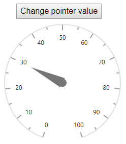

# Methods in Blazor Circular Gauge Component

## Using methods in Circular Gauge component

You can create object for the circular gauge component using `@ref` and call the [SetPoinerValue](https://help.syncfusion.com/cr/blazor/Syncfusion.Blazor.CircularGauge.SfCircularGauge.html#Syncfusion_Blazor_CircularGauge_SfCircularGauge_SetPointerValue_System_Double_System_Double_System_Double_) method as shown in the following example.

```cshtml
@using Syncfusion.Blazor.CircularGauge

<button style="margin-left:34px" @onclick="ChangePoinerValue">Change pointer value</button>
<SfCircularGauge @ref="gauge" Width="250px" Height="250px">
    <CircularGaugeAxes>
        <CircularGaugeAxis>
            <CircularGaugePointers>
                <CircularGaugePointer Value="50"></CircularGaugePointer>
            </CircularGaugePointers>
        </CircularGaugeAxis>
    </CircularGaugeAxes>
</SfCircularGauge>

@code {
    SfCircularGauge gauge;
    void ChangePoinerValue()
    {
        gauge.SetPointerValue(0, 0, 30);
    }
}
```



## Available methods

### SetAnnotationValue

Description: Dynamically set the annotation content to the circular gauge.

Return: void

|   Argument name      |   Description                            |
|----------------------| -----------------------------------------|
|     axis index       |    Specifies the axis index              |
|     annotationIndex  |    Specifies the current annotation index        |
|     content          |    Specifies the current annotation text         |

### SetPointerValue

Description: Dynamically set the pointer value to the circular gauge.

Return: void

|   Argument name      |   Description                            |
|----------------------| -----------------------------------------|
|     axis index       |    Specifies the axis index              |
|     pointerIndex     |    Specifies the current pointer index           |
|     value            |    Specifies the current pointer value           |

### SetRangeValue

Description: Dynamically set the range value to the circular gauge.

Return: void

|   Argument name      |   Description                            |
|----------------------| -----------------------------------------|
|     axis index       |    Specifies the current axis index              |
|     rangeIndex       |    Specifies the current range index             |
|     start            |    Specifies the range start value       |
|     end              |    Specifies the range end value         |