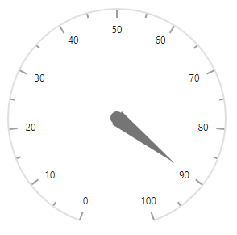
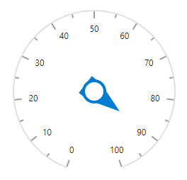

# Pointers in Blazor Circular Gauge Component

Pointers indicate values on an axis. The value of a pointer is set using the [Value](https://help.syncfusion.com/cr/blazor/Syncfusion.Blazor.CircularGauge.CircularGaugePointer.html#Syncfusion_Blazor_CircularGauge_CircularGaugePointer_Value) property.

```cshtml

@using Syncfusion.Blazor.CircularGauge

<SfCircularGauge>
    <CircularGaugeAxes>
        <CircularGaugeAxis>
            <CircularGaugePointers>
                <CircularGaugePointer Value="90" />
            </CircularGaugePointers>
        </CircularGaugeAxis>
    </CircularGaugeAxes>
</SfCircularGauge>

```



The Circular Gauge supports three pointer types: [Needle](https://help.syncfusion.com/cr/blazor/Syncfusion.Blazor.CircularGauge.PointerType.html#Syncfusion_Blazor_CircularGauge_PointerType_Needle), [RangeBar](https://help.syncfusion.com/cr/blazor/Syncfusion.Blazor.CircularGauge.PointerType.html#Syncfusion_Blazor_CircularGauge_PointerType_RangeBar), and [Marker](https://help.syncfusion.com/cr/blazor/Syncfusion.Blazor.CircularGauge.PointerType.html#Syncfusion_Blazor_CircularGauge_PointerType_Marker). Select a type using the [Type](https://help.syncfusion.com/cr/blazor/Syncfusion.Blazor.CircularGauge.CircularGaugePointer.html#Syncfusion_Blazor_CircularGauge_CircularGaugePointer_Type) property.

## Needle pointer

The default pointer type is Needle. A needle pointer includes a needle, a cap/knob, and a tail.

```cshtml

@using Syncfusion.Blazor.CircularGauge

<SfCircularGauge>
    <CircularGaugeAxes>
        <CircularGaugeAxis>
            <CircularGaugePointers>
                <CircularGaugePointer Value="90">
                </CircularGaugePointer>
            </CircularGaugePointers>
        </CircularGaugeAxis>
    </CircularGaugeAxes>
</SfCircularGauge>

```




### Customization

The needle, tail, and cap of the pointer can be customized using the following properties.

* [CircularGaugePointer](https://help.syncfusion.com/cr/blazor/Syncfusion.Blazor.CircularGauge.CircularGaugePointer.html) – Customize the pointer's needle.
    * [Radius](https://help.syncfusion.com/cr/blazor/Syncfusion.Blazor.CircularGauge.CircularGaugePointer.html#Syncfusion_Blazor_CircularGauge_CircularGaugePointer_Radius) – Sets the needle length.
    * [PointerWidth](https://help.syncfusion.com/cr/blazor/Syncfusion.Blazor.CircularGauge.CircularGaugePointer.html#Syncfusion_Blazor_CircularGauge_CircularGaugePointer_PointerWidth) – Sets the needle width.
    * [Color](https://help.syncfusion.com/cr/blazor/Syncfusion.Blazor.CircularGauge.CircularGaugePointer.html#Syncfusion_Blazor_CircularGauge_CircularGaugePointer_Color) – Sets the needle color.
* [CircularGaugeNeedleTail](https://help.syncfusion.com/cr/blazor/Syncfusion.Blazor.CircularGauge.CircularGaugeNeedleTail.html) – Customize the pointer's tail.
    * [Length](https://help.syncfusion.com/cr/blazor/Syncfusion.Blazor.CircularGauge.CircularGaugeNeedleTail.html#Syncfusion_Blazor_CircularGauge_CircularGaugeNeedleTail_Length) – Sets pointer's tail length.
    * [Color](https://help.syncfusion.com/cr/blazor/Syncfusion.Blazor.CircularGauge.CircularGaugeNeedleTail.html#Syncfusion_Blazor_CircularGauge_CircularGaugeNeedleTail_Color) – Sets pointer's tail color.
    * [CircularGaugeNeedleTailBorder](https://help.syncfusion.com/cr/blazor/Syncfusion.Blazor.CircularGauge.CircularGaugeNeedleTail.html#Syncfusion_Blazor_CircularGauge_CircularGaugeNeedleTail_Border) – Sets pointer's tail border.
* [CircularGaugeCap](https://help.syncfusion.com/cr/blazor/Syncfusion.Blazor.CircularGauge.CircularGaugeCap.html) – Customize the pointer's cap.
    * [Color](https://help.syncfusion.com/cr/blazor/Syncfusion.Blazor.CircularGauge.CircularGaugeCap.html#Syncfusion_Blazor_CircularGauge_CircularGaugeCap_Color) – Sets pointer's cap color.
    * [Radius](https://help.syncfusion.com/cr/blazor/Syncfusion.Blazor.CircularGauge.CircularGaugeCap.html#Syncfusion_Blazor_CircularGauge_CircularGaugeCap_Radius) – Sets pointer's cap radius.
    * [CircularGaugeCapBorder](https://help.syncfusion.com/cr/blazor/Syncfusion.Blazor.CircularGauge.CircularGaugeCap.html#Syncfusion_Blazor_CircularGauge_CircularGaugeCap_Border) – sets pointer's cap border.
    * [Position](https://help.syncfusion.com/cr/blazor/Syncfusion.Blazor.CircularGauge.CircularGaugePointer.html#Syncfusion_Blazor_CircularGauge_CircularGaugePointer_Position) – Specifies the position of the Pointer. Its possible values are `PointerRangePosition.Inside`, `PointerRangePosition.Outside` and `PointerRangePosition.Cross`.

```cshtml

@using Syncfusion.Blazor.CircularGauge

<SfCircularGauge Height="250px" Width="250px">
    <CircularGaugeAxes>
        <CircularGaugeAxis>
            <CircularGaugePointers>
                <CircularGaugePointer Value="90"
                                      Radius="40%"
                                      PointerWidth="30"
                                      Color="#007DD1"
                                      Position="PointerRangePosition.Inside">
                    <CircularGaugeCap Radius="15"
                                      Color="white">
                        <CircularGaugeCapBorder Width="4"
                                                Color="#007DD1">
                        </CircularGaugeCapBorder>
                    </CircularGaugeCap>
                    <CircularGaugeNeedleTail Length="35%"
                                             Color="#007DD1">
                    </CircularGaugeNeedleTail>
                </CircularGaugePointer>
            </CircularGaugePointers>
        </CircularGaugeAxis>
    </CircularGaugeAxes>
</SfCircularGauge>

```




<!-- markdownlint-disable MD010 -->

The appearance of the needle pointer can be modified using [NeedleStartWidth](https://help.syncfusion.com/cr/blazor/Syncfusion.Blazor.CircularGauge.CircularGaugePointer.html#Syncfusion_Blazor_CircularGauge_CircularGaugePointer_NeedleStartWidth) and [NeedleEndWidth](https://help.syncfusion.com/cr/blazor/Syncfusion.Blazor.CircularGauge.CircularGaugePointer.html#Syncfusion_Blazor_CircularGauge_CircularGaugePointer_NeedleEndWidth) properties.

```cshtml

@using Syncfusion.Blazor.CircularGauge

<SfCircularGauge>
    <CircularGaugeAxes>
        <CircularGaugeAxis StartAngle="270" EndAngle="90" Radius="90%" Minimum="0" Maximum="100">
		<CircularGaugeAxisLineStyle Width="3" Color="#1E7145">
            </CircularGaugeAxisLineStyle>
			 <CircularGaugeAxisLabelStyle>
                <CircularGaugeAxisLabelFont Color="#1E7145" Size="0px">
                </CircularGaugeAxisLabelFont>
            </CircularGaugeAxisLabelStyle>
			<CircularGaugeAxisMajorTicks Interval="100"
                                         Height="0"
                                         Width="1">
            </CircularGaugeAxisMajorTicks>
            <CircularGaugeAxisMinorTicks Width="0"
                                         Height="0"
                                         >
            </CircularGaugeAxisMinorTicks>
            <CircularGaugePointers>
                <CircularGaugePointer Value="70"
                                      Radius="80%" Color="green" PointerWidth="2" NeedleStartWidth="4" NeedleEndWidth="4">
				 <CircularGaugeCap Radius="8" Color="green">
                    </CircularGaugeCap>
                    <CircularGaugeNeedleTail Length="0%">
                    </CircularGaugeNeedleTail>
                </CircularGaugePointer>
            </CircularGaugePointers>
			<CircularGaugeAnnotations>
                <CircularGaugeAnnotation Angle="180" ZIndex="1">
                    <ContentTemplate>
                        <div class="custom-annotation">Customized Needle</div>
                    </ContentTemplate>
                </CircularGaugeAnnotation>
            </CircularGaugeAnnotations>
        </CircularGaugeAxis>
    </CircularGaugeAxes>
</SfCircularGauge>

<style type="text/css">
    .custom-annotation {
        color: #757575;
        font-family:Roboto; font-size:14px;padding-top: 26px;
    }
</style>

```


## Range bar pointer

The range bar pointer functions like a range on an axis and marks the pointer value. The range bar starts at the beginning of the gauge and ends at the pointer value. Set the pointer type using the `Type` property in `CircularGaugePointer`.

```cshtml

@using Syncfusion.Blazor.CircularGauge

<SfCircularGauge>
    <CircularGaugeAxes>
        <CircularGaugeAxis>
            <CircularGaugePointers>
                <CircularGaugePointer Value="50"
                                      Type="PointerType.RangeBar">
                </CircularGaugePointer>
            </CircularGaugePointers>
        </CircularGaugeAxis>
    </CircularGaugeAxes>
</SfCircularGauge>

```



### Customization

Customize the range bar using the following properties.

* [PointerWidth](https://help.syncfusion.com/cr/blazor/Syncfusion.Blazor.CircularGauge.CircularGaugePointer.html#Syncfusion_Blazor_CircularGauge_CircularGaugePointer_PointerWidth) – Specifies the width of the range bar.
* [Color](https://help.syncfusion.com/cr/blazor/Syncfusion.Blazor.CircularGauge.CircularGaugePointer.html#Syncfusion_Blazor_CircularGauge_CircularGaugePointer_Color) – Specifies the color of the range bar.
* [Radius](https://help.syncfusion.com/cr/blazor/Syncfusion.Blazor.CircularGauge.CircularGaugePointer.html#Syncfusion_Blazor_CircularGauge_CircularGaugePointer_Radius) – Specifies the range bar radius.
* [RoundedCornerRadius](https://help.syncfusion.com/cr/blazor/Syncfusion.Blazor.CircularGauge.CircularGaugePointer.html#Syncfusion_Blazor_CircularGauge_CircularGaugePointer_RoundedCornerRadius) – Specifies the rounded corners of the range bar.
* [CircularGaugePointerBorder](https://help.syncfusion.com/cr/blazor/Syncfusion.Blazor.CircularGauge.CircularGaugePointerBorder.html) – Specifies the border of the range bar.

```cshtml

@using Syncfusion.Blazor.CircularGauge

<SfCircularGauge>
    <CircularGaugeAxes>
        <CircularGaugeAxis>
            <CircularGaugePointers>
                <CircularGaugePointer Value="46"
                                      Type="PointerType.RangeBar"
                                      PointerWidth="8"
                                      Radius="95%"
                                      Color="lightgray">
                    <CircularGaugePointerBorder Color="darkgray"
                                                Width="2">
                    </CircularGaugePointerBorder>
                </CircularGaugePointer>
            </CircularGaugePointers>
        </CircularGaugeAxis>
    </CircularGaugeAxes>
</SfCircularGauge>

```



### Rounded corners

The start and end of a range bar can be rounded to form an arc using the `RoundedCornerRadius` property.

```cshtml

@using Syncfusion.Blazor.CircularGauge

<SfCircularGauge>
    <CircularGaugeAxes>
        <CircularGaugeAxis>
            <CircularGaugePointers>
                <CircularGaugePointer Value="46"
                                      RoundedCornerRadius="20"
                                      Type="PointerType.RangeBar">
                </CircularGaugePointer>
            </CircularGaugePointers>
        </CircularGaugeAxis>
    </CircularGaugeAxes>
</SfCircularGauge>

```



## Marker pointer

Marker shapes can be used to indicate the pointer value on an axis. Change the marker shape using the [MarkerShape](https://help.syncfusion.com/cr/blazor/Syncfusion.Blazor.CircularGauge.CircularGaugePointer.html#Syncfusion_Blazor_CircularGauge_CircularGaugePointer_MarkerShape) property in the pointer. The Circular Gauge supports the following marker shapes:

* Circle
* Rectangle
* Triangle
* InvertedTriangle
* Diamond

```cshtml

@using Syncfusion.Blazor.CircularGauge

<SfCircularGauge>
    <CircularGaugeAxes>
        <CircularGaugeAxis>
            <CircularGaugePointers>
                <CircularGaugePointer Value="90"
                                      Type="PointerType.Marker"
                                      MarkerShape="GaugeShape.Diamond"
                                      MarkerHeight="15"
                                      MarkerWidth="15">
                </CircularGaugePointer>
            </CircularGaugePointers>
        </CircularGaugeAxis>
    </CircularGaugeAxes>
</SfCircularGauge>

```



### Customization

Customize the marker pointer using the following properties.

* [Color](https://help.syncfusion.com/cr/blazor/Syncfusion.Blazor.CircularGauge.CircularGaugePointer.html#Syncfusion_Blazor_CircularGauge_CircularGaugePointer_Color) – Specifies the marker color.
* [MarkerWidth](https://help.syncfusion.com/cr/blazor/Syncfusion.Blazor.CircularGauge.CircularGaugePointer.html#Syncfusion_Blazor_CircularGauge_CircularGaugePointer_MarkerWidth) – Specifies the marker width.
* [MarkerHeight](https://help.syncfusion.com/cr/blazor/Syncfusion.Blazor.CircularGauge.CircularGaugePointer.html#Syncfusion_Blazor_CircularGauge_CircularGaugePointer_MarkerHeight) – Specifies the marker height.
* [Radius](https://help.syncfusion.com/cr/blazor/Syncfusion.Blazor.CircularGauge.CircularGaugePointer.html#Syncfusion_Blazor_CircularGauge_CircularGaugePointer_Radius) – Specifies the marker radius.
* [CircularGaugePointerBorder](https://help.syncfusion.com/cr/blazor/Syncfusion.Blazor.CircularGauge.CircularGaugePointerBorder.html) – Specifies the marker border color and width.

```cshtml

@using Syncfusion.Blazor.CircularGauge

<SfCircularGauge>
    <CircularGaugeAxes>
        <CircularGaugeAxis>
            <CircularGaugePointers>
                <CircularGaugePointer Value="90"
                                      Type="PointerType.Marker"
                                      MarkerShape="GaugeShape.InvertedTriangle"
                                      MarkerHeight="15"
                                      MarkerWidth="15"
                                      Color="white"
                                      Radius="110%">
                    <CircularGaugePointerBorder Width="2" Color="#007DD1"></CircularGaugePointerBorder>
                </CircularGaugePointer>
            </CircularGaugePointers>
        </CircularGaugeAxis>
    </CircularGaugeAxes>
</SfCircularGauge>

```



### Image marker pointer

An image can be used instead of a marker shape to denote the pointer value. This is achieved by setting [MarkerShape](https://help.syncfusion.com/cr/blazor/Syncfusion.Blazor.CircularGauge.CircularGaugePointer.html#Syncfusion_Blazor_CircularGauge_CircularGaugePointer_MarkerShape) property to `GaugeShape.Image` and providing the image path using [ImageUrl](https://help.syncfusion.com/cr/blazor/Syncfusion.Blazor.CircularGauge.CircularGaugePointer.html#Syncfusion_Blazor_CircularGauge_CircularGaugePointer_ImageUrl).

```cshtml

@using Syncfusion.Blazor.CircularGauge

<SfCircularGauge>
    <CircularGaugeAxes>
        <CircularGaugeAxis>
            <CircularGaugePointers>
                <CircularGaugePointer Value="90"
                                      Type="PointerType.Marker"
                                      MarkerShape="GaugeShape.Image"
                                      ImageUrl="football.png"
                                      MarkerHeight="20"
                                      MarkerWidth="20"
                                      Radius="100%">
                </CircularGaugePointer>
            </CircularGaugePointers>
        </CircularGaugeAxis>
    </CircularGaugeAxes>
</SfCircularGauge>

```


<!-- markdownlint-disable MD010 -->

## Dragging pointer

Pointers can be dragged along the axis. Use the [EnablePointerDrag](https://help.syncfusion.com/cr/blazor/Syncfusion.Blazor.CircularGauge.SfCircularGauge.html#Syncfusion_Blazor_CircularGauge_SfCircularGauge_EnablePointerDrag) property to enable or disable dragging.

```cshtml

@using Syncfusion.Blazor.CircularGauge

<SfCircularGauge EnablePointerDrag="true" Height="250px" Width="250px">
    <CircularGaugeAxes>
        <CircularGaugeAxis>
            <CircularGaugePointers>
                <CircularGaugePointer Value="50">
                </CircularGaugePointer>
            </CircularGaugePointers>
        </CircularGaugeAxis>
    </CircularGaugeAxes>
</SfCircularGauge>

```



## Multiple pointers

Multiple pointers can be added to an axis using the [CircularGaugePointers](https://help.syncfusion.com/cr/blazor/Syncfusion.Blazor.CircularGauge.CircularGaugePointers.html) tag.

```cshtml

@using Syncfusion.Blazor.CircularGauge

<SfCircularGauge>
    <CircularGaugeAxes>
        <CircularGaugeAxis>
            <CircularGaugePointers>
                <CircularGaugePointer Value="90"
                                      MarkerShape="GaugeShape.InvertedTriangle"
                                      Radius="100%"
                                      MarkerHeight="15"
                                      MarkerWidth="15">
                </CircularGaugePointer>
                <CircularGaugePointer Value="90"
                                      Type="PointerType.RangeBar"
                                      Radius="60%"
                                      MarkerWidth="10">
                </CircularGaugePointer>
                <CircularGaugePointer Value="90"
                                      Radius="50%"
                                      PointerWidth="25"
                                      Color="#007DD1">
                    <CircularGaugeCap Radius="15">
                        <CircularGaugeCapBorder Width="5">
                        </CircularGaugeCapBorder>
                    </CircularGaugeCap>
                    <CircularGaugeNeedleTail Length="25%">
                    </CircularGaugeNeedleTail>
                </CircularGaugePointer>
            </CircularGaugePointers>
        </CircularGaugeAxis>
    </CircularGaugeAxes>
</SfCircularGauge>

```



## Pointer animation

Pointers can animate on load using the [CircularGaugePointerAnimation](https://help.syncfusion.com/cr/blazor/Syncfusion.Blazor.CircularGauge.CircularGaugePointerAnimation.html) tag in the pointer. The [Enable](https://help.syncfusion.com/cr/blazor/Syncfusion.Blazor.CircularGauge.CircularGaugePointerAnimation.html#Syncfusion_Blazor_CircularGauge_CircularGaugePointerAnimation_Enable) property enables or disables the animation. The [Duration](https://help.syncfusion.com/cr/blazor/Syncfusion.Blazor.CircularGauge.CircularGaugePointerAnimation.html#Syncfusion_Blazor_CircularGauge_CircularGaugePointerAnimation_Duration) property specifies the animation duration in milliseconds.

```cshtml

@using Syncfusion.Blazor.CircularGauge

<SfCircularGauge Height="250px" Width="250px">
    <CircularGaugeAxes>
        <CircularGaugeAxis>
            <CircularGaugePointers>
                <CircularGaugePointer Value="70">
                    <CircularGaugePointerAnimation Enable="true" Duration="1500">
                    </CircularGaugePointerAnimation>
                </CircularGaugePointer>
            </CircularGaugePointers>
        </CircularGaugeAxis>
    </CircularGaugeAxes>
</SfCircularGauge>

```



## Gradient color

Gradient support allows multiple colors to be applied to the ranges and pointers of the Circular Gauge. The following gradient types are supported:

* Linear Gradient
* Radial Gradient

### Linear gradient

With a linear gradient, colors are applied in a linear progression. The start value is set using the [StartValue](https://help.syncfusion.com/cr/blazor/Syncfusion.Blazor.CircularGauge.CircularGaugeLinearGradient.html#Syncfusion_Blazor_CircularGauge_CircularGaugeLinearGradient_StartValue) property, and the end value using the [EndValue](https://help.syncfusion.com/cr/blazor/Syncfusion.Blazor.CircularGauge.CircularGaugeLinearGradient.html#Syncfusion_Blazor_CircularGauge_CircularGaugeLinearGradient_EndValue) property. Color stop values such as color, opacity, and offset are set using the [ColorStop](https://help.syncfusion.com/cr/blazor/Syncfusion.Blazor.CircularGauge.CircularGaugeLinearGradient.html#Syncfusion_Blazor_CircularGauge_CircularGaugeLinearGradient_ColorStop) property.

The linear gradient can be applied to all pointer types, including marker, range bar, and needle. The following example demonstrates this.

```cshtml

@using Syncfusion.Blazor.CircularGauge

<SfCircularGauge>
    <CircularGaugeAxes>
        <CircularGaugeAxis StartAngle="270" EndAngle="90" Radius="90%" Minimum="0" Maximum="100">
            <CircularGaugeAxisLineStyle Width="3" Color="#E63B86" />
            <CircularGaugeAxisLabelStyle>
                <CircularGaugeAxisLabelFont Size="0px" />
            </CircularGaugeAxisLabelStyle>
            <CircularGaugeAxisMajorTicks Height="0.01" />
            <CircularGaugeAxisMinorTicks Height="0.01" />
            <CircularGaugePointers>
                <CircularGaugePointer Value="80" Radius="80%" PointerWidth="10">
                    <LinearGradient StartValue="1%" EndValue="99%">
                        <ColorStops>
                            <ColorStop Opacity="0.9" Offset="0%" Color="#fef3f9"></ColorStop>
                            <ColorStop Opacity="0.9" Offset="100%" Color="#f54ea2"></ColorStop>
                        </ColorStops>
                    </LinearGradient>
                    <CircularGaugeCap Radius="8" Color="White">
                        <CircularGaugeCapBorder Color="#E63B86" Width="1" />
                    </CircularGaugeCap>
                    <CircularGaugeNeedleTail Length="20%">
                        <LinearGradient StartValue="1%" EndValue="99%">
                            <ColorStops>
                                <ColorStop Opacity="0.9" Offset="0%" Color="#fef3f9"></ColorStop>
                                <ColorStop Opacity="0.9" Offset="100%" Color="#f54ea2"></ColorStop>
                            </ColorStops>
                        </LinearGradient>
                        </CircularGaugeNeedleTail>
                        <CircularGaugePointerAnimation Enable="true" Duration="1000" />
                </CircularGaugePointer>
                <CircularGaugePointer Value="40" Radius="60%" MarkerWidth="5" MarkerHeight="5" PointerWidth="10">
                    <LinearGradient StartValue="1%" EndValue="99%">
                        <ColorStops>
                            <ColorStop Opacity="0.9" Offset="0%" Color="#fef3f9"></ColorStop>
                            <ColorStop Opacity="0.9" Offset="100%" Color="#f54ea2"></ColorStop>
                        </ColorStops>
                    </LinearGradient>
                    <CircularGaugeCap Radius="8" Color="White">
                        <CircularGaugeCapBorder Color="#E63B86" Width="1" />
                    </CircularGaugeCap>
                    <CircularGaugeNeedleTail Length="20%">
                        <LinearGradient StartValue="1%" EndValue="99%">
                            <ColorStops>
                                <ColorStop Opacity="0.9" Offset="0%" Color="#fef3f9"></ColorStop>
                                <ColorStop Opacity="0.9" Offset="100%" Color="#f54ea2"></ColorStop>
                            </ColorStops>
                        </LinearGradient>
                    </CircularGaugeNeedleTail>
                    <CircularGaugePointerAnimation Enable="true" Duration="1000" />
                </CircularGaugePointer>
            </CircularGaugePointers>
        </CircularGaugeAxis>
    </CircularGaugeAxes>
</SfCircularGauge>

```


### Radial gradient

With a radial gradient, colors are applied in a circular progression. The inner circle position is set using the [InnerPosition](https://help.syncfusion.com/cr/blazor/Syncfusion.Blazor.CircularGauge.CircularGaugeRadialGradient.html#Syncfusion_Blazor_CircularGauge_CircularGaugeRadialGradient_InnerPosition) property, and the outer circle position using the [OuterPosition](https://help.syncfusion.com/cr/blazor/Syncfusion.Blazor.CircularGauge.CircularGaugeRadialGradient.html#Syncfusion_Blazor_CircularGauge_CircularGaugeRadialGradient_OuterPosition) property. Color stop values such as color, opacity, and offset are set using the [ColorStop](https://help.syncfusion.com/cr/blazor/Syncfusion.Blazor.CircularGauge.CircularGaugeRadialGradient.html#Syncfusion_Blazor_CircularGauge_CircularGaugeRadialGradient_ColorStop) property.

The radial gradient can be applied to all pointer types, including marker, range bar, and needle. The following example demonstrates this.

```cshtml

@using Syncfusion.Blazor.CircularGauge

<SfCircularGauge>
    <CircularGaugeAxes>
        <CircularGaugeAxis StartAngle="270" EndAngle="90" Radius="90%" Minimum="0" Maximum="100">
            <CircularGaugeAxisLineStyle Width="3" Color="#E63B86" />
            <CircularGaugeAxisLabelStyle>
                <CircularGaugeAxisLabelFont Size="0px" />
            </CircularGaugeAxisLabelStyle>
            <CircularGaugeAxisMajorTicks Height="0.01" />
            <CircularGaugeAxisMinorTicks Height="0.01" />
            <CircularGaugePointers>
                <CircularGaugePointer Value="80" Radius="80%" PointerWidth="10">
                    <RadialGradient Radius="65%">
                        <InnerPosition X="60%" Y="60%"></InnerPosition>
                        <OuterPosition X="50%" Y="70%"></OuterPosition>
                        <ColorStops>
                            <ColorStop Opacity="0.9" Offset="5%" Color="#fff5f5"></ColorStop>
                            <ColorStop Opacity="0.9" Offset="99%" Color="#f54ea2"></ColorStop>
                        </ColorStops>
                    </RadialGradient>
                    <CircularGaugeCap Radius="8" Color="White">
                        <CircularGaugeCapBorder Color="#E63B86" Width="1" />
                    </CircularGaugeCap>
                    <CircularGaugeNeedleTail Length="20%">
                        <RadialGradient Radius="65%">
                            <InnerPosition X="60%" Y="60%"></InnerPosition>
                            <OuterPosition X="50%" Y="70%"></OuterPosition>
                            <ColorStops>
                                <ColorStop Opacity="0.9" Offset="5%" Color="#fff5f5"></ColorStop>
                                <ColorStop Opacity="0.9" Offset="99%" Color="#f54ea2"></ColorStop>
                            </ColorStops>
                        </RadialGradient>
                        </CircularGaugeNeedleTail>
                        <CircularGaugePointerAnimation Enable="true" Duration="1000" />
                </CircularGaugePointer>
                <CircularGaugePointer Value="40" Radius="60%" MarkerWidth="5" MarkerHeight="5" PointerWidth="10">
                    <RadialGradient Radius="65%">
                        <InnerPosition X="60%" Y="60%"></InnerPosition>
                        <OuterPosition X="50%" Y="70%"></OuterPosition>
                        <ColorStops>
                            <ColorStop Opacity="0.9" Offset="5%" Color="#fff5f5"></ColorStop>
                            <ColorStop Opacity="0.9" Offset="99%" Color="#f54ea2"></ColorStop>
                        </ColorStops>
                    </RadialGradient>
                    <CircularGaugeCap Radius="8" Color="White">
                        <CircularGaugeCapBorder Color="#E63B86" Width="1" />
                    </CircularGaugeCap>
                    <CircularGaugeNeedleTail Length="20%">
                        <RadialGradient Radius="65%">
                            <InnerPosition X="60%" Y="60%"></InnerPosition>
                            <OuterPosition X="50%" Y="70%"></OuterPosition>
                            <ColorStops>
                                <ColorStop Opacity="0.9" Offset="5%" Color="#fff5f5"></ColorStop>
                                <ColorStop Opacity="0.9" Offset="99%" Color="#f54ea2"></ColorStop>
                            </ColorStops>
                        </RadialGradient>
                        </CircularGaugeNeedleTail>
                        <CircularGaugePointerAnimation Enable="true" Duration="1000" />
                </CircularGaugePointer>
            </CircularGaugePointers>
        </CircularGaugeAxis>
    </CircularGaugeAxes>
</SfCircularGauge>

```


<!-- markdownlint-disable MD010 -->
