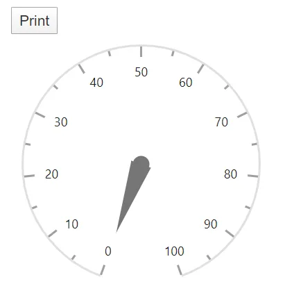
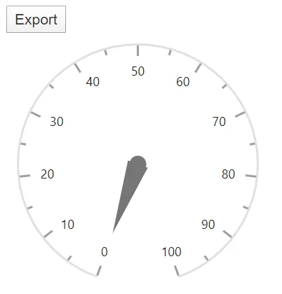

# Blazor Circular Gauge Print and Export

## Print

Set the [AllowPrint](https://help.syncfusion.com/cr/blazor/Syncfusion.Blazor.CircularGauge.SfCircularGauge.html#Syncfusion_Blazor_CircularGauge_SfCircularGauge_AllowPrint) property to **true** to enable print functionality. The rendered Circular Gauge can then be printed directly from the browser by calling the [`Print`](https://help.syncfusion.com/cr/blazor/Syncfusion.Blazor.CircularGauge.SfCircularGauge.html#Syncfusion_Blazor_CircularGauge_SfCircularGauge_Print_System_Object_) method on the component reference. Use `@ref="Gauge"` to obtain a reference to the Circular Gauge component.

```cshtml
@using Syncfusion.Blazor.CircularGauge

<button @onclick="PrintGauge">Print</button>
<SfCircularGauge @ref="Gauge" AllowPrint="true">
   <CircularGaugeAxes>
      <CircularGaugeAxis>
        <CircularGaugeAxisMajorTicks Height="10" Width="3"
                                     Position="Position.Inside">
        </CircularGaugeAxisMajorTicks>
        <CircularGaugeAxisMinorTicks Height="5" Width="2"
                                     Position="Position.Inside">
        </CircularGaugeAxisMinorTicks>
        <CircularGaugePointers>
            <CircularGaugePointer></CircularGaugePointer>
        </CircularGaugePointers>
      </CircularGaugeAxis>
    </CircularGaugeAxes>
</SfCircularGauge>

@code {
    SfCircularGauge Gauge;
    void PrintGauge()
    {
        this.Gauge.PrintAsync();
    }
}
```



## Export

### Image export

Set the [AllowImageExport](https://help.syncfusion.com/cr/blazor/Syncfusion.Blazor.CircularGauge.SfCircularGauge.html#Syncfusion_Blazor_CircularGauge_SfCircularGauge_AllowImageExport) property to **true** to enable image export. The rendered Circular Gauge can be exported as an image by calling the [`Export`](https://help.syncfusion.com/cr/blazor/Syncfusion.Blazor.CircularGauge.SfCircularGauge.html#Syncfusion_Blazor_CircularGauge_SfCircularGauge_Export_Syncfusion_Blazor_CircularGauge_ExportType_System_String_System_Object_System_Nullable_System_Boolean__) method with one of the image [`ExportType`](https://help.syncfusion.com/cr/blazor/Syncfusion.Blazor.CircularGauge.ExportType.html) values and a file name.

The Circular Gauge can be exported as an image in the following formats:

* `ExportType.PNG`
* `ExportType.JPEG`
* `ExportType.SVG`

```cshtml
@using Syncfusion.Blazor.CircularGauge

<button @onclick="ExportGauge">Export</button>
<SfCircularGauge @ref="Gauge" AllowImageExport="true">
   <CircularGaugeAxes>
      <CircularGaugeAxis>
        <CircularGaugeAxisMajorTicks Height="10" Width="3"
                                     Position="Position.Inside">
        </CircularGaugeAxisMajorTicks>
        <CircularGaugeAxisMinorTicks Height="5" Width="2"
                                     Position="Position.Inside">
        </CircularGaugeAxisMinorTicks>
        <CircularGaugePointers>
            <CircularGaugePointer></CircularGaugePointer>
        </CircularGaugePointers>
      </CircularGaugeAxis>
    </CircularGaugeAxes>
</SfCircularGauge>

@code {
    SfCircularGauge Gauge;
    void ExportGauge()
    {
        this.Gauge.ExportAsync(ExportType.PNG, "CircularGauge");
    }
}
```

N> Replace `ExportType.PNG` with `ExportType.JPEG` or `ExportType.SVG` in the example above to export in another image format.



### PDF export

Set the [AllowPdfExport](https://help.syncfusion.com/cr/blazor/Syncfusion.Blazor.CircularGauge.SfCircularGauge.html#Syncfusion_Blazor_CircularGauge_SfCircularGauge_AllowPdfExport) property to **true** to enable PDF export. The rendered Circular Gauge can be exported as a PDF by calling the [`Export`](https://help.syncfusion.com/cr/blazor/Syncfusion.Blazor.CircularGauge.SfCircularGauge.html#Syncfusion_Blazor_CircularGauge_SfCircularGauge_Export_Syncfusion_Blazor_CircularGauge_ExportType_System_String_System_Object_System_Nullable_System_Boolean__) method with `ExportType.PDF`.

```cshtml
@using Syncfusion.Blazor.CircularGauge

<button @onclick="ExportGauge">Export</button>
<SfCircularGauge @ref="Gauge" AllowPdfExport="true">
  <CircularGaugeAxes>
      <CircularGaugeAxis>
        <CircularGaugeAxisMajorTicks Height="10" Width="3"
                                     Position="Position.Inside">
        </CircularGaugeAxisMajorTicks>
        <CircularGaugeAxisMinorTicks Height="5" Width="2"
                                     Position="Position.Inside">
        </CircularGaugeAxisMinorTicks>
        <CircularGaugePointers>
            <CircularGaugePointer></CircularGaugePointer>
        </CircularGaugePointers>
      </CircularGaugeAxis>
    </CircularGaugeAxes>
</SfCircularGauge>

@code {
    SfCircularGauge Gauge;
    void ExportGauge()
    {
        this.Gauge.ExportAsync(ExportType.PDF, "CircularGauge", 0);
    }
}
```


## See also

* [Methods in Blazor Circular Gauge](methods.md)
* [Appearance in Blazor Circular Gauge](appearance.md)
* [Dimensions in Blazor Circular Gauge](dimensions.md)