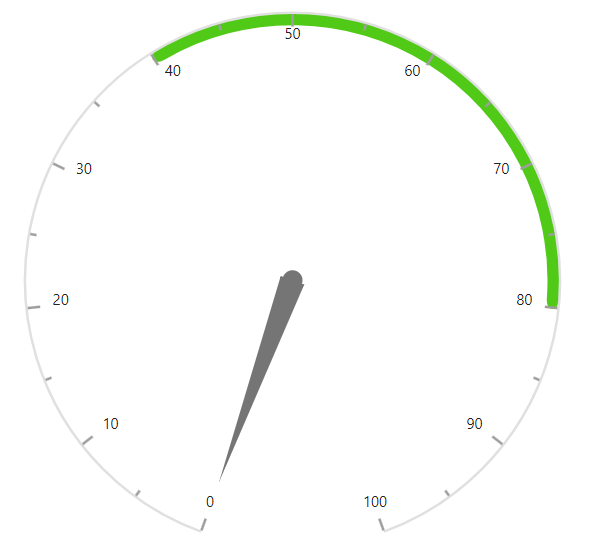
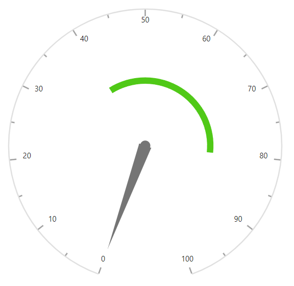

# Ranges in Blazor Circular Gauge Component

Categorize an interval on a Circular Gauge axis using the [CircularGaugeRanges](https://help.syncfusion.com/cr/blazor/Syncfusion.Blazor.CircularGauge.CircularGaugeRanges.html) tag.

## Range start and end

Customize the start and end values of a range using the [Start](https://help.syncfusion.com/cr/blazor/Syncfusion.Blazor.CircularGauge.CircularGaugeRange.html#Syncfusion_Blazor_CircularGauge_CircularGaugeRange_Start) and [End](https://help.syncfusion.com/cr/blazor/Syncfusion.Blazor.CircularGauge.CircularGaugeRange.html#Syncfusion_Blazor_CircularGauge_CircularGaugeRange_End) properties.

```cshtml

@using Syncfusion.Blazor.CircularGauge

<SfCircularGauge>
    <CircularGaugeAxes>
        <CircularGaugeAxis>
            <CircularGaugeRanges>
                <CircularGaugeRange Start="40" End="80">
                </CircularGaugeRange>
            </CircularGaugeRanges>
            <CircularGaugePointers>
                <CircularGaugePointer />
            </CircularGaugePointers>
        </CircularGaugeAxis>
    </CircularGaugeAxes>
</SfCircularGauge>

```



## Start width and end width

Customize the start and end widths using the [StartWidth](https://help.syncfusion.com/cr/blazor/Syncfusion.Blazor.CircularGauge.CircularGaugeRange.html#Syncfusion_Blazor_CircularGauge_CircularGaugeRange_StartWidth) and [EndWidth](https://help.syncfusion.com/cr/blazor/Syncfusion.Blazor.CircularGauge.CircularGaugeRange.html#Syncfusion_Blazor_CircularGauge_CircularGaugeRange_EndWidth) properties.

```cshtml

@using Syncfusion.Blazor.CircularGauge

<SfCircularGauge>
    <CircularGaugeAxes>
        <CircularGaugeAxis>
            <CircularGaugeRanges>
                <CircularGaugeRange Start="40"
                                    End="80"
                                    StartWidth="2"
                                    EndWidth="20">
                </CircularGaugeRange>
            </CircularGaugeRanges>
            <CircularGaugePointers>
                <CircularGaugePointer />
            </CircularGaugePointers>
        </CircularGaugeAxis>
    </CircularGaugeAxes>
</SfCircularGauge>

```



## Changing color

Customize the color and opacity of a range using the [Color](https://help.syncfusion.com/cr/blazor/Syncfusion.Blazor.CircularGauge.CircularGaugeRange.html#Syncfusion_Blazor_CircularGauge_CircularGaugeRange_Color) and [Opacity](https://help.syncfusion.com/cr/blazor/Syncfusion.Blazor.CircularGauge.CircularGaugeRange.html#Syncfusion_Blazor_CircularGauge_CircularGaugeRange_Opacity) properties.

```cshtml

@using Syncfusion.Blazor.CircularGauge

<SfCircularGauge>
    <CircularGaugeAxes>
        <CircularGaugeAxis>
            <CircularGaugeRanges>
                <CircularGaugeRange Start="40"
                                    End="80"
                                    StartWidth="2"
                                    EndWidth="20"
                                    Color="blue"
                                    Opacity="0.2">
                </CircularGaugeRange>
            </CircularGaugeRanges>
            <CircularGaugePointers>
                <CircularGaugePointer />
            </CircularGaugePointers>
        </CircularGaugeAxis>
    </CircularGaugeAxes>
</SfCircularGauge>

```



## Range position

Place ranges inside, outside, or across the axis using the Position property in [CircularGaugeRange](https://help.syncfusion.com/cr/blazor/Syncfusion.Blazor.CircularGauge.CircularGaugeRange.html). Possible values are 'PointerRangePosition.Inside', 'PointerRangePosition.Outside', and 'PointerRangePosition.Cross'.

```cshtml

@using Syncfusion.Blazor.CircularGauge

<SfCircularGauge>
    <CircularGaugeAxes>
        <CircularGaugeAxis>
            <CircularGaugeRanges>
                <CircularGaugeRange Start="40" End="80" StartWidth="15" EndWidth="15" Color="#ff5985" Position="PointerRangePosition.Cross">
                </CircularGaugeRange>
            </CircularGaugeRanges>
            <CircularGaugePointers>
                <CircularGaugePointer />
            </CircularGaugePointers>
        </CircularGaugeAxis>
    </CircularGaugeAxes>
</SfCircularGauge>

```



## Rounded corners

Adjust the corner radius using the [RoundedCornerRadius](https://help.syncfusion.com/cr/blazor/Syncfusion.Blazor.CircularGauge.CircularGaugeRange.html#Syncfusion_Blazor_CircularGauge_CircularGaugeRange_RoundedCornerRadius) property in [CircularGaugeRange](https://help.syncfusion.com/cr/blazor/Syncfusion.Blazor.CircularGauge.CircularGaugeRange.html).

```cshtml

@using Syncfusion.Blazor.CircularGauge

<SfCircularGauge>
    <CircularGaugeAxes>
        <CircularGaugeAxis>
            <CircularGaugeRanges>
                <CircularGaugeRange Start="40" End="80" RoundedCornerRadius="5">
                </CircularGaugeRange>
            </CircularGaugeRanges>
            <CircularGaugePointers>
                <CircularGaugePointer />
            </CircularGaugePointers>
        </CircularGaugeAxis>
    </CircularGaugeAxes>
</SfCircularGauge>

```




## Radius

Place a range inside or outside the axis using the [Radius](https://help.syncfusion.com/cr/blazor/Syncfusion.Blazor.CircularGauge.CircularGaugeRange.html#Syncfusion_Blazor_CircularGauge_CircularGaugeRange_Radius) property. The radius accepts percentages or pixels. By default, a range takes 100% of the axis radius.

### In pixels

Set the radius of the range in pixels as shown below.

```cshtml

@using Syncfusion.Blazor.CircularGauge

<SfCircularGauge>
    <CircularGaugeAxes>
        <CircularGaugeAxis>
            <CircularGaugeRanges>
                <CircularGaugeRange Start="40" End="80" Radius="100px">
                </CircularGaugeRange>
            </CircularGaugeRanges>
            <CircularGaugePointers>
                <CircularGaugePointer />
            </CircularGaugePointers>
        </CircularGaugeAxis>
    </CircularGaugeAxes>
</SfCircularGauge>

```



### In percentage

When the value is specified as a percentage, the range size is computed relative to the axis radius. For example, with a radius of '50%', the range renders at half of the axis radius.

```cshtml

@using Syncfusion.Blazor.CircularGauge

<SfCircularGauge>
    <CircularGaugeAxes>
        <CircularGaugeAxis>
            <CircularGaugeRanges>
                <CircularGaugeRange Start="40" End="80" Radius="50%">
                </CircularGaugeRange>
            </CircularGaugeRanges>
            <CircularGaugePointers>
                <CircularGaugePointer />
            </CircularGaugePointers>
        </CircularGaugeAxis>
    </CircularGaugeAxes>
</SfCircularGauge>

```




<!-- markdownlint-disable MD010 -->

## Dragging ranges

Enable dragging to move ranges along the axis line using the [EnableRangeDrag](https://help.syncfusion.com/cr/blazor/Syncfusion.Blazor.CircularGauge.SfCircularGauge.html#Syncfusion_Blazor_CircularGauge_SfCircularGauge_EnableRangeDrag) property.

```cshtml

@using Syncfusion.Blazor.CircularGauge

<SfCircularGauge EnableRangeDrag="true" Height="250px" Width="250px">
    <CircularGaugeAxes>
        <CircularGaugeAxis>
            <CircularGaugePointers>
                <CircularGaugePointer Value="50">
                </CircularGaugePointer>
            </CircularGaugePointers>
			<CircularGaugeRanges>
                <CircularGaugeRange Start="0" End="100" Radius="108%" Color="#30B32D" StartWidth="8" EndWidth="8">
                </CircularGaugeRange>
			</CircularGaugeRanges>
        </CircularGaugeAxis>
    </CircularGaugeAxes>
</SfCircularGauge>

```


## Multiple ranges

Add multiple ranges to an axis with the above customizations as shown below.

Set the range color for ticks and labels by enabling the UseRangeColor property in [CircularGaugeAxisMajorTicks](https://help.syncfusion.com/cr/blazor/Syncfusion.Blazor.CircularGauge.CircularGaugeAxisMajorTicks.html#Syncfusion_Blazor_CircularGauge_CircularGaugeAxisMajorTicks_UseRangeColor), [CircularGaugeAxisMinorTicks](https://help.syncfusion.com/cr/blazor/Syncfusion.Blazor.CircularGauge.CircularGaugeAxisMinorTicks.html#Syncfusion_Blazor_CircularGauge_CircularGaugeAxisMinorTicks_UseRangeColor), and [CircularGaugeAxisLabelStyle](https://help.syncfusion.com/cr/blazor/Syncfusion.Blazor.CircularGauge.CircularGaugeAxisLabelStyle.html#Syncfusion_Blazor_CircularGauge_CircularGaugeAxisLabelStyle_UseRangeColor) tags.

```cshtml

@using Syncfusion.Blazor.CircularGauge

<SfCircularGauge>
    <CircularGaugeAxes>
        <CircularGaugeAxis>
            <CircularGaugeRanges>
                <CircularGaugeRange Start="0" End="25" Radius="108%">
                </CircularGaugeRange>
                <CircularGaugeRange Start="25" End="50" Radius="70%">
                </CircularGaugeRange>
                <CircularGaugeRange Start="50" End="75" Radius="70%">
                </CircularGaugeRange>
                <CircularGaugeRange Start="75" End="100" Radius="108%">
                </CircularGaugeRange>
            </CircularGaugeRanges>
            <CircularGaugeAxisLabelStyle UseRangeColor="true">
            </CircularGaugeAxisLabelStyle>
            <CircularGaugeAxisMinorTicks UseRangeColor="true"></CircularGaugeAxisMinorTicks>
            <CircularGaugePointers>
                <CircularGaugePointer />
            </CircularGaugePointers>
        </CircularGaugeAxis>
    </CircularGaugeAxes>
</SfCircularGauge>

```



## Gradient color

Gradient support adds multiple colors to ranges and pointers in the circular gauge. The following gradient types are supported:

* Linear gradient
* Radial gradient

### Linear gradient

In a linear gradient, colors transition along a straight line. Set the start and end values using [StartValue](https://help.syncfusion.com/cr/blazor/Syncfusion.Blazor.CircularGauge.CircularGaugeLinearGradient.html#Syncfusion_Blazor_CircularGauge_CircularGaugeLinearGradient_StartValue) and [EndValue](https://help.syncfusion.com/cr/blazor/Syncfusion.Blazor.CircularGauge.CircularGaugeLinearGradient.html#Syncfusion_Blazor_CircularGauge_CircularGaugeLinearGradient_EndValue). Configure color stops (color, opacity, and offset) using [ColorStop](https://help.syncfusion.com/cr/blazor/Syncfusion.Blazor.CircularGauge.CircularGaugeLinearGradient.html#Syncfusion_Blazor_CircularGauge_CircularGaugeLinearGradient_ColorStop).

To apply a linear gradient to a range, use the following sample.

```cshtml

@using Syncfusion.Blazor.CircularGauge

<SfCircularGauge CenterY="57%" Title="Shot Put Distance">
    <CircularGaugeAxes>
        <CircularGaugeAxis StartAngle="200" EndAngle="130" Minimum="0" Maximum="14" Radius="80%">
            <CircularGaugeAxisLineStyle Width="0.001" />
            <CircularGaugeAxisMajorTicks Width="0.01" />
            <CircularGaugeAxisMinorTicks Width="0.01" />
            <CircularGaugeAxisLabelStyle>
                <CircularGaugeAxisLabelFont Size="0px" />
            </CircularGaugeAxisLabelStyle>
            <CircularGaugePointers>
                <CircularGaugePointer Type="PointerType.Marker" Value="12" MarkerShape="GaugeShape.Image" 
                ImageUrl="https://blazor.syncfusion.com/demos/_content/blazor_server_common_net8/images/circular-gauge/football.png" Radius="100%" MarkerWidth="28" MarkerHeight="28">
                      <CircularGaugePointerAnimation Enable="true" Duration="1500" />
                </CircularGaugePointer>
                <CircularGaugePointer Type="PointerType.Marker" Value="11" MarkerShape="GaugeShape.Image" 
                ImageUrl="https://blazor.syncfusion.com/demos/_content/blazor_server_common_net8/images/circular-gauge/basketball.png" Radius="70%" MarkerWidth="28" MarkerHeight="28">
                     <CircularGaugePointerAnimation Enable="true" Duration="1200" />
                </CircularGaugePointer>
                <CircularGaugePointer Type="PointerType.Marker" Value="10" MarkerShape="GaugeShape.Image" 
                ImageUrl="https://blazor.syncfusion.com/demos/_content/blazor_server_common_net8/images/circular-gauge/golf-ball.png" Radius="40%" MarkerWidth="28" MarkerHeight="28">
                    <CircularGaugePointerAnimation Enable="true" Duration="900" />
               </CircularGaugePointer>
               <CircularGaugePointer Type="PointerType.Marker" Value="12" MarkerShape="GaugeShape.Image" 
                ImageUrl="https://blazor.syncfusion.com/demos/_content/blazor_server_common_net8/images/circular-gauge/athletics.png" Radius="0%" MarkerWidth="90" MarkerHeight="90">
                   <CircularGaugePointerAnimation Enable="true" Duration="0" />
               </CircularGaugePointer>
               <CircularGaugePointer Type="PointerType.Marker" Value="0" MarkerShape="GaugeShape.Image" 
                ImageUrl="https://blazor.syncfusion.com/demos/_content/blazor_server_common_net8/images/circular-gauge/girl1.png" Radius="100%" MarkerWidth="28" MarkerHeight="28">
                   <CircularGaugePointerAnimation Enable="true" Duration="1500" />
                </CircularGaugePointer>
                <CircularGaugePointer Type="PointerType.Marker" Value="0" MarkerShape="GaugeShape.Image" 
                ImageUrl="https://blazor.syncfusion.com/demos/_content/blazor_server_common_net8/images/circular-gauge/man1.png" Radius="70%" MarkerWidth="28" MarkerHeight="28">
                   <CircularGaugePointerAnimation Enable="true" Duration="1500" />
               </CircularGaugePointer>
               <CircularGaugePointer Type="PointerType.Marker" Value="0" MarkerShape="GaugeShape.Image" 
                ImageUrl="https://blazor.syncfusion.com/demos/_content/blazor_server_common_net8/images/circular-gauge/man2.png" Radius="40%" MarkerWidth="28" MarkerHeight="28">
                    <CircularGaugePointerAnimation Enable="true" Duration="1500" />
               </CircularGaugePointer>
            </CircularGaugePointers>
            <CircularGaugeRanges>
                <CircularGaugeRange Start="0" End="12" Radius="105%" Color="#01aebe" StartWidth="25" EndWidth="25">
                    <LinearGradient StartValue="1%" EndValue="99%">
                        <ColorStops>
                            <ColorStop Opacity="0.9" Offset="0%" Color="#fef3f9"></ColorStop>
                            <ColorStop Opacity="0.9" Offset="100%" Color="#f54ea2"></ColorStop>
                        </ColorStops>
                    </LinearGradient>
                    </CircularGaugeRange>
                <CircularGaugeRange Start="0" End="11" Radius="75%" Color="#3bceac" StartWidth="25" EndWidth="25">
                    <LinearGradient StartValue="1%" EndValue="99%">
                        <ColorStops>
                            <ColorStop Opacity="0.9" Offset="0%" Color="#fef3f9"></ColorStop>
                            <ColorStop Opacity="0.9" Offset="100%" Color="#f54ea2"></ColorStop>
                        </ColorStops>
                    </LinearGradient>
                </CircularGaugeRange>
                <CircularGaugeRange Start="0" End="10" Radius="45%" Color="#ee4266" StartWidth="25" EndWidth="25">
                    <LinearGradient StartValue="1%" EndValue="99%">
                        <ColorStops>
                            <ColorStop Opacity="0.9" Offset="0%" Color="#fef3f9"></ColorStop>
                            <ColorStop Opacity="0.9" Offset="100%" Color="#f54ea2"></ColorStop>
                        </ColorStops>
                    </LinearGradient>
                </CircularGaugeRange>
              </CircularGaugeRanges>
            <CircularGaugeAnnotations>
                <CircularGaugeAnnotation Content="12 M" Radius="100%" Angle="97" ZIndex="1" />
                <CircularGaugeAnnotation Content="11 M" Radius="72%" Angle="80" ZIndex="1" />
                <CircularGaugeAnnotation Content="10 M" Radius="40%" Angle="68" ZIndex="1" />
                <CircularGaugeAnnotation Radius="108%" Angle="185" ZIndex="1">
                    <ContentTemplate>
                        <div class="annotationText"><span class="templateAlign">Doe</span></div>
                    </ContentTemplate>
                </CircularGaugeAnnotation>
                <CircularGaugeAnnotation Radius="80%" Angle="175" ZIndex="1">
                    <ContentTemplate>
                        <div class="annotationText"><span class="templateAlign">Almaida</span></div>
                    </ContentTemplate>
                </CircularGaugeAnnotation>
                <CircularGaugeAnnotation Radius="50%" Angle="168" ZIndex="1">
                    <ContentTemplate>
                        <div class="annotationText"><span class="templateAlign">John</span></div>
                    </ContentTemplate>
                </CircularGaugeAnnotation>
            </CircularGaugeAnnotations>
        </CircularGaugeAxis>
    </CircularGaugeAxes>
</SfCircularGauge>

<style>
    .templateAlign {
        font-size: 14px;
        color: #9E9E9E;
        font-family: Regular;
        margin-left: -20px;
    }
    .annotationText {
        margin-top: -30px;
    }
</style>

```

### Radial gradient

In a radial gradient, colors transition in a circular pattern. Set the inner and outer circle positions using [InnerPosition](https://help.syncfusion.com/cr/blazor/Syncfusion.Blazor.CircularGauge.CircularGaugeRadialGradient.html#Syncfusion_Blazor_CircularGauge_CircularGaugeRadialGradient_InnerPosition) and [OuterPosition](https://help.syncfusion.com/cr/blazor/Syncfusion.Blazor.CircularGauge.CircularGaugeRadialGradient.html#Syncfusion_Blazor_CircularGauge_CircularGaugeRadialGradient_OuterPosition). Configure color stops using [ColorStop](https://help.syncfusion.com/cr/blazor/Syncfusion.Blazor.CircularGauge.CircularGaugeRadialGradient.html#Syncfusion_Blazor_CircularGauge_CircularGaugeRadialGradient_ColorStop).

To apply a radial gradient to a range, use the following sample.

```cshtml

@using Syncfusion.Blazor.CircularGauge

<SfCircularGauge CenterY="57%" Title="Shot Put Distance">
    <CircularGaugeAxes>
        <CircularGaugeAxis StartAngle="200" EndAngle="130" Minimum="0" Maximum="14" Radius="80%">
            <CircularGaugeAxisLineStyle Width="0.001" />
            <CircularGaugeAxisMajorTicks Width="0.01" />
            <CircularGaugeAxisMinorTicks Width="0.01" />
            <CircularGaugeAxisLabelStyle>
                <CircularGaugeAxisLabelFont Size="0px" />
            </CircularGaugeAxisLabelStyle>
            <CircularGaugePointers>
                <CircularGaugePointer Type="PointerType.Marker" Value="12" MarkerShape="GaugeShape.Image" ImageUrl="https://blazor.syncfusion.com/demos/_content/blazor_server_common_net8/images/circular-gauge/football.png" Radius="100%" MarkerWidth="28" MarkerHeight="28">
                    <CircularGaugePointerAnimation Enable="true" Duration="1500" />
                </CircularGaugePointer>
                <CircularGaugePointer Type="PointerType.Marker" Value="11" MarkerShape="GaugeShape.Image" ImageUrl="https://blazor.syncfusion.com/demos/_content/blazor_server_common_net8/images/circular-gauge/basketball.png" Radius="70%" MarkerWidth="28" MarkerHeight="28">
                    <CircularGaugePointerAnimation Enable="true" Duration="1200" />
                </CircularGaugePointer>
                <CircularGaugePointer Type="PointerType.Marker" Value="10" MarkerShape="GaugeShape.Image" ImageUrl="https://blazor.syncfusion.com/demos/_content/blazor_server_common_net8/images/circular-gauge/golfball.png" Radius="40%" MarkerWidth="28" MarkerHeight="28">
                    <CircularGaugePointerAnimation Enable="true" Duration="900" />
                </CircularGaugePointer>
                <CircularGaugePointer Type="PointerType.Marker" Value="12" MarkerShape="GaugeShape.Image" ImageUrl="https://blazor.syncfusion.com/demos/_content/blazor_server_common_net8/images/circular-gauge/athletics.png" Radius="0%" MarkerWidth="90" MarkerHeight="90">
                    <CircularGaugePointerAnimation Enable="true" Duration="0" />
                </CircularGaugePointer>
                <CircularGaugePointer Type="PointerType.Marker" Value="0" MarkerShape="GaugeShape.Image" ImageUrl="https://blazor.syncfusion.com/demos/_content/blazor_server_common_net8/images/circular-gauge/girl1.png" Radius="100%" MarkerWidth="28" MarkerHeight="28">
                    <CircularGaugePointerAnimation Enable="true" Duration="1500" />
                </CircularGaugePointer>
                <CircularGaugePointer Type="PointerType.Marker" Value="0" MarkerShape="GaugeShape.Image" ImageUrl="https://blazor.syncfusion.com/demos/_content/blazor_server_common_net8/images/circular-gauge/man1.png" Radius="70%" MarkerWidth="28" MarkerHeight="28">
                    <CircularGaugePointerAnimation Enable="true" Duration="1500" />
                </CircularGaugePointer>
                <CircularGaugePointer Type="PointerType.Marker" Value="0" MarkerShape="GaugeShape.Image" ImageUrl="https://blazor.syncfusion.com/demos/_content/blazor_server_common_net8/images/circular-gauge/man2.png" Radius="40%" MarkerWidth="28" MarkerHeight="28">
                    <CircularGaugePointerAnimation Enable="true" Duration="1500" />
                </CircularGaugePointer>
            </CircularGaugePointers>
            <CircularGaugeRanges>
                <CircularGaugeRange Start="0" End="12" Radius="105%" Color="#01aebe" StartWidth="25" EndWidth="25">
                    <RadialGradient Radius="65%">
                        <InnerPosition X="60%" Y="60%"></InnerPosition>
                        <OuterPosition X="50%" Y="70%"></OuterPosition>
                        <ColorStops>
                            <ColorStop Opacity="0.9" Offset="5%" Color="#fff5f5"></ColorStop>
                            <ColorStop Opacity="0.9" Offset="99%" Color="#f54ea2"></ColorStop>
                        </ColorStops>
                    </RadialGradient>
                    </CircularGaugeRange>
                <CircularGaugeRange Start="0" End="11" Radius="75%" Color="#3bceac" StartWidth="25" EndWidth="25">
                    <RadialGradient Radius="65%">
                        <InnerPosition X="60%" Y="60%"></InnerPosition>
                        <OuterPosition X="50%" Y="70%"></OuterPosition>
                        <ColorStops>
                            <ColorStop Opacity="0.9" Offset="5%" Color="#fff5f5"></ColorStop>
                            <ColorStop Opacity="0.9" Offset="99%" Color="#f54ea2"></ColorStop>
                        </ColorStops>
                    </RadialGradient>
                </CircularGaugeRange>
                <CircularGaugeRange Start="0" End="10" Radius="45%" Color="#ee4266" StartWidth="25" EndWidth="25">
                    <RadialGradient Radius="65%">
                        <InnerPosition X="60%" Y="60%"></InnerPosition>
                        <OuterPosition X="50%" Y="70%"></OuterPosition>
                        <ColorStops>
                            <ColorStop Opacity="0.9" Offset="5%" Color="#fff5f5"></ColorStop>
                            <ColorStop Opacity="0.9" Offset="99%" Color="#f54ea2"></ColorStop>
                        </ColorStops>
                    </RadialGradient>
                </CircularGaugeRange>
            </CircularGaugeRanges>
            <CircularGaugeAnnotations>
                <CircularGaugeAnnotation Content="12 M" Radius="100%" Angle="97" ZIndex="1" />
                <CircularGaugeAnnotation Content="11 M" Radius="72%" Angle="80" ZIndex="1" />
                <CircularGaugeAnnotation Content="10 M" Radius="40%" Angle="68" ZIndex="1" />
                <CircularGaugeAnnotation Radius="108%" Angle="185" ZIndex="1">
                    <ContentTemplate>
                        <div class="annotationText"><span class="templateAlign">Doe</span></div>
                    </ContentTemplate>
                </CircularGaugeAnnotation>
                <CircularGaugeAnnotation Radius="80%" Angle="175" ZIndex="1">
                    <ContentTemplate>
                        <div class="annotationText"><span class="templateAlign">Almaida</span></div>
                    </ContentTemplate>
                </CircularGaugeAnnotation>
                <CircularGaugeAnnotation Radius="50%" Angle="168" ZIndex="1">
                    <ContentTemplate>
                        <div class="annotationText"><span class="templateAlign">John</span></div>
                    </ContentTemplate>
                </CircularGaugeAnnotation>
            </CircularGaugeAnnotations>
        </CircularGaugeAxis>
    </CircularGaugeAxes>
</SfCircularGauge>

<style>
    .templateAlign {
        font-size: 14px;
        color: #9E9E9E;
        font-family: Regular;
        margin-left: -20px;
    }
    .annotationText {
        margin-top: -30px;
    }
</style>

```

## See also

* [Tooltip for Ranges](user-interaction#tooltip-for-annotations)
