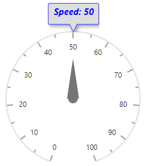
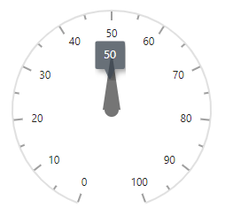
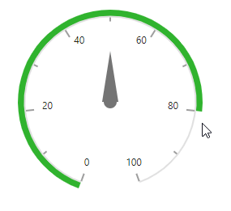

# User Interaction in Blazor Circular Gauge Component

## Tooltip for pointers

The Circular Gauge displays pointer details through [CircularGaugeTooltipSettings](https://help.syncfusion.com/cr/blazor/Syncfusion.Blazor.CircularGauge.CircularGaugeTooltipSettings.html) when hovering over a pointer.

### Formatting the tooltip

By default, the tooltip is not visible. Enable it by setting the [Enable](https://help.syncfusion.com/cr/blazor/Syncfusion.Blazor.CircularGauge.CircularGaugeTooltipSettings.html#Syncfusion_Blazor_CircularGauge_CircularGaugeTooltipSettings_Enable) property to true. The following properties customize the tooltip:

* [CircularGaugeTooltipSettings](https://help.syncfusion.com/cr/blazor/Syncfusion.Blazor.CircularGauge.CircularGaugeTooltipSettings.html)
    * [Fill](https://help.syncfusion.com/cr/blazor/Syncfusion.Blazor.CircularGauge.CircularGaugeTooltipSettings.html#Syncfusion_Blazor_CircularGauge_CircularGaugeTooltipSettings_Fill) - Specifies the tooltip fill color.
    * [EnableAnimation](https://help.syncfusion.com/cr/blazor/Syncfusion.Blazor.CircularGauge.CircularGaugeTooltipSettings.html#Syncfusion_Blazor_CircularGauge_CircularGaugeTooltipSettings_EnableAnimation) - Enables or disables tooltip animation.
    * [Format](https://help.syncfusion.com/cr/blazor/Syncfusion.Blazor.CircularGauge.CircularGaugeTooltipSettings.html#Syncfusion_Blazor_CircularGauge_CircularGaugeTooltipSettings_Format) - Customizes the tooltip content.
* [CircularGaugeTooltipBorder](https://help.syncfusion.com/cr/blazor/Syncfusion.Blazor.CircularGauge.CircularGaugeTooltipBorder.html)
    * [Color](https://help.syncfusion.com/cr/blazor/Syncfusion.Blazor.CircularGauge.CircularGaugeTooltipBorder.html#Syncfusion_Blazor_CircularGauge_CircularGaugeTooltipBorder_Color) - Specifies the tooltip border color.
    * [Width](https://help.syncfusion.com/cr/blazor/Syncfusion.Blazor.CircularGauge.CircularGaugeTooltipBorder.html#Syncfusion_Blazor_CircularGauge_CircularGaugeTooltipBorder_Width) - Specifies the tooltip border width.
* [CircularGaugeTooltipTextStyle](https://help.syncfusion.com/cr/blazor/Syncfusion.Blazor.CircularGauge.CircularGaugeTooltipTextStyle.html)
    * [Color](https://help.syncfusion.com/cr/blazor/Syncfusion.Blazor.CircularGauge.CircularGaugeTooltipTextStyle.html#Syncfusion_Blazor_CircularGauge_CircularGaugeTooltipTextStyle_Color) - Specifies the tooltip text color.
    * [FontStyle](https://help.syncfusion.com/cr/blazor/Syncfusion.Blazor.CircularGauge.CircularGaugeTooltipTextStyle.html#Syncfusion_Blazor_CircularGauge_CircularGaugeTooltipTextStyle_FontStyle) - Specifies the font style for tooltip text.
    * [FontWeight](https://help.syncfusion.com/cr/blazor/Syncfusion.Blazor.CircularGauge.CircularGaugeTooltipTextStyle.html#Syncfusion_Blazor_CircularGauge_CircularGaugeTooltipTextStyle_FontWeight) - Specifies the font weight for tooltip text.
    * [FontFamily](https://help.syncfusion.com/cr/blazor/Syncfusion.Blazor.CircularGauge.CircularGaugeTooltipTextStyle.html#Syncfusion_Blazor_CircularGauge_CircularGaugeTooltipTextStyle_FontFamily) - Specifies the font family for tooltip text.
    * [Opacity](https://help.syncfusion.com/cr/blazor/Syncfusion.Blazor.CircularGauge.CircularGaugeTooltipTextStyle.html#Syncfusion_Blazor_CircularGauge_CircularGaugeTooltipTextStyle_Opacity) - Specifies the opacity of the tooltip text.
    * [Size](https://help.syncfusion.com/cr/blazor/Syncfusion.Blazor.CircularGauge.CircularGaugeTooltipTextStyle.html#Syncfusion_Blazor_CircularGauge_CircularGaugeTooltipTextStyle_Size) - Specifies the font size for tooltip text.

```cshtml

@using Syncfusion.Blazor.CircularGauge

<SfCircularGauge>
    <CircularGaugeAxes>
        <CircularGaugeAxis>
            <CircularGaugePointers>
                <CircularGaugePointer Value="50">
                </CircularGaugePointer>
            </CircularGaugePointers>
            <CircularGaugeTooltipSettings Enable="true"
                                          Fill="lightgray"
                                          EnableAnimation="true"
                                          Format="Speed: {value}">
                <CircularGaugeTooltipBorder Color="blue"
                                            Width="1">
                </CircularGaugeTooltipBorder>
                <CircularGaugeTooltipTextStyle Color="blue"
                                               FontStyle="italic"
                                               FontWeight="bold"
                                               Size="15px">
                </CircularGaugeTooltipTextStyle>
            </CircularGaugeTooltipSettings>
        </CircularGaugeAxis>
    </CircularGaugeAxes>
</SfCircularGauge>

```




### Showing tooltip at mouse position

By default, the tooltip appears near the axis. To position the tooltip at the cursor, set the [ShowAtMousePosition](https://help.syncfusion.com/cr/blazor/Syncfusion.Blazor.CircularGauge.CircularGaugeTooltipSettings.html#Syncfusion_Blazor_CircularGauge_CircularGaugeTooltipSettings_ShowAtMousePosition) property to true.

```cshtml

@using Syncfusion.Blazor.CircularGauge

<SfCircularGauge>
    <CircularGaugeAxes>
        <CircularGaugeAxis>
            <CircularGaugePointers>
                <CircularGaugePointer Value="50">
                </CircularGaugePointer>
            </CircularGaugePointers>
            <CircularGaugeTooltipSettings Enable="true" ShowAtMousePosition="true">
            </CircularGaugeTooltipSettings>
        </CircularGaugeAxis>
    </CircularGaugeAxes>
</SfCircularGauge>

```




## Tooltip for ranges

The Circular Gauge displays information about ranges through tooltips when hovering over a range. Enable this by setting the tooltip `Type` to `Range` in the array collection.

### Tooltip customization for ranges

To customize the range tooltip, use the `CircularGaugeRangeTooltipSettings` within the tooltip. The following options are available:

* `Fill` - Specifies the range tooltip fill color.
* `CircularGaugeRangeTooltipTextStyle` - Specifies the range tooltip text style.
* `Format` - Specifies the range tooltip content format.
* `Template` - Specifies a custom template for the tooltip.
* `EnableAnimation` - Animates the tooltip transition.
* `CircularGaugeRangeTooltipBorder` - Specifies the tooltip border.
* `ShowAtMousePosition` - Displays the tooltip at the cursor position.

## Tooltip for annotations

The Circular Gauge displays information about annotations through tooltips when hovering over an annotation. Enable this by setting the tooltip `Type` to `Annotation` in the array collection.

### Tooltip customization for annotations

To customize the annotation tooltip, use the `CircularGaugeAnnotationTooltipSettings` within the tooltip. The following options are available:

* `Fill` - Specifies the annotation tooltip fill color.
* `CircularGaugeAnnotationTooltipTextStyle` - Specifies the annotation tooltip text style.
* `Format` - Specifies the annotation tooltip content format.
* `Template` - Specifies a custom template for the tooltip content.
* `EnableAnimation` - Animates the tooltip transition.
* `CircularGaugeAnnotationTooltipBorder` - Specifies the tooltip border.

The following code example shows the tooltip for the pointers, ranges, and annotations.

```cshtml

@using Syncfusion.Blazor.CircularGauge

<SfCircularGauge EnablePointerDrag="true">
    <CircularGaugeTooltipSettings Enable="true" Type="@TooltipType">
        <CircularGaugeAnnotationTooltipSettings Format="Circulargauge">
        </CircularGaugeAnnotationTooltipSettings>
        <CircularGaugeRangeTooltipSettings Fill="red">
        </CircularGaugeRangeTooltipSettings>
    </CircularGaugeTooltipSettings>
    <CircularGaugeAxes>
        <CircularGaugeAxis StartAngle="240" EndAngle="120" Minimum="0" Maximum="120" Radius="90%">
            <CircularGaugePointers>
                <CircularGaugePointer Value="70" Radius="60%" Color="#33BCBD">
                    <CircularGaugeCap Radius="10" Color="white">
                        <CircularGaugeCapBorder Width="5" Color="#33BCBD"></CircularGaugeCapBorder>
                    </CircularGaugeCap>
                    <CircularGaugePointerAnimation Enable="false">
                    </CircularGaugePointerAnimation>
                </CircularGaugePointer>
            </CircularGaugePointers>
            <CircularGaugeAxisMajorTicks Color="white" Height="12" Offset="-5">
            </CircularGaugeAxisMajorTicks>
            <CircularGaugeAxisMinorTicks Color="transparent" Width="0">
            </CircularGaugeAxisMinorTicks>
            <CircularGaugeAxisLabelStyle UseRangeColor="true">
                <CircularGaugeAxisLabelFont Color="#424242" Size="13px" FontFamily="Roboto">
                </CircularGaugeAxisLabelFont>
            </CircularGaugeAxisLabelStyle>
            <CircularGaugeAxisLineStyle Width="0">
            </CircularGaugeAxisLineStyle>
            <CircularGaugeRanges>
                <CircularGaugeRange Start="0" End="50" Radius="102%">
                </CircularGaugeRange>
                <CircularGaugeRange Start="50" End="120" Radius="102%">
                </CircularGaugeRange>
            </CircularGaugeRanges>
            <CircularGaugeAnnotations>
                <CircularGaugeAnnotation Angle="180" ZIndex="1">
                    <ContentTemplate>
                        <div>Circulargauge</div>
                    </ContentTemplate>
                </CircularGaugeAnnotation>
            </CircularGaugeAnnotations>
        </CircularGaugeAxis>
    </CircularGaugeAxes>
</SfCircularGauge>

@code {
    public string[] TooltipType = new string[] { "Range", "Annotation", "Pointer"};
}

```



## Dragging pointer

Pointers can be dragged across axis values by clicking and dragging the pointer. To enable or disable pointer drag, use the [EnablePointerDrag](https://help.syncfusion.com/cr/blazor/Syncfusion.Blazor.CircularGauge.SfCircularGauge.html#Syncfusion_Blazor_CircularGauge_SfCircularGauge_EnablePointerDrag) property.

```cshtml

@using Syncfusion.Blazor.CircularGauge

<SfCircularGauge EnablePointerDrag="true">
    <CircularGaugeAxes>
        <CircularGaugeAxis>
            <CircularGaugePointers>
                <CircularGaugePointer Value="50">
                </CircularGaugePointer>
            </CircularGaugePointers>
        </CircularGaugeAxis>
    </CircularGaugeAxes>
</SfCircularGauge>

```



## Dragging range

Ranges can be dragged across axis values by clicking and dragging the range. To enable or disable range drag, use the `EnableRangeDrag` property.

```cshtml

@using Syncfusion.Blazor.CircularGauge

<SfCircularGauge EnableRangeDrag="true">
    <CircularGaugeAxes>
        <CircularGaugeAxis>
            <CircularGaugePointers>
                <CircularGaugePointer Value="50">
                </CircularGaugePointer>
            </CircularGaugePointers>
            <CircularGaugeRanges>
                <CircularGaugeRange Start="0" End="80" Radius="108%" Color="#30B32D" StartWidth="8" EndWidth="8">
                </CircularGaugeRange>
            </CircularGaugeRanges>
        </CircularGaugeAxis>
    </CircularGaugeAxes>
</SfCircularGauge>

```



