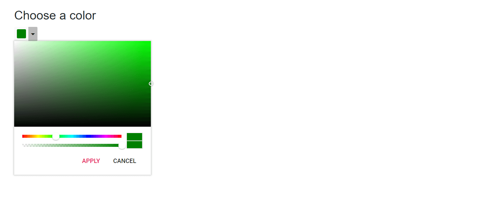
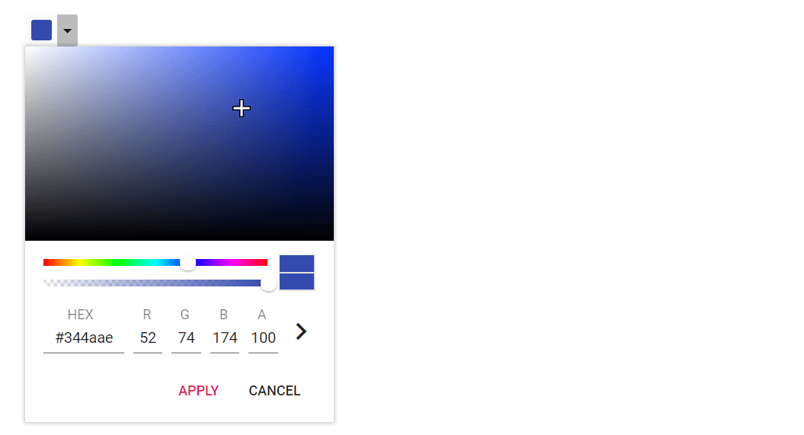

# Customize Color Picker in Blazor Color Picker Component

## Custom palette

By default, the palette renders with a set of predefined colors. To load custom colors, set the [PresetColors](https://help.syncfusion.com/cr/blazor/Syncfusion.Blazor.Inputs.SfColorPicker.html#Syncfusion_Blazor_Inputs_SfColorPicker_PresetColors) property. To further customize palette tiles (for example, to add a class for styling), use the [OnTileRender](https://help.syncfusion.com/cr/blazor/Syncfusion.Blazor.Inputs.SfColorPicker.html#Syncfusion_Blazor_Inputs_SfColorPicker_OnTileRender) event.

```cshtml

@using Syncfusion.Blazor.Inputs

<div id="preview" style="@styleValue"></div>
<h4>Select a color</h4>
<SfColorPicker Mode="ColorPickerMode.Palette" CssClass="circle-palette" ModeSwitcher="false" Inline="true" ShowButtons="false" Columns="4" PresetColors="@customColors" ValueChange="OnChange"></SfColorPicker>

@code {
    private string styleValue = "background-color: #008000";
    private void OnChange(ColorPickerEventArgs args)
    {
        styleValue = "background-color: " + args.CurrentValue.Hex;
    }
    private Dictionary<string, string[]> customColors = new Dictionary<string, string[]> {
        { "Custom", new string[] { "#ef9a9a", "#e57373", "#ef5350", "#f44336", "#f48fb1", "#f06292",
                    "#ec407a", "#e91e63", "#ce93d8", "#ba68c8", "#ab47bc", "#9c27b0", "#b39ddb","#9575cd",
                    "#7e57c2", "#673AB7", "#9FA8DA", "#7986CB", "#5C6BC0", "#3F51B5", "#90CAF9", "#64B5F6",
                    "#42A5F5","#2196F3", "#81D4FA", "#4FC3F7", "#29B6F6", "#03A9F4", "#80DEEA", "#4DD0E1",
                    "#26C6DA", "#00BCD4", "#80CBC4", "#4DB6AC", "#26A69A", "#009688","#A5D6A7", "#81C784",
                    "#66BB6A", "#4CAF50", "#C5E1A5", "#AED581", "#9CCC65", "#8BC34A", "#E6EE9C","#DCE775",
                    "#D4E157", "#CDDC39" }
        }
   };
}

<style>
    #preview {
        height: 50px;
        width: 50%;
    }
    .circle-palette .e-container {
        background-color: transparent;
        border-color: transparent;
        box-shadow: none;
    }
    .circle-palette .e-container .e-custom-palette.e-palette-group {
        height: 182px;
    }
    .circle-palette .e-container .e-palette .e-tile {
        border: 0;
        color: #fff;
        height: 36px;
        font-size: 18px;
        width: 36px;
        line-height: 36px;
        border-radius: 50%;
        margin: 2px 5px;
        font-family: "e-icons";
        font-style: normal;
        font-variant: normal;
        font-weight: normal;
        text-transform: none;
    }
    .circle-palette .e-container .e-palette .e-tile.e-selected::before {
        content: '\e933';
    }
    .circle-palette .e-container .e-palette .e-tile.e-selected {
        outline: none;
    }
</style>

```



## Hide input area from picker

By default, the input area is rendered in the Color Picker. To hide the input area, add the built-in class `e-hide-value` via the [CssClass](https://help.syncfusion.com/cr/blazor/Syncfusion.Blazor.Inputs.SfColorPicker.html#Syncfusion_Blazor_Inputs_SfColorPicker_CssClass) property. This hides the input field visually while retaining core picker functionality.

In the following sample, the Color Picker is rendered without the input area.

```cshtml
@using Syncfusion.Blazor.Inputs

<h4>Choose a color</h4>
<SfColorPicker ModeSwitcher="false" CssClass="e-hide-value"></SfColorPicker>
```




## Custom handle

Customize the Color Picker handle shape and UI with CSS. In this example, the handle is replaced with an SVG icon encoded as a data URL. Similar techniques can be used to style the handle to match application branding. For broad compatibility, verify styles across themes and consider contrast and focus visibility.

The following sample shows the customized Color Picker handle.

```cshtml

@using Syncfusion.Blazor.Inputs

<SfColorPicker Value="#344aae" CssClass="e-custom-picker" ModeSwitcher="false"></SfColorPicker>

<style>
    .e-color-picker-tooltip.e-popup.e-popup-open {
        display: none;
    }
    .e-custom-picker .e-container .e-handler {
        background: transparent url('data:image/svg+xml;base64,PD94bWwgdmVyc2lvbj0iMS4wIiBlbmNvZGluZz0idXRmLTgiPz4KPCEtLSBHZW5lcmF0b3I6IEFkb2JlIElsbHVzdHJhdG9yIDIyLjEuMCwgU1ZHIEV4cG9ydCBQbHVnLUluIC4gU1ZHIFZlcnNpb246IDYuMDAgQnVpbGQgMCkgIC0tPgo8c3ZnIHZlcnNpb249IjEuMSIgaWQ9IkxheWVyXzEiIHhtbG5zPSJodHRwOi8vd3d3LnczLm9yZy8yMDAwL3N2ZyIgeG1sbnM6eGxpbms9Imh0dHA6Ly93d3cudzMub3JnLzE5OTkveGxpbmsiIHg9IjBweCIgeT0iMHB4IgoJIHZpZXdCb3g9IjAgMCAxNiAxNiIgc3R5bGU9ImVuYWJsZS1iYWNrZ3JvdW5kOm5ldyAwIDAgMTYgMTY7IiB4bWw6c3BhY2U9InByZXNlcnZlIj4KPHN0eWxlIHR5cGU9InRleHQvY3NzIj4KCS5zdDB7ZmlsbDojRkZGRkZGO30KPC9zdHlsZT4KPGc+Cgk8cG9seWdvbiBjbGFzcz0ic3QwIiBwb2ludHM9IjE2LDYgMTAsNiAxMCwwIDYsMCA2LDYgMCw2IDAsMTAgNiwxMCA2LDE2IDEwLDE2IDEwLDEwIDE2LDEwIAkiLz4KPC9nPgo8cGF0aCBkPSJNMTAsNlYwSDZ2NkgwdjRoNnY2aDR2LTZoNlY2SDEweiBNMTUsOUg5djZIN1Y5SDFWN2g2VjFoMnY2aDZWOXoiLz4KPC9zdmc+Cg==');
        font-size: 16px;
        height: 16px;
        line-height: 16px;
        margin-left: -8px;
        margin-top: -8px;
        border: none;
        box-shadow: none;
        width: 16px;
    }
</style>

```


