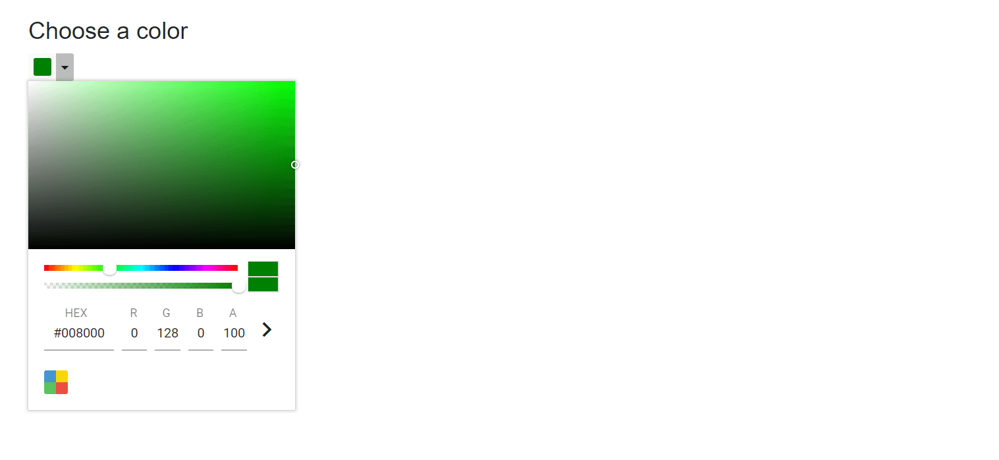

# Hide control buttons in Blazor Color Picker Component

Render the Color Picker without control buttons (Apply/Cancel) by setting the [ShowButtons](https://help.syncfusion.com/cr/blazor/Syncfusion.Blazor.Inputs.SfColorPicker.html#Syncfusion_Blazor_Inputs_SfColorPicker_ShowButtons) property to `false`.

```cshtml
@using Syncfusion.Blazor.Inputs

<h4>Choose a color</h4>
<SfColorPicker ShowButtons="false"></SfColorPicker>
```


