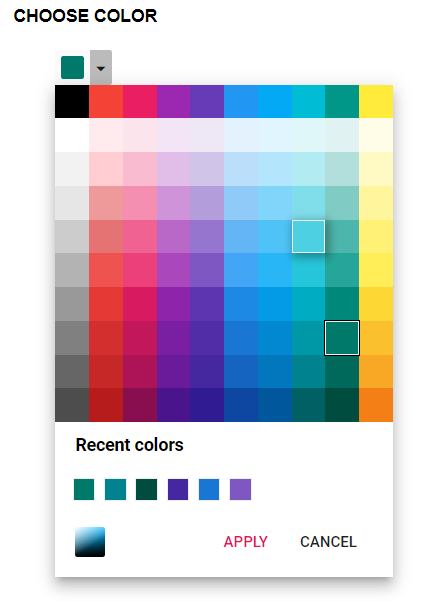

# Show Recent color in Blazor Color Picker Component

The [ShowRecentColors](https://help.syncfusion.com/cr/blazor/Syncfusion.Blazor.Inputs.SfColorPicker.html#Syncfusion_Blazor_Inputs_SfColorPicker_ShowRecentColors) property displays recently selected colors in the Color Picker when using palette mode. This feature helps users quickly reuse frequently chosen colors.

> Note: The [ShowRecentColors](https://help.syncfusion.com/cr/blazor/Syncfusion.Blazor.Inputs.SfColorPicker.html#Syncfusion_Blazor_Inputs_SfColorPicker_ShowRecentColors) feature shows up to 10 recent colors as tiles and is available only in palette mode.

In the following sample, the [ShowRecentColors](https://help.syncfusion.com/cr/blazor/Syncfusion.Blazor.Inputs.SfColorPicker.html#Syncfusion_Blazor_Inputs_SfColorPicker_ShowRecentColors) property is enabled to display recent colors in the palette area.

```cshtml
@using Syncfusion.Blazor.Inputs

<h4>Choose a color</h4>
<SfColorPicker ShowRecentColors="true"></SfColorPicker>
```


