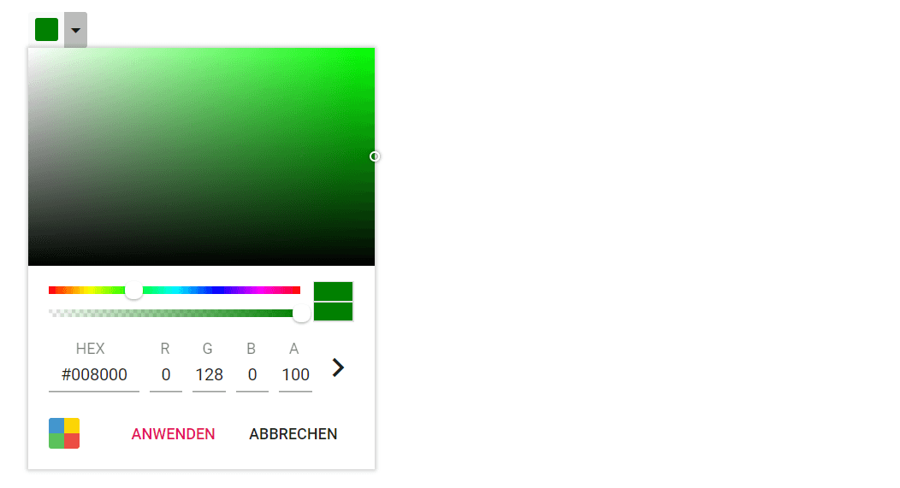
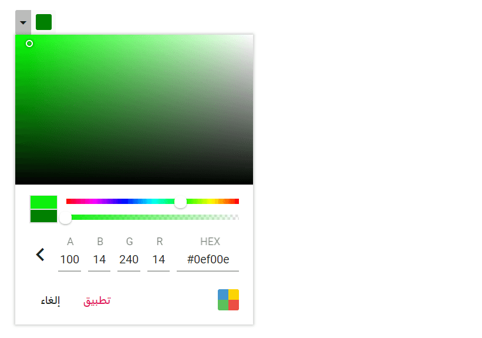

# Localization and RTL in Blazor Color Picker Component

## Localization

Use the localization framework to translate the default text in the Color Picker. The component includes static text for control buttons (Apply/Cancel) and the mode switcher that can be localized for cultures such as Arabic, German, French, and more by setting the app’s locale and providing translated resources. For setup guidance, see [How to enable localization in a Blazor application](https://blazor.syncfusion.com/documentation/common/localization#how-to-enable-localization-in-blazor-application).

Modify the default value in `.res` file added to Resource folder. Enter the key value (Locale Keywords) in the `Name` column and the translated string in the `Value` column. The following list of keys and their values are used in the Color Picker.

| Locale key | en-US (default culture) | de (Deutsch culture) |
| ---------- | ------------------------ | -------------------- |
| `ColorPicker_Apply` | `Apply` | `Anwenden` |
| `ColorPicker_Cancel` | `Cancel` | `Abbrechen` |
| `ColorPicker_ModeSwitcher` | `Switch Mode` | `Modus wechseln` |

```cshtml

@using Syncfusion.Blazor.Inputs

<SfColorPicker></SfColorPicker>

```




## RTL

The Color Picker supports right-to-left (RTL) layout to improve usability for languages such as Arabic, Farsi, and Urdu. Enable RTL by setting the [EnableRtl](https://help.syncfusion.com/cr/blazor/Syncfusion.Blazor.Inputs.SfColorPicker.html#Syncfusion_Blazor_Inputs_SfColorPicker_EnableRtl) property to `true`. RTL affects layout direction but does not translate text; use localization to provide translated strings.

In the following example, the Color Picker is rendered in RTL mode with an Arabic locale configured at the app level.

```cshtml

@using Syncfusion.Blazor.Inputs

<SfColorPicker EnableRtl="true"></SfColorPicker>

```


