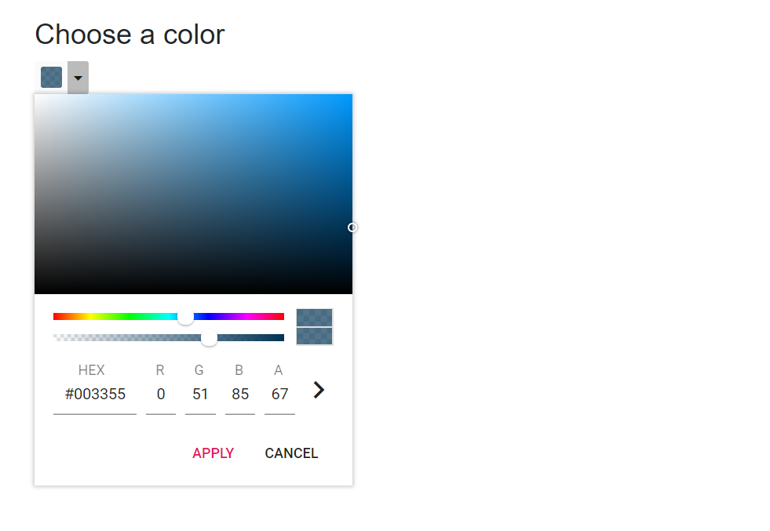

# Mode and Value

## Rendering palette at initial load

By default, the `Picker` area will be rendered at initial load. To render the Palette area while opening the Color Picker pop-up, specify the [`Mode`](https://help.syncfusion.com/cr/blazor/Syncfusion.Blazor.Inputs.SfColorPicker.html#Syncfusion_Blazor_Inputs_SfColorPicker_Mode) property as `Palette`.

In the following sample, it will render the `Palette` at initial load.

```cshtml
@using Syncfusion.Blazor.Inputs

<h4>Choose a color</h4>
<SfColorPicker Mode="ColorPickerMode.Palette"></SfColorPicker>
```

Output be like


## Color value

The [`Value`](https://help.syncfusion.com/cr/blazor/Syncfusion.Blazor.Inputs.SfColorPicker.html#Syncfusion_Blazor_Inputs_SfColorPicker_Value) property can be used to specify the color value to the Color Picker. It supports either `three` or `six` digit hex codes. To include `opacity`, set the color value as `four` or `eight` digit hex code.

In the following sample, the color value sets as `four` digit hex code, the last digit represents the `opacity` value.

```cshtml
@using Syncfusion.Blazor.Inputs

<h4>Choose a color</h4>
<SfColorPicker Value="035a" ModeSwitcher="false"></SfColorPicker>
```

Output be like


> The [`Value`](https://help.syncfusion.com/cr/blazor/Syncfusion.Blazor.Inputs.SfColorPicker.html#Syncfusion_Blazor_Inputs_SfColorPicker_Value) property
supports hex code with or without `#` prefix.