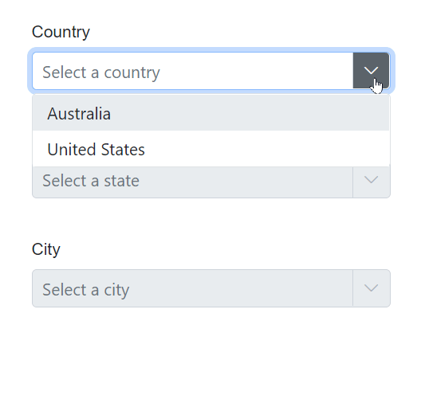
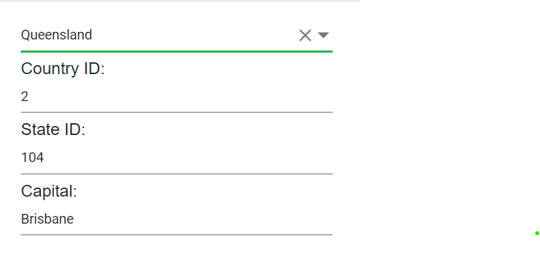

# Cascading in  ComboBox

The Cascading ComboBox is a series of ComboBoxes, where the value of one ComboBox depends on the value selected in another ComboBox value. 

In the [ValueChange](https://help.syncfusion.com/cr/blazor/Syncfusion.Blazor.DropDowns.ComboBoxEvents-2.html#Syncfusion_Blazor_DropDowns_ComboBoxEvents_2_ValueChange) event handler of first ComboBox, load the data for the second ComboBox based on the selected value of the first ComboBox. The same process can be  configured between the second and third ComboBoxes.

In this sample, when a country is selected from the countries ComboBox, the respective states are loaded in the second ComboBox. Similarly, the states and cities ComboBox works.







## Cascading with filtering 

In this sample, when a country is selected from the countries ComboBox, the respective StateID, CountryID and Capital are loaded in the below textbox.







