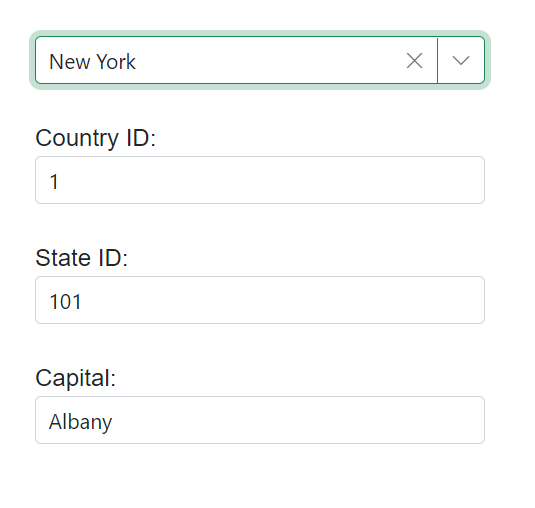

# Cascading in ComboBox

The Cascading ComboBox is a series of ComboBoxes, where the value of one ComboBox depends on the value selected in another ComboBox value. 

In the [ValueChange](https://help.syncfusion.com/cr/blazor/Syncfusion.Blazor.DropDowns.ComboBoxEvents-2.html#Syncfusion_Blazor_DropDowns_ComboBoxEvents_2_ValueChange) event handler of first ComboBox, load the data for the second ComboBox based on the selected value of the first ComboBox. The same process can be  configured between the second and third ComboBoxes.

In this sample, when a country is selected from the countries ComboBox, the respective states are loaded in the second ComboBox. Similarly, the states and cities ComboBox works.







## Cascading with other form field 

The ValueChange event of Syncfusion's Blazor ComboBox component is used to populate other form fields (such as textboxes) based on the value selected in the ComboBox. In the [ValueChange](https://help.syncfusion.com/cr/blazor/Syncfusion.Blazor.DropDowns.ComboBoxEvents-2.html#Syncfusion_Blazor_DropDowns_ComboBoxEvents_2_ValueChange) event handler, you can access the selected value of the ComboBox through the event arguments, then use this value to query your data source and retrieve the relevant data to populate the other form fields.

In this example, the ComboBox displays a list of countries, and the textboxes display the state ID, country ID, and capital of the selected country. When the user selects a different country in the ComboBox, the `ChangeState` event handler is triggered, and the data for the selected country is retrieved from the data source.







