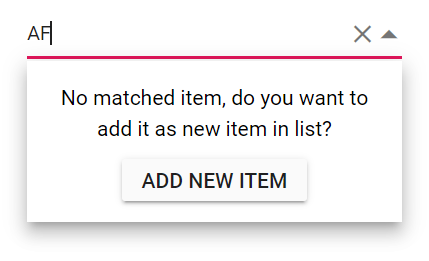

# Adding Custom Value to Blazor ComboBox Component

You can add custom value to the ComboBox component. When the typed character(s) is not present in the list, a button will be shown in the popup list. By clicking on this button, the custom value character(s) get added to the existing list as a new item. Default value of [AllowCustom](https://help.syncfusion.com/cr/blazor/Syncfusion.Blazor.DropDowns.SfComboBox-2.html#Syncfusion_Blazor_DropDowns_SfComboBox_2_AllowCustom) is `true`.



