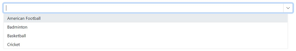

# Customization in Blazor ComboBox

## Open combobox dropdown on focus

You can automatically open the dropdown by using [ShowPopupAsync()](https://help.syncfusion.com/cr/blazor/Syncfusion.Blazor.DropDowns.SfDropDownList-2.html#Syncfusion_Blazor_DropDowns_SfDropDownList_2_ShowPopupAsync) method on [Focus](https://blazor.syncfusion.com/documentation/combobox/events#focus) event. The `ShowPopupAsync()` method opens the popup that displays the list of items.

```cshtml
@using Syncfusion.Blazor.DropDowns

<SfComboBox @ref=@popup TItem="GameFields" TValue="string" DataSource="@Games">
    <ComboBoxEvents TItem="GameFields" TValue="string" Focus="@FocusHandler"></ComboBoxEvents>
    <ComboBoxFieldSettings Text="Text" Value="ID"></ComboBoxFieldSettings>
</SfComboBox>

@code {
    public class GameFields
    {
        public string ID { get; set; }
        public string Text { get; set; }
    }
    SfComboBox<string, GameFields> popup;
    private List<GameFields> Games = new List<GameFields>() {
        new GameFields(){ ID= "Game1", Text= "American Football" },
        new GameFields(){ ID= "Game2", Text= "Badminton" },
        new GameFields(){ ID= "Game3", Text= "Basketball" },
        new GameFields(){ ID= "Game4", Text= "Cricket" },
     };

    private void FocusHandler()
    {
        popup.ShowPopupAsync();
       
    }
}
```


