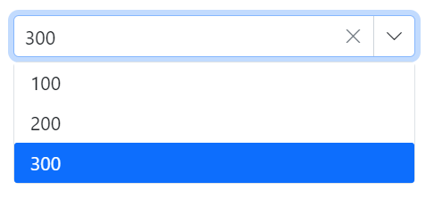

# Data Binding in Blazor ComboBox Component

The ComboBox supports binding data from local sources or remote services. Use the [DataSource](https://help.syncfusion.com/cr/blazor/Syncfusion.Blazor.DropDowns.SfDropDownBase-1.html#Syncfusion_Blazor_DropDowns_SfDropDownBase_1_DataSource) property to bind local data. For remote data, use the [DataManager](https://help.syncfusion.com/cr/blazor/Syncfusion.Blazor.DataManager.html) to configure endpoints and adaptors.

* **TItem** - Specifies the type of the data source items for the ComboBox component.

## Binding local data

The ComboBox loads the data from local data sources through the [DataSource](https://help.syncfusion.com/cr/blazor/Syncfusion.Blazor.DropDowns.SfDropDownBase-1.html#Syncfusion_Blazor_DropDowns_SfDropDownBase_1_DataSource) property. It supports the data type of `Array of primitive type`, `Array of object`, `List of primitive type`,`List of object`, `Observable Collection`, `ExpandoObject`, `DynamicObject`.








## Index value binding

Bind by index using the `bind-Index` attribute (supports int and nullable int). This binds the selected item based on its index in the data.

```cshtml
@using Syncfusion.Blazor.DropDowns

<SfComboBox TValue="string" Placeholder="e.g. Australia" TItem="Country" @bind-Index="@ddlIndex" DataSource="@Countries">
    <ComboBoxFieldSettings Value="Name"></ComboBoxFieldSettings>
</SfComboBox>

@code {

    private int? ddlIndex { get; set; } = 1;

    public class Country
    {
        public string Name { get; set; }

        public string Code { get; set; }
    }

    List<Country> Countries = new List<Country>
{
        new Country() { Name = "Australia", Code = "AU" },
        new Country() { Name = "Bermuda", Code = "BM" },
        new Country() { Name = "Canada", Code = "CA" },
        new Country() { Name = "Cameroon", Code = "CM" },
    };
}
```


### DataBound event

The [DataBound](https://help.syncfusion.com/cr/blazor/Syncfusion.Blazor.DropDowns.ComboBoxEvents-2.html#Syncfusion_Blazor_DropDowns_ComboBoxEvents_2_DataBound) event fires after the data source is populated in the popup list.







### Primitive type

Bind arrays or lists of primitive types such as `string`, `int`, `double`, and `bool`.

The following code demonstrates binding an array of strings to the ComboBox.








The following code demonstrates binding an array of integers to the ComboBox.









### Complex data type

Bind arrays or lists of complex objects. Map the appropriate fields using the [Fields](https://help.syncfusion.com/cr/blazor/Syncfusion.Blazor.DropDowns.ComboBoxModel.html) property (via ComboBoxFieldSettings).

In the following example, `Code.ID` is mapped to [ComboBoxFieldSettings.Value](https://help.syncfusion.com/cr/blazor/Syncfusion.Blazor.DropDowns.ComboBoxFieldSettings.html#Syncfusion_Blazor_DropDowns_ComboBoxFieldSettings_Value) and `Country.CountryID` is mapped to [ComboBoxFieldSettings.Text](https://help.syncfusion.com/cr/blazor/Syncfusion.Blazor.DropDowns.ComboBoxFieldSettings.html#Syncfusion_Blazor_DropDowns_ComboBoxFieldSettings_Text).








### Expando object binding

Bind [ExpandoObject](https://learn.microsoft.com/en-us/dotnet/api/system.dynamic.expandoobject?view=net-8.0) data to the ComboBox. The following example binds a collection of vehicle objects.








### Observable collection binding

Bind an [ObservableCollection](https://blazor.syncfusion.com/documentation/common/data-binding/data-updates#observable-collection) so UI updates reflect changes to the collection (add, remove, update).








### Dynamic object binding

Bind [DynamicObject](https://learn.microsoft.com/en-us/dotnet/api/system.dynamic.dynamicobject?view=net-8.0) instances to the ComboBox. The following example binds a collection of customers.








### Enum data binding

Bind enum data and display description values from enumeration members.








### ValueTuple data binding

Bind [ValueTuple](https://learn.microsoft.com/en-us/dotnet/api/system.valuetuple-2?view=net-8.0) data. The following example shows how to extract and display a string value using `ValueTuple`.








## Binding remote data 

Load data from remote services using [DataSource](https://help.syncfusion.com/cr/blazor/Syncfusion.Blazor.DropDowns.SfDropDownBase-1.html#Syncfusion_Blazor_DropDowns_SfDropDownBase_1_DataSource) in combination with [DataManager](https://blazor.syncfusion.com/documentation/data/getting-started). Use the [Query](https://help.syncfusion.com/cr/blazor/Syncfusion.Blazor.DropDowns.SfDropDownBase-1.html#Syncfusion_Blazor_DropDowns_SfDropDownBase_1_Query) property to shape requests.

* [DataManager.Url](https://help.syncfusion.com/cr/blazor/Syncfusion.Blazor.DataManager.html#Syncfusion_Blazor_DataManager_Url) – Specifies the service endpoint to fetch data.
* [DataManager.Adaptor](https://help.syncfusion.com/cr/blazor/Syncfusion.Blazor.DataManager.html#Syncfusion_Blazor_DataManager_Adaptor) – Selects the adaptor. By default, the [ODataAdaptor](https://blazor.syncfusion.com/documentation/data/adaptors#odata-adaptor) is used for remote binding. Adaptors handle request/response processing for the endpoint.
* The [Syncfusion.Blazor.Data](https://www.nuget.org/packages/Syncfusion.Blazor.Data/) package provides predefined adaptors for common service endpoints.

### OnActionBegin event

The [OnActionBegin](https://help.syncfusion.com/cr/blazor/Syncfusion.Blazor.DropDowns.ComboBoxEvents-2.html#Syncfusion_Blazor_DropDowns_ComboBoxEvents_2_OnActionBegin) event fires before data is requested from the server.







### OnActionComplete event

The [OnActionComplete](https://help.syncfusion.com/cr/blazor/Syncfusion.Blazor.DropDowns.ComboBoxEvents-2.html#Syncfusion_Blazor_DropDowns_ComboBoxEvents_2_OnActionComplete) event fires after data is successfully fetched from the server.







### OnActionFailure event

The [OnActionFailure](https://help.syncfusion.com/cr/blazor/Syncfusion.Blazor.DropDowns.ComboBoxEvents-2.html#Syncfusion_Blazor_DropDowns_ComboBoxEvents_2_OnActionFailure) event fires when a remote data request fails.







### OData v4 services

The [OData v4 Adaptor](https://blazor.syncfusion.com/documentation/data/adaptors#odatav4-adaptor) enables consuming and manipulating data from OData v4 services. The following example displays the first six customer records from the `Customers` table of the Northwind service.








### Web API adaptor

Use the [Web API Adaptor](https://blazor.syncfusion.com/documentation/data/adaptors#web-api-adaptor) to interact with Web API endpoints that follow OData conventions. `WebApiAdaptor` extends the [ODataAdaptor](https://blazor.syncfusion.com/documentation/data/adaptors#odata-adaptor), so endpoints should understand OData-formatted queries.








### Custom adaptor

The [SfDataManager](https://help.syncfusion.com/cr/aspnetcore-blazor/Syncfusion.Blazor.Data.SfDataManager.html) has custom adaptor support which allows you to perform manual operations on the data. This can be utilized for implementing customize data binding and editing operations in the ComboBox component.

For implementing custom data binding in the ComboBox, the `DataAdaptor` class is used. This abstract class acts as a base class for the custom adaptor.

The `DataAdaptor` abstract class has both synchronous and asynchronous method signatures, which can be overridden in the custom adaptor. Following are the method signatures present in this class.

```csharp
public abstract class DataAdaptor
{
    /// <summary>
    /// Performs data Read operation synchronously.
    /// </summary>
    public virtual object Read(DataManagerRequest dataManagerRequest, string key = null)

    /// <summary>
    /// Performs data Read operation asynchronously.
    /// </summary>
    public virtual Task<object> ReadAsync(DataManagerRequest dataManagerRequest, string key = null)
}
```

Bind the ComboBox using your custom adaptor by providing the custom class to DataManager and implementing `Read` or `ReadAsync`.







### Offline mode

To avoid a server request for every action, preloaded all data at initialization and perform actions on the client. Enable this behavior by setting the DataManager’s `Offline` property.








### Entity Framework

Follow these steps to consume data from [Entity Framework](https://blazor.syncfusion.com/documentation/common/data-binding/bind-entity-framework) in the ComboBox component.

#### Create DBContext class

Create a `DbContext` (for example, `OrderContext`) to connect to the database.

```csharp
using Microsoft.EntityFrameworkCore;
using System;
using System.Collections.Generic;
using System.Linq;
using System.Threading.Tasks;
using EFDropDown.Shared.Models;

namespace EFDropDown.Shared.DataAccess
{
    public class OrderContext : DbContext
    {
        public virtual DbSet<Shared.Models.Order> Orders { get; set; }

        protected override void OnConfiguring(DbContextOptionsBuilder optionsBuilder)
        {
            if (!optionsBuilder.IsConfigured)
            {
                optionsBuilder.UseSqlServer(@"Data Source=(LocalDB)\MSSQLLocalDB;AttachDbFilename=D:\Blazor\DropDownList\EFDropDown\Shared\App_Data\NORTHWND.MDF;Integrated Security=True;Connect Timeout=30");
            }
        }
    }
}
```

#### Create data access layer to perform data operation

Create a data access class (for example, `OrderDataAccessLayer`) to retrieve records from the database.

```csharp
using Microsoft.EntityFrameworkCore;
using System;
using System.Collections.Generic;
using System.Linq;
using System.Threading.Tasks;
using EFDropDown.Shared.Models;

namespace EFDropDown.Shared.DataAccess
{
    public class OrderDataAccessLayer
    {
        OrderContext db = new OrderContext();

        //To Get all Orders details
        public DbSet<Order> GetAllOrders()
        {
            try
            {
                return db.Orders;
            }
            catch
            {
                throw;
            }
        }
    }
}
```

#### Creating web API controller

Create a Web API controller so the ComboBox can consume data directly from Entity Framework.

```csharp
using EFDropDown.Shared.DataAccess;
using EFDropDown.Shared.Models;
using Microsoft.AspNetCore.Mvc;
using Microsoft.Extensions.Primitives;
using System;
using System.Collections.Generic;
using System.Linq;
using System.Threading.Tasks;
using System.Web;
using Microsoft.AspNetCore.Http;

namespace EFDropDown.Controllers
{
    [Route("api/[controller]")]
    [ApiController]
    //TreeGrid
    public class DefaultController : ControllerBase
    {
        OrderDataAccessLayer db = new OrderDataAccessLayer();
        [HttpGet]
        public object Get()
        {
            IQueryable<Order> data = db.GetAllOrders().AsQueryable();
            var count = data.Count();
            var queryString = Request.Query;
            if (queryString.Keys.Contains("$inlinecount"))
            {
                StringValues Skip;
                StringValues Take;
                int skip = (queryString.TryGetValue("$skip", out Skip)) ? Convert.ToInt32(Skip[0]) : 0;
                int top = (queryString.TryGetValue("$top", out Take)) ? Convert.ToInt32(Take[0]) : data.Count();
                return new { Items = data.Skip(skip).Take(top), Count = count };
            }
            else
            {
                return data;
            }
         }
    }
}
```

### Configure ComboBox component using Web API adaptor

Configure the ComboBox with [SfDataManager](https://blazor.syncfusion.com/documentation/data/getting-started) to interact with the Web API using the [WebApiAdaptor](https://blazor.syncfusion.com/documentation/data/adaptors#web-api-adaptor).







## Adding new items

Add items directly to the popup (without altering the bound data source) using [AddItemsAsync](https://help.syncfusion.com/cr/blazor/Syncfusion.Blazor.DropDowns.SfDropDownBase-1.html#Syncfusion_Blazor_DropDowns_SfDropDownBase_1_AddItemsAsync_System_Collections_Generic_IEnumerable__0__System_Nullable_System_Int32__). This method inserts the specified items into the ComboBox popup at the given index (or at the end if not specified) while leaving the original data source unchanged.







