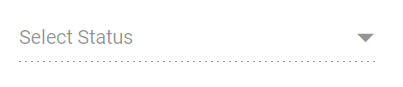

# Disabled Items in Blazor ComboBox Component

The [ComboBox](https://help.syncfusion.com/cr/blazor/Syncfusion.Blazor.DropDowns.SfComboBox-2.html) allows individual items to be enabled or disabled based on application logic. Map a boolean field from the data source to the [Disabled](https://help.syncfusion.com/cr/blazor/Syncfusion.Blazor.DropDowns.ComboBoxFieldSettings.html#Syncfusion_Blazor_DropDowns_ComboBoxFieldSettings_Disabled) property in field settings to mark specific items as disabled. Disabled items remain visible but cannot be selected as the value of the component.

In the following sample, items are disabled based on a data field mapped to Disabled.









## Disable Item Method

The disableItem method can be used to handle dynamic changing in disable state of a specific item. Only one item can be disabled in this method. To disable multiple items, this method can be iterated with the items list or array. The disabled field state will to be updated in the [DataSource](https://help.syncfusion.com/cr/blazor/Syncfusion.Blazor.DropDowns.SfDropDownBase-1.html#Syncfusion_Blazor_DropDowns_SfDropDownBase_1_DataSource), when the item is disabled using this method. If the selected item is disabled dynamically, then the selection will be cleared.

| Parameter | Type | Description |
|------|------|------|
| itemValue | <code>string</code> \| <code>number</code> \| <code>boolean</code> \| <code>object</code> | Not applicable for Blazor ComboBox; update the data-bound Disabled field instead. |
| itemIndex | <code>number</code> | Not applicable for Blazor ComboBox; update the data-bound Disabled field instead. |

## Enabled

To disable the entire component, set the [Enabled](https://help.syncfusion.com/cr/blazor/Syncfusion.Blazor.DropDowns.SfDropDownList-2.html#Syncfusion_Blazor_DropDowns_SfDropDownList_2_Enabled) property to false.

