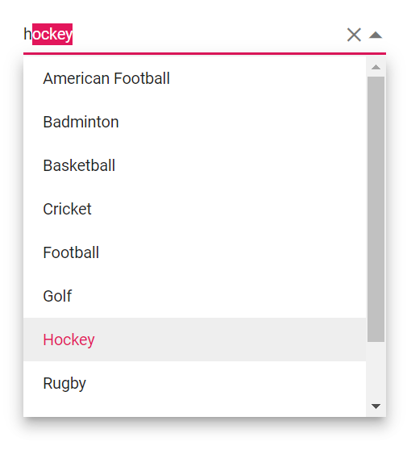

# Filtering in Blazor ComboBox Component

The ComboBox has built-in support to filter data items when [AllowFiltering](https://help.syncfusion.com/cr/blazor/Syncfusion.Blazor.DropDowns.SfComboBox-2.html) is enabled. The filter operation starts as soon as you start typing characters in the component.

```cshtml
@using Syncfusion.Blazor.Data
@using Syncfusion.Blazor.DropDowns

<SfComboBox TValue="string" TItem="EmployeeData" Placeholder="Select a customer" Query="@Query" AllowFiltering=true>
    <SfDataManager Url="https://ej2services.syncfusion.com/production/web-services/api/Employees" Adaptor="Adaptors.WebApiAdaptor" CrossDomain=true></SfDataManager>
    <ComboBoxFieldSettings Text="FirstName" Value="EmployeeID"></ComboBoxFieldSettings>
</SfComboBox>

@code {
    public Query Query = new Query();

    public class EmployeeData
    {
        public int EmployeeID { get; set; }
        public string FirstName { get; set; }
        public string Designation { get; set; }
        public string Country { get; set; }
    }
}
```



## Custom Filtering

The ComboBox component filter queries can be customized. You can also use your own filter libraries to filter data like Fuzzy search.

```cshtml
@using Syncfusion.Blazor.Data

<SfComboBox TValue="string" @ref="comboObj" TItem="Country" Placeholder="e.g. Australia" DataSource="@Countries" AllowFiltering="true">
    <ComboBoxFieldSettings Text="Name" Value="Code"></ComboBoxFieldSettings>
    <ComboBoxEvents TValue="string" TItem="Country" Filtering="OnFilter"></ComboBoxEvents>
</SfComboBox>

@code {

    SfComboBox<string, Country> comboObj { get; set; }

    public class Country
    {
        public string Name { get; set; }

        public string Code { get; set; }
    }

    List<Country> Countries = new List<Country>
    {
        new Country() { Name = "Australia", Code = "AU" },
        new Country() { Name = "Bermuda", Code = "BM" },
        new Country() { Name = "Canada", Code = "CA" },
        new Country() { Name = "Cameroon", Code = "CM" },
        new Country() { Name = "Denmark", Code = "DK" }
    };

    List<Country> CountriesFiltered = new List<Country>
    {
        new Country() { Name = "France", Code = "FR" },
        new Country() { Name = "Finland", Code = "FI" },
        new Country() { Name = "Germany", Code = "DE" },
        new Country() { Name = "Greenland", Code = "GL" }
    };

    private async Task OnFilter(FilteringEventArgs args)
    {
        args.PreventDefaultAction = true;
        var query = new Query().Where(new WhereFilter() { Field = "Name", Operator = "contains", value = args.Text, IgnoreCase = true });

        query = !string.IsNullOrEmpty(args.Text) ? query : new Query();

        await comboObj.FilterAsync(CountriesFiltered, query);
    }
}
```


## Prevent popup opening when filtering

To prevent the ComboBox dropdown from opening when filtering is applied, you can use the [BeforeOpenEventArgs.Cancel](https://help.syncfusion.com/cr/blazor/Syncfusion.Blazor.DropDowns.BeforeOpenEventArgs.html#Syncfusion_Blazor_DropDowns_BeforeOpenEventArgs_Cancel) argument in the [BeforeOpenEventArgs](https://help.syncfusion.com/cr/blazor/Syncfusion.Blazor.DropDowns.BeforeOpenEventArgs.html). The `BeforeOpenEventArgs.Cancel` argument is a boolean value that can be set to true to cancel the dropdown opening, or false to allow the dropdown to open.

In the following example, the isTyped flag is used to track whether the filtering action is taking place. The `OnFiltering` method sets the flag to true when the filtering action starts, and the `OnBeforeOpen` method cancels the dropdown opening if the flag is set to true. Finally, the `OnBeforeOpen` method resets the flag to false to prepare for the next filtering action.

> This will prevent the ComboBox dropdown from opening when filtering is applied, while still allowing the user to filter the items using the input field in the ComboBox.







## Autofill

Specifies whether the input field of the control will automatically suggest and fill in the first matched item, as the user types based on the items in the control's data source. If no matches are found, the input field will not be filled and no action will occur. Default value of [Autofill](https://help.syncfusion.com/cr/blazor/Syncfusion.Blazor.DropDowns.SfComboBox-2.html#Syncfusion_Blazor_DropDowns_SfComboBox_2_Autofill) is `false`.





 

