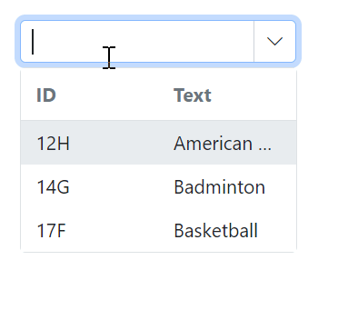

# Filtering in Blazor ComboBox Component

The ComboBox has built-in support to filter data items when [AllowFiltering](https://help.syncfusion.com/cr/blazor/Syncfusion.Blazor.DropDowns.SfComboBox-2.html#Syncfusion_Blazor_DropDowns_SfComboBox_2_AllowFiltering) is enabled. The filter operation starts as soon as characters are typed in the input. The default value of AllowFiltering is `false`.

## Local data

The following code demonstrates the filtering functionality with local data in the ComboBox component.







## Remote data

For remote data, each key press sends a filter request to the server when using DataManager with filtering enabled.

The below code demonstrates the filtering functionality with [ODataAdaptor](https://blazor.syncfusion.com/documentation/data/adaptors#odata-adaptor) in the ComboBox component with help of [Query](https://help.syncfusion.com/cr/blazor/Syncfusion.Blazor.Data.Query.html) property.







## Debounce delay

Use the [DebounceDelay](https://help.syncfusion.com/cr/blazor/Syncfusion.Blazor.DropDowns.SfComboBox-2.html#Syncfusion_Blazor_DropDowns_SfComboBox_2_DebounceDelay) property for filtering, enabling you to set a delay in milliseconds. This functionality helps reduce the frequency of filtering as you type, enhancing performance and responsiveness for a smoother user experience.By default, a DebounceDelay of 300ms is set. If you wish to disable this feature entirely, you can set it to 0ms.







## Filter type

Use the [FilterType](https://help.syncfusion.com/cr/blazor/Syncfusion.Blazor.DropDowns.SfDropDownBase-1.html#Syncfusion_Blazor_DropDowns_SfDropDownBase_1_FilterType) property to specify the string matching mode used during search. The available `FilterType` options and their descriptions are:

FilterType     | Description
------------ | -------------
  [StartsWith](https://help.syncfusion.com/cr/blazor/Syncfusion.Blazor.DropDowns.FilterType.html#Syncfusion_Blazor_DropDowns_FilterType_StartsWith)       | Checks whether a value begins with the specified value.
  [EndsWith](https://help.syncfusion.com/cr/blazor/Syncfusion.Blazor.DropDowns.FilterType.html#Syncfusion_Blazor_DropDowns_FilterType_EndsWith)     | Checks whether a value ends with the specified value.
  [Contains](https://help.syncfusion.com/cr/blazor/Syncfusion.Blazor.DropDowns.FilterType.html#Syncfusion_Blazor_DropDowns_FilterType_Contains)      | Checks whether a value contains the specified value.

In the following example, `EndsWith` filter type has been mapped to the `FilterType` property.







## Minimum filter length

When filtering the list items, you can set the limit for character count to raise a remote request and fetch filtered data on the DropDownList. This can be done by manual validation by using the [Filtering event arguments](https://help.syncfusion.com/cr/blazor/Syncfusion.Blazor.DropDowns.FilteringEventArgs.html#Syncfusion_Blazor_DropDowns_FilteringEventArgs_Text) within the [Filtering](https://help.syncfusion.com/cr/blazor/Syncfusion.Blazor.DropDowns.DropDownListEvents-2.html#Syncfusion_Blazor_DropDowns_DropDownListEvents_2_Filtering) event handler.

In the following example, the remote request does not fetch the search data until the search key contains three characters.







## Multi column filtering 

In the built-in Syncfusion&reg; Blazor theme files, support for multi column layout can be enabled by adding the `e-multi-column` class to the [CssClass](https://help.syncfusion.com/cr/blazor/Syncfusion.Blazor.DropDowns.SfDropDownBase-1.html#Syncfusion_Blazor_DropDowns_SfDropDownBase_1_CssClass) property.







Achieve multiple column(field) filtering by passing the list of [predicates](https://help.syncfusion.com/cr/blazor/Syncfusion.Blazor.Data.WhereFilter.html#Syncfusion_Blazor_Data_WhereFilter_predicates) to the [And](https://help.syncfusion.com/cr/blazor/Syncfusion.Blazor.Data.WhereFilter.html#Syncfusion_Blazor_Data_WhereFilter_And_Syncfusion_Blazor_Data_WhereFilter_) or [Or](https://help.syncfusion.com/cr/blazor/Syncfusion.Blazor.Data.WhereFilter.html#Syncfusion_Blazor_Data_WhereFilter_Or_Syncfusion_Blazor_Data_WhereFilter_) methods of [WhereFilters](https://help.syncfusion.com/cr/blazor/Syncfusion.Blazor.Data.WhereFilter.html#Syncfusion_Blazor_Data_WhereFilter__ctor).







## Case sensitive filtering

The data items can be filtered with or without case sensitivity using the [DataManager](https://help.syncfusion.com/cr/blazor/Syncfusion.Blazor.Data.SfDataManager.html). This can be done by passing the fourth optional parameter [IgnoreCase](https://help.syncfusion.com/cr/blazor/Syncfusion.Blazor.Data.WhereFilter.html#Syncfusion_Blazor_Data_WhereFilter_IgnoreCase) of the [Where clause](https://help.syncfusion.com/cr/blazor/Syncfusion.Blazor.Data.Query.html#Syncfusion_Blazor_Data_Query_Where_Syncfusion_Blazor_Data_WhereFilter_).

The following example shows how to perform case-sensitive filtering.







## Custom filtering

ComboBox component filter queries can be customized using the [Filtering](https://help.syncfusion.com/cr/blazor/Syncfusion.Blazor.DropDowns.ComboBoxEvents-2.html#Syncfusion_Blazor_DropDowns_ComboBoxEvents_2_Filtering) event. You can also filter text across multiple columns in the data source by composing predicates.

In the below sample demonstration, the data is filtered using its `FirstName` or `LastName` field. Hence in the Filtering event, [Predicate](https://help.syncfusion.com/cr/blazor/Syncfusion.Blazor.Data.WhereFilter.html#Syncfusion_Blazor_Data_WhereFilter_Condition) is used with `or` condition for filtering both fields. 

For instance, the data source item consists of `FirstName` as `Nancy` and `LastName` as `Davalio`. You can filter the data by typing `N` or `D`, and it will display `Nancy` (FirstName field) in the popup.









## Prevent popup opening when filtering

To prevent the ComboBox dropdown from opening when filtering is applied, use the [BeforeOpenEventArgs.Cancel](https://help.syncfusion.com/cr/blazor/Syncfusion.Blazor.DropDowns.BeforeOpenEventArgs.html#Syncfusion_Blazor_DropDowns_BeforeOpenEventArgs_Cancel) argument in the [BeforeOpenEventArgs](https://help.syncfusion.com/cr/blazor/Syncfusion.Blazor.DropDowns.BeforeOpenEventArgs.html). Set it to true to cancel the dropdown opening, or false to allow the dropdown to open.

In the following example, the `isTyped` flag is used to track whether the filtering action is taking place. The `OnFiltering` method sets the flag to true when the filtering action starts, and the `OnBeforeOpen` method cancels the dropdown opening if the flag is set to true. Finally, the `OnBeforeOpen` method resets the flag to false to prepare for the next filtering action.

> This prevents the ComboBox dropdown from opening when filtering is applied, while still allowing the user to filter the items using the input field in the ComboBox.





