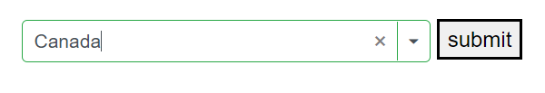

# Form Validation in ComboBox

## ComboBox inside edit form

The ComboBox can be used inside an `EditForm` to create a form with a list for selecting an option. The `EditForm` validates all data annotation rules using the `DataAnnotationsValidator`. 

If the ComboBox input is valid, the form will be ready to be submit. If the ComboBox input is invalid, an error message will be displayed until a valid value is chosen.

In this following example, the `EditForm` component is used to wrap the ComboBox and the submit button. The `DataAnnotationsValidator` component is used to enable data annotation-based validation, and the `ValidationMessage` component is used to display the validation error message. The `Required` attribute is applied to the Name field to make it a required field.







