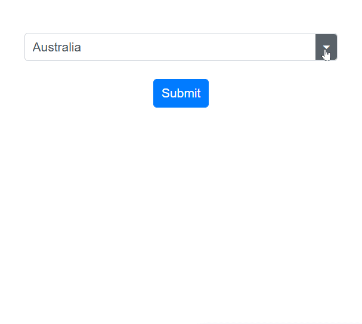

# Form Validation in ComboBox

## ComboBox inside edit form

The `EditForm` validates all data annotation rules using the `DataAnnotationsValidator`. If the input is valid, the form will be ready to be submitted. If the input is invalid, an error message will be displayed until a valid value is chosen.

In this following example, the `EditForm` component is used to wrap the ComboBox and the submit button. The `DataAnnotationsValidator` component is used to enable data annotation-based validation, and the `ValidationMessage` component is used to display the validation error message. The `Required` attribute is applied to the Name field to make it a required field.







## Form validation using injectable datasource

The ComboBox component inside the Edit form with the required field validation and with the injectable datasource is mentioned in the following sample.

In this following example, the ownservice is injected into the component using the @inject directive. The ownservice. GetDataAsync() method is used to get the list of countries to display in the ComboBox. The EditForm, DataAnnotationsValidator, and ValidationMessage components are used to enable form validation and display the validation error message.










    public class Countries
    {
        [Required(ErrorMessage = "The Country field is required.")]
        public string Name { get; set; }

        public string Code { get; set; }
    }





    public class CountryService
    {

        public async Task<List<Countries>> GetDataAsync()
        {
            List<Countries> Country = new List<Countries>
        {
            new Countries() { Name = "Australia", Code = "AU" },
            new Countries() { Name = "Bermuda", Code = "BM" },
            new Countries() { Name = "Canada", Code = "CA" },
            new Countries() { Name = "Cameroon", Code = "CM" },
            new Countries() { Name = "Denmark", Code = "DK" },
            new Countries() { Name = "France", Code = "FR" },
            new Countries() { Name = "Finland", Code = "FI" }
        };
            return await Task.FromResult(Country);
        }
        public async Task<string> GetPreSelectDataAsync()
        {
            string value = "AU";

            return await Task.FromResult(value);
        }

    }




