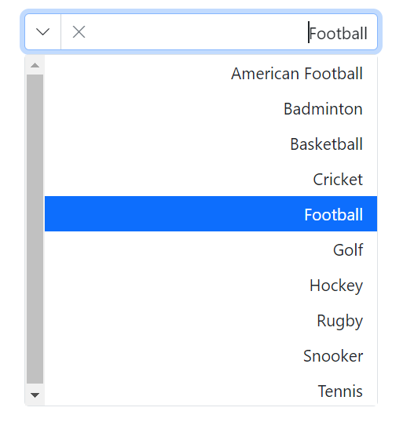

# Localization and Globalization in Blazor ComboBox Component

## Localization

The [Blazor ComboBox](https://www.syncfusion.com/blazor-components/blazor-combobox) supports localization of built-in text such as “No records found” and “Action failure.” To localize component texts, add the required culture resources as described in the [Blazor Localization](https://blazor.syncfusion.com/documentation/common/localization) topic. Ensure the application culture (CurrentCulture/CurrentUICulture) is set appropriately so localized strings are displayed.

## Globalization

### Enable RTL mode

The direction can be switched to right to left when specifies the [EnableRtl](https://help.syncfusion.com/cr/blazor/Syncfusion.Blazor.DropDowns.DropDownListModel-2.html#Syncfusion_Blazor_DropDowns_DropDownListModel_2_EnableRtl) as `true`. Writing systems like Arabic, Hebrew, and more will require `EnableRtl` property.

Specifies the [EnableRtl](https://help.syncfusion.com/cr/blazor/Syncfusion.Blazor.DropDowns.DropDownListModel-2.html#Syncfusion_Blazor_DropDowns_DropDownListModel_2_EnableRtl) as a boolean value that indicates to enable or disable rendering component in the right to left direction. Writing systems will require Arabic, Hebrew, and more. The direction can be switched to right-to-left.







