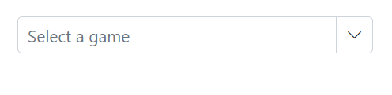
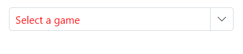
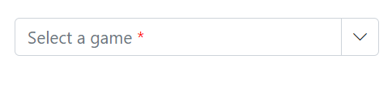
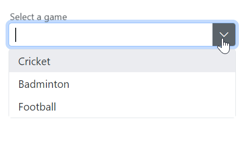
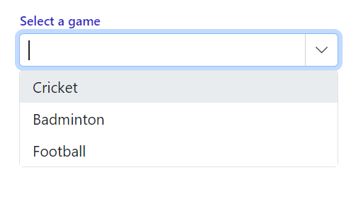

# Placeholder and Float Label in ComboBox

## Placeholder

Use the [Placeholder](https://help.syncfusion.com/cr/blazor/Syncfusion.Blazor.DropDowns.SfComboBox-2.html#Syncfusion_Blazor_DropDowns_SfComboBox_2_Placeholder) property to display a hint describing the expected value in the input. In the following example, “Select a game” is set as the placeholder, which applies the corresponding attribute to the input element in the DOM.







## Color of the placeholder text

Change the color of the placeholder by targeting its CSS class `input.e-input::placeholder`, which indicates the placeholder text, and set the desired color using the `color` property.







## Add mandatory indicator using placeholder

The mandatory indicator `*` can be applied to the placeholder by targeting its CSS class `.e-float-text::after` using the `content` style.







## FloatLabel

Use the [FloatLabelType](https://help.syncfusion.com/cr/blazor/Syncfusion.Blazor.DropDowns.SfDropDownList-2.html#Syncfusion_Blazor_DropDowns_SfDropDownList_2_FloatLabelType) property to specify the floating label behavior of the DropDownList that the `Placeholder` text floats above the TextBox based on the following values. `FloatLabelType` is applicable only when `Placeholder` is used. `FloatLabelType` is depends on `Placeholder`. Default value of `FloatLabelType` is `Never`.

The floating label supports the types of actions as follow.

Type     | Description
------------ | -------------
  [Auto](https://help.syncfusion.com/cr/blazor/Syncfusion.Blazor.Inputs.FloatLabelType.html#Syncfusion_Blazor_Inputs_FloatLabelType_Auto)       | The label floats above the input when it is focused or a value is entered.
  [Always](https://help.syncfusion.com/cr/blazor/Syncfusion.Blazor.Inputs.FloatLabelType.html#Syncfusion_Blazor_Inputs_FloatLabelType_Always)     | The label always floats above the input.
  [Never](https://help.syncfusion.com/cr/blazor/Syncfusion.Blazor.Inputs.FloatLabelType.html#Syncfusion_Blazor_Inputs_FloatLabelType_Never)      | The label never floats above the input when the placeholder is available.

The FloatLabelType set to Auto is demonstrated in the following example.







## Customizing the float label element’s focusing color

Change the text color of the floating label when it is focused by targeting its CSS classes `.e-input-focus` and `.e-float-text.e-label-top`. These classes indicate the floating label text while it is focused state and set the desired color using the `color` property.







