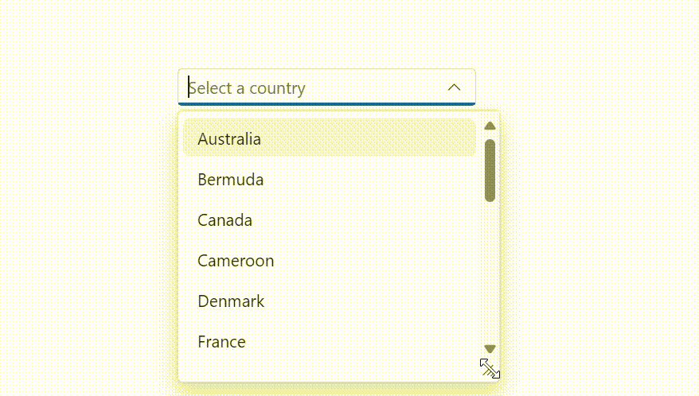
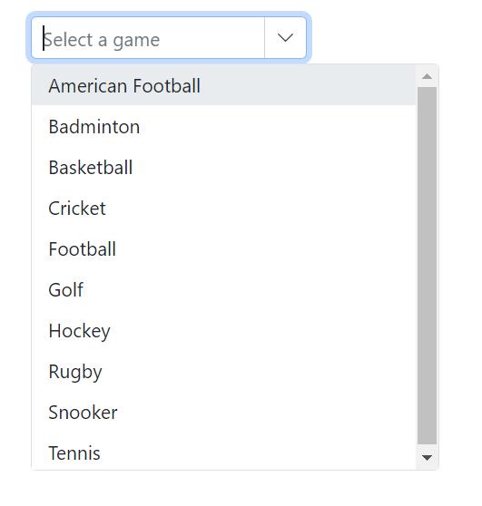
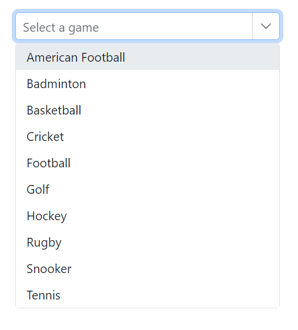
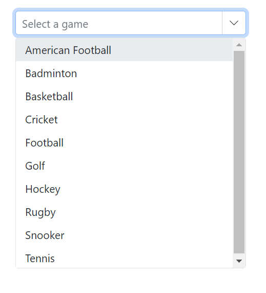
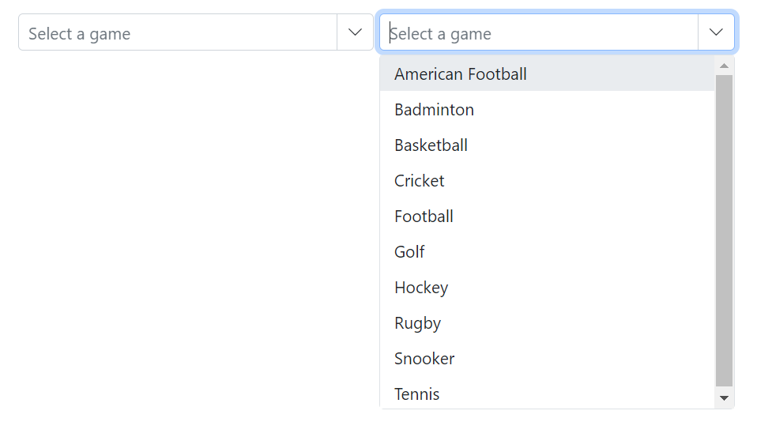
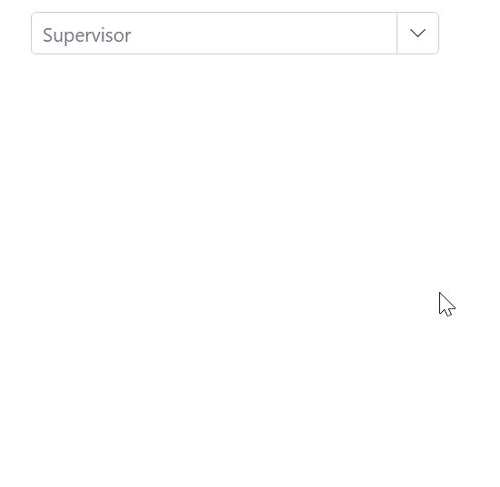

# Popup Setting in ComboBox

## Popup resize

Dynamically adjust the size of the popup by using the [AllowResize](https://help.syncfusion.com/cr/blazor/Syncfusion.Blazor.DropDowns.SfComboBox-2.html#Syncfusion_Blazor_DropDowns_SfComboBox_2_AllowResize) property. When enabled, users can resize the popup to improve visibility and control. The resized dimensions are preserved while the component instance remains active.





 

## Change the popup width

Customize the width of the popup using the [PopupWidth](https://help.syncfusion.com/cr/blazor/Syncfusion.Blazor.DropDowns.SfDropDownList-2.html#Syncfusion_Blazor_DropDowns_SfDropDownList_2_PopupWidth) property. The default value of the `PopupWidth` is `100%`. If popup width unspecified, it sets based on the width of the ComboBox component.

In the following sample, `PopupWidth` is set to `300px`.







## Change the popup height

Customize the height of the popup using the [PopupHeight](https://help.syncfusion.com/cr/blazor/Syncfusion.Blazor.DropDowns.SfDropDownList-2.html#Syncfusion_Blazor_DropDowns_SfDropDownList_2_PopupHeight) property. The default value of the `PopupHeight` is `300px`.

In the following sample, `PopupHeight` is set to `500px`.







## Change the popup z-index

Customize the [ZIndex](https://help.syncfusion.com/cr/blazor/Syncfusion.Blazor.DropDowns.SfDropDownBase-1.html#Syncfusion_Blazor_DropDowns_SfDropDownBase_1_ZIndex) value of the component’s popup element to control stacking order.

Defaults to `1000`.

## Show popup on initial loading

Show the popup when the component is initialized by calling [ShowPopupAsync()](https://help.syncfusion.com/cr/blazor/Syncfusion.Blazor.DropDowns.SfComboBox-2.html#Syncfusion_Blazor_DropDowns_SfComboBox_2_ShowPopupAsync) in the [Created](https://help.syncfusion.com/cr/blazor/Syncfusion.Blazor.DropDowns.ComboBoxEvents-2.html#Syncfusion_Blazor_DropDowns_ComboBoxEvents_2_Created) event.







## Preventing opening and closing

Prevent the popup from opening or closing by setting [BeforeOpenEventArgs.Cancel](https://help.syncfusion.com/cr/blazor/Syncfusion.Blazor.DropDowns.BeforeOpenEventArgs.html#Syncfusion_Blazor_DropDowns_BeforeOpenEventArgs_Cancel) or [PopupEventArgs.Cancel](https://help.syncfusion.com/cr/blazor/Syncfusion.Blazor.DropDowns.PopupEventArgs.html#Syncfusion_Blazor_DropDowns_PopupEventArgs_Cancel) to `true` in the corresponding [OnOpen](https://help.syncfusion.com/cr/blazor/Syncfusion.Blazor.DropDowns.ComboBoxEvents-2.html#Syncfusion_Blazor_DropDowns_ComboBoxEvents_2_OnOpen) and [OnClose](https://help.syncfusion.com/cr/blazor/Syncfusion.Blazor.DropDowns.ComboBoxEvents-2.html#Syncfusion_Blazor_DropDowns_ComboBoxEvents_2_OnClose) events.







The following events are used when opening and closing the popup.

### OnOpen event

The [OnOpen](https://help.syncfusion.com/cr/blazor/Syncfusion.Blazor.DropDowns.ComboBoxEvents-2.html#Syncfusion_Blazor_DropDowns_ComboBoxEvents_2_OnOpen) event triggers before the popup opens. If this event is canceled, the popup remains closed.







### Opened event

The [Opened](https://help.syncfusion.com/cr/blazor/Syncfusion.Blazor.DropDowns.DropDownListEvents-2.html#Syncfusion_Blazor_DropDowns_DropDownListEvents_2_Opened) event triggers when the popup opens.

### OnClose event

The [OnClose](https://help.syncfusion.com/cr/blazor/Syncfusion.Blazor.DropDowns.ComboBoxEvents-2.html#Syncfusion_Blazor_DropDowns_ComboBoxEvents_2_OnClose) event triggers before the popup closes. If this event is canceled, the popup remains open.







### Closed event

The [Closed](https://help.syncfusion.com/cr/blazor/Syncfusion.Blazor.DropDowns.ComboBoxEvents-2.html#Syncfusion_Blazor_DropDowns_ComboBoxEvents_2_Closed) event triggers after the popup has been closed.







## Popup height based on available space

Adjust the popup height based on the available viewport space by handling the window `resize` event and updating the popup element’s height at runtime.













