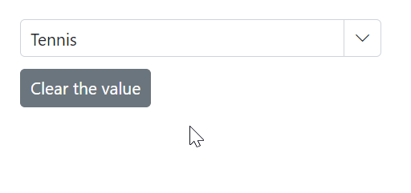

# Selection in ComboBox

## Get selected value

Get the selected value of the ComboBox component in the [ValueChange](https://help.syncfusion.com/cr/blazor/Syncfusion.Blazor.DropDowns.ComboBoxEvents-2.html#Syncfusion_Blazor_DropDowns_ComboBoxEvents_2_ValueChange) event using the [ChangeEventArgs.Value](https://help.syncfusion.com/cr/blazor/Syncfusion.Blazor.DropDowns.ChangeEventArgs-2.html#Syncfusion_Blazor_DropDowns_ChangeEventArgs_2_Value) property.







Get the complete data item for the selected value in the [ValueChange](https://help.syncfusion.com/cr/blazor/Syncfusion.Blazor.DropDowns.ComboBoxEvents-2.html#Syncfusion_Blazor_DropDowns_ComboBoxEvents_2_ValueChange) event using the [ChangeEventArgs.ItemData](https://help.syncfusion.com/cr/blazor/Syncfusion.Blazor.DropDowns.ChangeEventArgs-2.html#Syncfusion_Blazor_DropDowns_ChangeEventArgs_2_ItemData) property.







## Preselected value on OnInitializedAsync

Bind the preselected value to the ComboBox component using the [@bind-Value](https://help.syncfusion.com/cr/blazor/Syncfusion.Blazor.DropDowns.SfComboBox-2.html#Syncfusion_Blazor_DropDowns_SfComboBox_2_Value) attribute. Assign the bound value in the [OnInitializedAsync](https://learn.microsoft.com/en-us/aspnet/core/blazor/components/lifecycle?view=aspnetcore-6.0#component-initialization-oninitializedasync) lifecycle so the component renders with the initial selection.







## Programmatically change the selected value

Change the component value programmatically or externally by using the component instance with the [@ref](https://learn.microsoft.com/en-us/aspnet/core/mvc/views/razor?view=aspnetcore-7.0#ref) attribute. The following sample shows how to set the value in a button click handler.







### ValueChange event

The [ValueChange](https://help.syncfusion.com/cr/blazor/Syncfusion.Blazor.DropDowns.ComboBoxEvents-2.html#Syncfusion_Blazor_DropDowns_ComboBoxEvents_2_ValueChange) event triggers when the value of the ComboBox is changed. The event provides arguments that include the current and previous values.







### OnValueSelect event

The [OnValueSelect](https://help.syncfusion.com/cr/blazor/Syncfusion.Blazor.DropDowns.ComboBoxEvents-2.html#Syncfusion_Blazor_DropDowns_ComboBoxEvents_2_OnValueSelect) event triggers when a value is selected from the popup. Access the selected item via [SelectEventArgs.ItemData](https://help.syncfusion.com/cr/blazor/Syncfusion.Blazor.DropDowns.SelectEventArgs-1.html#Syncfusion_Blazor_DropDowns_SelectEventArgs_1_ItemData). To prevent selection, set [SelectEventArgs.Cancel](https://help.syncfusion.com/cr/blazor/Syncfusion.Blazor.DropDowns.SelectEventArgs-1.html#Syncfusion_Blazor_DropDowns_SelectEventArgs_1_Cancel) to `true`.







## Preselect value with index

Bind the preselected item by index using the [@bind-Index](https://help.syncfusion.com/cr/blazor/Syncfusion.Blazor.DropDowns.SfComboBox-2.html#Syncfusion_Blazor_DropDowns_SfComboBox_2_Index) attribute. The item at the specified index in the data source will be selected.

N> The selection depends on the [SortOrder](https://help.syncfusion.com/cr/blazor/Syncfusion.Blazor.DropDowns.SortOrder.html) setting. If sorting is applied, the index refers to the sorted data.

The following sample shows how to bind the index on initial rendering.







## Autofill the selected value

The [Autofill](https://help.syncfusion.com/cr/blazor/Syncfusion.Blazor.DropDowns.SfComboBox-2.html#Syncfusion_Blazor_DropDowns_SfComboBox_2_Autofill) property enables the input to suggest and fill the first matched item as the user types, based on the data source. If no matches are found, the input remains unchanged. The default value is `false`.





 

## Get selected item by value

Retrieve the full data item corresponding to a selected value by using the [GetDataByValue](https://help.syncfusion.com/cr/blazor/Syncfusion.Blazor.DropDowns.SfComboBox-2.html#Syncfusion_Blazor_DropDowns_SfComboBox_2_GetDataByValue__0_) method.







## Focus the next component on selection

Focus the component programmatically using the [FocusAsync](https://help.syncfusion.com/cr/blazor/Syncfusion.Blazor.DropDowns.SfDropDownList-2.html#Syncfusion_Blazor_DropDowns_SfDropDownList_2_FocusAsync) public method. It will set focus instantly to the ComboBox component when invoking it. 







## Programmatically clear the selected value

To clear the ComboBox value programmatically, use the [ClearAsync](https://help.syncfusion.com/cr/blazor/Syncfusion.Blazor.DropDowns.SfDropDownList-2.html#Syncfusion_Blazor_DropDowns_SfDropDownList_2_ClearAsync) method. This method clears out the selected values from the SfComboBox<TValue, TItem> component and sets the [Value](https://help.syncfusion.com/cr/blazor/Syncfusion.Blazor.DropDowns.SfDropDownList-2.html#Syncfusion_Blazor_DropDowns_SfDropDownList_2_Value) and [Index](https://help.syncfusion.com/cr/blazor/Syncfusion.Blazor.DropDowns.SfDropDownList-2.html#Syncfusion_Blazor_DropDowns_SfDropDownList_2_Index) properties to null.







## Prevent reload on form submit

To prevent page reload when using the ComboBox inside a form, specify the button type as "button" via the `HTMLAttributes` property so the button does not submit the form.







## Programmatically trigger onChange event

Trigger the [ValueChange](https://help.syncfusion.com/cr/blazor/Syncfusion.Blazor.DropDowns.ComboBoxEvents-2.html#Syncfusion_Blazor_DropDowns_ComboBoxEvents_2_ValueChange) event manually using the instance (from the @ref attribute) of [ComboBoxEvents](https://help.syncfusion.com/cr/blazor/Syncfusion.Blazor.DropDowns.ComboBoxEvents-2.html). In the following example, `ValueChange` is invoked inside the `Created` event handler and runs when the component is rendered.







## Programmatically focus in and focus out the component

Use buttons to invoke the `FocusAsync()` and `FocusOutAsync()` methods on the ComboBox instance for programmatic focus management.







While focusing in and out, the following events are triggered.

### Focus event

The [Focus](https://help.syncfusion.com/cr/blazor/Syncfusion.Blazor.DropDowns.ComboBoxEvents-2.html#Syncfusion_Blazor_DropDowns_ComboBoxEvents_2_Focus) event triggers when the component receives focus. 







### Blur event

The [Blur](https://help.syncfusion.com/cr/blazor/Syncfusion.Blazor.DropDowns.ComboBoxEvents-2.html#Syncfusion_Blazor_DropDowns_ComboBoxEvents_2_Blur) event triggers when focus moves out from the component. 





