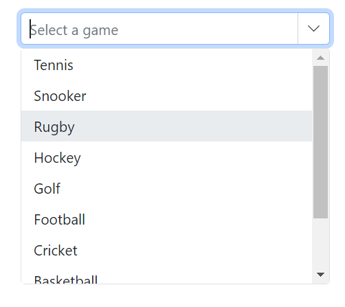

# Sorting in Blazor ComboBox Component

Sorting enables displaying items in ascending or descending order. To enable sorting in the ComboBox, set the [SortOrder](https://help.syncfusion.com/cr/blazor/Syncfusion.Blazor.DropDowns.SfDropDownBase-1.html#Syncfusion_Blazor_DropDowns_SfDropDownBase_1_SortOrder) property to the required value.

The available sort orders are:

SortOrder     | Description
------------ | -------------
  [None](https://help.syncfusion.com/cr/blazor/Syncfusion.Blazor.DropDowns.SortOrder.html#Syncfusion_Blazor_DropDowns_SortOrder_None)       | The data source is not sorted.
  [Ascending](https://help.syncfusion.com/cr/blazor/Syncfusion.Blazor.DropDowns.SortOrder.html#Syncfusion_Blazor_DropDowns_SortOrder_Ascending)     | The data source is sorted in ascending order.
  [Descending](https://help.syncfusion.com/cr/blazor/Syncfusion.Blazor.DropDowns.SortOrder.html#Syncfusion_Blazor_DropDowns_SortOrder_Descending)      | The data source is sorted in descending order.

In the following sample, items in the data source are initially in random order. Use SortOrder to display them alphanumerically in ascending or descending order in the popup.







