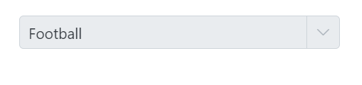
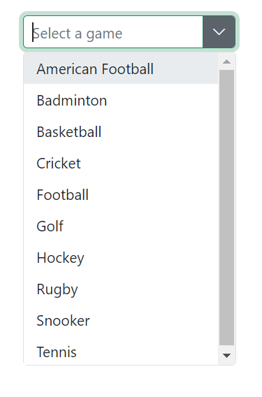
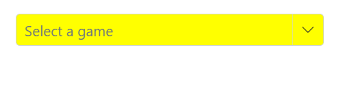
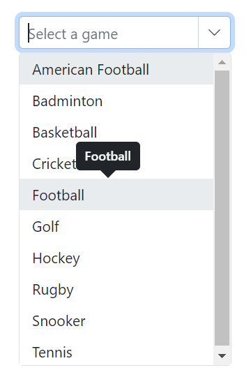
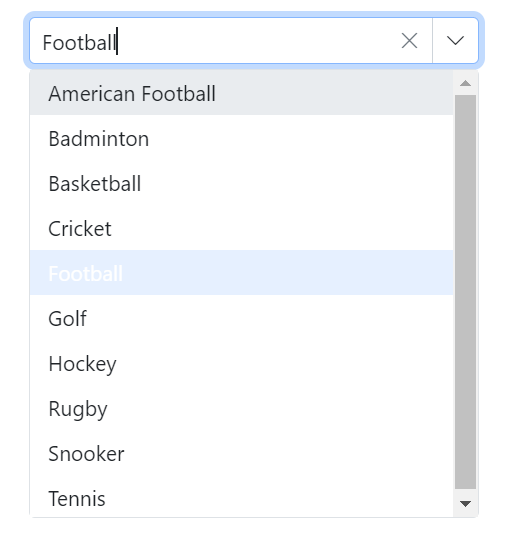

# Style and appearance in Blazor ComboBox Component

The following content provides the exact CSS structure that can be used to modify the control's appearance based on the user preference.

## Read-only mode

Specify the boolean value to the [Readonly](https://help.syncfusion.com/cr/blazor/Syncfusion.Blazor.DropDowns.SfDropDownList-2.html#Syncfusion_Blazor_DropDowns_SfDropDownList_2_Readonly) whether the ComboBox allows the user to change the value or not.









## Disabled state

Specify the boolean value to the [Enabled](https://help.syncfusion.com/cr/blazor/Syncfusion.Blazor.DropDowns.SfDropDownBase-1.html#Syncfusion_Blazor_DropDowns_SfDropDownBase_1_Enabled) property that indicates whether the component is enabled or not.







## CssClass  

Specifies the CSS class name that can be appended to the root element of the ComboBox. One or more custom CSS classes can be added to a ComboBox.

Some of the possible values are:

* `e-success`: Denotes the component in a success state, adding a green color to the ComboBox input field.
* `e-warning`: Denotes the component in a warning state, adding an orange color to the ComboBox input field.
* `e-error`: Denotes the component in an error state, adding a red color to the ComboBox input field.
* `e-outline`: Supports only the material theme.
* `e-multi-column`: Provides two or more columns in the popup, aligning the columns like a grid.





 

## Customizing the disabled component’s text color

You can customize the text color of a disabled component by targeting its CSS class `.e-input[disabled]`, which indicates the input element in a disabled state, and set the desired color to the `-webkit-text-fill-color` property.









## Customizing the appearance of container element

You can customize the appearance of the container element within the ComboBox component by targeting its CSS class `.e-input`, which indicates the parent element of the input, and allows you to apply any desired styles to the component.









## Customizing the dropdown icon’s color

You can customize the dropdown [icon](https://ej2.syncfusion.com/documentation/appearance/icons#material) by targeting its CSS class `.e-ddl-icon.e-icons`, which indicates the icon element displayed within the combobox component, and setting the desired color to the `color` property.









## Customizing the focus color

You can customize the component color when it is focused by targeting its CSS class `.e-input-focus::after`, which indicates the input element when it is focused, and set the desired color to the `background` property.









## Customizing the outline theme's focus color

You can customize the color of the combobox component when it is in a focused state and rendered with an outline theme,  by targeting its CSS class `e-outline` which indicates the input element when it is focused, and allows you to set the desired color to the `color` property.









## Customizing the background color of focus, hover, and active items

You can customize the background color and text color of list items within the combobox component when they are in a focused, active, or hovered state by targeting the CSS classes `.e-list-item.e-item-focus`, `.e-list-item.e-active`, and `.e-list-item.e-hover`, and set the desired color to the background-color and color properties.









## Customizing the appearance of pop-up element

You can customize the appearance of the popup element within the combobox component by targeting the CSS class `.e-list-item.e-item-focus`, which indicates the list item element when it is focused, and and allows you to apply any desired styles to the component.









## Change the HTML attributes

Add the additional html attributes such as styles, class, and more to the root element using the [HTMLAttributes](https://help.syncfusion.com/cr/blazor/Syncfusion.Blazor.DropDowns.SfDropDownList-2.html#Syncfusion_Blazor_DropDowns_SfDropDownList_2_HtmlAttributes) property and accepts n number of attributes in a key-value pair format.







## Show tooltip on list item

You can achieve this behavior by integrating the tooltip component. When the mouse hovers over the ComboBox option, a tooltip appears with information about the hovered list item.

The following code demonstrates how to display a tooltip when hovering over the ComboBox option.







## Customize selected item opacity

In the following code , the CSS style that targets the `.e-list-item` class within the `.e-dropdownbase` class when it is in an active or active and hovered state. It sets the opacity property , which will make the elements appear transparent. This can be used to change the appearance of the dropdown list items when they are in a certain state.

## Disable specific items in DropDownList

Prevent some items in the popup list from selecting. This can be achieved by disabling the item for a specific combobox component by adding the custom class for the popup element using the [CssClass](https://help.syncfusion.com/cr/blazor/Syncfusion.Blazor.DropDowns.SfDropDownList-2.html#Syncfusion_Blazor_DropDowns_SfDropDownList_2_CssClass) property.

In the following code, a single list Item is hidden using js interop.












## Customizing the float label element's focusing color

You can change the text color of the floating label when it is focused by targeting its CSS classes `.e-input-focus` and `.e-float-text.e-label-top`. These classes indicate the floating label text while it is focused and set the desired color using the `color` property.









## Customizing the color of the placeholder text

You can change the color of the placeholder by targeting its CSS class `input.e-input::placeholder`, which indicates the placeholder text, and set the desired color using the `color` property.









## Customizing the placeholder to add mandatory indicator(*)

The mandatory indicator `*` can be applied to the placeholder by targeting its CSS class `.e-float-text::after` using the `content` style.









## Customizing the text selection color

The appearance of a selected item within a combobox component can be customized by targeting the CSS class `input.e-input::selection` and set the desired background color and text color. This customization will only be applied when the item is selected manually. To achieve this, use the `background-color` and `color` properties of the CSS class `input.e-input::selection`.







