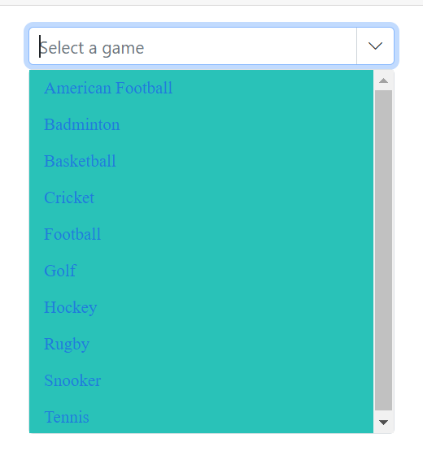

# Style and appearance in Blazor ComboBox Component

The following content provides the CSS structure and options that can be used to modify the component’s appearance based on user preference.

## Read-only mode

Specify the boolean value to the [Readonly](https://help.syncfusion.com/cr/blazor/Syncfusion.Blazor.DropDowns.SfDropDownList-2.html#Syncfusion_Blazor_DropDowns_SfDropDownList_2_Readonly) whether the ComboBox allows the user to change the value or not.









## Disabled state

Specify a boolean value for the [Enabled](https://help.syncfusion.com/cr/blazor/Syncfusion.Blazor.DropDowns.SfDropDownBase-1.html#Syncfusion_Blazor_DropDowns_SfDropDownBase_1_Enabled) property to indicate whether the component is enabled.







## CssClass  

Specifies the CSS class name that can be appended to the root element of the ComboBox. One or more custom CSS classes can be added to a ComboBox.

Some of the possible values are:

-`e-success`: Denotes a success state, applying a green style to the input.
- `e-warning`: Denotes a warning state, applying an orange style to the input.
- `e-error`: Denotes an error state, applying a red style to the input.
- `e-outline`:  Applies outline styles (supported in Material theme).
- `e-multi-column`: Lays out two or more columns in the popup.





 

## Customizing the disabled component’s text color

Customize the text color of a disabled component by targeting its CSS class `.e-input[disabled]`, which indicates the input element in a disabled state, and set the desired color to the `-webkit-text-fill-color` property.









## Customizing the appearance of the container element

Customize the ComboBox container by targeting the `.e-input` selector (the parent of the input), and apply the desired styles.









## Customizing the dropdown icon’s color

Customize the dropdown [icon](https://ej2.syncfusion.com/documentation/appearance/icons#material) by targeting the `.e-ddl-icon.e-icons` selector and setting the desired `color`.









## Customizing the focus color

Customize the component color when it is focused by targeting its CSS class `.e-input-focus::after`, which indicates the input element when it is focused, and set the desired color to the `background` property.









## Customizing the outline theme’s focus color

Customize the color of the combobox component when it is in a focused state and rendered with an outline theme,  by targeting its CSS class `e-outline` which indicates the input element when it is focused, and allows you to set the desired color to the `color` property.









## Customizing the background color of focused, hovered, and active items

Customize background and text colors of list items in focused, hovered, or active states by targeting `.e-list-item.e-item-focus`, `.e-list-item.e-active`, and `.e-list-item.e-hover`, and setting `background-color` and `color`.









## Customizing the appearance of the popup element

Customize the popup’s appearance by targeting list item selectors within the popup and applying the desired styles. For example, use `.e-list-item.e-item-focus` to style a focused list item.









## Change the HTML attributes

Add additional HTML attributes such as styles and class to the root element using the [HtmlAttributes](https://help.syncfusion.com/cr/blazor/Syncfusion.Blazor.DropDowns.SfDropDownBase-1.html#Syncfusion_Blazor_DropDowns_SfDropDownBase_1_HtmlAttributes) property, which accepts any number of key–value pairs.







## Show tooltip on list item

Display a tooltip when hovering over ComboBox options by integrating the Tooltip component and binding it to list items.







## Customize selected item opacity

In the following code , the CSS style that targets the `.e-list-item` class within the `.e-dropdownbase` class when it is in an active or active and hovered state. It sets the opacity property , which will make the elements appear transparent. This can be used to change the appearance of the dropdown list items when they are in a certain state.

## Disable specific items in ComboBox

Prevent certain items from being selected by marking them disabled via a custom class on the popup using the [CssClass](https://help.syncfusion.com/cr/blazor/Syncfusion.Blazor.DropDowns.SfDropDownBase-1.html#Syncfusion_Blazor_DropDowns_SfDropDownBase_1_CssClass) property, and then applying styles or script logic. In the following example, a single list item is disabled using JavaScript interop.












## Customizing the float label element’s focusing color

Change the floating label text color when focused by targeting `.e-input-focus` and `.e-float-text.e-label-top`. These selectors represent the floating label in a focused state; set the desired `color`.









## Customizing the color of the placeholder text

Change the placeholder color by targeting `input.e-input::placeholder` (scope within the ComboBox as needed) and setting the desired `color`.









## Customizing the placeholder to add a mandatory indicator (*)

Append a visual mandatory indicator to the floating placeholder by targeting `.e-float-text::after` and setting the `content` style. This affects appearance only; use form validation to enforce required input.









## Customizing the text selection color

The appearance of a selected item within a combobox component can be customized by targeting the CSS class `input.e-input::selection` and set the desired background color and text color. This customization will only be applied when the item is selected manually. To achieve this, use the `background-color` and `color` properties of the CSS class `input.e-input::selection`.









