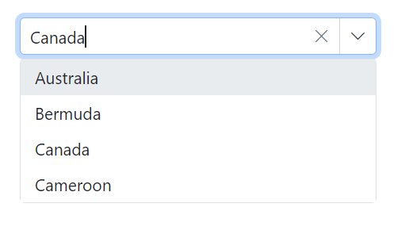
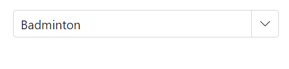
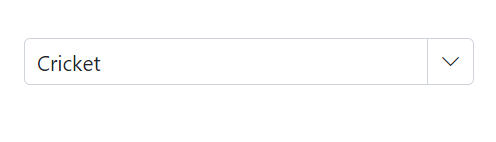
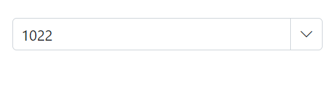
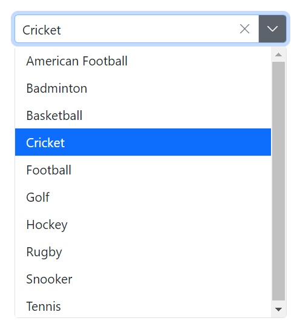
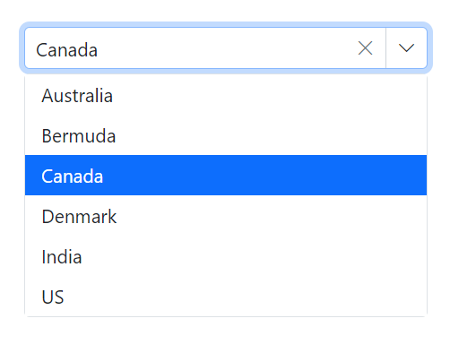
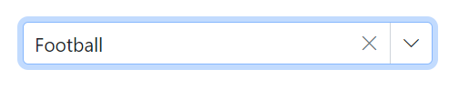

# Value Binding in ComboBox

Value binding is the process of passing values between a component and its parent. There are two methods for binding values.These are.

* bind-Value Binding 
* bind-Index Binding

## Bind value binding

The value binding can be achieved by using the [@bind-Value](https://help.syncfusion.com/cr/blazor/Syncfusion.Blazor.DropDowns.SfDropDownList-2.html#Syncfusion_Blazor_DropDowns_SfDropDownList_2_Value) attribute and it supports `string`, `int`, `enum`, `bool` and `complex types`. If the component value has been changed, it will affect all places where you bind the variable for the `@bind-value` attribute. In order for the binding to work properly, the value assigned to the `@bind-value` attribute should be based on the field mapped to [ComboBoxFieldSettings.Value](https://help.syncfusion.com/cr/blazor/Syncfusion.Blazor.DropDowns.ComboBoxFieldSettings.html#Syncfusion_Blazor_DropDowns_ComboBoxFieldSettings_Value)

* **TValue** - Specifies the type of each list item on the suggestion list.







## Index value binding

The Index value binding is achieved by using the [@bind-Index](https://help.syncfusion.com/cr/blazor/Syncfusion.Blazor.DropDowns.SfDropDownList-2.html#Syncfusion_Blazor_DropDowns_SfDropDownList_2_Index) attribute and it supports int and int nullable types. By using this attribute, bind the values respective to its index.







## Primitive type binding

The ComboBox has support to load array of primitive data such as strings and numbers. Bind the value of primitive data to the [@bind-Value](https://help.syncfusion.com/cr/blazor/Syncfusion.Blazor.DropDowns.SfDropDownList-2.html#Syncfusion_Blazor_DropDowns_SfDropDownList_2_Value) attribute of the ComboBox.

The following code demonstrates array of string as datasource to the ComboBox component.







The following code demonstrates array of int as datasource to the ComboBox component.







## Object binding

Bind the Object data to the [@bind-Value](https://help.syncfusion.com/cr/blazor/Syncfusion.Blazor.DropDowns.SfDropDownList-2.html#Syncfusion_Blazor_DropDowns_SfDropDownList_2_Value) attribute of the ComboBox component, this is, You can map the class name to `TValue`. 

In the following example, the `Name` column has been mapped to the [ComboBoxFieldSettings.Value](https://help.syncfusion.com/cr/blazor/Syncfusion.Blazor.DropDowns.ComboBoxFieldSettings.html#Syncfusion_Blazor_DropDowns_ComboBoxFieldSettings_Value).







## Enum binding

Bind the enum data to the [@bind-Value](https://help.syncfusion.com/cr/blazor/Syncfusion.Blazor.DropDowns.SfDropDownList-2.html#Syncfusion_Blazor_DropDowns_SfDropDownList_2_Value) attribute of ComboBox component. The following code helps you to get a string value from the enumeration data.







## Show or hide clear button

Use the [ShowClearButton](https://help.syncfusion.com/cr/blazor/Syncfusion.Blazor.DropDowns.SfDropDownList-2.html#Syncfusion_Blazor_DropDowns_SfDropDownList_2_ShowClearButton) property to specify whether to show or hide the clear button. When the clear button is clicked, the `Value`, `Text`, and `Index` properties are reset to null.

N> If the TValue is a non nullable type, then while using the clear button, it will set the default value of the data type, and if TValue is set as a nullable type, then while using the clear button it will set to a null value(for example If the TValue is int, then while clearing 0 will set to the component and if TValue is int?, then while clearing null will set to the component)

The following sample demonstrates the `string` used as `TValue`. So, if you clear the value using the clear button, it will be set to null as it's the default value of the respective type.







## Dynamically change TItem

The `TItem` property can be changed dynamically by defining the datasource type of the ComboBox component with the help of the `@typeparam` directive. The following sample demonstration explains how to change  the TItem dynamically with different type of datasource.

### Creating generic combobox component

First, create a `ComboBox.razor` file as a parent component in the `/Pages` folder. Also, add a Parameter property for a List as `<TItem>` and `TValue`.




@using Syncfusion.Blazor.DropDowns

@typeparam TValue;
@typeparam TItem;

<SfComboBox TValue="TValue" Width="300px" TItem="TItem" @bind-Value="@ComboBoxValue" Placeholder="Please select a value" DataSource="@customData">
    <ComboBoxFieldSettings Text="Text" Value="ID"></ComboBoxFieldSettings>
</SfComboBox>

@code {
    [Parameter]
    public List<TItem> customData { get; set; }
    [Parameter]
    public TValue ComboBoxValue { get; set; }
    [Parameter]
    public EventCallback<TValue> ComboBoxValueChanged { get; set; }
}




### Usage of generic component with different type

Then, render the Generic ComboBox component with the required `TValue` and `TItem` in the respective razor components. 

Here, the ComboBox component is rendered with the TValue as a string type in the `/Index.razor` file and the ComboBox component with TValue as an int nullable type in the `/Counter.razor` file.

**[Index.razor]**




<ComboBox TValue="string" TItem="Games" @bind-ComboBoxValue="@value" customData="@LocalData">
</ComboBox>

@code{
    public string value { get; set; } = "Game1";
    public class Games
    {
        public string ID { get; set; }
        public string Text { get; set; }
    }
    List<Games> LocalData = new List<Games> {
        new Games() { ID= "Game1", Text= "American Football" },
        new Games() { ID= "Game2", Text= "Badminton" },
        new Games() { ID= "Game3", Text= "Basketball" },
        new Games() { ID= "Game4", Text= "Cricket" },
        new Games() { ID= "Game5", Text= "Football" },
        new Games() { ID= "Game6", Text= "Golf" },
        new Games() { ID= "Game7", Text= "Hockey" },
        new Games() { ID= "Game8", Text= "Rugby"},
        new Games() { ID= "Game9", Text= "Snooker" },
        new Games() { ID= "Game10", Text= "Tennis"},
    };
}




**[Counter.razor]**



<ComboBox TValue="int?" TItem="Games" @bind-ComboBoxValue="@value" customData="@LocalData">
</ComboBox>

@code{
    public int? value { get; set; } = 3;
    public class Games
    {
        public int? ID { get; set; }
        public string Text { get; set; }
    }
    List<Games> LocalData = new List<Games> {
        new Games() { ID= 1, Text= "American Football" },
        new Games() { ID= 2, Text= "Badminton" },
        new Games() { ID= 3, Text= "Basketball" },
        new Games() { ID= 4, Text= "Cricket" },
        new Games() { ID= 5, Text= "Football" },
        new Games() { ID= 6, Text= "Golf" },
        new Games() { ID= 7, Text= "Hockey" },
        new Games() { ID= 8, Text= "Rugby"},
        new Games() { ID= 9, Text= "Snooker" },
        new Games() { ID= 10, Text= "Tennis"},
    };
}



