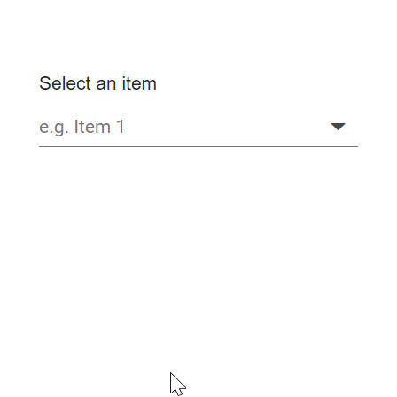
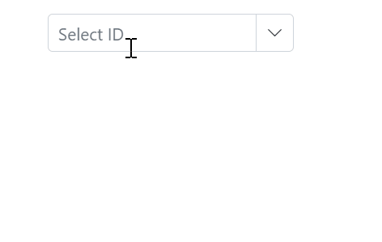

# Virtualization in Blazor ComboBox Component

The ComboBox component includes a virtual scrolling feature designed to enhance UI performance, particularly for handling large datasets. By enabling the [EnableVirtualization](https://help.syncfusion.com/cr/blazor/Syncfusion.Blazor.DropDowns.SfDropDownList-2.html#Syncfusion_Blazor_DropDowns_SfDropDownList_2_EnableVirtualization) option, the ComboBox intelligently manages data rendering, ensuring only a subset of items is initially loaded when the component is rendered. As you interact with the dropdown, additional items are dynamically loaded as you scroll, creating a smooth and efficient user experience.

This feature is applicable to both local and remote data scenarios, providing flexibility in its implementation. For instance, consider a case where the ComboBox is bound to a dataset containing 150 items. Upon opening the dropdown, only a few items are loaded initially, based on the height of the popup. As you scroll through the list, additional items are fetched and loaded on-demand, allowing you to effortlessly explore the complete dataset.

## Local data









## Remote data







## Grouping with Virtualization

The ComboBox supports grouping with virtualization. Items can be organized into categories by mapping the [GroupBy](https://help.syncfusion.com/cr/blazor/Syncfusion.Blazor.DropDowns.ComboBoxFieldSettings.html#Syncfusion_Blazor_DropDowns_ComboBoxFieldSettings_GroupBy) field. After grouping, virtualization behaves like local data binding for a seamless experience. When the data source is remote, an initial request retrieves all data required for grouping; afterward, the grouped data is virtualized similarly to local data.

The following sample shows grouping with virtualization.







## Keyboard interaction

Users can navigate through the virtualized list using the keyboard. Based on key inputs, the next or previous set of items is loaded within the popup. The ComboBox supports the following keyboard shortcuts.

| Key | Action |
|-----|-----|
| `ArrowDown` | Loads the next virtual list item if the selection is on the last item of the current page. |
| `ArrowUp` | Loads the previous virtual list item if the selection is on the first item of the current page. |
| `PageDown` | Loads the next page and selects the last item in it. |
| `PageUp` | Loads the previous page and selects the first item in it. |