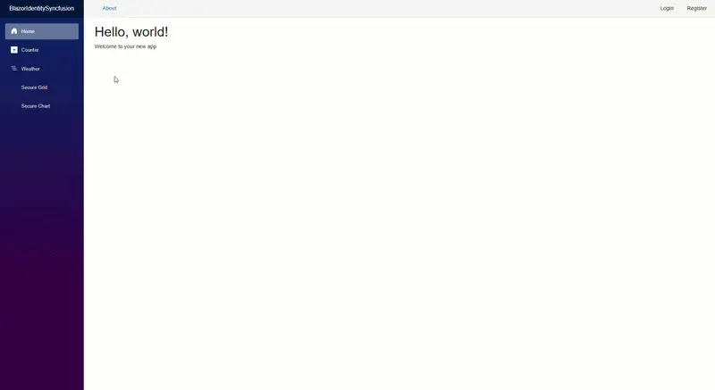

# Securing Blazor Components with ASP.NET Core Identity

[ASP.NET Core Identity](https://learn.microsoft.com/en-us/aspnet/core/security/authentication/identity?view=aspnetcore-10.0&tabs=visual-studio) is the built-in authentication and authorization framework for ASP.NET Core applications. It supports user registration, sign-in, sign-out, password management, roles, and claims, and is commonly used with cookie-based authentication.

This guide explains how to configure ASP.NET Core Identity in a **Blazor Web App using Interactive Server render mode** to secure Blazor components such as **[Blazor DataGrid](https://www.syncfusion.com/blazor-components/blazor-datagrid)** and **[Blazor Charts](https://www.syncfusion.com/blazor-components/blazor-charts)**. It walks you through setting up ASP.NET Core Identity with [SQLite](https://learn.microsoft.com/en-us/ef/core/providers/sqlite/?tabs=dotnet-core-cli) as the data store and adding Blazor components to pages protected by the `[Authorize]` attribute.

## 1. Create a Blazor Web App with Interactive Server

Create a new Blazor Web App configured to use **Interactive Server render mode**. In this mode, the app runs on the server and updates the UI in the browser through a real-time connection, which helps keep your data secure.

`BlazorIdentitySyncfusion` is used as the sample project name in the following commands. Replace it with any project name you prefer.

Run the following commands in your **command-line interface (CLI)**.




dotnet new blazor -o BlazorIdentitySyncfusion --interactivity Server
cd BlazorIdentitySyncfusion




## 2. Install Identity and database packages

Install the necessary NuGet packages that provide ASP.NET Core Identity features and database connectivity. These packages allow your app to store user accounts, manage authentication, and connect to a SQLite database.

**Package overview**

| Package | What it does |
|---------|--------------|
| [Microsoft.AspNetCore.Identity.EntityFrameworkCore](https://www.nuget.org/packages/Microsoft.AspNetCore.Identity.EntityFrameworkCore) | Connects Identity to your database via [Entity Framework Core](https://learn.microsoft.com/en-us/ef/core/), enabling storage of users, passwords (hashed), and roles |
| [Microsoft.AspNetCore.Identity.UI](https://www.nuget.org/packages/Microsoft.AspNetCore.Identity.UI) | Provides ready-made login, registration, and account management pages (Razor Pages) so you don't have to build them from scratch |
| [Microsoft.EntityFrameworkCore.Sqlite](https://www.nuget.org/packages/Microsoft.EntityFrameworkCore.Sqlite) | SQLite database provider. A lightweight database stored as a single file, perfect for development and small applications |
| [Microsoft.EntityFrameworkCore.Design](https://www.nuget.org/packages/Microsoft.EntityFrameworkCore.Design) | Tools for creating and managing database schema changes (migrations) |
| [Microsoft.EntityFrameworkCore.Tools](https://www.nuget.org/packages/Microsoft.EntityFrameworkCore.Tools) | Adds the `dotnet ef` command-line tool for running migration commands |
| [Microsoft.VisualStudio.Web.CodeGeneration.Design](https://www.nuget.org/packages/Microsoft.VisualStudio.Web.CodeGeneration.Design) | Scaffolding tool for customizing Identity Razor Pages (e.g., to override the default login page design) |

Run the following commands inside your project folder.




dotnet add package Microsoft.AspNetCore.Identity.EntityFrameworkCore
dotnet add package Microsoft.AspNetCore.Identity.UI
dotnet add package Microsoft.EntityFrameworkCore.Sqlite
dotnet add package Microsoft.EntityFrameworkCore.Design
dotnet add package Microsoft.EntityFrameworkCore.Tools
dotnet add package Microsoft.VisualStudio.Web.CodeGeneration.Design




## 3. Install Blazor component packages

From the project folder (where the `.csproj` file is located), install the required Blazor packages.

* [Syncfusion.Blazor.Grid](https://www.nuget.org/packages/Syncfusion.Blazor.Grid)
* [Syncfusion.Blazor.Charts](https://www.nuget.org/packages/Syncfusion.Blazor.Charts)
* [Syncfusion.Blazor.Themes](https://www.nuget.org/packages/Syncfusion.Blazor.Themes/)




dotnet add package Syncfusion.Blazor.Grid -v {{ site.releaseversion }}
dotnet add package Syncfusion.Blazor.Charts -v {{ site.releaseversion }}
dotnet add package Syncfusion.Blazor.Themes -v {{ site.releaseversion }}




## 4. Create the database context for Identity users

Create the **ApplicationDbContext** class that connects ASP.NET Core Identity to your database. This class defines how [Entity Framework Core](https://learn.microsoft.com/en-us/ef/core/) stores and manages Identity data such as users, passwords, and roles.

Create a folder named `Data` in the project root (same level as `Program.cs`). Inside that folder, create a file named `ApplicationDbContext.cs` and add the following code.




using Microsoft.AspNetCore.Identity;
using Microsoft.AspNetCore.Identity.EntityFrameworkCore;
using Microsoft.EntityFrameworkCore;

namespace BlazorIdentitySyncfusion.Data;

// Database context for ASP.NET Core Identity (users, roles, claims, etc.)
public class ApplicationDbContext : IdentityDbContext<IdentityUser>
{
    public ApplicationDbContext(DbContextOptions<ApplicationDbContext> options)
        : base(options) { }
}




N> `IdentityDbContext<IdentityUser>` uses the default `IdentityUser` class. You can replace `IdentityUser` with a custom user class (e.g., `ApplicationUser : IdentityUser`) if you need additional properties like `FullName` or `Department`.

## 5. Configure the SQLite connection string

Set up the connection string that specifies where the `SQLite` database should be created. Entity Framework Core uses this connection string to store Identity data.

Open `appsettings.json` and add the `ConnectionStrings` section.




{
  "ConnectionStrings": {
    "DefaultConnection": "Data Source=blazor_identity.db"
  },
  "Logging": {
    "LogLevel": {
      "Default": "Information",
      "Microsoft.AspNetCore": "Warning"
    }
  },
  "AllowedHosts": "*"
}




N> **SQLite** is a simple, file-based database that stores all data in one `.db` file. It is easy to use and works well for development, testing, and learning. For production apps with many users or heavy traffic, consider switching to SQL Server, PostgreSQL, or MySQL.

## 6. Configure application services and middleware

Configure your application by registering essential services and middleware in `Program.cs`. This is the central configuration file where you:
- Connect to the database.
- Enable Identity authentication.
- Register Blazor components.
- Configure the request processing pipeline.

Open `Program.cs` and replace its contents with the following snippets where appropriate.




...
using BlazorIdentitySyncfusion.Data;
using Microsoft.AspNetCore.Identity;
using Microsoft.EntityFrameworkCore;
using Syncfusion.Blazor;
...
// Configure EF Core to use SQLite for Identity data.
builder.Services.AddDbContext<ApplicationDbContext>(options =>
    options.UseSqlite(builder.Configuration.GetConnectionString("DefaultConnection")));

// Configure Identity with the default UI.
builder.Services
    .AddDefaultIdentity<IdentityUser>(options =>
    {
        // Email confirmation is disabled for demo purposes. Enable and configure an email sender in production.
        options.SignIn.RequireConfirmedAccount = false;
    })
    .AddEntityFrameworkStores<ApplicationDbContext>();

// Add Razor Pages (includes Identity UI).
builder.Services.AddRazorPages();

// Enable Blazor authentication state support for CascadingAuthenticationState and AuthorizeRouteView.
builder.Services.AddCascadingAuthenticationState();

// Register Blazor services.
builder.Services.AddSyncfusionBlazor();
...

// Serve static files and enable endpoint routing.
app.UseStaticFiles();
app.UseRouting();

// Enable authentication and authorization middleware (order matters).
app.UseAuthentication();
app.UseAuthorization();

// Enable antiforgery middleware (required for Identity Razor Pages login/logout forms in .NET 8+).
app.UseAntiforgery();

// Map Razor Pages endpoints (includes Identity UI).
app.MapRazorPages();
...




## 7. Import authorization and Blazor namespaces

Add the required namespaces in `Components/_Imports.razor`. These namespaces allow you to use authorization features such as `[Authorize]` and `<AuthorizeView>`, and they enable Blazor components in your Blazor pages.




@using Microsoft.AspNetCore.Authorization
@using Microsoft.AspNetCore.Components.Authorization
@using Syncfusion.Blazor
@using Syncfusion.Blazor.Grids
@using Syncfusion.Blazor.Charts




## 8. Add styles and script resources

Before adding the stylesheet, ensure no other Blazor theme CSS (for example, `bootstrap5.css` or `tailwind.css`) is referenced to avoid conflicts.

Add the following Blazor stylesheet and script references to `~/App.razor`.




<head>
    ....
    <!-- Blazor theme stylesheet -->
    <link href="_content/Syncfusion.Blazor.Themes/fluent2.css" rel="stylesheet" />
</head>

<body>
    ....
    <!-- Blazor core script (required for UI components, including DataGrid and Charts) -->
    
</body>




## 9. Create the `_LoginPartial.cshtml` file for Identity UI

The `_LoginPartial.cshtml` file displays login, logout, register, and account management links for ASP.NET Core Identity. It appears in the navigation bar and automatically updates based on the user's sign-in status.

In the project root (next to `Program.cs`), create a `Pages` folder and add a `Shared` subfolder. Inside the `Shared` folder, create a file named `_LoginPartial.cshtml` and add the following content.




@using Microsoft.AspNetCore.Identity
@inject SignInManager<IdentityUser> SignInManager
@inject UserManager<IdentityUser> UserManager

<ul class="navbar-nav">
@if (SignInManager.IsSignedIn(User))
{
    <li class="nav-item">
        <a class="nav-link text-dark" asp-area="Identity" asp-page="/Account/Manage/Index" title="Manage">
            Hello @User.Identity?.Name!
        </a>
    </li>
    <li class="nav-item">
        <form class="form-inline" asp-area="Identity" asp-page="/Account/Logout"
              asp-route-returnUrl="~/" method="post">
            <button type="submit" class="nav-link btn btn-link text-dark">Logout</button>
        </form>
    </li>
}
else
{
    <li class="nav-item">
        <a class="nav-link text-dark" asp-area="Identity" asp-page="/Account/Register">Register</a>
    </li>
    <li class="nav-item">
        <a class="nav-link text-dark" asp-area="Identity" asp-page="/Account/Login">Login</a>
    </li>
}
</ul>




Create a file named `_ViewImports.cshtml` inside the `Pages` folder and add the following code. This enables Tag Helpers for all Razor Pages, including the Identity UI pages.




@addTagHelper *, Microsoft.AspNetCore.Mvc.TagHelpers




## 10. Configure the Blazor router with authorization support

To apply authorization for Blazor components, update the router in `App.razor`. This ensures that pages marked with `[Authorize]` require authentication before rendering.

Replace the existing `<body>` section in `App.razor` with the following:

* Wrap the router in `<CascadingAuthenticationState>` so Blazor can pass authentication information to all components.
* Replace `<RouteView>` with `<AuthorizeRouteView>` so pages can show different content based on the user's sign-in status.
* Keep the `<NotAuthorized>` and `<Authorizing>` sections to display messages to the user when needed.




<body>
    <CascadingAuthenticationState>
        <Router AppAssembly="@typeof(App).Assembly">
            <Found Context="routeData">
                <AuthorizeRouteView RouteData="@routeData" DefaultLayout="@typeof(MainLayout)">
                    <NotAuthorized>
                        

                            You are not authorized. Please
                            <a href="/Identity/Account/Login">log in</a>.
                        

                    </NotAuthorized>
                    <Authorizing>
                        
Authorizing...

                    </Authorizing>
                </AuthorizeRouteView>
                <FocusOnNavigate RouteData="@routeData" Selector="h1" />
            </Found>
            <NotFound>
                <LayoutView Layout="@typeof(MainLayout)">
                    
Sorry, there’s nothing at this address.

                </LayoutView>
            </NotFound>
        </Router>
    </CascadingAuthenticationState>

    <ReconnectModal />
    ...

</body>




N> `<ReconnectModal />` is a custom component for handling SignalR reconnection UI. If your template does not include it, you can remove this line.

## 11. Add authentication UI to the main layout

Update your main layout to display authentication options in the header. The `<AuthorizeView>` component will display different links depending on whether the user is signed in. This gives users an easy way to access login, logout, register, or manage account pages.

Open `Components/Layout/MainLayout.razor` and replace its content with the following. 

N> This example uses Bootstrap classes (`d-flex`, `ms-auto`, `gap-3`). If your project uses different styling, adjust the CSS classes accordingly.




@inherits LayoutComponentBase
@using Microsoft.AspNetCore.Components.Authorization

    

        <NavMenu />
    

    <main>
        

            <a href="https://learn.microsoft.com/aspnet/core/" target="_blank">About</a>

            

                <AuthorizeView>
                    <Authorized>
                        Hello @context.User.Identity?.Name
                        <a class="nav-link text-dark" href="/Identity/Account/Manage/Index" title="Manage">Manage</a>
                        <a class="nav-link text-dark" href="/Identity/Account/Logout">Logout</a>
                    </Authorized>

                    <NotAuthorized>
                        <a class="nav-link text-dark" href="/Identity/Account/Login">Login</a>
                        <a class="nav-link text-dark" href="/Identity/Account/Register">Register</a>
                    </NotAuthorized>
                </AuthorizeView>
            

        

        <article class="content px-4">
            @Body
        </article>
    </main>

....




## 12. Create the secure Blazor DataGrid and Charts pages

Create two protected Razor pages named `SecureGrid.razor` and `SecureChart.razor` inside the `Components/Pages` folder. Apply the `[Authorize]` attribute to both pages and use them to display the Blazor DataGrid and Charts components respectively.

### Add Blazor DataGrid component

This component displays a sample order list using [Blazor DataGrid](https://www.syncfusion.com/blazor-components/blazor-datagrid). The `@attribute [Authorize]` directive ensures only authenticated users can access this page.




@page "/secure-grid"
@attribute [Authorize]
@rendermode InteractiveServer

<PageTitle>Secure Grid</PageTitle>
<h1>Orders (Authorized users only)</h1>

<SfGrid DataSource="@Orders">
    <GridColumns>
        <GridColumn Field=@nameof(Order.OrderID) HeaderText="Order ID" TextAlign="TextAlign.Right" Width="120" />
        <GridColumn Field=@nameof(Order.CustomerID) HeaderText="Customer" Width="150" />
        <GridColumn Field=@nameof(Order.OrderDate) HeaderText="Order Date" Format="d" Type="ColumnType.Date" Width="140" />
        <GridColumn Field=@nameof(Order.Freight) HeaderText="Freight" Format="C2" TextAlign="TextAlign.Right" Width="120" />
    </GridColumns>
</SfGrid>

@code {
    public List<Order> Orders { get; set; } = default!;

    protected override void OnInitialized()
    {
        Orders = Enumerable.Range(1, 12).Select(i => new Order {
            OrderID = 1000 + i,
            CustomerID = new[] { "ALFKI","ANATR","ANTON","BLONP","BOLID" }[Random.Shared.Next(5)],
            OrderDate = DateTime.Today.AddDays(-i),
            Freight = Math.Round(25 + 15 * Random.Shared.NextDouble(), 2)
        }).ToList();
    }

    public class Order
    {
        public int OrderID { get; set; }
        public string? CustomerID { get; set; }
        public DateTime OrderDate { get; set; }
        public double Freight { get; set; }
    }
}




### Add Blazor Charts component

This component displays a column chart showing monthly sales data.




@page "/secure-chart"
@attribute [Authorize]
@rendermode InteractiveServer

<PageTitle>Secure Chart</PageTitle>
<h1>Monthly Sales (Authorized users only)</h1>

<SfChart Title="Sales (USD)">
    <ChartPrimaryXAxis ValueType="Syncfusion.Blazor.Charts.ValueType.Category"></ChartPrimaryXAxis>
    <ChartSeriesCollection>
        <ChartSeries DataSource="@Data"
                     XName="Month" YName="Amount"
                     Type="Syncfusion.Blazor.Charts.ChartSeriesType.Column"
                     Name="Sales" />
    </ChartSeriesCollection>
</SfChart>

@code {
    public List<Point> Data { get; set; } = new()
    {
        new("Jan", 42500), new("Feb", 39100), new("Mar", 45900),
        new("Apr", 54400), new("May", 49350), new("Jun", 61200)
    };

    public record Point(string Month, double Amount);
}




## 13. Add secure links to the left navigation menu

Update the navigation menu to include links to the secured pages. This makes them easily accessible from any page in the application. When users click these links, they can access the pages if logged in, or will be redirected to the login page if they are not authenticated.

Open `Components/Layout/NavMenu.razor` and add the following navigation items after the existing menu links.



...

    <NavLink class="nav-link" href="secure-grid">
         Secure Grid
    </NavLink>

    <NavLink class="nav-link" href="secure-chart">
         Secure Chart
    </NavLink>




## 14. Generate and apply EF Core migrations

Create the database tables required for ASP.NET Core Identity by running Entity Framework Core migrations. Migrations generate the schema and apply it to your SQLite database.

If you have not installed the EF Core command-line tools, install them first.




dotnet tool install --global dotnet-ef




Then create the migration and update the database.




dotnet ef migrations add CreateIdentitySchema
dotnet ef database update




After these commands run, the SQLite database will include the Identity tables such as `AspNetUsers`, `AspNetRoles`, and others used for authentication.

N> If you receive an error that a migration with this name already exists, you can either delete the existing migration or choose a different name such as `InitialIdentitySetup`.

## 15. Run the application and validate authentication flow

Run the application and verify the authentication flow.




dotnet run




1. Open a browser and navigate to the URL shown in the terminal output (typically `https://localhost:5001` or `https://localhost:7xxx`).
2. Click **Secure Grid** or **Secure Chart** in the left navigation.
3. You will be redirected to the Identity login page (`/Identity/Account/Login`) because you are not authenticated.
4. Click **Register** and create a new account (email and password).
5. After registration, you will be automatically logged in.
6. Navigate back to **Secure Grid** or **Secure Chart** - the pages should now render successfully with Blazor components.
7. Click **Logout** to end the session and verify that accessing the secure pages redirects back to the login page.

**Output:**

## See also

* [Getting started with Blazor DataGrid](https://blazor.syncfusion.com/documentation/datagrid/getting-started-with-web-app)
* [Getting started with Blazor Charts](https://blazor.syncfusion.com/documentation/chart/getting-started-with-web-app)