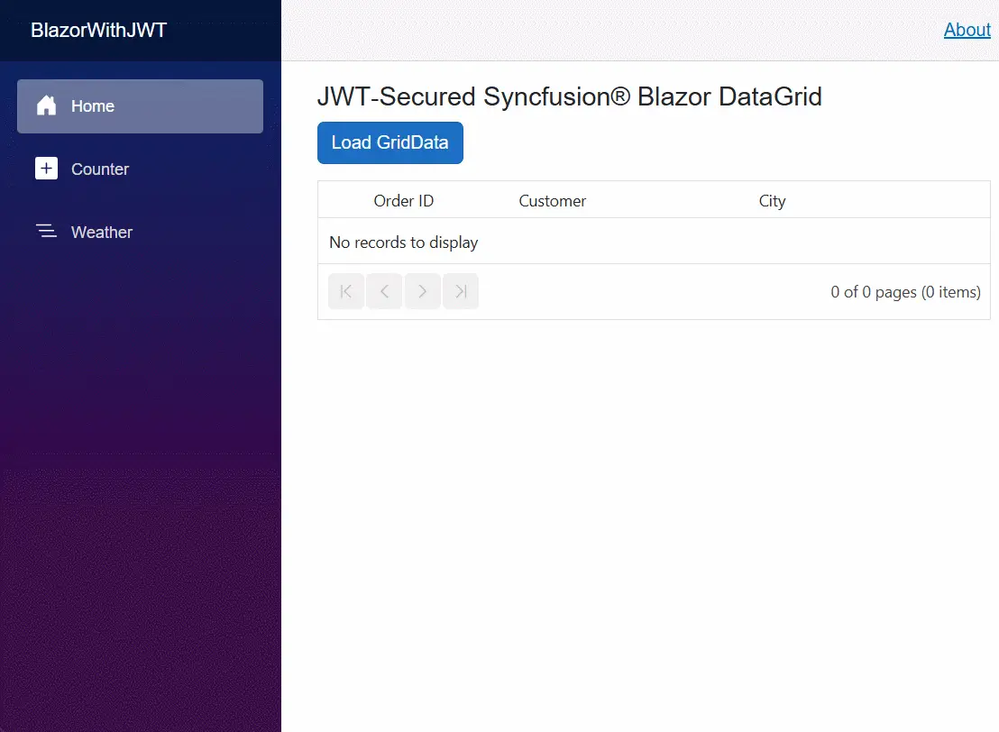

# Securing Syncfusion® Blazor DataGrid with JWT Authentication

This guide shows how to secure the [Syncfusion® Blazor DataGrid](https://www.syncfusion.com/blazor-components/blazor-datagrid) in a **Blazor Web App** with **Interactive Server** using **JWT (JSON Web Token)** authentication.

## What is JWT (JSON Web Token)?

A JSON Web Token (JWT) is a compact, digitally signed string that identifies a user and authorizes API calls. It has three parts:

- **Header** – specifies the token type and the signing algorithm used.
- **Payload** – contains claims (e.g., `sub`, `name`, `role`, `exp`).
- **Signature** – computed using the header, payload, and secret (or private key) to prevent tampering.

## Why use JWT in Blazor?

Syncfusion® Blazor components make HTTP requests to your API internally. JWT allows each request to carry a trusted identity and prevents unauthorized access without relying on server-side session state.

**Benefits of using JWT in Blazor applications**

JWT allows users to log in once and securely access APIs, controls features based on user roles, maintain authentication while navigating between pages, ensure secure communication between client and server, and supports large‑scale applications without storing login sessions on the server.

## Implementing JWT Authorization for Syncfusion® Blazor DataGrid

Configure JWT based authorization to secure backend APIs used by the Syncfusion® Blazor DataGrid in a Blazor App, ensuring that each DataGrid request includes a valid bearer token for authorized access.

### Create a Blazor project

If you already have a Blazor project configured, you can skip this section and proceed to **Install required packages**.

Otherwise, create a new Blazor application by following the **Syncfusion getting started guides** [Blazor Web App (Interactive Server)](https://blazor.syncfusion.com/documentation/getting-started/blazor-web-app)

Ensure that **HTTPS is enabled** during project creation, as JWT based authorization requires secure communication.

### Install required packages

Open the NuGet Package Manager in Visual Studio from (*Tools → NuGet Package Manager → Manage NuGet Packages for Solution*), and install the required package.

**Syncfusion packages:**

- [Syncfusion.Blazor.Grid](https://www.nuget.org/packages/Syncfusion.Blazor.Grid/)- [Syncfusion.Blazor.Themes](https://www.nuget.org/packages/Syncfusion.Blazor.Themes/).

**JWT package:**

- [Microsoft.AspNetCore.Authentication.JwtBearer](https://www.nuget.org/packages/Microsoft.AspNetCore.Authentication.JwtBearer)

### Add Syncfusion® namespaces

Open the `~/_Imports.razor` file and import the Syncfusion® namespaces.




@using Syncfusion.Blazor
@using Syncfusion.Blazor.Grids
@using Syncfusion.Blazor.Data




### Add stylesheet and script resources

Include the theme stylesheet and script references in the `App.razor` file.




<head>
    <!-- Syncfusion theme stylesheet -->
    <link href="_content/Syncfusion.Blazor.Themes/fluent2.css" rel="stylesheet" />
</head>

<body>
    <!-- Syncfusion Blazor DataGrid component's script reference -->
    
</body>




### Configuring JWT in appsettings.json

The JWT configuration specifies how the server signs and validates authentication tokens.




{
  "Jwt": {
    "Key": "REPLACE_WITH_A_LONG_RANDOM_SECRET_32+_CHARS", 
    "Issuer": "BlazorJWT",
    "Audience": "BlazorJWTClient"
  }
}




N> For production environments, do not store secrets directly in `appsettings.json`. Use environment variables or a secure secret store such as **Azure Key Vault** to protect sensitive information.

### Generating a JWT token

This section demonstrates how to generate a JWT token on the server by using a custom **TokenService** class.




using System.IdentityModel.Tokens.Jwt;
using System.Security.Claims;
using System.Text;
using Microsoft.IdentityModel.Tokens;
using Microsoft.Extensions.Configuration;

namespace YourProjectName.Services 
{
    public class TokenService
    {
        private readonly IConfiguration _config;
        public TokenService(IConfiguration config) => _config = config;

        public string IssueToken(string subjectUserId, string? name = null)
        {
            var issuer = _config["Jwt:Issuer"]!;
            var audience = _config["Jwt:Audience"]!;
            var key = new SymmetricSecurityKey(Encoding.UTF8.GetBytes(_config["Jwt:Key"]!));
            var creds = new SigningCredentials(key, SecurityAlgorithms.HmacSha256);

            var claims = new List<Claim>
            {
                new(JwtRegisteredClaimNames.Sub, subjectUserId),
                new(JwtRegisteredClaimNames.Jti, Guid.NewGuid().ToString()),
            };

            if (!string.IsNullOrWhiteSpace(name))
            {
                claims.Add(new Claim(ClaimTypes.Name, name));
            }

            var token = new JwtSecurityToken(
                issuer: issuer,
                audience: audience,
                claims: claims,
                notBefore: DateTime.UtcNow.AddMinutes(-1),
                expires: DateTime.UtcNow.AddMinutes(30),
                signingCredentials: creds);
            return new JwtSecurityTokenHandler().WriteToken(token);
        }
    }
}




### Getting the token

This section describes how the application issues a JSON Web Token (JWT) for authenticated access. The **AuthController** class provides an API endpoint that generates and returns a JWT for the requesting user.




using YourProjectName.Services;
using Microsoft.AspNetCore.Mvc;

namespace YourProjectName.Controllers;

[ApiController]
[Route("api/[controller]")]
public class AuthController : ControllerBase
{
    private readonly TokenService _tokenService;
    public AuthController(TokenService tokenService) => _tokenService = tokenService;

    [HttpPost("token")]
    public IActionResult Token([FromQuery] string user = "user123")
    {
        var jwt = _tokenService.IssueToken(user, name: user);
        return Ok(new { token = jwt });
    }
}




### Adding JWT middleware

Register JWT authentication and authorization middleware to validate incoming API requests. Add these configurations in `Program.cs`.




using System.Text;
using YourProjectName.Components;
using YourProjectName.Services;
using Microsoft.AspNetCore.Authentication.JwtBearer;
using Microsoft.IdentityModel.Tokens;
using Syncfusion.Blazor;

var builder = WebApplication.CreateBuilder(args);

builder.Services.AddRazorComponents()
    .AddInteractiveServerComponents();
builder.Services.AddControllers();
builder.Services.AddHttpClient();
builder.Services.AddSyncfusionBlazor();

var jwtKey = builder.Configuration["Jwt:Key"] ?? throw new InvalidOperationException("Jwt:Key missing");

builder.Services
    .AddAuthentication(JwtBearerDefaults.AuthenticationScheme)
    .AddJwtBearer(options =>
    {
        options.TokenValidationParameters = new TokenValidationParameters
        {
            ValidateIssuer = true,
            ValidateAudience = true,
            ValidateIssuerSigningKey = true,
            ValidateLifetime = true,
            ClockSkew = TimeSpan.FromMinutes(5),
            ValidIssuer = builder.Configuration["Jwt:Issuer"],
            ValidAudience = builder.Configuration["Jwt:Audience"],
            IssuerSigningKey = new SymmetricSecurityKey(Encoding.UTF8.GetBytes(jwtKey))
        };
    });

builder.Services.AddAuthorization();
builder.Services.AddSingleton<TokenService>();

var app = builder.Build();

app.UseHttpsRedirection();
app.UseStaticFiles();
app.UseAuthentication();
app.UseAuthorization();
app.UseAntiforgery();
app.MapControllers();
app.MapRazorComponents<App>()
   .AddInteractiveServerRenderMode();
app.Run();




### Create sample data model

Create sample records for the DataGrid in `~/Models/OrdersDetails.cs` file.




namespace YourProjectName.Models;  

public class OrdersDetails
{
    public int OrderID { get; set; }
    public string? CustomerID { get; set; }
    public string? ShipCity { get; set; }
    public string? ShipCountry { get; set; }
    private static List<OrdersDetails>? _data;
    public static List<OrdersDetails> GetAllRecords()
    {
        if (_data is null)
        {
            _data = Enumerable.Range(1, 50).Select(i => new OrdersDetails
            {
                OrderID = i,
                CustomerID = $"CUST-{i:000}",
                ShipCity = i % 2 == 0 ? "Chennai" : "Bengaluru",
                ShipCountry = "India"
            }).ToList();
        }
        return _data;
    }
}




### Protecting the Syncfusion® Blazor DataGrid API

This section explains how the Syncfusion® Blazor DataGrid API endpoint is secured to allow access only to authenticated requests. The `Authorize` attribute enforces token based access to Grid data.




using YourProjectName.Models;  
using Microsoft.AspNetCore.Authorization;
using Microsoft.AspNetCore.Mvc;
using Syncfusion.Blazor.Data;

namespace YourProjectName.Controllers;

[ApiController]
[Route("api/[controller]")]
[Authorize]
[IgnoreAntiforgeryToken] // DataManager uses bearer token authentication; antiforgery tokens are not applicable for API endpoints using JWT.
public class GridController : ControllerBase
{
    [HttpPost]
    public IActionResult Post([FromBody] DataManagerRequest dm)
    {
        var data = OrdersDetails.GetAllRecords().AsQueryable();
        var total = data.Count();
        return Ok(new { result = data.ToList(), count = total });
    }
}




### Adding JWT to Syncfusion® Blazor DataManager headers

Attach the JWT token to HTTP headers so the **DataManager** can send authenticated requests.




@page "/"
@using Syncfusion.Blazor
@using Syncfusion.Blazor.Grids
@using Syncfusion.Blazor.Data
@using YourProjectName.Models
@inject HttpClient Http
@inject NavigationManager Nav

<h3>JWT + Syncfusion DataGrid (Click to Load)</h3>

<button class="btn btn-primary" @onclick="LoadGridWithToken">Load GridData</button>

<SfGrid TValue="OrdersDetails" @ref="grid" AllowPaging="true" AllowSorting="true" Width="100%">
    // Only render the DataManager after the token is fetched.
    @if (isDataManagerEnabled)
    {
        <SfDataManager Url="api/grid" Adaptor="Adaptors.UrlAdaptor" Headers="HeaderData" />
    }
    <GridColumns>
        <GridColumn Field=@nameof(OrdersDetails.OrderID) HeaderText="Order ID" Width="120" TextAlign="TextAlign.Center" />
        <GridColumn Field=@nameof(OrdersDetails.CustomerID) HeaderText="Customer" Width="150" />
        <GridColumn Field=@nameof(OrdersDetails.ShipCity) HeaderText="City" Width="150" />
    </GridColumns>
</SfGrid>

@code {
    private SfGrid<OrdersDetails>? grid;
    // DataManager is enabled only after token is retrieved.
    private bool isDataManagerEnabled = false;
    private string? jwt;
    private string? error;
    private IDictionary<string, string> HeaderData => new Dictionary<string, string>
    {
        ["Authorization"] = string.IsNullOrEmpty(jwt) ? "" : $"Bearer {jwt}"
    };
    // Ensure jwt is set before the DataManager is rendered; otherwise headers may be empty.
    private async Task LoadGridWithToken()
    {
        error = null;
        try
        {
            var baseUri = new Uri(Nav.BaseUri);
            var tokenRes = await Http.PostAsync(new Uri(baseUri, "api/auth/token?user=username"), content: null);
            tokenRes.EnsureSuccessStatusCode();
            var json = await tokenRes.Content.ReadFromJsonAsync<Dictionary<string, string>>();
            jwt = json!["token"];
            isDataManagerEnabled = true;
            StateHasChanged();
            await Task.Yield();
            if (grid is not null)
            {
                await grid.Refresh(); // Triggers the first data request using the DataManager and headers.
            }
        }
        catch (Exception ex)
        {
            error = ex.Message;
            isDataManagerEnabled = false;
        }
    }
}




The complete application flow ensures the **DataGrid** loads only after the user is authenticated using a valid JWT.

## See also

- [Configure JWT bearer authentication in ASP.NET Core](https://learn.microsoft.com/en-us/aspnet/core/security/authentication/configure-jwt-bearer-authentication?view=aspnetcore-10.0)

- [Getting started with Blazor DataGrid in Web app](https://blazor.syncfusion.com/documentation/datagrid/getting-started-with-web-app)