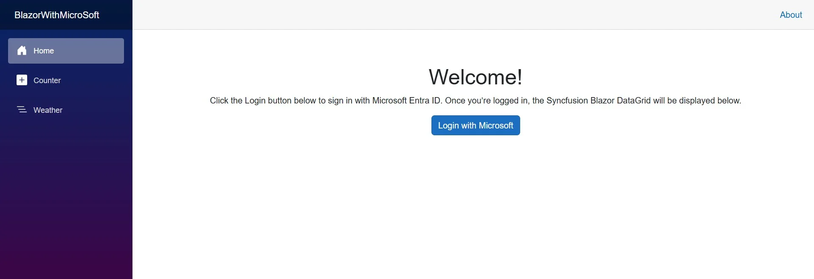
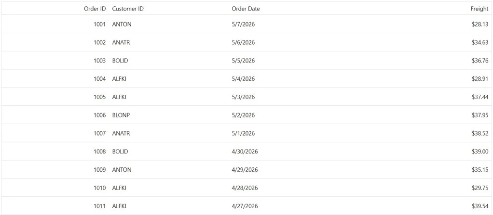

# Securing Syncfusion® Blazor DataGrid with Microsoft Entra ID

This guide shows how to secure the [Syncfusion® Blazor DataGrid](https://www.syncfusion.com/blazor-components/blazor-datagrid) in a **Blazor Web App** with **Interactive Server** using [Microsoft Entra ID](https://www.microsoft.com/en-us/security/business/identity-access/microsoft-entra-id) (formerly Azure Active Directory) authentication.

## Create a Blazor project

If you already have a Blazor project configured, you can skip this section and proceed to [Install required packages](../authentication/blazor-microsoft-entra-id#install-required-packages).

Otherwise, create a new Blazor application by following the [Syncfusion® getting started guide](https://blazor.syncfusion.com/documentation/getting-started/blazor-web-app) for a **Blazor Web App (Interactive Server)**.

Ensure that **HTTPS is enabled** during project creation, as Microsoft Entra ID based authorization requires secure communication.

## Install required packages

Install the following NuGet packages to use the **Syncfusion® Blazor DataGrid** and enable authentication with **Microsoft Entra ID**.

**Syncfusion® packages:**

- [Syncfusion.Blazor.Grid](https://www.nuget.org/packages/Syncfusion.Blazor.Grid/)
- [Syncfusion.Blazor.Themes](https://www.nuget.org/packages/Syncfusion.Blazor.Themes/)

**Microsoft Identity packages:**

- [Microsoft.Identity.Web](https://www.nuget.org/packages/Microsoft.Identity.Web)
- [Microsoft.Identity.Web.UI](https://www.nuget.org/packages/Microsoft.Identity.Web.UI)

You can install the required packages by using the following .NET CLI commands.




dotnet add package Syncfusion.Blazor.Grid -v {{ site.releaseversion }}
dotnet add package Syncfusion.Blazor.Themes -v {{ site.releaseversion }}
dotnet add package Microsoft.Identity.Web
dotnet add package Microsoft.Identity.Web.UI 




## Add Syncfusion® namespaces

Open the `~/_Imports.razor` file and import the Syncfusion® namespaces.




@using Syncfusion.Blazor
@using Syncfusion.Blazor.Grids




## Add stylesheet and script resources

Include the theme stylesheet and script references in the `App.razor` file.




<head>
    ....
    <!-- Syncfusion® theme stylesheet -->
    <link href="_content/Syncfusion.Blazor.Themes/fluent2.css" rel="stylesheet" />
    ....
</head>

<body>
    ....
    <!-- Syncfusion® Blazor core script (required for UI components, including DataGrid) -->
    
    ....
</body>




## Register your app in Microsoft Entra ID (Azure Portal)

This step registers the Blazor application in Azure so Microsoft Entra ID can authenticate users.

1. Open [Azure Portal](https://portal.azure.com).
2. Go to **Microsoft Entra ID** → **App registrations**.
3. Click **New registration**.
4. Enter **App name** and under **Supported account types**, select **Single tenant** (for users within your organization only).
5. Click **Register**.

After registration, note the following values:
- **Application (Client) ID**
- **Directory (Tenant) ID**

These values are required in the application configuration.

## Configure redirect URLs

Redirect URLs specify where **Microsoft Entra ID** should return the user after a successful login.

1. Open the registered application in Azure Portal.
2. Navigate to **Authentication**.
3. Click **Add a platform** and select **Web**.
4. Add the redirect URL: `https://localhost:5001/signin-oidc` *(Replace **5001** with your application's actual HTTPS port number from `launchSettings.json` if different)*.
5. Enable **ID tokens**.
6. Save the changes.

## Configure Azure AD settings

This step stores **Microsoft Entra ID** configuration values so the Blazor App can read them at runtime. After copying the **Tenant ID** and **Client ID**, update the `appsettings.json` file as shown below.




"AzureAd": {
  "Instance": "https://login.microsoftonline.com/",
  "TenantId": "<tenant-id>",
  "ClientId": "<client-id>",
  "CallbackPath": "/signin-oidc"
}




## Configure Microsoft Entra ID authentication in Blazor

This step enables OpenID Connect authentication in the Blazor application by configuring **Microsoft Entra ID** settings in the `Program.cs` file.




using YourProjectName.Components;
using Microsoft.Identity.Web;
using Microsoft.Identity.Web.UI;
using Microsoft.AspNetCore.Authentication.OpenIdConnect;
using Syncfusion.Blazor;

var builder = WebApplication.CreateBuilder(args);

// Configure authentication with Microsoft Entra ID (Azure AD).
builder.Services.AddAuthentication(OpenIdConnectDefaults.AuthenticationScheme)
  .AddMicrosoftIdentityWebApp(builder.Configuration.GetSection("AzureAd"));

builder.Services.AddAuthorization();

builder.Services.AddRazorComponents()
  .AddInteractiveServerComponents();

// Register the Syncfusion® Blazor service.
builder.Services.AddSyncfusionBlazor();

// Add controllers with UI endpoints for Microsoft Identity (SignIn/SignOut).
builder.Services.AddControllersWithViews().AddMicrosoftIdentityUI();

var app = builder.Build();

// Configure the HTTP request pipeline.
if (!app.Environment.IsDevelopment())
{
  app.UseExceptionHandler("/Error", createScopeForErrors: true);
  app.UseHsts();
}

app.UseStatusCodePagesWithReExecute("/not-found", createScopeForStatusCodePages: true);
app.UseHttpsRedirection();
app.MapStaticAssets();
app.UseAuthentication();
app.UseAuthorization();
app.UseAntiforgery();
app.MapControllers();
app.MapRazorComponents<App>()
  .AddInteractiveServerRenderMode();
app.Run();




## Enabling authentication state in Blazor

This step allows Blazor components to access the current user’s authentication state by configuring the `~/Components/Routes.razor` file.




@using Microsoft.AspNetCore.Components.Authorization

<CascadingAuthenticationState>
	<Router AppAssembly="typeof(Program).Assembly" NotFoundPage="typeof(Pages.NotFound)">
		<Found Context="routeData">
			<RouteView RouteData="routeData" DefaultLayout="typeof(Layout.MainLayout)" />
			<FocusOnNavigate RouteData="routeData" Selector="h1" />
		</Found>
	</Router>
</CascadingAuthenticationState>




## Connect Syncfusion® Blazor DataGrid

Create a protected page that displays the **Syncfusion® Blazor DataGrid** only after the user successfully signs in with **Microsoft Entra ID**.




@page "/"
@rendermode InteractiveServer
@using Microsoft.AspNetCore.Components.Authorization

<PageTitle>Home</PageTitle>

<AuthorizeView>
	<NotAuthorized>
		

			<h1>Welcome!</h1>
			
	
			   Click the Login button below to sign in with Microsoft Entra ID.
			   Once you’re logged in, the Syncfusion® Blazor DataGrid will be displayed below.
			

			<a class="btn btn-primary" href="/MicrosoftIdentity/Account/SignIn">Login with Microsoft</a>
		

	</NotAuthorized>
	<Authorized>
		

			<h1>DataGrid</h1>
			<a class="btn btn-secondary" href="/MicrosoftIdentity/Account/SignOut">Logout</a>
		

		<SfGrid DataSource="@Orders">
			<GridColumns>
				<GridColumn Field=@nameof(Order.OrderID) HeaderText="Order ID" TextAlign="TextAlign.Right" Width="120" />
				<GridColumn Field=@nameof(Order.CustomerID) HeaderText="Customer ID" Width="100" />
				<GridColumn Field=@nameof(Order.OrderDate) HeaderText="Order Date" Format="d" Type="ColumnType.Date" Width="100" />
				<GridColumn Field=@nameof(Order.Freight) HeaderText="Freight" Format="C2" TextAlign="TextAlign.Right" Width="120" />
			</GridColumns>
		</SfGrid>

		@code{
			public List<Order> Orders { get; set; }

			protected override void OnInitialized()
			{
				Orders = Enumerable.Range(1, 12).Select(i => new Order {
					OrderID = 1000 + i,
					CustomerID = new[] { "ALFKI","ANATR","ANTON","BLONP","BOLID" }[Random.Shared.Next(5)],
					OrderDate = DateTime.Today.AddDays(-i),
					Freight = Math.Round(25 + 15 * Random.Shared.NextDouble(), 2)
				}).ToList();
			}

			public class Order
			{
				public int OrderID { get; set; }
				public string? CustomerID { get; set; }
				public DateTime OrderDate { get; set; }
				public double Freight { get; set; }
			}
		}
	</Authorized>
</AuthorizeView>




## Run the application

Run the application using the following command:




dotnet run




This example demonstrates how to integrate **Microsoft Entra ID** authentication into a **Blazor Web App** using the Microsoft Identity platform.

The application securely signs users in through **Microsoft Entra ID** and manages the authentication lifecycle using OpenID Connect. After successfully signing in, authenticated users can access protected pages and interact with the **Syncfusion® Blazor DataGrid** component. 

This approach provides a secure, enterprise ready foundation for building modern Blazor applications with controlled access to data and UI components.   

## See also

- [Secure an ASP.NET Core Blazor WebAssembly Standalone App with Microsoft Accounts](https://learn.microsoft.com/en-us/aspnet/core/blazor/security/webassembly/standalone-with-microsoft-accounts)
- [Getting started with Syncfusion® Blazor DataGrid in Web App](https://blazor.syncfusion.com/documentation/datagrid/getting-started-with-web-app)
- [Getting started with Microsoft Entra ID](https://www.microsoft.com/en-us/security/business/identity-access/microsoft-entra-id)

