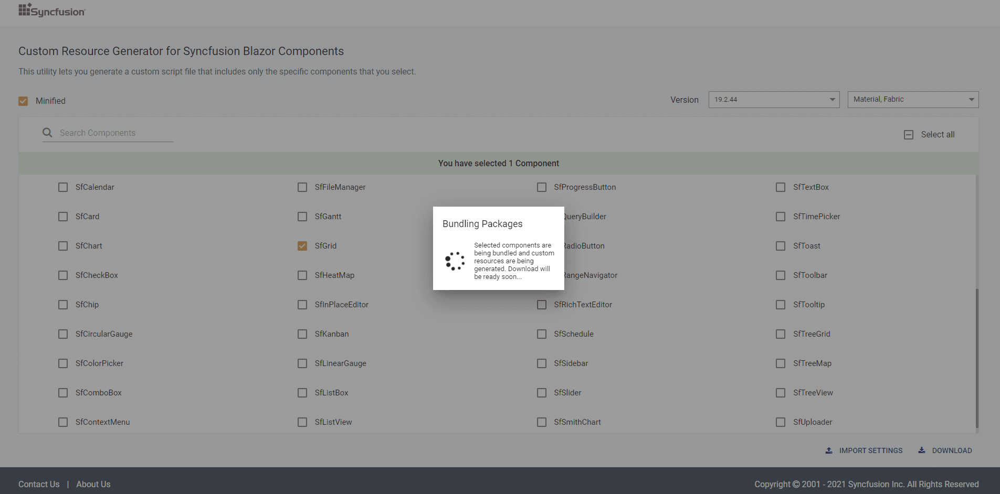

# Custom Resource Generator

Syncfusion provides an option to generate a component's interop script and styles using the [Custom Resource Generator](https://blazor.syncfusion.com/crg) (CRG) web tool for Blazor components from v19.2.0.44.


## Search and select the component list

Search and select the required Syncfusion Blazor UI components from the CRG to generate a specific set of component resources.

Refer to the following steps to search and select the components in CRG:

1. Navigate to the Custom Resource Generator (CRG) application at [CRG](https://blazor.syncfusion.com/crg).

2. Type the required component name in the search bar, and then select the checkbox. The dependency of the selected component is resolved in the application itself, so you do not need to choose each dependent component manually.

    

3. Select the required built-in themes from the **Select Themes** option. This provides an option to select more than one theme.

    

## Download the selected component resources

After selecting the required component resources, download the custom interop script and styles from CRG.

Refer to the following steps to download the custom resources in CRG:

1. Click the **DOWNLOAD** button at the bottom of the page. Select the **Minified** option to generate the minified file output for production.

    

2. Change the file name as needed, and then click **GENERATE** button in the pop-up.

    

3. Now, the bundling process for the selected components will be started, and the output will be downloaded as a zip file.

    

4. The final output contains the custom interop script and styles for the selected components and an **import.json** file, which stores the current settings.

    

## How to use custom resources in the Blazor application

1. Copy or paste the downloaded custom resources in the Blazor application `~/wwwroot` folder.

2. Set `IgnoreScriptIsolation` as true in `AddSyncfusionBlazor` service in `~/Startup.cs` file for Blazor Server app or `~/Program.cs` file for Blazor WebAssembly app.

    **Blazor Server App (~/Startup.cs)**
    ```c#
    public void ConfigureServices(IServiceCollection services)
    {
        services.AddRazorPages();
        services.AddServerSideBlazor();

        // Set IgnoreScriptIsolation as true to load custom  scripts
        services.AddSyncfusionBlazor(options => {
            options.IgnoreScriptIsolation = true;
            });

        services.AddSingleton<WeatherForecastService>();
    }
    ```

    > If you are using Blazor Server App with net6.0 SDK, the **Startup.cs** file is not available in the Application. Set `IgnoreScriptIsolation` as true in `AddSyncfusionBlazor` service in `~/Program.cs` file for Blazor Server app.

    ```c#
    // For .NET 6 project, add the Syncfusion Blazor Service in Program.cs file.
    using Microsoft.AspNetCore.Components;
    using Microsoft.AspNetCore.Components.Web;
    using Syncfusion.Blazor;

    var builder = WebApplication.CreateBuilder(args);

    builder.Services.AddRazorPages();
    builder.Services.AddServerSideBlazor();
    ....
    builder.Services.AddSyncfusionBlazor(options => { options.IgnoreScriptIsolation = true; });
    var app = builder.Build();
    ....
    ....
    ```

    **Blazor WebAssembly App (~/Program.cs)**
    ```c#
    // For .NET 6 project.
    using Microsoft.AspNetCore.Components;
    using Microsoft.AspNetCore.Components.Web;
    using Syncfusion.Blazor;

    var builder = WebApplication.CreateBuilder(args);

    builder.Services.AddRazorPages();
    builder.Services.AddServerSideBlazor(options => { options.IgnoreScriptIsolation = true; });
    ....
    builder.Services.AddSyncfusionBlazor();
    var app = builder.Build();
    ....
    ....
    ```

    ```c#
    // For .NET 5 or .NET Core SDK 3.1 project.
    using Syncfusion.Blazor;
    ....
    ....
    public static async Task Main(string[] args)
    {
        var builder = WebAssemblyHostBuilder.CreateDefault(args)    ;
        ....
        ....

        // Set IgnoreScriptIsolation as true to load custom  scripts
        builder.Services.AddSyncfusionBlazor(options => {
            options.IgnoreScriptIsolation = true;
            });

        await builder.Build().RunAsync();
    }
    ```

3. Now, manually add the custom interop script and styles in the Blazor App.

    a) For `.NET 6` Blazor Server app, add the custom interop script and styles in the `~/Pages/_Layout.cshtml` page.

    b) For `.NET 5 / .NET Core SDK 3.1` Blazor Server app, add the custom interop script and styles in the `~/Pages/_Host.cshtml` page.

    c) For Blazor WebAssembly app, add the custom interop script and styles in the `~/wwwroot/index.html` page.

    ```html
    <head>
        ....
        ....
        <link href="material.css" rel="stylesheet" />
        <script src="syncfusion-blazor.min.js" type="text/javascript"></script>
    </head>
    ```

    ***How to use CDN resources in the Blazor application***

    The same theme and script files can be referred through the CDN version by setting the `IgnoreScriptIsolation` to true in `AddSyncfusionBlazor` service in `~/Startup.cs` file for Blazor Server app or `~/Program.cs` file for Blazor WebAssembly app which is in step 2.

    a) For `.NET 6` Blazor Server app, add the CDN interop script and styles in the `~/Pages/_Layout.cshtml` page.

    b) For `.NET 5 / .NET Core SDK 3.1` Blazor Server app, add the CDN interop script and styles in the `~/Pages/_Host.cshtml` page.

    c) For Blazor WebAssembly app, add the CDN interop script and styles in the `~/wwwroot/index.html` page.

    ```html
    <head>
        ....
        ....
        <link href="https://cdn.syncfusion.com/blazor/{{ site.blazorversion }}/styles/bootstrap4.css" rel="stylesheet" />
        <script src="https://cdn.syncfusion.com/blazor/{{ site.blazorversion }}/syncfusion-blazor.min.js" type="text/javascript"></script>
    </head>
    ```

4. Run the application and it will load the resources with application required components.

## Import previously generated settings into CRG

To add more components or upgrade the latest Syncfusion Blazor library resources, it is not necessary to generate from the scratch in the CRG. Just import the old **import.json** file, make the changes, and then download it again from the CRG application.

Refer to the following steps to import previous settings in CRG:

1. Click the **IMPORT SETTINGS** button at the bottom of the page.

    

2. Upload the **import.json** file, so that the previously stored data will be restored in the CRG application. Now, add more components and export the resources again.

    
