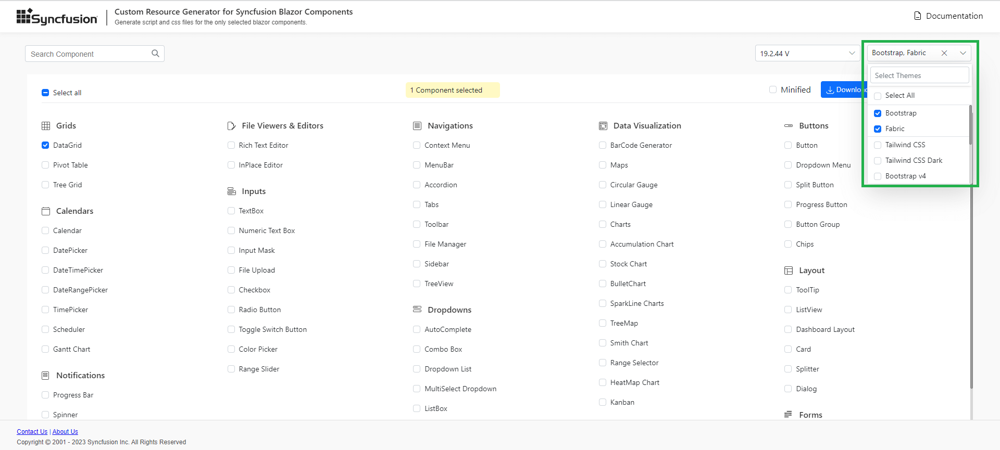
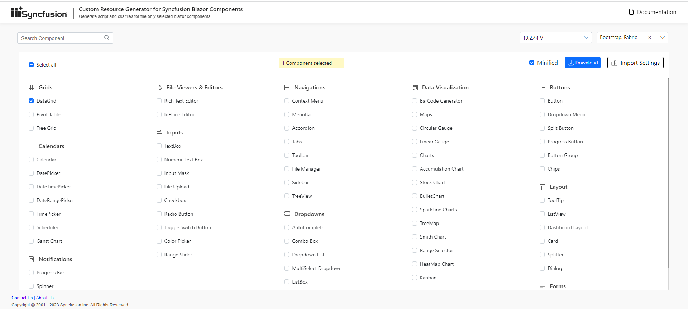

# Custom Resource Generator

Syncfusion<sup style="font-size:70%">&reg;</sup> provides the [Custom Resource Generator](https://blazor.syncfusion.com/crg) (CRG) web tool (available from v19.2.0.44) to generate component-specific interop scripts and styles for Blazor. Using CRG reduces bundle size and improves load performance by including only the required resources instead of the full library.


## Search and select the component list

Select the required Syncfusion<sup style="font-size:70%">&reg;</sup> Blazor components in CRG to generate a specific set of resources.

Follow these steps to choose components in CRG:

1. Open the [Syncfusion<sup style="font-size:70%">&reg;</sup> Custom Resource Generator](https://blazor.syncfusion.com/crg) (CRG) app.
2. Type the component name in the search box, then select its checkbox. CRG automatically resolves dependencies; manual selection of dependent components is not required.

3. Select one or more built-in themes from **Select Themes**.


## Download the selected component resources

After selecting the required components, download the custom interop script and styles from CRG.

Follow these steps to download the custom resources:

1. Select the **Minified** option to generate the minified file output for production, then click **DOWNLOAD**.

2. Rename the file if needed, enter a valid email address, and click **GENERATE** in the pop-up.

3. The export request starts for the selected components. An email with a download link will arrive shortly (timing depends on the number of components and bundle type minified or unminified).

4. The output includes the custom interop script, styles, and an **import.json** file that stores the current settings.

   

N> When downloading Material or Tailwind themes (alone or with other themes), the package includes a 'styles' folder with CSS files and a 'customized' folder. The CSS files within the 'customized' folder do not include the online Google font dependencies associated with the Material and Tailwind themes. See [themes documentation](https://blazor.syncfusion.com/documentation/appearance/themes#render-syncfusion-components-in-offline-with-material-and-tailwind-themes) for details.

## How to use custom resources in the Blazor application

1. Copy and paste the downloaded custom resources into the application's `~/wwwroot` folder.
2. Manually add the custom interop script and styles:
    * For **.NET 8 and .NET 9** Blazor Web App (any render mode: Server, WebAssembly, or Auto), reference the custom interop script in `~/Components/App.razor` file.
    * For a **Blazor WebAssembly (standalone) app**, reference the custom interop script in `~/wwwroot/index.html` file.

    ```html
    <head>
        ....
        ....
        <link href="material.css" rel="stylesheet" />
        <script src="syncfusion-blazor.min.js" type="text/javascript"></script>
    </head>
    ```
3. Run the application. The resources will load only the required components.

N> Ensure the generated bundle version matches the installed Syncfusion Blazor NuGet package version. After upgrading packages, regenerate the CRG bundle. For reference on where to place script references, see [Reference script files for Syncfusion Blazor](https://blazor.syncfusion.com/documentation/common/adding-script-references).

## Import previously generated settings into CRG

To add more components or update to the latest Syncfusion<sup style="font-size:70%">&reg;</sup> Blazor resources, it is not necessary to start from scratch. Import the existing **import.json**, make changes, and download it again from the CRG application.

Follow these steps to import previous settings in CRG:

1. Click **IMPORT SETTINGS** at the bottom of the page.

2. Upload the **import.json** file to restore the previous configuration. Add components as needed and export the resources again.

