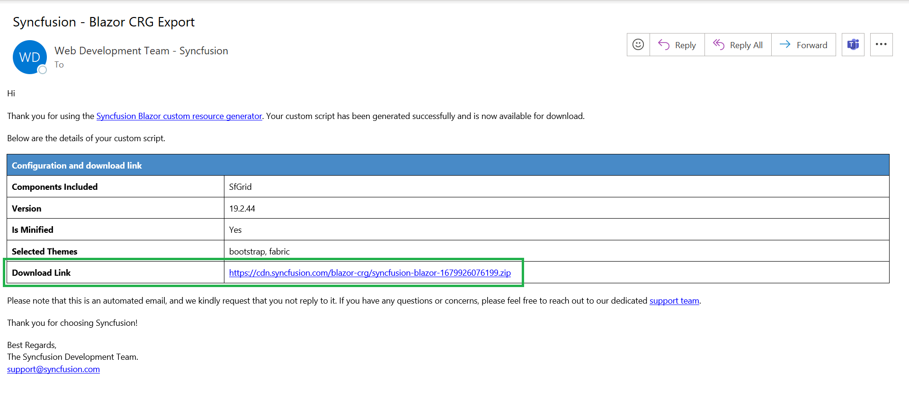
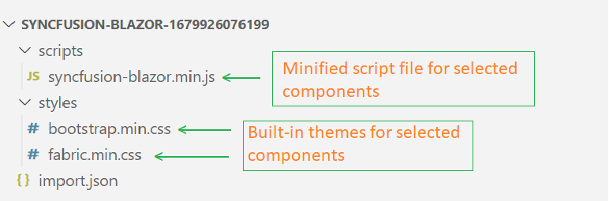

# Custom Resource Generator

Syncfusion<sup style="font-size:70%">&reg;</sup> provides an option to generate a component's interop script and styles using the [Custom Resource Generator](https://blazor.syncfusion.com/crg) (CRG) web tool for Blazor components from v19.2.0.44. This tool empowers users by generating precise interop scripts and styles specifically for their components. By leveraging the CRG, you can optimize loading times and enhance responsiveness compared to loading overall script and style resources.


## Search and select the component list

Search and select the required Syncfusion<sup style="font-size:70%">&reg;</sup> Blazor UI components from the CRG to generate a specific set of component resources.

Refer to the following steps to search and select the components in CRG:

1. Open [Syncfusion<sup style="font-size:70%">&reg;</sup> Custom Resource Generator](https://blazor.syncfusion.com/crg) (CRG) application.
2. Type the required component name in the search bar, and then select the checkbox. The dependency of the selected component is resolved in the application itself, so you do not need to choose each dependent component manually.

3. Select the required built-in themes from the **Select Themes** option. This provides an option to select more than one theme.


## Download the selected component resources

After selecting the required component resources, download the custom interop script and styles from CRG.

Refer to the following steps to download the custom resources in CRG:

1. Once components are selected, select the **Minified** option to generate the minified file output for production. Then Click the **DOWNLOAD** button.

2. Change the file name as needed. After that, enter an valid email address and then click **GENERATE** button in the pop-up.

3. Now, the export request has been initiated for the selected component(s). You will receive an email with a download link within a minute( Depending on the selected component counts and bundle type minified or unminified ).

4. The final output contains the custom interop script and styles for the selected components and an **import.json** file, which stores the current settings.

   

N> When you download the resources of Material and Tailwind themes, either separately or with other themes, you will find a 'styles' folder that contains CSS files along with a 'customized' folder. The CSS files within the 'customized' folder do not include the online Google font dependencies associated with the Material and Tailwind themes. For more details, please refer to [this](https://blazor.syncfusion.com/documentation/appearance/themes#render-syncfusion-components-in-offline-with-material-and-tailwind-themes) resource.

## How to use custom resources in the Blazor application

1. Copy and paste the downloaded custom resources in the Blazor application `~/wwwroot` folder.
2. Now, manually add the custom interop script and styles in the Blazor App.
    * For **.NET 8 and .NET 9**  Blazor Web Apps using any render mode (Server, WebAssembly, or Auto), reference custom interop script in `~/Components/App.razor` file.
    * For **Blazor WASM Standalone App**, reference custom interop script in `~/wwwroot/index.html` file.

    ```html
    <head>
        ....
        ....
        <link href="material.css" rel="stylesheet" />
        <script src="syncfusion-blazor.min.js" type="text/javascript"></script>
    </head>
    ```
3. Run the application and it will load the resources with application required components.

## Import previously generated settings into CRG

To add more components or upgrade the latest Syncfusion<sup style="font-size:70%">&reg;</sup> Blazor library resources, it is not necessary to generate from the scratch in the CRG. Just import the old **import.json** file, make the changes, and then download it again from the CRG application.

Refer to the following steps to import previous settings in CRG:

1. Click the **IMPORT SETTINGS** button at the bottom of the page.

2. Upload the **import.json** file, so that the previously stored data will be restored in the CRG application. Now, add more components and export the resources again.

