# Bind Data from SQL Server to Syncfusion® Blazor Components

This section explains how to retrieve data from a SQL Server database using Entity Framework and bind it to the Blazor Grid component for performing Create, Read, Update, and Delete (CRUD) operations.

Entity Framework is an open-source object-relational mapper (O/RM) developed by Microsoft. It simplifies database access by allowing developers to work with data as strongly typed objects instead of writing raw SQL queries. Entity Framework supports multiple database providers; however, the focus here is on using [MS SQL Server](https://en.wikipedia.org/wiki/Microsoft_SQL_Server) database.

The following step-by-step procedure demonstrates how to configure Entity Framework with SQL Server and connect it to the Syncfusion<sup style="font-size:70%">&reg;</sup> Grid component in a Blazor Server application to enable CRUD functionality.
## Prerequisite software

The following software must be installed before working with the Blazor Grid component and Entity Framework integration:

* [Visual Studio 2026](https://visualstudio.microsoft.com/vs/?utm_source=copilot.com)
Required for building and running Blazor Server applications with full development support.
* [.Net10 or later](https://dotnet.microsoft.com/en-us/download/dotnet/10.0?utm_source=copilot.com)
Provides the runtime and SDK necessary for creating Blazor applications.
* [SQL Server](https://www.microsoft.com/en-us/sql-server/sql-server-downloads?utm_source=copilot.com)
Used as the database engine for storing and retrieving application data.


## Create the database

Follow these steps to set up the database and table required for storing book records:
1. **Open SQL Server Management Studio (SSMS).** Launch SQL Server to begin working with databases.

2. **Create a new database named `Library`.** 
    - In the Object Explorer, right-click on **Databases**. 
    - Select **New Database**. 
    - Enter `Library` as the database name and click **OK**.
3. **Open a new query window.** 
    - Right-click on the newly created `Library` database. 
    - Select **New Query** to open the SQL editor. 
4. **Run the following SQL script to create a table named `Book`:**

```
Create Table Book(
Id BigInt Identity(1,1) Primary Key Not Null,
Name Varchar(200) Not Null,
Author Varchar(100) Not Null,
Quantity int,
Price int Not Null,
Available bit)
```

Now, the Book table design will look like below.

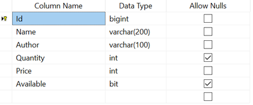

## Creating Blazor Web App

Open Visual Studio and follow the steps in the [documentation](https://learn.microsoft.com/en-us/aspnet/core/blazor/tooling?view=aspnetcore-8.0&pivots=windows) to create the Blazor Web App.

You need to configure the corresponding [Interactive render mode](https://learn.microsoft.com/en-us/aspnet/core/blazor/components/render-modes?view=aspnetcore-8.0#render-modes) and [Interactivity location](https://learn.microsoft.com/en-us/aspnet/core/blazor/tooling?view=aspnetcore-8.0&pivots=windows) while creating a Blazor Web Application.

## Create Blazor Server Application

Open Visual Studio 2022, select Create a New Project, select Blazor Server App, then click Next.

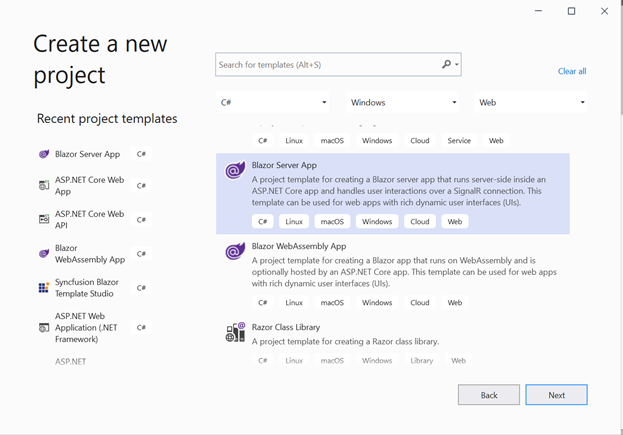

In the next window, provide the project name as LibraryManagement and click Next.

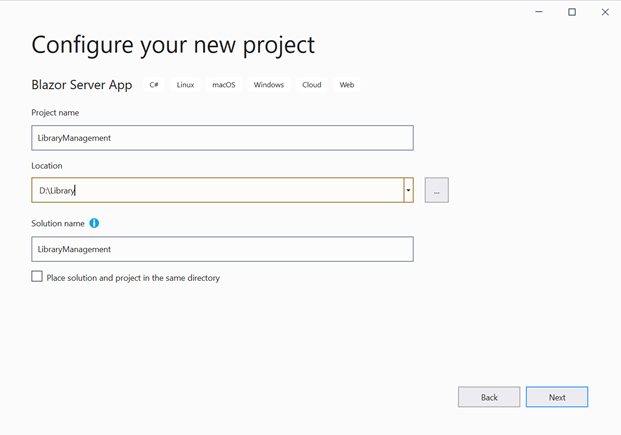

Now, select Target Framework as (.NET 9.0 or .NET 10.0) in the project template and click Create button to create the Blazor Server application.

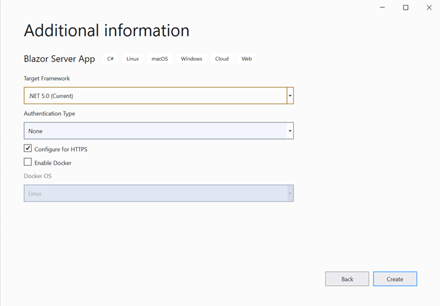

## Creating DbContext and model class

### DbContext and model class in Blazor Web App

Now, scaffold DbContext and model classes from the existing library database. To perform scaffolding and work with the SQL Server Database in our application, you need to install the following NuGet packages. If you have created a Blazor Web App with the interactive render mode set to `WebAssembly` or `Auto`, ensure to follow these steps:

* Create the new project with Class Library template named as `BlazorWebApp.Shared` for DbContext and model class as shown below.


Additionally, ensure that you have added a reference to the `BlazorWebApp.Shared` project in both the server-side and client-side projects of your web application.

* Then, open the NuGet Package Manager and install the following packages in both the shared and server-side projects of your app.

   * [Microsoft.EntityFrameworkCore.Tools](https://www.nuget.org/packages/Microsoft.EntityFrameworkCore.Tools): This package creates database context and model classes from the database.
   * [Microsoft.EntityFrameworkCore.SqlServer](https://www.nuget.org/packages/Microsoft.EntityFrameworkCore.SqlServer/): The database provider that allows Entity Framework Core to work with SQL Server.

Alternatively, you can utilize the following package manager command to achieve the same.




Install-Package Microsoft.EntityFrameworkCore.Tools

Install-Package Microsoft.EntityFrameworkCore.SqlServer




Once the above packages are installed, you can scaffold DbContext and Model classes. Run the following command in the Package Manager Console under the `BlazorWebApp.Shared` project.

```
Scaffold-DbContext “Server=localhost;Database=Library;Integrated Security=True” Microsoft.EntityFrameworkCore.SqlServer -OutputDir Models

```

The above scaffolding command contains the following details for creating DbContext and model classes for the existing database and its tables.

   * **Connection string**: Server=localhost;Database=Library;Integrated Security=True
   * **Data provider**: Microsoft.EntityFrameworkCore.SqlServer
   * **Output directory**: -OutputDir Models

* After running the above command, **LibraryContext.cs** and **Book.cs** files will be created under the **Models** folder in the `BlazorWebApp.Shared` project as follows.

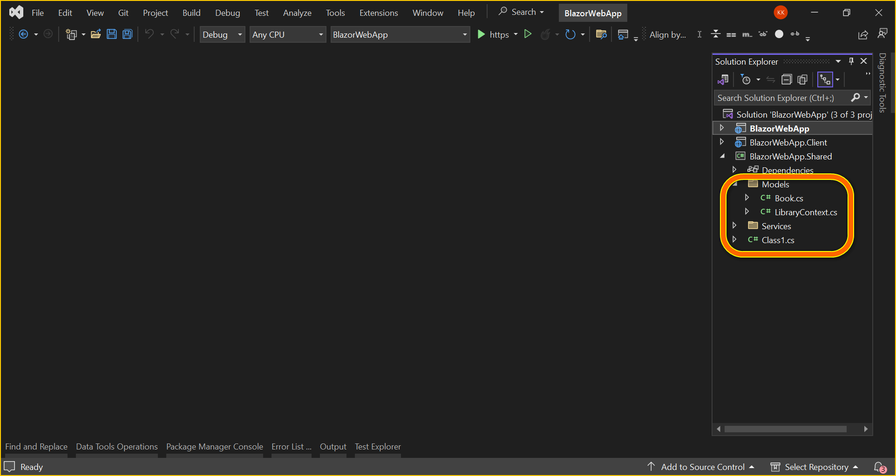

 You can see that **LibraryContext.cs** file contains the connection string details in the OnConfiguring method.

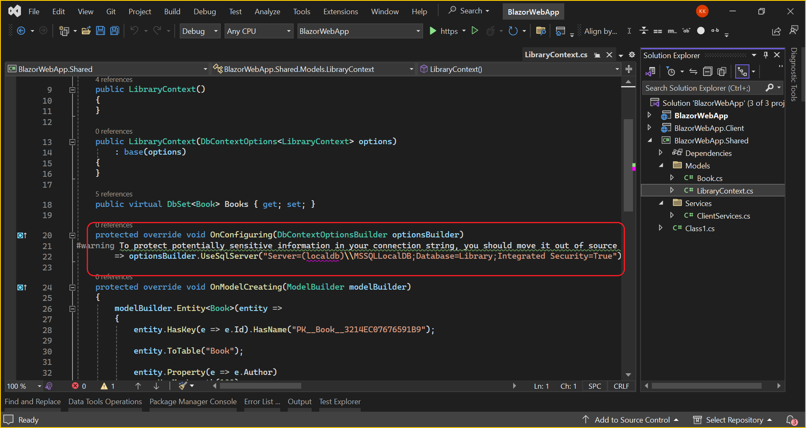

* Also, include the following code snippet in the **app settings.json** file from server side application.




          // your localhost portal number
"BaseUri": "https://localhost:7105",
"Logging": {
  "LogLevel": {
    "Default": "Information",
    "Microsoft.AspNetCore": "Warning"
  }
},
"AllowedHosts": "*",
"ConnectionStrings": {
  "LibraryDatabase": "Server={Your server name};Database=Library;Integrated Security=True"
}




* Add the following code snippet to configure a scoped HttpClient with a base address and **DbContext** must be configured using connection string and registered as scoped service using the **AddDbContext** method in **Program.cs** file in server side application.




builder.Services.AddScoped(http => new HttpClient { BaseAddress = new Uri(builder.Configuration.GetSection("BaseUri").Value!) });
builder.Services.AddDbContext<LibraryContext>(option =>
                option.UseSqlServer(builder.Configuration.GetConnectionString("LibraryDatabase")));




* Crete the `DataGridController` in server side application for handle CRUD (Create, Read, Update, Delete) operations for the Book entity.

```cshtml
using BlazorWebApp.Shared.Models;
using Microsoft.AspNetCore.Mvc;

namespace BlazorWebApp.Controller
{
    [Route("api/[controller]")]
    [ApiController]
    public class DataGridController : ControllerBase
    {
        public DataGridController ()
        {

        }

        [HttpGet]
        public async Task<ActionResult<List<Book>>> Get ()
        {
            LibraryContext db = new LibraryContext();
            return db.Books.ToList();
        }

        [HttpPost]

        public async Task<ActionResult<Book>> Post ( Book value )
        {
            LibraryContext db = new LibraryContext();
            db.Books.Add(value);
            db.SaveChanges();
            return Ok(value);
        }

        [HttpPut("{id}")]
        public async Task<ActionResult<Book>> Put ( long id, Book updatedBook )
        {
            using (LibraryContext db = new LibraryContext())
            {
                var existingBook = await db.Books.FindAsync(id);

                if (existingBook == null)
                {
                    return NotFound(); // Return 404 Not Found if the book with the given id is not found
                }

                // Update the properties of the existing book with the values from the updated book
                existingBook.Name = updatedBook.Name;
                existingBook.Author = updatedBook.Author;
                existingBook.Price = updatedBook.Price;
                existingBook.Quantity = updatedBook.Quantity;
                // Update other properties as needed

                await db.SaveChangesAsync(); // Save changes to the database

                return Ok(existingBook); // Return the updated book
            }
        }

        [HttpDelete("{id}")]
        public async Task<ActionResult> Delete ( long id )
        {
            LibraryContext db = new LibraryContext();
            var book = db.Books.Find(id);

            if (book == null)
            {
                return NotFound();
            }

            db.Books.Remove(book);
            db.SaveChanges();

            return NoContent();
        }
    }
}

```

Also, make sure to include the `AddControllers` and `MapControllers` methods in the Program.cs file of your server-side application.



....
builder.Services.AddControllers();
....
app.MapControllers();
....



* Create a `Services` folder in the `BlazorWebApp.Shared` project. Inside the `Services` folder, create the ClientServices class. This class will be responsible for interacting with the server-side API to perform operations such as retrieving books, inserting a new book, removing a book, and updating a book.




public class ClientServices
{
    private readonly HttpClient _httpClient;

    public ClientServices ( HttpClient httpClient )
    {
        _httpClient = httpClient;

    }

    public async Task<List<Book>> GetBooks ()
    {
        var result = await _httpClient.GetFromJsonAsync<List<Book>>("https://localhost:7105/api/DataGrid");

        return result;
    }


    public async Task<Book> InsertBook ( Book value )
    {
        await _httpClient.PostAsJsonAsync<Book>($"https://localhost:7105/api/DataGrid/", value);
        return value;
    }
    public async Task<bool> RemoveBook ( long bookId )
    {
        HttpResponseMessage response = await _httpClient.DeleteAsync($"https://localhost:7105/api/DataGrid/{bookId}");

        return true;
    }

    public async Task<Book> UpdateBook ( long bookId, Book updatedBook )
    {
        HttpResponseMessage response = await _httpClient.PutAsJsonAsync($"https://localhost:7105/api/DataGrid/{bookId}", updatedBook);

        return updatedBook;

    }
}




Additionally, make sure to register the `ClientServices` class in both `Program.cs` files of your application.

```
....
builder.Services.AddScoped<ClientServices>();

```
N> To ensure the using correct your's localhost portable number in code snippet.

### DbContext and model class in Blazor Server App

Now, scaffold DbContext and model classes from the existing library database. To perform scaffolding and work with the SQL Server Database in our application, you need to install the following NuGet packages.

* [Microsoft.EntityFrameworkCore.Tools](https://www.nuget.org/packages/Microsoft.EntityFrameworkCore.Tools): This package creates database context and model classes from the database.
* [Microsoft.EntityFrameworkCore.SqlServer](https://www.nuget.org/packages/Microsoft.EntityFrameworkCore.SqlServer/): The database provider that allows Entity Framework Core to work with SQL Server.

Run the following commands in the Package Manager Console.




Install-Package Microsoft.EntityFrameworkCore.Tools

Install-Package Microsoft.EntityFrameworkCore.SqlServer




Once the above packages are installed, you can scaffold DbContext and Model classes. Run the following command in the Package Manager Console under the LibraryManagement project.

```
Scaffold-DbContext “Server=localhost;Database=Library;Integrated Security=True” Microsoft.EntityFrameworkCore.SqlServer -OutputDir Models
```

The above scaffolding command contains the following details for creating DbContext and model classes for the existing database and its tables.

* **Connection string**: Server=localhost;Database=Library;Integrated Security=True
* **Data provider**: Microsoft.EntityFrameworkCore.SqlServer
* **Output directory**: -OutputDir Models

After running the above command, **LibraryContext.cs** and **Book.cs** files will be created under the **LibraryManagement.Models** folder as follows.

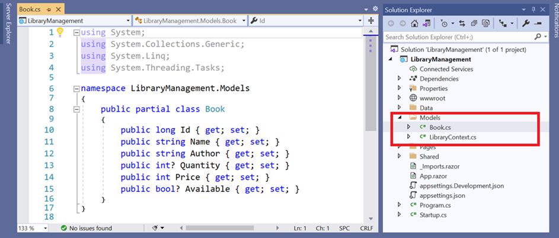

You can see that **LibraryContext.cs** file contains the connection string details in the OnConfiguring method.

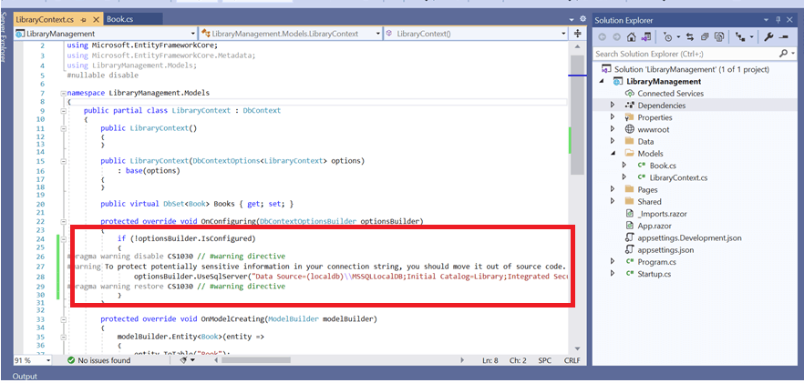

It is not recommended to have a connection string with sensitive information in the **LibraryContext.cs** file, so the connection string is moved to the **app settings.json** file.

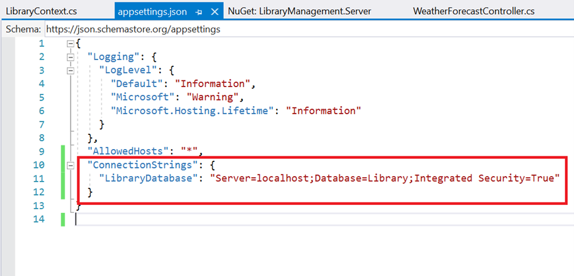

Now, the **DbContext** must be configured using connection string and registered as scoped service using the **AddDbContext** method in **Program.cs** file in .NET 6 and .NET 7 application.




builder.Services.AddDbContext<LibraryContext>(option =>
                option.UseSqlServer(builder.Configuration.GetConnectionString("LibraryDatabase")));




#### Creating a Data Access Layer

The application is now configured to connect with the library database using Entity Framework. Now, it’s time to consume data from the library database. To do so, you need an interface to fetch data from DbContext to the Blazor application.

To create an interface, right-click on the Models folder and create an interface called **ILibraryService.cs**  like below.

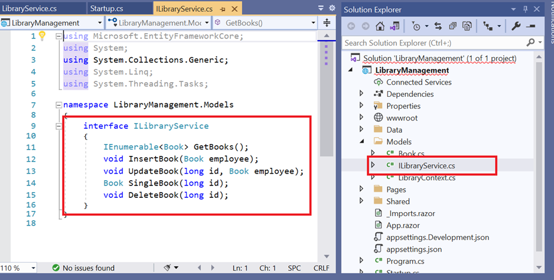

Create a data access layer LibraryService.cs.



using Microsoft.EntityFrameworkCore;
using System;
using System.Collections.Generic;
using System.Linq;
using System.Threading.Tasks;

namespace LibraryManagement.Models
{
    public class LibraryService : ILibraryService
    {
        private LibraryContext _context;
        public LibraryService(LibraryContext context)
        {
            _context = context;
        }

        public void DeleteBook(long id)
        {
            try
            {
                Book ord = _context.Books.Find(id);
                _context.Books.Remove(ord);
                _context.SaveChanges();
            }
            catch
            {
                throw;
            }
        }

        public IEnumerable<Book> GetBooks()
        {
            try
            {
                return _context.Books.ToList();
            }
            catch
            {
                throw;
            }
        }

        public void InsertBook(Book book)
        {
            try
            {
                _context.Books.Add(book);
                _context.SaveChanges();
            }
            catch
            {
                throw;
            }
        }

        public Book SingleBook(long id)
        {
            throw new NotImplementedException();
        }

        public void UpdateBook(long id, Book book)
        {
            try
            {
                var local = _context.Set<Book>().Local.FirstOrDefault(entry => entry.Id.Equals(book.Id));
                // check if local is not null
                if (local != null)
                {
                    // detach
                    _context.Entry(local).State = EntityState.Detached;
                }
                _context.Entry(book).State = EntityState.Modified;
                _context.SaveChanges();
            }
            catch
            {
                throw;
            }
        }
    }
}



#### Register the service in Program.cs

Now, you need to register the **LibraryService** and **ILibraryService** as services in the **Program.cs** file for .NET6 and .NET7 applications. Register the Scoped Services like below.




builder.Services.AddScoped<ILibraryService, LibraryService>();
builder.Services.AddDbContext<LibraryContext>(option =>
                option.UseSqlServer(builder.Configuration.GetConnectionString("LibraryDatabase")));




## Add Syncfusion<sup style="font-size:70%">&reg;</sup> Blazor Grid and Themes NuGet in Blazor App

To add **Blazor DataGrid** component in the app, open the NuGet package manager in Visual Studio (*Tools → NuGet Package Manager → Manage NuGet Packages for Solution*), search and install [Syncfusion.Blazor.Grid](https://www.nuget.org/packages/Syncfusion.Blazor.Grid/) and [Syncfusion.Blazor.Themes](https://www.nuget.org/packages/Syncfusion.Blazor.Themes/).

If you utilize `WebAssembly or Auto` render modes in the Blazor Web App need to be install Syncfusion<sup style="font-size:70%">&reg;</sup> Blazor components NuGet packages within the client project.

Alternatively, you can utilize the following package manager command to achieve the same.




Install-Package Syncfusion.Blazor.Grid -Version {{ site.releaseversion }}
Install-Package Syncfusion.Blazor.Themes -Version {{ site.releaseversion }}




N> Syncfusion<sup style="font-size:70%">&reg;</sup> Blazor components are available in [nuget.org](https://www.nuget.org/packages?q=syncfusion.blazor). Refer to [NuGet packages](https://blazor.syncfusion.com/documentation/nuget-packages) topic for available NuGet packages list with component details.

Open **~/_Imports.razor** file and import the following namespace.



@using Syncfusion.Blazor
@using Syncfusion.Blazor.Grids



Now, register the Syncfusion<sup style="font-size:70%">&reg;</sup> Blazor Service in the **~/Program.cs** file of your App.

For a Blazor Web App with `WebAssembly` or `Auto (Server and WebAssembly)` interactive render mode, register the Syncfusion<sup style="font-size:70%">&reg;</sup> Blazor service in both **~/Program.cs** files of your web app.

```cshtml

....
using Syncfusion.Blazor;
....
builder.Services.AddSyncfusionBlazor();
....

```

Themes provide life to components. Syncfusion<sup style="font-size:70%">&reg;</sup> Blazor has different themes. They are:

* Fabric
* Bootstrap
* Material
* High Contrast

In this demo application, the latest theme will be used.

  * For **Blazor Web App**,  refer stylesheet inside the `<head>` of **~/Components/App.razor** file for .NET 10, .NET 9 and .NET 8.

  * For **Blazor WebAssembly application**, refer stylesheet inside the `<head>` element of **wwwroot/index.html** file.
  * For **Blazor Server application**, refer stylesheet inside the `<head>` element of
    * **~/Pages/_Host.cshtml** file for .NET 7.
    * **~/Pages/_Layout.cshtml** file for .NET 6.



<link href="_content/Syncfusion.Blazor.Themes/bootstrap5.css" rel="stylesheet" />



Also, Include the script reference at the end of the `<body>` of **~/Components/App.razor**(For Blazor Web App) or **Pages/_Host.cshtml** (for Blazor Server App) file as shown below:

```html
<body>
    ....
    <script src="_content/Syncfusion.Blazor.Core/scripts/syncfusion-blazor.min.js" type="text/javascript"></script>
</body>
```
## Add Syncfusion<sup style="font-size:70%">&reg;</sup> Blazor DataGrid component to an application

In previous steps, you have successfully configured the Syncfusion<sup style="font-size:70%">&reg;</sup> Blazor package in the application. Now, you can add the grid component to the `.razor` page inside the `Pages` folder.

If you have set the interactivity location to `Per page/component` in the web app, ensure that you define a render mode at the top of the Syncfusion<sup style="font-size:70%">&reg;</sup> Blazor component-included razor page as follows:




@* Your App render mode define here *@
@rendermode InteractiveAuto






<SfGrid TValue="Book">
</SfGrid>



## Bind data to Blazor DataGrid component using Entity Framework

To consume data from the database using Entity Framework, the `LibraryService` must be injected into the Razor page and assigned to the DataGrid’s `DataSource` property. The `DataSource` property of the DataGrid component is responsible for binding SQL Server data retrieved through Entity Framework in a Blazor Server application, enabling seamless data display and interaction.




@using BlazorWebApp.Shared.Models
@using BlazorWebApp.Shared.Services

<SfGrid DataSource="@LibraryBooks" TValue="Book">
</SfGrid>

@code
{
    public List<Book> LibraryBooks { get; set; }
    protected override async Task OnInitializedAsync ()
    {
        LibraryBooks = await clientlibrary.GetBooks();
    }
}




@using LibraryManagement.Models
@inject ILibraryService LibraryService

<SfGrid DataSource="@LibraryBooks" TValue="Book">
</SfGrid>

@code
{
    public IEnumerable<Book> LibraryBooks { get; set; }
    protected override void OnInitialized()
    {
        LibraryBooks = LibraryService.GetBooks();
    }
}




Grid columns can be defined using the **GridColumn** component. We are going to create columns using the following code. Let us see the properties used and their usage.

* **Field** property specifies the column name of the Book table to display in the grid column.
* **IsPrimaryKey** property specifies that the given column is a primary key column. Here, Id column is a primary key column.
* **Visible** property specifies the column visibility. Setting as false will hide the column at the user end.
* **Width** property specifies the column width.
* **Format** property helps to format number, currencies, and date in a particular culture. Here, the Price column has been formatted.
* **DisplayAsCheckBox** property renders checkbox in cells and sets check state based on the property value. Here, Available column is rendered as a checkbox column.




@using BlazorWebApp.Shared.Models
@using BlazorWebApp.Shared.Services

<SfGrid DataSource="@LibraryBooks" TValue="Book">
    <GridColumns>
        <GridColumn Field="@nameof(Book.Id)" IsPrimaryKey="true" IsIdentity="true" Visible="false"></GridColumn>
        <GridColumn Field="@nameof(Book.Name)" Width="150"></GridColumn>
        <GridColumn Field="@nameof(Book.Author)" Width="150"></GridColumn>
        <GridColumn Field="@nameof(Book.Quantity)" Width="90" TextAlign="TextAlign.Right"></GridColumn>
        <GridColumn Field="@nameof(Book.Price)" Width="90" Format="C2" TextAlign="TextAlign.Right"></GridColumn>
        <GridColumn Field="@nameof(Book.Available)" DisplayAsCheckBox="true" Width="70"></GridColumn>
    </GridColumns>
</SfGrid>

@code
{
    public List<Book> LibraryBooks { get; set; }
    protected override async Task OnInitializedAsync ()
    {
        LibraryBooks = await clientlibrary.GetBooks();
    }
}




@using LibraryManagement.Models
@inject ILibraryService LibraryService

<SfGrid DataSource="@LibraryBooks" TValue="Book">
    <GridColumns>
        <GridColumn Field="@nameof(Book.Id)" IsPrimaryKey="true" IsIdentity="true" Visible="false"></GridColumn>
        <GridColumn Field="@nameof(Book.Name)" Width="150"></GridColumn>
        <GridColumn Field="@nameof(Book.Author)" Width="150"></GridColumn>
        <GridColumn Field="@nameof(Book.Quantity)" Width="90" TextAlign="TextAlign.Right"></GridColumn>
        <GridColumn Field="@nameof(Book.Price)" Width="90" Format="C2" TextAlign="TextAlign.Right"></GridColumn>
        <GridColumn Field="@nameof(Book.Available)" DisplayAsCheckBox="true" Width="70"></GridColumn>
    </GridColumns>
</SfGrid>

@code
{
    public IEnumerable<Book> LibraryBooks { get; set; }
    protected override void OnInitialized()
    {
        LibraryBooks = LibraryService.GetBooks();
    }
}




Now, the data from the SQL server is loaded into the DataGrid component. Refer to the following screenshot for the output of above.

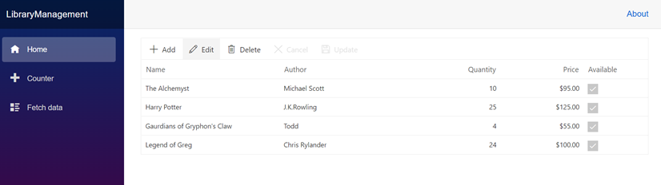

## Handling CRUD operations with our Syncfusion<sup style="font-size:70%">&reg;</sup> Blazor DataGrid component

You can enable editing in the grid component using the **GridEditSettings** component. Grid provides various modes of editing options such as Inline/Normal, Dialog, and Batch editing. Refer to the following documentation for your reference.

[Grid Editing in Blazor](https://blazor.syncfusion.com/documentation/datagrid/editing#editing)

Here, inline edit mode and **Toolbar** property are used to show toolbar items for editing.
While using the `DataSource` property of the Grid, changes will be reflected only in the Grid’s local datasource. To ensure that changes are also updated in the database, CRUD operations must be handled externally by using the Grid’s row-level events.  

- **RowCreated** – Triggered after a new record has been added. This event can be used to insert the new record into the database.  
- **RowEdited** – Triggered after an existing record has been modified. This event can be used to update the corresponding record in the database.  
- **RowDeleted** – Triggered after a record has been removed. This event can be used to delete the record from the database.  

By handling these events, the Grid can remain synchronized with the database. The Grid editing and toolbar features can be combined with these row-level events to provide full CRUD functionality with the existing Grid model.

We have added the DataGrid editing, toolbar, and OnActionBegin and OnActionComplete event code with the previous Grid model.





@rendermode InteractiveAuto

@using Syncfusion.Blazor.Data
@using BlazorWebApp.Shared.Models
@using BlazorWebApp.Shared.Services

@inject ClientServices clientlibrary

<SfGrid DataSource="@LibraryBooks" Toolbar="@(new List<string>() { "Add", "Edit", "Delete", "Cancel", "Update" })" TValue="Book">
    <GridEditSettings AllowAdding="true" AllowDeleting="true" AllowEditing="true" Mode="EditMode.Normal"></GridEditSettings>
    <GridEvents RowCreated="RowCreatedHandler" RowEdited="RowEditedHandler" RowDeleted="RowDeletedHandler" TValue="Book"></GridEvents>
    <GridColumns>
        <GridColumn Field="@nameof(Book.Id)" IsPrimaryKey="true" IsIdentity="true" Visible="false"></GridColumn>
        <GridColumn Field="@nameof(Book.Name)" Width="150"></GridColumn>
        <GridColumn Field="@nameof(Book.Author)" Width="150"></GridColumn>
        <GridColumn Field="@nameof(Book.Quantity)" Width="90" TextAlign="TextAlign.Right"></GridColumn>
        <GridColumn Field="@nameof(Book.Price)" Width="90" Format="C2" TextAlign="TextAlign.Right"></GridColumn>
        <GridColumn Field="@nameof(Book.Available)" DisplayAsCheckBox="true" Width="70"></GridColumn>
    </GridColumns>
</SfGrid>

@code
{
    public List<Book> LibraryBooks { get; set; }
    protected override async Task OnInitializedAsync()
    {
        LibraryBooks = await clientlibrary.GetBooks();
    }
    public void RowCreatedHandler(RowCreatedEventArgs<Book> args)
    {
        // Initialize default values or cancel adding using args.Cancel.
        await clientlibrary.AddBook(args.Data);
    }

    public void RowEditedHandler(RowEditedEventArgs<Book> args)
    {
        // Configure editors or cancel editing using args as needed.
        await clientlibrary.UpdateBook(args.Data);
    }


    public void RowDeletedHandler(RowDeletedEventArgs<Book> args)
    {
        // Confirm or cancel deletion based on business rules.
        await clientlibrary.DeleteBook(args.Data.Id);
    }
}



@using LibraryManagement.Models
@inject ILibraryService LibraryService

<SfGrid DataSource="@LibraryBooks" Toolbar="@(new List<string>() { "Add", "Edit", "Delete", "Cancel", "Update" })" TValue="Book">
    <GridEditSettings AllowAdding="true" AllowDeleting="true" AllowEditing="true" Mode="EditMode.Normal"></GridEditSettings>
    <GridEvents RowCreated="RowCreatedHandler" RowEdited="RowEditedHandler" RowDeleted="RowDeletedHandler" TValue="Book"></GridEvents>
    <GridColumns>
        <GridColumn Field="@nameof(Book.Id)" IsPrimaryKey="true" IsIdentity="true" Visible="false"></GridColumn>
        <GridColumn Field="@nameof(Book.Name)" Width="150"></GridColumn>
        <GridColumn Field="@nameof(Book.Author)" Width="150"></GridColumn>
        <GridColumn Field="@nameof(Book.Quantity)" Width="90" TextAlign="TextAlign.Right"></GridColumn>
        <GridColumn Field="@nameof(Book.Price)" Width="90" Format="C2" TextAlign="TextAlign.Right"></GridColumn>
        <GridColumn Field="@nameof(Book.Available)" DisplayAsCheckBox="true" Width="70"></GridColumn>
    </GridColumns>
</SfGrid>

@code
{
    public List<Book> LibraryBooks { get; set; }
    protected override async Task OnInitializedAsync()
    {
        LibraryBooks = await LibraryService.GetBooks();
    }
    public void RowCreatedHandler(RowCreatedEventArgs<Book> args)
    {
        // Initialize default values or cancel adding using args.Cancel.
        await LibraryService.AddBook(args.Data);
    }

    public void RowEditedHandler(RowEditedEventArgs<Book> args)
    {
        // Configure editors or cancel editing using args as needed.
        await LibraryService.UpdateBook(args.Data);
    }


    public void RowDeletedHandler(RowDeletedEventArgs<Book> args)
    {
        // Confirm or cancel deletion based on business rules.
        await LibraryService.DeleteBook(args.Data.Id);
    }
}




N> Normal edit mode is the default mode of editing.

### Insert a row

To insert a new row, click the **Add** toolbar button. The new record edit form will look like below.

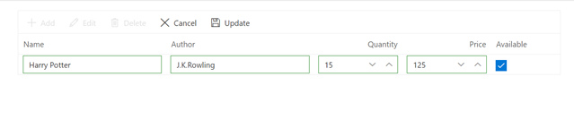

After clicking the **Add** button in Blazor, use the **Update** toolbar button to confirm the insert action. At this point, the **RowCreated** event will be triggered. This event can be used to insert the new record into the database (`Book` table) by calling the `InsertBook()` method of the `ClientServices` in the Blazor Web App (`BlazorWebApp.Shared` project) and the `LibraryService` in the Blazor Server App.Refer to the following code example.





public void RowCreatedHandler(RowCreatedEventArgs<Book> args)
{
    // Initialize default values or cancel adding using args.Cancel.
    await LibraryService.AddBook(args.Data);
}




public void RowCreatedHandler(RowCreatedEventArgs<Book> args)
{
    // Initialize default values or cancel adding using args.Cancel.
    await LibraryService.AddBook(args.Data);
}




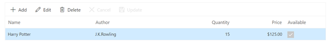

### Update a row

To edit a row, select any row and click the **Edit** toolbar button. The edit form will look like below.

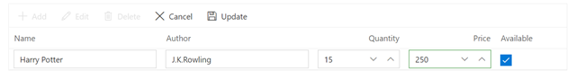

Now, the Price column value is changed to 125 from 250. After modifying the values, click the **Update** toolbar button to confirm the changes. At this point, the **RowEdited** event will be triggered. This event can be used to update the corresponding record in the database (`Book` table) by calling the `UpdateBook()` method of the `ClientServices` in the Blazor Web App (`BlazorWebApp.Shared` project) and the `LibraryService` in the Blazor Server App.Refer to the following code example.





public void RowEditedHandler(RowEditedEventArgs<Book> args)
{
    // Configure editors or cancel editing using args as needed.
    await clientlibrary.UpdateBook(args.Data);
}




public void RowEditedHandler(RowEditedEventArgs<Book> args)
{
    // Configure editors or cancel editing using args as needed.
    await clientlibrary.UpdateBook(args.Data);
}




The resultant grid will look like below.

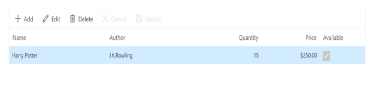

### Delete a row

To delete a row, select any row and click the **Delete** toolbar button. After confirming the deletion, the **RowDeleted** event will be triggered. This event can be used to remove the record from the database (`Book` table) by calling the `DeleteBook()` method of the `ClientServices` in the Blazor Web App (`BlazorWebApp.Shared` project) and the `LibraryService` in the Blazor Server App.Refer to the following code example.




public void RowDeletedHandler(RowDeletedEventArgs<Book> args)
{
    // Confirm or cancel deletion based on business rules.
    await LibraryService.DeleteBook(args.Data.Id);
}




public void RowDeletedHandler(RowDeletedEventArgs<Book> args)
{
    // Confirm or cancel deletion based on business rules.
    await LibraryService.DeleteBook(args.Data.Id);
}




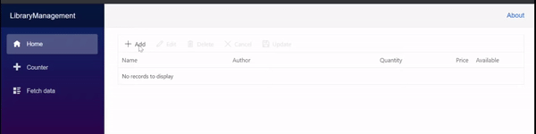

N> Find the sample from this [Github](https://github.com/SyncfusionExamples/blazor-server-datagrid-efcore-crud/) location.
