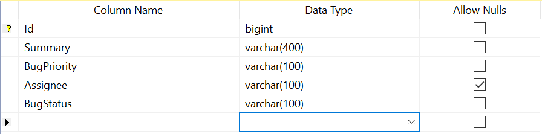
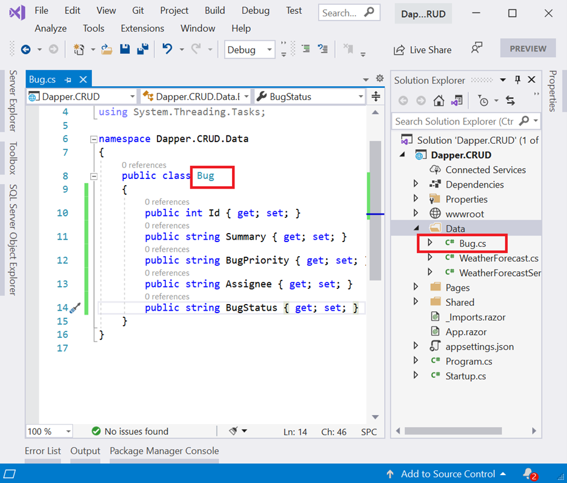
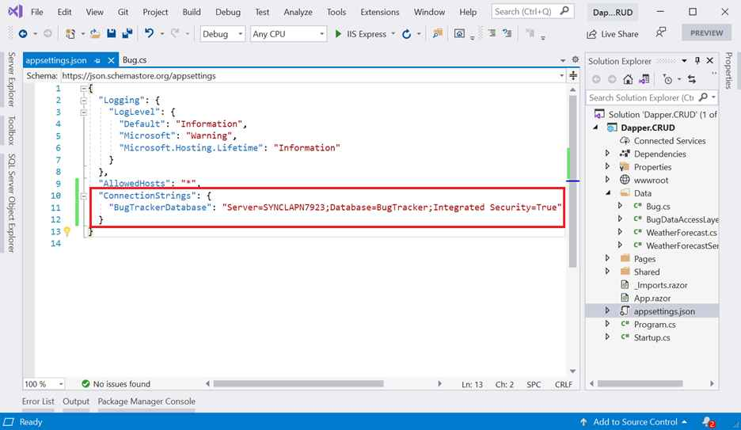
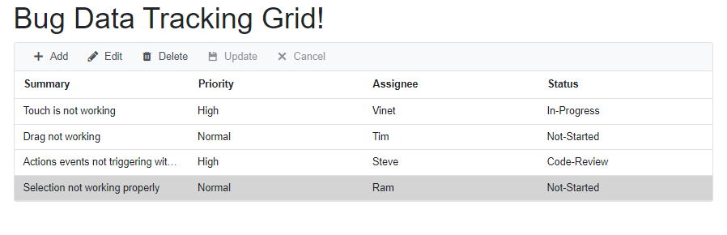
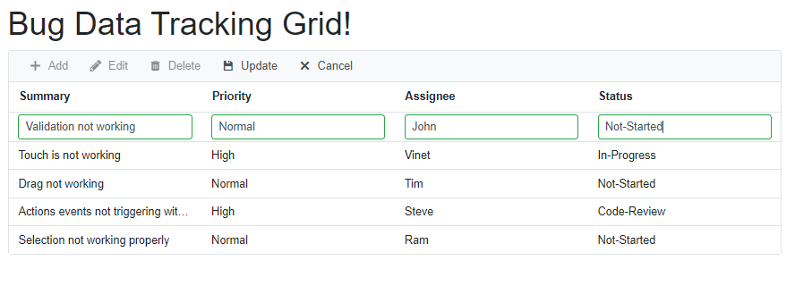
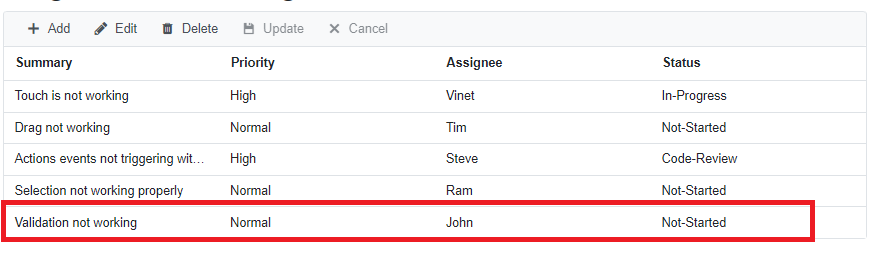
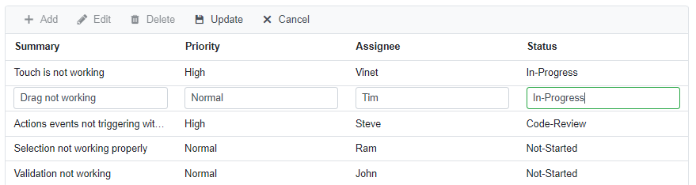
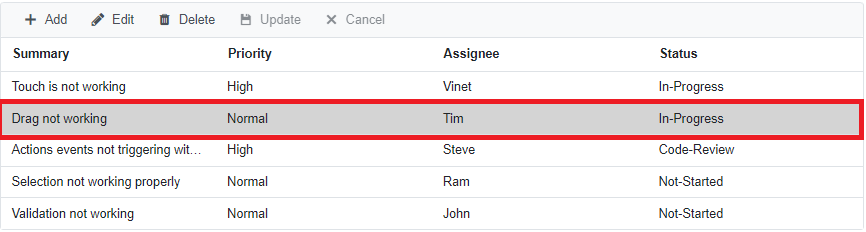

# How to Bind Data Using Dapper and Perform CRUD Operations

* Consume data from a SQL Server database using [Dapper](https://github.com/DapperLib/Dapper), a lightweight object mapper.
* Bind the retrieved data to the Syncfusion® Blazor DataGrid component so that records can be displayed in a structured grid format.
* Perform CRUD operations (Create, Read, Update, Delete) directly from the DataGrid by connecting it with a custom adaptor that interacts with the database.

This approach combines the simplicity and performance of Dapper for data access with the rich UI features of the Syncfusion® Blazor DataGrid, enabling you to build a responsive and interactive application that supports inline editing, sorting, filtering, and paging.

## Prerequisite software

* Visual Studio 2026 (or later) installed and configured for Blazor development.

* MS SQL Server (2017 or later) available to host the sample database.

## Creating Blazor application

* Open Visual Studio and follow the steps in the [documentation](https://blazor.syncfusion.com/documentation/getting-started/blazor-server-side-visual-studio) to create the Blazor Server Application.

## Creating the database

First, create a database to store all bug details. This involves setting up a database named `BugTracker` and creating a table named `Bugs`inside it.

1. Open Microsoft SQL Server — this can be SQL Server 2025 (latest version) or an earlier version such as SQL Server 2017 or SQL Server 2022.
2. Create a new database and name it `BugTracker`. 
3. After the database is created, right‑click on it and select New Query.
4. In the query window, run the following SQL script to create the Bugs table.

```
Create Table Bugs(
Id BigInt Identity(1,1) Primary Key Not Null,
Summary Varchar(400) Not Null,
BugPriority Varchar(100) Not Null,
Assignee Varchar(100),
BugStatus Varchar(100) Not Null)
```

Now, the table design will look like below.



## Adding Dapper package and creating a model class

To enable Dapper and establish database connectivity within the application, the required `NuGet` packages must be installed. These packages are added through the Package Manager Console in Visual Studio.

Run the following commands in the Package Manager Console to add the required packages:

* The following command installs Dapper, which enables the application to handle database operations efficiently.

    ```
    Install-Package Dapper -Version 2.1.24

    ```

* The next command installs the SQL Client package. This package provides the necessary tools for connecting to Microsoft SQL Server, including features such as SqlConnection, SqlCommand, and other essential database components.

    ```
    Install-Package Microsoft.Data.SqlClient
    ```

Many database tools automatically generate files to define how data is structured. Dapper does not provide this automatic feature, so the data structure must be created manually.
As part of this setup, a file named `Bug.cs` is created inside the `Data` folder. This file represents how each bug record is stored in the database.

```c#

namespace {Your namespace}
{
    public class Bug
    {
        public int Id { get; set; }

        public string Summary { get; set; }

        public string BugPriority { get; set; }

        public string Assignee { get; set; }

        public string BugStatus { get; set; }
    }
}

```



## Creating data access layer
Before setting up the data access layer, the application needs to know how to connect to the database. This connection information is added to the `appsettings.json` file. Update the file with the required connection string as shown below.

```cshtml

"ConnectionStrings": {
  "BugTrackerDatabase": "Server= {Your Server Name};Database=BugTracker;Integrated Security=True;Encrypt=True;TrustServerCertificate=True"
}

```


Now, create the file that will handle all communication with the database.
Right‑click the `Data` folder and choose Class to create a new file named `BugDataAccessLayer.cs`.
This file will contain the code responsible for adding, updating, retrieving, and deleting bug records in the `Bugs` table.


The code inside this class performs the following tasks:

* In the constructor of `BugDataAccessLayer` receives `IConfiguration`, which provides access to the connection details stored in `appsettings.json`. This ensures the class can connect to the correct database.
* `GetBugsAsync` method performs select operation and returns a list of bugs from the Bugs table.
* `AddBugAsync` method inserts a new bug into the Bugs table.
* `UpdateBugAsync` method updates the given bug object in the table.
* `RemoveBugAsync` method deletes a bug entry based on its ID.



public class BugDataAccessLayer
{
    public IConfiguration Configuration;
    private const string BUGTRACKER_DATABASE = "BugTrackerDatabase";
    private const string SELECT_BUG = "select * from bugs";
    public BugDataAccessLayer(IConfiguration configuration)
    {
        Configuration = configuration; //Inject configuration to access Connection string from appsettings.json.
    }

    public async Task<List<Bug>> GetBugsAsync()
    {
        using (IDbConnection db = new SqlConnection(Configuration.GetConnectionString(BUGTRACKER_DATABASE)))
        {
            db.Open();
            IEnumerable<Bug> result = await db.QueryAsync<Bug>(SELECT_BUG);
            return result.ToList();
        }
    }

    public async Task<int> GetBugCountAsync()
    {
        using (IDbConnection db = new SqlConnection(Configuration.GetConnectionString(BUGTRACKER_DATABASE)))
        {
            db.Open();
            int result = await db.ExecuteScalarAsync<int>("select count(*) from bugs");
            return result;
        }
    }

    public async Task AddBugAsync(Bug bug)
    {
        using (IDbConnection db = new SqlConnection(Configuration.GetConnectionString(BUGTRACKER_DATABASE)))
        {
            db.Open();
            await db.ExecuteAsync("insert into bugs (Summary, BugPriority, Assignee, BugStatus) values (@Summary, @BugPriority, @Assignee, @BugStatus)", bug);
        }
    }

    public async Task UpdateBugAsync(Bug bug)
    {
        using (IDbConnection db = new SqlConnection(Configuration.GetConnectionString(BUGTRACKER_DATABASE)))
        {
            db.Open();
            await db.ExecuteAsync("update bugs set Summary=@Summary, BugPriority=@BugPriority, Assignee=@Assignee, BugStatus=@BugStatus where id=@Id", bug);
        }
    }

    public async Task RemoveBugAsync(int bugid)
    {
        using (IDbConnection db = new SqlConnection(Configuration.GetConnectionString(BUGTRACKER_DATABASE)))
        {
            db.Open();
            await db.ExecuteAsync("delete from bugs Where id=@BugId", new { BugId = bugid });
        }
    }
}



Now, register `BugDataAccessLayer` as scoped service in the `Program.cs` file as follows.

```cshtml
....
builder.Services.AddScoped<BugDataAccessLayer>();

```

## Adding Syncfusion<sup style="font-size:70%">&reg;</sup> Blazor DataGrid component

Run the following commands in the Package Manager Console.
To add the **Blazor DataGrid** component to the application, open the NuGet Package Manager in Visual Studio
(Tools → NuGet Package Manager → Manage NuGet Packages for Solution).
Then search for and install the following packages:

* [Syncfusion.Blazor.Grid](https://www.nuget.org/packages/Syncfusion.Blazor.Grid/) – provides the DataGrid component.
* [Syncfusion.Blazor.Themes](https://www.nuget.org/packages/Syncfusion.Blazor.Themes/) – provides the required styles for the component.

Alternatively, the same installation can be completed by running the following command in the Package Manager Console.




Install-Package Syncfusion.Blazor.Grid -Version {{ site.releaseversion }}
Install-Package Syncfusion.Blazor.Themes -Version {{ site.releaseversion }}




N> Syncfusion<sup style="font-size:70%">&reg;</sup> Blazor components are available in [nuget.org](https://www.nuget.org/packages?q=syncfusion.blazor). Refer to [NuGet packages](https://blazor.syncfusion.com/documentation/nuget-packages) topic for available NuGet packages list with component details.

Open the `_Import.razor` file and add the following namespaces. These entries are required for the application to use the Syncfusion<sup style="font-size:70%">&reg;</sup> Blazor DataGrid component.



@using Syncfusion.Blazor
@using Syncfusion.Blazor.Grids
@using Syncfusion.Blazor.Data



Open the `Program.cs` file in your the application and register the Syncfusion<sup style="font-size:70%">&reg;</sup> service.

```cshtml

....
using Syncfusion.Blazor;
....
builder.Services.AddSyncfusionBlazor();
....

```

Syncfusion<sup style="font-size:70%">&reg;</sup> Blazor provides a variety of built‑in themes that can be applied to the application. The available themes include:

* Bootstrap4
* Material
* Fabric
* Bootstrap
* High Contrast

In this sample application, the Bootstrap4 theme is used.

* For **.NET 7** app, add the theme reference inside the `<head>` section of the **~/Pages/_Host.cshtml** file.

* For **.NET 6** app, add the theme reference inside the `<head>` section of the **~/Pages/_Layout.cshtml** file.

* For **.NET 8**,**.NET 9**, and **.NET 10** apps,add the theme reference inside the `<head>` section of the **~/Components/App.razor** file.



<head>
    ....
    <link href="_content/Syncfusion.Blazor.Themes/bootstrap4.css" rel="stylesheet" />
</head>



Be sure to include the required script reference in the correct file based on the .NET version:

* For **.NET 7** app, add script reference at end of the `<body>` section of the **~/Pages/_Host.cshtml** file.

* For **.NET 6** app, add script reference at end of the `<body>` section of the **~/Pages/_Layout.cshtml** file.

*For **.NET 8**,**.NET 9**, and **.NET 10** apps , add script reference at end of the `<body>` section of the **~/Components/App.razor** file.


<body>
    ....
    <script src="_content/Syncfusion.Blazor.Core/scripts/syncfusion-blazor.min.js" type="text/javascript"></script>
</body>


After completing the previous configuration steps for the Syncfusion<sup style="font-size:70%">&reg;</sup> Blazor package, the DataGrid component can be added to the `Home.razor` page to initialize the grid within the application.



<SfGrid>
</SfGrid>



## Binding data to the DataGrid component

The DataGrid can display information stored in a SQL database. Dapper is used to collect this information, and the Syncfusion<sup style="font-size:70%">&reg;</sup> Blazor DataGrid shows it on the screen.

To make this connection work, the DataGrid uses a feature called [custom data binding](https://blazor.syncfusion.com/documentation/datagrid/connecting-to-adaptors/custom-adaptor). This feature allows the application to control how data is loaded, saved, updated, or deleted.

A custom adaptor acts as the communication layer between the database and the DataGrid.During the creation of this adaptor, the following requirements must be met.

* The custom adaptor must inherit from the `DataAdaptor` class.
* CRUD‑related methods must be implemented to manage data retrieval and updates.
* The adaptor must be registered as a service in the `Program.cs` file to ensure availability within the application.

### Creating the Custom Adaptor File

A file named `BugDataAdaptor.cs` can be added under the `Data` folder.
This file includes:

* A `BugDataAdaptor` class that extends the DataAdaptor base class.
* An integrated 'BugDataAccessLayer' instance responsible for handling all database operations.

This structure ensures that the DataGrid receives accurate data from the database and efficiently processes changes made through the grid.



public class BugDataAdaptor: DataAdaptor
{
    private BugDataAccessLayer _dataLayer;
    public BugDataAdaptor(BugDataAccessLayer bugDataAccessLayer)
    {
        _dataLayer = bugDataAccessLayer;
    }

    public override async Task<object> ReadAsync(DataManagerRequest dataManagerRequest, string key = null)
    {
        List<Bug> bugs = await _dataLayer.GetBugsAsync();
        int count = await _dataLayer.GetBugCountAsync();
        return dataManagerRequest.RequiresCounts ? new DataResult() { Result = bugs, Count = count } : (object)bugs;
    }
}



Next, open the `Program.cs` file in the application and register the `BugDataAdaptor` class to make it available for DataGrid operations.




....
builder.Services.AddScoped<BugDataAccessLayer>();
builder.Services.AddSyncfusionBlazor();
builder.Services.AddScoped<BugDataAdaptor>();
.....




Next, add the `SfDataManager` component to the Grid to enable data binding and define the required column structure.

In the following code example,

* Configures the `SfDataManager` component as the data source for the Grid, with the `AdaptorInstance` property set to the custom adaptor created earlier and the `Adaptor` property assigned as `Adaptors.CustomAdaptor`.
* Sets the `TValue` parameter to the Bug class to ensure proper data mapping within the Grid.



<SfGrid TValue="Bug">
    <SfDataManager AdaptorInstance="typeof(BugDataAdaptor)" Adaptor="Adaptors.CustomAdaptor"></SfDataManager>
</SfGrid>



Grid columns can be added using the [GridColumn](https://blazor.syncfusion.com/documentation/datagrid/columns) component. The following code example shows how to create these columns. Each column includes properties that control how data is displayed and formatted within the Grid.



<SfGrid TValue="Bug">
    <SfDataManager AdaptorInstance="typeof(BugDataAdaptor)" Adaptor="Adaptors.CustomAdaptor"></SfDataManager>
    <GridColumns>
        <GridColumn Field="@nameof(Bug.Id)" IsPrimaryKey="true" Visible="false"></GridColumn>
        <GridColumn Field="@nameof(Bug.Summary)" Width="100"></GridColumn>
        <GridColumn Field="@nameof(Bug.BugPriority)" HeaderText="Priority" Width="100"></GridColumn>
        <GridColumn Field="@nameof(Bug.Assignee)" Width="100"></GridColumn>
        <GridColumn Field="@nameof(Bug.BugStatus)" HeaderText="Status" Width="100"></GridColumn>
    </GridColumns>
</SfGrid>



When the application is running, the DataGrid appears as shown below, displaying records retrieved directly from the database.



## Handling CRUD operations with our Syncfusion<sup style="font-size:70%">&reg;</sup> Blazor DataGrid component

Editing in the Grid can be enabled by using the [GridEditSettings](https://blazor.syncfusion.com/documentation/datagrid/editing) component. The Grid supports multiple editing modes, including Inline (Normal), Dialog, and Batch editing. Each mode provides a different way to modify records directly within the Grid. Additional details about these editing options are available in the official documentation.

[Grid Editing in Blazor](https://blazor.syncfusion.com/documentation/datagrid/editing#editing)

N> Normal editing is the default mode used by the DataGrid. To enable editing for a specific record, the column containing unique values must have the IsPrimaryKey property set to true. This ensures that the Grid can correctly identify and update the selected record.

In this setup, the Grid uses Inline editing mode, and the [Toolbar](https://blazor.syncfusion.com/documentation/datagrid/tool-bar) property is enabled to display editing options such as Add, Edit, Delete, Update, and Cancel.



<SfGrid TValue="Bug" Toolbar="@(new List<string>() { "Add", "Edit", "Delete", "Update", "Cancel" })">
    <SfDataManager AdaptorInstance="typeof(BugDataAdaptor)" Adaptor="Adaptors.CustomAdaptor"></SfDataManager>
    <GridEditSettings AllowAdding="true" AllowEditing="true" AllowDeleting="true"></GridEditSettings>
    <GridColumns>
        <GridColumn Field="@nameof(Bug.Id)" IsPrimaryKey="true" Visible="false"></GridColumn>
        <GridColumn Field="@nameof(Bug.Summary)" Width="100"></GridColumn>
        <GridColumn Field="@nameof(Bug.BugPriority)" HeaderText="Priority" Width="100"></GridColumn>
        <GridColumn Field="@nameof(Bug.Assignee)" Width="100"></GridColumn>
        <GridColumn Field="@nameof(Bug.BugStatus)" HeaderText="Status" Width="100"></GridColumn>
    </GridColumns>
</SfGrid>



The CRUD operation methods are already defined in the data access layer. These methods are now used by the DataGrid to handle actions such as adding, updating, and deleting records during Grid interactions.

## Insert a row

Add the `InsertAsync` method to the `BugDataAdaptor`(CustomAdaptor) class to handle the insertion of new records into the database.



public override async Task<object> InsertAsync(DataManager dataManager, object data, string key)
{
    await _dataLayer.AddBugAsync(data as Bug);
    return data;
}



To add a new row, select the `Add` option from the toolbar. This action opens a form where the details for the new record can be entered, as shown in the image below.



Clicking the `Update` option in the toolbar triggers the `InsertAsync` method in the `BugDataAdaptor`. This action adds the new record to the `Bug` table. After the insertion is completed, the updated DataGrid displays the newly added record, as shown below.



## Update a row

Add the `UpdateAsync` method to the `BugDataAdaptor`(CustomAdaptor) class to handle the update operation for modifying existing records in the database.



public override async Task<object> UpdateAsync(DataManager dataManager, object data, string keyField, string key)
{
    await _dataLayer.UpdateBugAsync(data as Bug);
    return data;
}



To initiate row editing, select a record and activate the `Edit` option from the toolbar. The corresponding edit form is then displayed.



The `Status` field is updated from `Not started` to `In progress`. Selecting the `Update` option in the toolbar triggers the `UpdateAsync` method of the `BugDataAdaptor`, which applies the modified data to the `Bug` table. After the update operation is completed, the revised record is displayed in the grid as shown below.



## Delete a row

Include the following(`RemoveAsync`) method in the `BugDataAdaptor` (CustomAdaptor) class to enable the delete operation



public override async Task<object> RemoveAsync(DataManager dataManager, object primaryKeyValue, string keyField, string key)
{
    await _dataLayer.RemoveBugAsync(Convert.ToInt32(primaryKeyValue));
    return primaryKeyValue;
}



To delete a row, select the desired record and use the `Delete` option in the toolbar. Activating the `Delete` command triggers the `RemoveAsync` method in the `BugDataAdaptor`, which processes the delete operation for the corresponding entry in the `Bug` table.

N> Find the sample from this [Github](https://github.com/SyncfusionExamples/blazor-datagrid-dapper-crud) location.

## See also

* [Create Blazor CRUD Application with PostgreSQL and Dapper](https://www.syncfusion.com/blogs/post/create-blazor-crud-application-with-postgresql-and-dapper.aspx)
