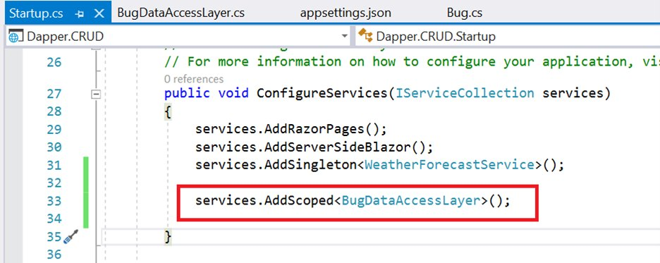
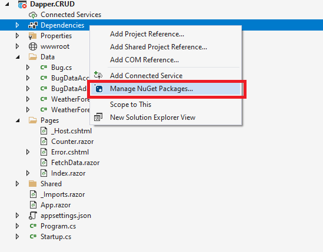
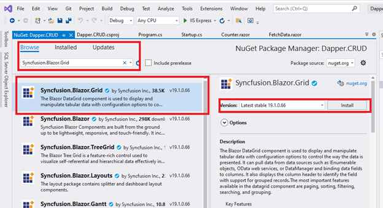

# How to bind data to the Syncfusion Blazor components using Dapper and perform CRUD operations

In this topic, we are going to discuss how to consume data from a database using [Dapper](https://github.com/DapperLib/Dapper), bind it to a Syncfusion Blazor Component, and perform CRUD operations.

## Prerequisite software

* Visual Studio 2019.

* MS SQL Server.

## Creating Blazor server-side application

Open Visual Studio 2019 and follow the steps in the below documentation to create the Blazor Server Application.

[Creating Blazor Server Application](https://blazor.syncfusion.com/documentation/getting-started/blazor-server-side-visual-studio-2019/)

## Creating the database

First, create a database named `BugTracker` and a table named `Bugs` to hold the list of bugs.

1. Open SQL Server 2017 / latest version.
2. Now, create a new database named `BugTracker`.
3. Right-click on the created database and select New Query.
4. Use the following SQL query to create a table named Bugs.

```csharp
Create Table Bugs(
Id BigInt Identity(1,1) Primary Key Not Null,
Summary Varchar(400) Not Null,
BugPriority Varchar(100) Not Null,
Assignee Varchar(100),
BugStatus Varchar(100) Not Null)
```

Now, the table design will look like below.


## Adding Dapper package and creating a model class

To use Dapper and access database in our application, we need to install the following `NuGet` packages.

Run the following commands in the Package Manager Console.

* The following command enable us to use Dapper in our application.

```bash
Install-Package Dapper -Version 2.0.90
```

* The following command provide database access classes such as  `SqlConnection`, `SqlCommand`, etc. Also provides data provider for MS SQL Server.

```bash
Install-Package Microsoft.Data.SqlClient -Version 2.1.3
```

Most of the ORMs provide scaffolding options to create model classes. Dapper doesn’t have any in-built scaffolding option. So, we need to create model class manually. Here, we are creating a class named `Bug.cs` in the `Data` folder as follows.


## Creating data access layer

Before creating a data access layer, we need to set the connection string of our database in the `appsettings.json` file as follows.


Now, right-click the `Data` folder and select `Class` to create a new class named `BugDataAccessLayer.cs`. Replace this class with the following code, which contains code to handle CRUD in the `Bugs` table.

In the following example,

* In the constructor of the `BugDataAccessLayer`, we have injected `IConfiguration` which helps us to get the connection string provided in the `appsettings.json`.
* `GetBugsAsync` method performs select operation and returns a list of bugs from the Bugs table.
* `AddBugAsync` method inserts a new bug into the Bugs table.
* `UpdateBugAsync` method updates the given bug object in the table.
* `RemoveBugAsync` method removes the given bug by Id.

```csharp
public class BugDataAccessLayer
    {
        public IConfiguration Configuration;
        private const string BUGTRACKER_DATABASE = "BugTrackerDatabase";
        private const string SELECT_BUG = "select * from bugs";
        public BugDataAccessLayer(IConfiguration configuration)
        {
            Configuration = configuration; //Inject configuration to access Connection string from appsettings.json.
        }

        public async Task<List<Bug>> GetBugsAsync()
        {
            using (IDbConnection db = new SqlConnection(Configuration.GetConnectionString(BUGTRACKER_DATABASE)))
            {
                db.Open();
                IEnumerable<Bug> result = await db.QueryAsync<Bug>(SELECT_BUG);
                return result.ToList();
            }
        }

        public async Task<int> GetBugCountAsync()
        {
            using (IDbConnection db = new SqlConnection(Configuration.GetConnectionString(BUGTRACKER_DATABASE)))
            {
                db.Open();
                int result = await db.ExecuteScalarAsync<int>("select count(*) from bugs");
                return result;
            }
        }

        public async Task AddBugAsync(Bug bug)
        {
            using (IDbConnection db = new SqlConnection(Configuration.GetConnectionString(BUGTRACKER_DATABASE)))
            {
                db.Open();
                await db.ExecuteAsync("insert into bugs (Summary, BugPriority, Assignee, BugStatus) values (@Summary, @BugPriority, @Assignee, @BugStatus)", bug);
            }
        }

        public async Task UpdateBugAsync(Bug bug)
        {
            using (IDbConnection db = new SqlConnection(Configuration.GetConnectionString(BUGTRACKER_DATABASE)))
            {
                db.Open();
                await db.ExecuteAsync("update bugs set Summary=@Summary, BugPriority=@BugPriority, Assignee=@Assignee, BugStatus=@BugStatus where id=@Id", bug);
            }
        }

        public async Task RemoveBugAsync(int bugid)
        {
            using (IDbConnection db = new SqlConnection(Configuration.GetConnectionString(BUGTRACKER_DATABASE)))
            {
                db.Open();
                await db.ExecuteAsync("delete from bugs Where id=@BugId", new { BugId = bugid });
            }
        }
    }
```

Now, register `BugDataAccessLayer` as scoped service in the `Startup.cs` as follows.



## Adding Syncfusion Blazor components Package

We are going to explain this data binding process (using dapper) using the Syncfusion DataGrid component and perform CRUD operations in it.

So, we are going to install the packages required to use the Syncfusion Blazor components. Now, right-click `Dependencies` in the project and select `Manage NuGet Packages`.



Now, in the `Browse` tab, search and install the `Syncfusion.Blazor.Grid` NuGet package.



> For this demo, we have used `Syncfusion.Blazor`(19.1.0.65) NuGet package.  We will release a new `Syncfusion.Blazor` NuGet package with new enhancement in our every-week release and main release. So, you can check and update to the [latest versions](https://www.nuget.org/packages/Syncfusion.Blazor).

## Adding Syncfusion Blazor DataGrid component

Open `_Import.razor` file and add the following namespaces which are required to use the Syncfusion Blazor DataGrid Component in this application.

```csharp
@using Syncfusion.Blazor
@using Syncfusion.Blazor.Grids
@using Syncfusion.Blazor.Data
```

Open `Startup.cs` file and register the Syncfusion service in the `ConfigureServices` method as follows.

```csharp
using Syncfusion.Blazor;

namespace BlazorDapper
{
    public class Startup
    {
        public void ConfigureServices(IServiceCollection services)
        {
            services.AddRazorPages();
            services.AddServerSideBlazor();
            services.AddSingleton<WeatherForecastService>();
            services.AddScoped<BugDataAccessLayer>();
            services.AddSyncfusionBlazor();
        }
    }
}

```

Syncfusion Blazor provides different themes. They are:

* Bootstrap4
* Material
* Fabric
* Bootstrap
* High Contrast

In this demo application, the Bootstrap4 theme will be used. To add the theme, open the `Pages/_Host.cshtml` file and add the following CSS reference code.

```html
<link href="_content/Syncfusion.Blazor.Themes/ bootstrap4.css" rel="stylesheet" />
```

In previous steps, we have successfully configured the Syncfusion Blazor package in the application. Now, we can add the DataGrid Component to the `Index.razor`.

```csharp
<SfGrid>
</SfGrid>

```

## Binding data to the DataGrid component

Now, we are going to get SQL data using Dapper and bind it to the DataGrid component. To bind the database table to Syncfusion Blazor DataGrid, we are going to use the [custom data binding feature](https://blazor.syncfusion.com/documentation/datagrid/custom-binding/) here.

The following points must be considered for creating a custom adaptor.

* Our custom adaptor must extend the `DataAdaptor` class.
* Override available CRUD methods to handle data querying and manipulation.
* Register our custom adaptor class as a service in the `Startup.cs`.

Now, create a new class named `BugDataAdaptor.cs` under the `Data` folder and replace the following code in that class.

In the following code example,

* Extended `BugDataAdaptor` class with `DataAdaptor` base class.
* Injected `BugDataAccessLayer` instance to perform data operations.

```csharp
 public class BugDataAdaptor: DataAdaptor
    {
        private BugDataAccessLayer _dataLayer;
        public BugDataAdaptor(BugDataAccessLayer bugDataAccessLayer)
        {
            _dataLayer = bugDataAccessLayer;
        }

        public override async Task<object> ReadAsync(DataManagerRequest dataManagerRequest, string key = null)
        {
            List<Bug> bugs = await _dataLayer.GetBugsAsync();
            int count = await _dataLayer.GetBugCountAsync();
            return dataManagerRequest.RequiresCounts ? new DataResult() { Result = bugs, Count = count } : count;
        }
    }
```

Now, Open the `Startup.cs` file and register the `BugDataAdaptor` class in the `ConfigureServices` method as follows.

```csharp
 public void ConfigureServices(IServiceCollection services)
{
   services.AddRazorPages();
   services.AddServerSideBlazor();
   services.AddSingleton<WeatherForecastService>();
   services.AddScoped<BugDataAccessLayer>();
   services.AddSyncfusionBlazor();
   services.AddScoped<BugDataAdaptor>();
}
```

Now, we have added `SfDataManager` in Grid for binding the data to the Grid and added column definition.

In the following code example,

* Defined `SfDataManager` component to provide data source to the grid. You can see that we have specified the `AdaptorInstance` property with the type of the custom adaptor we created in the previous step and mentioned the `Adaptor` property as `Adaptors.CustomAdaptor`.

* `TValue` is specified as `Bug` class.

```csharp
<SfGrid TValue="Bug">
    <SfDataManager AdaptorInstance="typeof(BugDataAdaptor)" Adaptor="Adaptors.CustomAdaptor"></SfDataManager>
</SfGrid>
```

Grid columns can be defined using the [GridColumn](https://blazor.syncfusion.com/documentation/datagrid/columns/) component. We are going to create columns using the following code, let us see the properties used and their usage.

```csharp
<SfGrid TValue="Bug">
    <SfDataManager AdaptorInstance="typeof(BugDataAdaptor)" Adaptor="Adaptors.CustomAdaptor"></SfDataManager>
    <GridColumns>
        <GridColumn Field="@nameof(Bug.Id)" IsPrimaryKey="true" Visible="false"></GridColumn>
        <GridColumn Field="@nameof(Bug.Summary)" Width="100"></GridColumn>
        <GridColumn Field="@nameof(Bug.BugPriority)" HeaderText="Priority" Width="100"></GridColumn>
        <GridColumn Field="@nameof(Bug.Assignee)" Width="100"></GridColumn>
        <GridColumn Field="@nameof(Bug.BugStatus)" HeaderText="Status" Width="100"></GridColumn>
    </GridColumns>
</SfGrid>
```

Now, the DataGrid will look like this while running the application. The displayed records are fetched from the database.


## Handling CRUD operations with our Syncfusion Blazor DataGrid component

We can enable editing in the grid component using the [GridEditSettings](https://blazor.syncfusion.com/documentation/datagrid/editing/) component. Grid provides various modes of editing options such as Inline/Normal, Dialog, and Batch editing. Kindly refer to the following documentation for your reference.

[Grid Editing](https://blazor.syncfusion.com/documentation/datagrid/editing/#editing)

> Normal editing is the default edit mode for the DataGrid component. You need to set the IsPrimaryKey property of Column as True for a particular column, whose value is a unique value for editing purposes.

Here, we are using inline edit mode and the [Toolbar](https://blazor.syncfusion.com/documentation/datagrid/tool-bar/) property to show toolbar items for editing.

```csharp
<SfGrid TValue="Bug" Toolbar="@(new List<string>() { "Add", "Edit", "Delete", "Update", "Cancel" })">
    <SfDataManager AdaptorInstance="typeof(BugDataAdaptor)" Adaptor="Adaptors.CustomAdaptor"></SfDataManager>
    <GridEditSettings AllowAdding="true" AllowEditing="true" AllowDeleting="true"></GridEditSettings>
    <GridColumns>
        <GridColumn Field="@nameof(Bug.Id)" IsPrimaryKey="true" Visible="false"></GridColumn>
        <GridColumn Field="@nameof(Bug.Summary)" Width="100"></GridColumn>
        <GridColumn Field="@nameof(Bug.BugPriority)" HeaderText="Priority" Width="100"></GridColumn>
        <GridColumn Field="@nameof(Bug.Assignee)" Width="100"></GridColumn>
        <GridColumn Field="@nameof(Bug.BugStatus)" HeaderText="Status" Width="100"></GridColumn>
    </GridColumns>
</SfGrid>
```

We have already created CRUD operations method in the data access layer section itself. Now, we are going to call those methods while performing CRUD actions in DataGrid.

## Insert a row

Add the following codes(`InsertAsync`) in the `BugDataAdaptor`(CustomAdaptor) class to perform insert operation.

```csharp
 public override async Task<object> InsertAsync(DataManager dataManager, object data, string key)
        {
            await _dataLayer.AddBugAsync(data as Bug);
            return data;
        }
```

To insert a new row, click the `Add` toolbar button. The new record edit form will look like below.


Clicking the `Update` toolbar button will call the `InsertAsync` method of our `BugDataAdaptor` to insert the record in the `Bug` table. Now, the successfully inserted record in the grid will look like below.


## Update a row

Add the following codes (`UpdateAsync`) in the `BugDataAdaptor`(CustomAdaptor) class to  perform update operation.

```csharp
 public override async Task<object> UpdateAsync(DataManager dataManager, object data, string keyField, string key)
        {
            await _dataLayer.UpdateBugAsync(data as Bug);
            return data;
        }
```

To edit a row, select any row and click the `Edit` toolbar button. The edit form will look like below.


Here, we are changing the `Status` field value from `Not started` to `In progress`. Clicking the `Update` toolbar button will call the `UpdateAsync` method of our `BugDataAdaptor` to update the record in the `Bug` table. Now, the successfully updated record in the grid will look like below.


## Delete a row

Add the following codes(`RemoveAsync`) in the `BugDataAdaptor`(CustomAdaptor) class to perform update operation.

```csharp
 public override async Task<object> RemoveAsync(DataManager dataManager, object primaryKeyValue, string keyField, string key)
        {
            await _dataLayer.RemoveBugAsync(Convert.ToInt32(primaryKeyValue));
            return primaryKeyValue;
        }
```

To delete a row, select any row and click the `Delete` toolbar button. Clicking the `Delete` toolbar button will call the `RemoveAsync` method of our `BugDataAdaptor` to update the record in the `Bug` table.

> Please find the sample from this [Github](https://github.com/SyncfusionExamples/blazor-datagrid-dapper-crud) location.